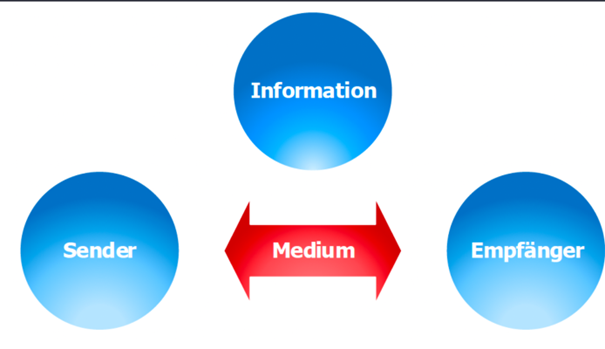

- [[Modul 117 - Informatik- und Netzinfrastruktur für eines kleines Unternehmen realisieren]]
- ## Aufbau eines Rechnernetwerkes
	- ### Kommunikation
		- Theoretisch betrachtet, besteht ein Netzwerk aus den Komponenten Information, Sender, einem oder mehreren Empfängern und einem Übertragungsmedium.
		- {:height 32, :width 94}
		- Ohne die ==Information== müsste gar kein Netz betrieben werden. Der Netzbetreiber stellt die technische Verpackung für die Information bereit,
		  ist jedoch nicht für deren Qualität zuständig.
		- Der ==Sender== ist diejenige Komponente, welche die Information versenden will.
		- Ein oder mehrere ==Empfänger== , an welche die Information übertragen werden soll.
		- Das =Medium= , über welches die Information übertragen wird. Das Medium kann ein Kabel oder aber auch die Luft sein.
	- ### Topologie eines Rechnernetzes
		- Unter der Topologie wird die Struktur der Verbindung mehrerer Geräte des Netzes verstanden
		- Die Topologie eines Netzes ist entscheidend für seine Ausfallsicherheit und die Performance.
		- Zudem beeinflusst die Topologie eines Netzwerkes massgeblich die Investition in
		  Verkabelung, Funkverbindungen und geeignete Hardware.
		- TODO link from bbc notiz
- ## Netzwerkausdehnung
	- ### Body Area Network (BAN)
		- Die Übertragung erfolgt in der Regel drahtlos via Bluetooth und Near Field Communication (NFC).
		- Diesen Netzwerktyp finden wir oft im Medizin- und Wellnessbereich Blutdruckmessgeräte, Pulsmesser kommunizieren mit Aufzeichnungsgeräten, welche direkt am Körper getragen werden.
	- ### Personal Area Network (PAN)
		- Die Übertragung erfolgt via USB oder Firewire, oder drahtlos via Infrarot, Bluetooth oder WLAN.
		- Bekanntes Beispiel ist die Bereitstellung eines Adhoc-Netzwerkes mit dem Mobiltelefon zu einem Laptop. Auch Freisprechanlagen und Drahtloskopfhörer fallen in diese Kategorie.
	- ### Local Area Network (LAN)
		- Die Übertragung erfolgt via Ethernet über Kabel (Kupfer, Glas) oder Funk. In der Regel ist ein LAN ein lokal begrenztes Netz bis fünfhundert Meter und befindet sich meistens in einem Gebäude.
		- Private Netze und kleine Firmennetze gehören in diese Kategorie.
	- ### City/Campus Area Network (CAN)
		- Die Übertragung erfolgt wie beim LAN via Ethernet in der Regel über Kabel. In einem CAN werden mehrere LANs einer grossen Schule, einer UNI oder einer Stadt miteinander verbunden.
	- ### Metropolitan Area Network (MAN)
		- Die Ausdehnung eines MANs kann bis 100 km gehen, die Übertragung wird immer öfter auch mit Ethernet via Glaskabel realisiert.
		- Viele Städte oder Kantone realisieren heute zusammen mit
		  Telekommunikationsanbietern eigene Stadt- oder Regionalnetze.
	- ### Wide Area Network (WAN)
		- Ein WAN erstreckt sich über grosse geografische Bereiche, indem zum Beispiel mehrere MANs über einen Kontinent oder weltweit miteinander verbunden werden.
		- In der Regel wird eine WAN von grossen Telekommunikationsanbietern betrieben, welche die WANs wiederum mit dem Internet verbinden.
- ## Schichtenmodellen
	- TODO like from bbc