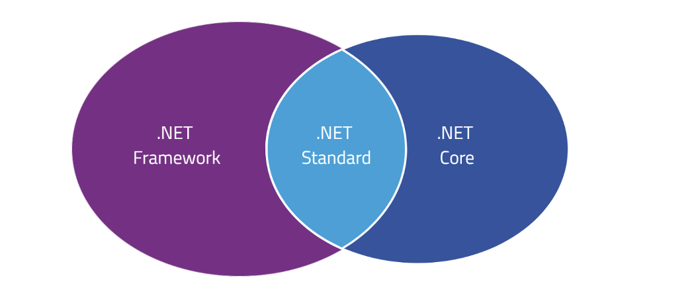

- Eine Bibliothek von standardisierten C# Klassen
- Beinhaltet eine Laufzeitumgebung, die Common Language Runtime (CLR)
- Übersetzt C# - Code in eine Zwischensprache,welche vom CLR ausgeführt werden kann
- ## **.NET Framework / .NET Standard /.NET Core**
	- [https://docs.microsoft.com/de-de/archive/msdn-magazine/2016/april/net-core-net-goes-cross-platform-with-net-core](https://docs.microsoft.com/de-de/archive/msdn-magazine/2016/april/net-core-net-goes-cross-platform-with-net-core)
	- 
	- **.NET Framework**: Alle Features die Microsoft anbietet werden unterstützt, sind aber
	  z.B. auf Linux nur mit dem veralteten Mono (die JVM für Linux) ausführbar.
	- **.NET Core**: Ermöglicht eine volle Kompatibilität zu andern Betriebssystemen wie z.B. Linux oder macOS. Es werden jedoch noch nicht alle Features von .NET Framework unterstützt. Die Programmierung mit .NET Core soll mehr Richtung Cloud gehen.
	- **.NET Standard**: Features aus .NET Framework, welche bereits mit .NET Core
	  funktionieren.