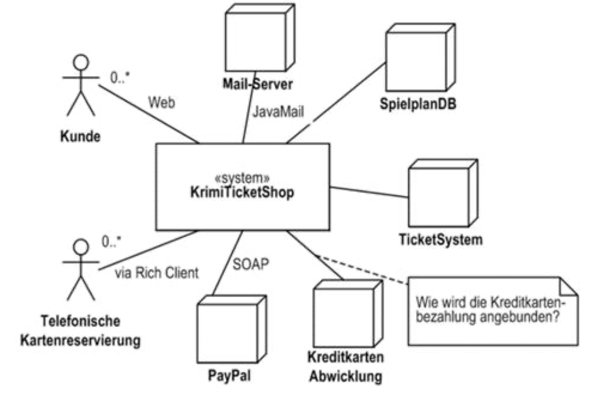
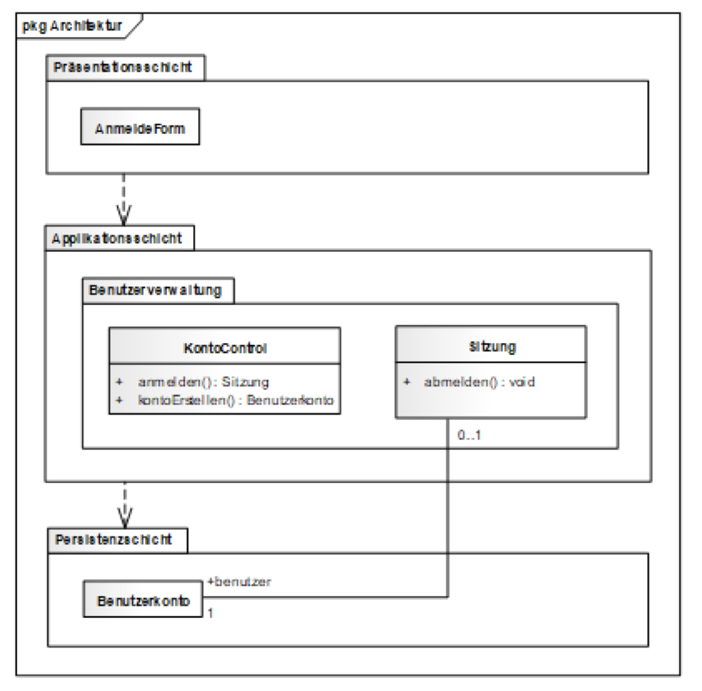

module:: M450

- Applikation werden getestet, um sicherzustellen, dass sie fehlerfrei, sicher, leistungsfähig und benutzerfreundlich sind.
-
- ## Das Testkonzept
	- Ein ist ein Dokument oder eine schriftliche Vereinbarung, das Strategien, Ziele, Pläne und Annahmen für das Testen eines Softwareprojekts oder Systems beschreibt. Es dient dazu, die Testaktivitäten klar zu strukturieren und allen Beteiligten ein einheitliches Verständnis zu vermitteln.
	- Die wichtigsten Elemente eines Testkonzepts sind:
		- **Zielsetzung**: Beschreibung der Testziele, z. B. Fehleridentifikation oder Qualitätsprüfung.
		- **Testobjekt**: Das System oder die Komponenten, die getestet werden.
		- **Umfang**: Festlegung, welche Teile getestet werden und welche nicht.
		- **Teststrategie**: Vorgehen, z. B. manuelles oder automatisiertes Testen, sowie verwendete Methoden und Werkzeuge.
		- **Testplan**: Grober Zeitrahmen, Ressourcen und Meilensteine.
		- **Testumgebung**: Anforderungen an Hardware, Software und Netzwerke.
		- **Testdaten**: Benötigte Daten zur Ausführung der Testfälle.
		- **Annahmen und Beschränkungen**: Rahmenbedingungen, die den Test beeinflussen.
		- **Risikobewertung**: Analyse potenzieller Risiken und deren Minderung.
		- **Testmetriken und Berichte**: Festlegung von Messkriterien und Berichtsformaten.
		- **Verantwortlichkeiten**: Zuweisung von Rollen und Aufgaben.
	- ### Testobjekt
		- Das Testobjekt ist ==das Ziel der Testaktivitäten== in der Softwareentwicklung. Die Auswahl des Testobjekts ist entscheidend, um die Testziele zu erreichen und die Projektanforderungen effektiv abzudecken.
		- Es kann je nach Testtyp und -ziel variieren. Gängige Beispiele sind:
			- **Softwareanwendung**: Eine Webanwendung, mobile App, ein Desktop-Programm oder andere Software.
			- **Einzelne Funktionen oder Module**: Spezifische Teile einer Software, z. B. einzelne Features.
			- **Integriertes System**: Ein gesamtes System mit mehreren Komponenten, die zusammenarbeiten.
			- **APIs (Application Programming Interfaces)**: Schnittstellen, die auf Funktionalität und Interoperabilität geprüft werden.
			- **Datenbanken**: Geprüft auf Integrität, Konsistenz und Leistung.
			- **Hardware-Software-Systeme**: Kombinationen aus Hardware und Software, wie bei eingebetteten Systemen.
	- ### Systemkontextdiagramm
		- Ein Systemkontextdiagramm visualisiert die Interaktionen zwischen einem zu entwickelnden System und seiner Umgebung. Es bietet einen Überblick über die Systemgrenzen und zeigt die Schnittstellen zu externen Entitäten.
		- **Hauptkomponenten**:
			- **Das System**: Im Zentrum des Diagramms, z. B. eine Software, Hardware oder ein komplexes System.
			- **Externe Entitäten**: Akteure oder Systeme, die mit dem zentralen System interagieren (z. B. Menschen, Datenbanken, andere Systeme, Hardware).
			- **Verbindungen/Schnittstellen**: Linien oder Pfeile zeigen den Informations- und Datenfluss zwischen dem System und den externen Entitäten.
		- *Beispiel:*
			- {:height 486, :width 593}
		- **Ziel:**
			- Das Diagramm klärt die Systemgrenzen und Beziehungen zu Akteuren. Es dient als Grundlage für die Systemanalyse, reduziert Missverständnisse und stellt sicher, dass Anforderungen und Schnittstellen klar definiert sind.
		- **Vorteile:**
			- Einfach verständliche Darstellung komplexer Systeme.
			- Unterstützt die Kommunikation zwischen Entwicklern und Stakeholdern.
			- Ausgangspunkt für detailliertere Modelle und Diagramme.
	- ### Systemarchitektur
	  collapsed:: true
		- Das Testobjekt näher betrachten lässt sich durch ein
		- Die Systemarchitektur beschreibt die Struktur und Organisation eines Systems, inklusive seiner Komponenten, deren Interaktionen und Zusammenwirken.
		- **Hauptaufgaben der Systemarchitektur:**
			- **Komponentendefinition**: Identifikation der Hauptbestandteile, wie Benutzeroberfläche, Geschäftslogik und Datenbank.
			- **Kommunikation und Schnittstellen**: Festlegung der Interaktionen und Datenflüsse zwischen den Komponenten.
			- **Skalierbarkeit und Leistung**: Sicherstellen, dass das System wachsenden Anforderungen standhält und performant bleibt.
			- **Sicherheit und Datenschutz**: Berücksichtigung von Sicherheits- und Datenschutzanforderungen.
		- **Architekturansätze:**
			- Monolithische Architektur
			- Client-Server-Architektur
			- Microservices-Architektur
	- ### Schichtenmodel
	  collapsed:: true
		- Das Schichtenmodell ist ein strukturiertes Framework, das Systeme in funktionale Ebenen unterteilt. Typische Schichten in der Softwareentwicklung sind:
			- **Präsentationsschicht**: Benutzerschnittstelle und Darstellung.
			- **Logikschicht**: Geschäftslogik und Regeln.
			- **Datenzugriffsschicht**: Interaktion mit der Datenbank oder Datenspeicher.
		- Das Schichtenmodell fördert die Modularität und erleichtert Wartung, Entwicklung und Tests durch klare Trennung der Verantwortlichkeiten.
		- **Nutzen:**
			- Klare Strukturierung des Systems.
			- Vereinfachte Kommunikation zwischen Entwicklern und Stakeholdern.
			- Effizientere Planung von Tests und Systemerweiterungen.
		- **Beispiel**:
			- 
	- ### Kritikalität der Funktionseinheiten
	  collapsed:: true
		- Die Kritikalität der Funktionseinheiten bewertet die Bedeutung einzelner Komponenten eines Systems, um deren Auswirkungen im Falle eines Fehlers oder Ausfalls zu analysieren. Dies ist ein zentraler Aspekt des Risikomanagements.
		- **Wichtige Aspekte:**
			- **Identifikation der Funktionseinheiten**: Festlegen, welche Module, Subsysteme oder Komponenten analysiert werden sollen.
			- **Bewertung der Bedeutung**: Einschätzung der Wichtigkeit jeder Einheit anhand von Kriterien wie Geschäftsauswirkung, Sicherheit, Gesetzeskonformität oder Benutzeranforderungen.
			- **Klassifizierung**: Einteilung in Kategorien wie ==kritisch==, ==wichtig== oder ==sekundär==.
			- **Risikobewertung**: Kritische Komponenten tragen ein höheres Risiko und erfordern Massnahmen zur Risikominderung.
			- **Testpriorisierung**: Kritische Einheiten haben eine höhere Priorität bei Testaktivitäten.
			- **Wartung und Überwachung**: Kritische Komponenten erfordern verstärkte Überwachung, Wartung und Backups.
		- **Nutzen:**
			- Die Bewertung der Kritikalität hilft, Ressourcen gezielt auf die wichtigsten Systemteile zu konzentrieren, um die Zuverlässigkeit, Sicherheit und Benutzerzufriedenheit zu maximieren. Sie sorgt zudem für eine effektive Testplanung und ein robustes Risikomanagement.
		- **Beispiel**
			- Wir haben zum Beispiel ein **Textverarbeitungsprogramm** mit folgenden Funktionseinheiten:
				- **Text eingeben**: Ermöglicht es, Text zu schreiben.
				- **Speichern**: Speichert das Dokument auf der Festplatte.
				- **Drucken**: Druckt das Dokument aus.
			- **Kritikalität:**
				- **Text eingeben**: **Wichtig** – Ohne diese Funktion kann der Benutzer keinen Text schreiben, aber das Programm funktioniert noch.
				- **Speichern**: **Kritisch** – Wenn das Speichern nicht funktioniert, könnte der Benutzer seine Arbeit verlieren, was sehr problematisch ist.
				- **Drucken**: **Sekundär** – Wenn das Drucken nicht funktioniert, ist das zwar ärgerlich, aber das Programm kann weiterhin genutzt werden.
			- **Testpriorität:**
				- Die Funktion **Speichern** hat die höchste Priorität bei Tests, gefolgt von **Text eingeben**. **Drucken** hat eine geringere Priorität, da der Verlust dieser Funktion das Programm nicht unbrauchbar macht.
	- ### Testanforderungen (Normal-, Grenz- und Ausnahmebedingungen)
	  collapsed:: true
		- Testanforderungen legen fest, welche Kriterien und Bedingungen während eines Tests überprüft werden müssen, um die Funktionsfähigkeit und Zuverlässigkeit einer Software oder eines Systems sicherzustellen.
		- Diese Tests helfen, die Software unter verschiedenen Bedingungen zu überprüfen und ihre Stabilität und Zuverlässigkeit zu garantieren.
		- Diese Anforderungen lassen sich in verschiedene Kategorien unterteilen:
			- **Normale Bedingungen**: Tests unter normalen Bedingungen prüfen die Grundfunktionen der Software in einer regulären Umgebung.
			- **Grenzbedingungen**: Hier wird die Software an den extremen Eingabeparametern getestet, wie den kleinsten und größten zulässigen Werten.
			- **Ausnahmebedingungen**: Diese Tests überprüfen die Reaktion auf ungültige Eingaben oder Fehler, um die Robustheit der Software zu gewährleisten.
			- **Höchstleistungen**: Testet die Leistungsfähigkeit und Skalierbarkeit der Software unter extremen Belastungen, z. B. bei hoher Geschwindigkeit oder vielen Benutzern.
			- **Komponentenausfall**: Testet, wie die Software auf Ausfälle einzelner Komponenten reagiert und sicherstellt, dass das System weiterhin verfügbar bleibt.
	- ### Funktionale und nicht funktionale Anforderungen
	  collapsed:: true
		- Funktionale und nicht-funktionale Anforderungen sind zwei grundlegende Arten von Anforderungen in der Softwareentwicklung, die die Funktionalität und die Qualitätsmerkmale eines Systems beschreiben.
		- **Funktionale Anforderungen**:
			- Diese definieren, welche Funktionen das System bereitstellen muss. Sie werden oft als User Stories formuliert.
			- **Beispiel**: *Als Benutzer möchte ich mich einloggen können, um auf meine persönlichen Informationen zuzugreifen.*
			- Akzeptanzkriterien für diese Story könnten beinhalten, dass der Benutzer seinen Benutzernamen und Passwort eingeben kann, und das System die Anmeldedaten überprüft.
		- **Nicht-funktionale Anforderungen**:
			- Diese betreffen die Qualität des Systems, wie Leistung, Benutzerfreundlichkeit oder Sicherheit. Sie beschreiben, wie das System insgesamt funktionieren soll, und betreffen oft das gesamte System, nicht einzelne Funktionen.
			- **Beispiel**: *Das System muss eine Antwortzeit von unter 2 Sekunden haben.*
		- **Definition of Done (DoD)**:
			- Bezieht sich auf die Kriterien, die erfüllt sein müssen, damit eine User Story als abgeschlossen gilt.
			- Sie beinhalten Qualitätsanforderungen, die als nicht-funktionale Anforderungen betrachtet werden, wie z.B. Code-Review, Dokumentation oder Performance-Tests.
	- ### Testfälle und Testprozeduren
	  collapsed:: true
		- Sind wesentliche Bestandteile im Softwaretest, die helfen, die Funktionsfähigkeit und Qualität einer Software sicherzustellen
		- #### Testfälle
			- Ein Testfall beschreibt ein spezifisches Szenario oder eine Situation, die während des Tests überprüft wird, um sicherzustellen, dass die Software wie erwartet funktioniert.
			- Jeder Testfall konzentriert sich auf eine einzelne Funktion oder ein bestimmtes Merkmal der Software. Er enthält die Eingaben, erwarteten Ergebnisse und gegebenenfalls verschiedene Testdaten und Schritte.
			- **Beispiel**: *Eingabe eines gültigen Benutzernamens und Passworts sollte den Zugriff auf das Benutzerkonto gewähren.*
		- #### Testprozeduren:
			- Eine Testprozedur ist eine detaillierte Schritt-für-Schritt-Anleitung, die beschreibt, wie ein Testfall ausgeführt wird.
			- Sie enthält klare Anweisungen für den Tester, einschliesslich der Eingaben, erwarteten Ergebnisse und der auszuführenden Schritte. Testprozeduren können mehrere Testfälle zusammenfassen, wenn sie denselben Testkontext betreffen, und fördern so die Wiederverwendung von Schritten.
			- **Beispiel**: *Eine Testprozedur könnte den Ablauf einer Benutzerregistrierung und Anmeldung umfassen, von der Datenbankvorbereitung bis hin zur Überprüfung der Benutzeranmeldung.*
		- **Zusammenfassung**: Testfälle prüfen spezifische Funktionen der Software, während Testprozeduren die Anleitungen für deren Durchführung liefern. Beide sind entscheidend für eine systematische und effektive Fehleridentifikation und -behebung im Softwaretest.
	- ### Testprotokoll
	  collapsed:: true
		- Ein formelles Dokument, das die Ergebnisse der durchgeführten Tests zusammenfasst. Es dient der Dokumentation der Testergebnisse, identifizierter Probleme und anderer relevanter Informationen.
		- Ein Testprotokoll kann detailliert oder knapp ausfallen und sich auf die Ergebnisse der Testprozeduren beschränken, insbesondere, wenn der Test erfolgreich oder nicht erfolgreich war.
		- **Beispiel für ein Testprotokoll**:
			- **Getestete Version**: 0.5, Iteration 1
			- **Tester**: Bill Geitsnoguet
			- **Datum, Zeit**: 13.5.2011, 14:00 – 15:30
			- | Testfall | Testschritt | Erfüllt | Bemerkung |
			  | ---- | ---- | ---- |
			  | Testfall 1: „Neuen Benutzer registrieren und anmelden“ | 1. Eingabefelder anzeigen | ✓ | - |
			  |  | 2. Registrierung durchführen | ✓ | - |
			  |  | 3. Anmeldung durchführen | ✓ | - |
			  |  | 6. Benutzer in der Tabelle | ✗ | Keine Datensätze mit „Test1“ gefunden |
			- In diesem Beispiel wurde der Testfall zur Benutzerregistrierung nicht vollständig erfüllt, weil der Benutzer nicht in der Datenbank gespeichert wurde.
		- #### Strategien zur Klassifizierung von Mängeln
			- Wenn ein Testfall nicht erfüllt wird, können Mängel nach verschiedenen Kriterien klassifiziert werden:
				- **Schweregradbasierte Klassifizierung**: Mängel werden nach ihrem Schweregrad eingeteilt, z. B. ==kritisch==, ==ernsthaft==, ==mittel== oder ==geringfügig==, um die Dringlichkeit der Fehlerbehebung zu bestimmen.
				- **Prioritätsbasierte Klassifizierung**: Mängel werden nach ihrer Wichtigkeit für das Projekt oder die Anwendung bewertet. Fehler, die die Hauptfunktionalität beeinträchtigen oder sicherheitskritisch sind, haben eine höhere Priorität.
				- **Fehlerartbasierte Klassifizierung**: Mängel werden nach ihrer Art kategorisiert, z. B. Benutzeroberflächenfehler, Funktionsfehler, Leistungsprobleme oder Sicherheitslücken.
				- **Phasenbasierte Klassifizierung**: Mängel werden basierend auf der Phase des Entwicklungsprozesses, in der sie entdeckt wurden, klassifiziert, um Fehlertrends zu erkennen.
				- **Auswirkungsbasierte Klassifizierung**: Fehler werden nach ihren potenziellen Auswirkungen auf Benutzer, Software oder das Unternehmen bewertet, um Ressourcen effizienter zu verteilen.
	-