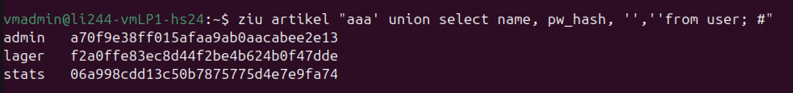

tag:: [[GIBB]] 
module:: 183

- ## Injection
	- In der Informatik bezeichnet **Injection** eine Technik, bei der **unerwünschte oder schädliche Daten in ein System eingefügt** werden.
	- Sie passiert, wenn ein User Eingaben macht, die nicht nur als Daten behandelt werden, sordern vom System als ==Code== geführt. Dadurch kann ein Angreifer Funktionen auf dem Server ausführen, die eigentlich nicht erlaubt sind. Das Problem entsteht, weil das Programm Eingaben eines Nutzers direkt in **Interpretern** oder Systemkommandos verwendet, ohne sie zu überprüfen oder abzusichern.
	- ### Grundstruktur einer Injektion:
		- Der **fest programmierte Teil** (z. B. ein SQL-Befehl oder ein Kommando) ist fix und wird vom Entwickler definiert.
		- Der **variable Teil** kommt aus Benutzereingaben, z. B. durch ein Eingabefeld.
		- Wenn diese Eingaben nicht sicher verarbeitet werden, kann ein Angreifer bösartigen Code einschleusen, der dann als Teil des Programms ausgeführt wird.
	- ### Beispiele für verwundbare Systeme:
		- **Datenbanken (SQL)**: Einschleusen von SQL-Befehlen, um auf geschützte Daten zuzugreifen.
		- **Browser (XSS)**: Einfügen von JavaScript, um Benutzerdaten zu stehlen.
		- **Dateisysteme (Directory Traversal)**: Zugriff auf Dateien außerhalb des erlaubten Bereichs.
		- **Betriebssysteme (Command Injection)**: Ausführen von Systembefehlen.
		- **Libraries**: Angriffe über schlecht abgesicherte Drittanbieter-Bibliotheken (z. B. Logging, XML).
	- ### Fazit
		- Jedes System, das Benutzereingaben entgegennimmt und weiterverarbeitet, ist potenziell angreifbar. Entwickler müssen sicherstellen, dass Eingaben **geprüft und bereinigt** werden, bevor sie in kritischen Bereichen wie Datenbanken oder Interpretern genutzt werden.
-
- ## Shell Injection
- ## XSS Injection
- ## SQL Injection
  collapsed:: true
	- Eine Art von Angriff, bei dem ein Angreifer schädlichen SQL-Code in eine DB-Abfrage einschleust, um um unerlaubt auf Daten zuzugreifen oder die Datenbank zu manipulieren. Eine Webanwendung übergibt Nutzereingaben oft direkt an eine SQL-Datenbank. Wenn diese Eingaben nicht richtig überprüft werden, kann ein Angreifer SQL-Befehle einschleusen.
	- ### Beispiele
		- #### Zugriff auf alle Daten
			- ```sql
			  --Ein unsicheres Login-System könnte folgenden SQL-Befehl nutzene:
			  SELECT * FROM users WHERE username = '$eingabe' AND password = '$passwort';
			  
			  --Ein Angreifer könnte als Benutzername eingeben:
			  ' OR '1'='1
			  
			  --Dann sieht die SQL-Abfrage so aus:
			  SELECT * FROM users WHERE username = '' OR '1'='1' AND password = '$passwort';
			  
			  --Da 1=1 immer wahr ist, kann sich der Angreifer ohne gültiges Passwort 
			  anmelden.
			  ```
		- ####  Daten aus einer anderen Tabelle auslesen
			- Mit `UNION SELECT` kann ein Angreifer Daten aus einer anderen Tabelle abrufen.
			- ```sql
			  99999' UNION SELECT name, tel FROM customer; #
			  ```
			- Falls die Tabelle `users` keinen Eintrag mit `id = 99999` hat, liefert die Datenbank stattdessen Namen und Telefonnummern aus der Tabelle `customer`.
	- ### Schutz vor SQL Injection:
		- **Prepared Statements verwenden** (z. B. mit `?` als Platzhalter)
		- **Eingaben validieren und escapen**
		- **Minimale Rechte für die Datenbankbenutzer vergeben**
- ## Workshops
	- ### Workshop 1 - Injection über Web
		- #### Shell Injection
			- Über das Web Formular auf die Shells des Servers gelangen. Mit `;` escapen, dann z.B. `ls -l`
			- Prozesse und Ihre Besitzer auslesen: `ps aux | grep website`
			- Welche Crontabs hat der User?: `crontab -l`
			- Wie sieht der Sourcecode der Webseite aus: `cat website.p1`
			- Mit was für eine Sprache (Version) wird die Seite ausgeführt: `perl --version`
		- ### XSS Injection
			- JS zum Umleiten auf GIBB Webseite
			- ```javascript
			  <script language="javascript" type="text/javascript">
			  	window.setTimeout('window.location = "https://portal.gibb.ch"',20000);
			  </script>
			  
			  ;sed -i "s/willkommen!/Her will"
			  ```
	- ### Workshop 2 - Injection über TCP
		- #### Login ohne Credentials
			- ```bash
			  $ ziu login
			  User: ' or 1=1; # 
			  Password: *
			  ```
			- Die SQL-Injection sollte beim **Usernamen** eingegeben werden, weil die Abfrage meist zuerst nach dem Benutzernamen sucht. So kann der Angreifer die Passwortprüfung umgehen.
			- Da `1=1` immer **wahr** ist, wird die Abfrage für alle Benutzer gültig – der Angreifer kann sich ohne Passwort einloggen!
			- Gebe ein beliebiges Passwort von mindestens der Länge 1 an, damit die TCP-Nachricht das korrekte Format hat und vom Server akzeptiert wird.
		- #### Credentials auslesen
			- `ziu artikel "aaaa' union select name, pw_hash, '', '' from user; #"`
			- **Was bewirkt der String aaaa?**
				- `aaaa` ist einfach ein Platzhalter, um die ursprüngliche SQL-Abfrage nicht komplett zu verändern. Es wird eine normale Abfrage nach einem Artikel mit dem Namen `aaaa` vorgetäuscht.
			- **Was macht ein union select?**
				- `UNION SELECT` erlaubt es, eine zweite Abfrage an das ursprüngliche Ergebnis anzuhängen.
				- Das bedeutet, dass wir zusätzlich zur ursprünglichen Tabelle **Daten aus einer anderen Tabelle** (hier `user`) abrufen können.
				- Damit der `UNION`-Angriff funktioniert, muss die Anzahl der Spalten übereinstimmen.
			- **Warum hat es zwei Leerstrings (' ') im Angriff?**
				- Die Original-Abfrage könnte eine Tabelle (`artikel`) mit vier Spalten haben.
				- Die `user`-Tabelle hat aber nur zwei relevante Spalten (`name` und `pw_hash`).
				- Damit der `UNION SELECT` funktioniert, müssen wir zwei leere Werte (`''`) hinzufügen, damit die Spaltenanzahl passt.
			- **Was erhalten Sie als Ergebnis?**
				- Falls die SQL-Injection erfolgreich ist, gibt die Datenbank eine Liste mit Artikeln **und zusätzlich die Benutzerdaten**(Name und Passwort-Hash) aus der `user`-Tabelle zurück.
				- Anstatt nur Artikel anzuzeigen, werden also auch **gehackte Usernamen und Passwort-Hashes** sichtbar!
				- {:height 86, :width 656}
		- #### Server weiter ausforschen über Shell-Injection
		- #### Remote Shell aktivieren
		- #### Daten Verändern