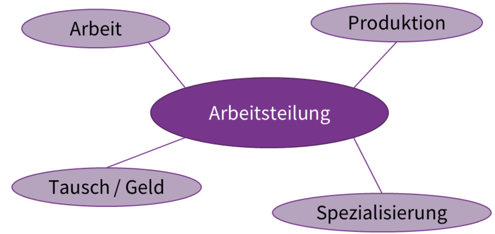
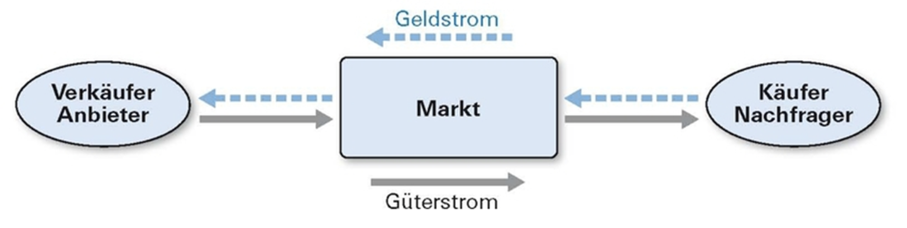

## Arbeitsteilung
	- Bedeutet die organisatorische Zerlegung einer Arbeitsaufgabe in mehrere Teilaufgaben (*sự chia nhỏ một cách có tổ chức một nhiệm vụ công việc thành nhiều nhiệm vụ nhỏ*) und deren Zuweisung an einzelne Arbeitsausführende (*phân công chúng cho từng cá nhân thực hiện công việc*).
	- {:height 235, :width 459}
	-
- ## Markt
	- Ist das regelmässige Zusammentreffen von Händlern an einem bestimmten Platz, um Waren (des täglichen Lebens) zu verkaufen.
	- Bezeichnet allgemeinsprachlich einen Ort, an dem Waren oder Dienstleistungen regelmässig auf einem meist zentralen Platz oder Ort (Marktplatz) gehandelt werden.
	- 
- ## Organisation
	-