alias:: Business Process Model and Notation,

- ## Definitionen
  collapsed:: true
	- **Geschäftsprozessmodellierung und -notation**
	- Eine grafische Spezifikationssprache in der Wirtschaftsinformatik und im Prozessmanagement.
	- Sie stellt **Symbole** zur Verfügung, mit denen Fach-, Methoden- und Informatikspezialisten Geschäftsprozesse und Arbeitsabläufe modellieren und dokumentieren können
	- Die BPMN ist eine graphische Darstellung, welche sich durch die einfache Zugänglichkeit alle Beteiligten auszeichnet.
	- Der kleine Umfang an Notationselementen erlaubt einen raschen Einstieg in die Modellierung. BPMN dient zur **technischen** und **fachlichen Beschreibung** von Geschäftsprozessen.
- ## Ziel und Zweck
  collapsed:: true
	- Eine leicht verständliche und einfach zu verwendende Notation für die Visualisierung und Modellierung der Business-Prozesse.
	- Grundlage für eine automatisierte Übersetzung von Modellen in ausführbare Form (z.B. BPEL – Business Process Execution Language)
- ## Elemente
	- ### Flow Objects
		- 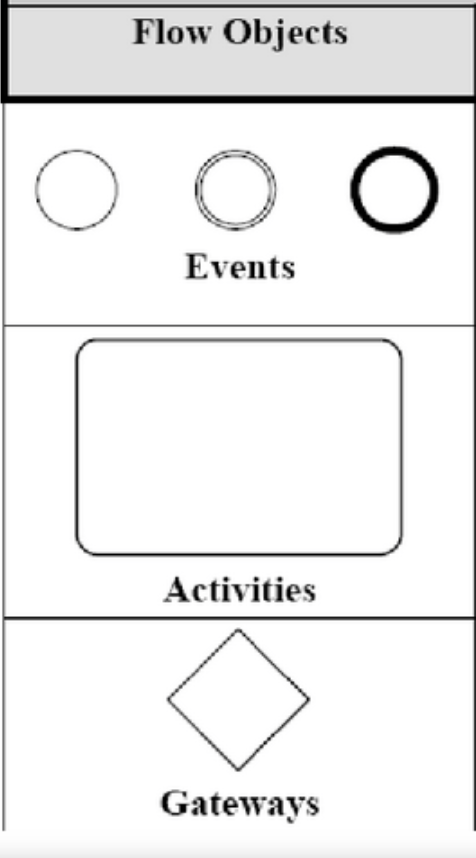{:height 424, :width 208}
		- **Activity**
			- Beschreibt eine Aufgabe, die in einem Geschäftsprozess zu erledigen ist
			- Elementare Activity ==> **Task**
			- Komplexere Activities ==> **Subprocess **
			- 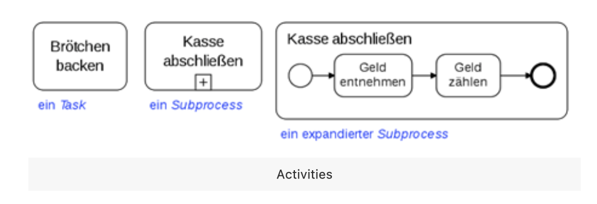
			- Ein Subprozess unterscheidet sich in der Notation durch ein ==+ Symbol==. Subprozesse können in kollabiertem oder expandiertem Zustand dargestellt werden.
		- **Gateway** (Zugang)
			- Stellt einen Entscheidungspunkt dar **(Split/Fork)**, oder einen Punkt, an dem verschiedene Kontrollflüsse zusammenlaufen **(Join/Merge**).
			- 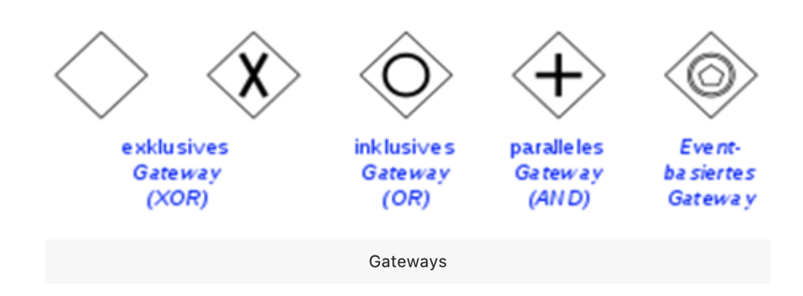
		- **Event**
		  collapsed:: true
			- Ist etwas, das sich in einem Geschäftsprozess ereignen (xay ra) kann
			- Zum Beispiel das Eintreffen einer Nachricht, das Erreichen eines bestimmten Datums oder das Auftreten einer Ausnahmesituation
			- Events werden in drei Klassen eingeteilt
				- *nach ihrer Position im Geschäftsprozess in Start-, Intermediate- und End-Event.
				- *nach ihrer Wirkung im Geschäftsprozess in Catching-Event (reagiert auf Auslöser) und Throwing-Event (liefert Ergebnis).
				- *nach ihrer Art in Timer-, Message-, Exception-Event etc*. Pro Event-Typ kennt die Notation ein eigenes Symbol, das im Innern des Kreissymbols für den Event angezeigt wird.
			- 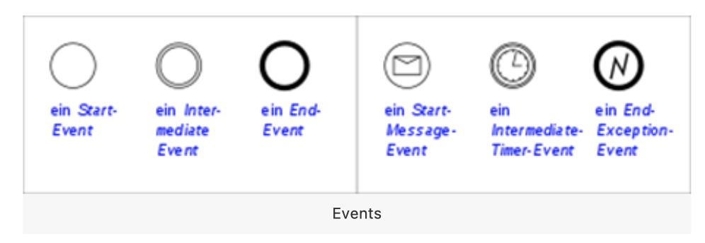{:height 203, :width 518}
		-
	- ### Connecting Objects
		- **Sequence Flows ** verbinden Activities, Gateways und Events.
		- Sie stellen dar, in welcher Reihenfolge Activities ausgeführt werden.
		- 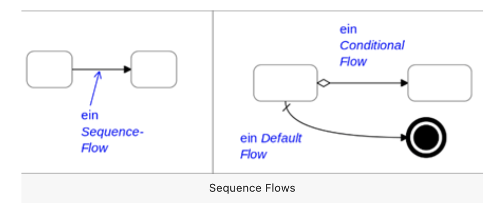{:height 258, :width 499}
			- Ein **Conditional Flow** wird nur dann durchlaufen, wenn eine bestimmte Bedingung wahr ist
			- Ein **Default Flow** nur, wenn kein anderer Sequence Flow durchlaufen werden kann
		-
		- 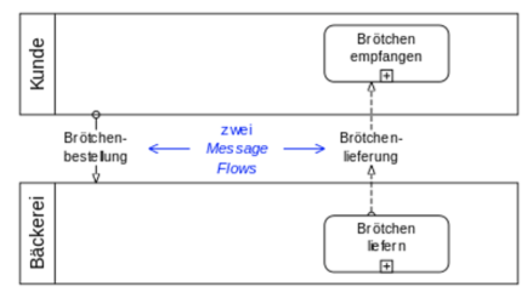{:height 396, :width 446}
			- Ein **Message Flow** zeigt an, dass zwei Lanes oder Pools in einem Business Process Diagramm oder zwei Elemente daraus Meldungen austauschen. Message Flows verbinden Lanes, Pools oder Flow Objects nur temporär miteinander.
	- ### Pools und Swimlanes
	  collapsed:: true
		- Die Bereiche, mit denen Aktoren und Systeme dargestellt werden
		- Ein **Pool **repräsentiert die wesentlichen Prozessbeteiligten ==> *unterschiedliche Organisationen.*
		- Eine **Lane **ist eine Unterteilung eines Pools, die sich über die komplette Länge des Pools erstreckt, und repräsentiert einen **Participant **in einem Workflow ==>  *einen Benutzer bzw. eine Benutzerrolle oder ein System.*
		- 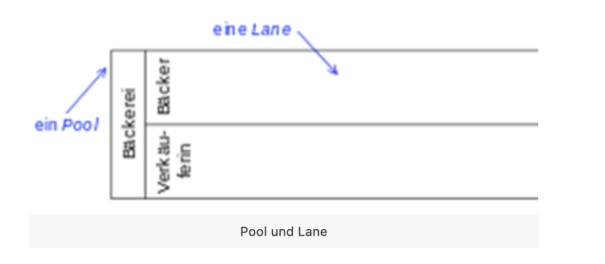{:height 320, :width 675}
		-
	- ### Artifacts
	  collapsed:: true
		- Eine **Annotation **ist ein Kommentar, der einem Element eines Geschäftsprozesses zugeordnet werden kann.
		- Ein **Data Object** repräsentiert ein Artefakt, das der Geschäftsprozess bearbeitet. Mit Data Objects können sowohl elektronische Objekte wie Dokumente oder Datensätze, als auch physische Objekte wie Brötchen oder Bücher dargestellt werden.
		- Eine **Group **ist ein Hilfsmittel, um Elemente eines Geschäftsprozess visuell zusammenzufassen. Sie ist nicht zu verwechseln mit einem Subprocess.
		- 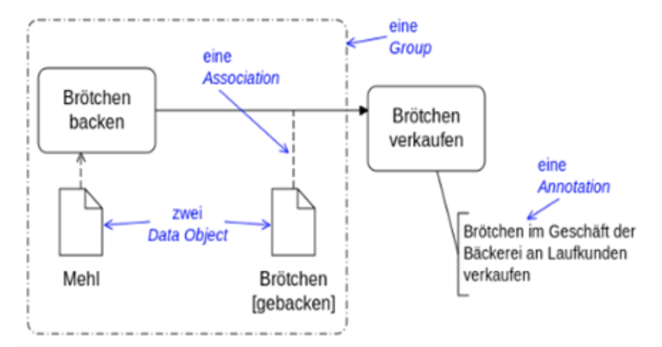
- ## Prozesstypen
  collapsed:: true
	- **Merkmalen von Geschäftsprozessen:**
		- Eindeutiger Anfang und Abschluss
		- Fokussiert auf ein Ziel
		- Ergebnis (z.B. Verkauf von Waren mit Gewinn)
		- Oft bestehen sie aus einer Kette von Teilprozessen
		- Verursachen durch den Ressourcenverbrauch Kosten
		- Beziehen die Schnittstellen zu oder die GP der Lieferanten und Kunden in den Ablauf mit ein
		- Werden durch einen Aktionsträgern gesteuert (Person, Sachmittel z.B. Computer)
	- ### Linearer Prozess
		- 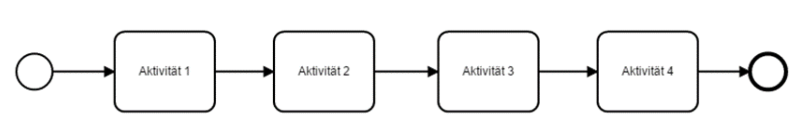{:height 125, :width 718}
	- ### Prozess mit Parallelität (Aktivitäten können zum Teil parallel ablaufen)
		- 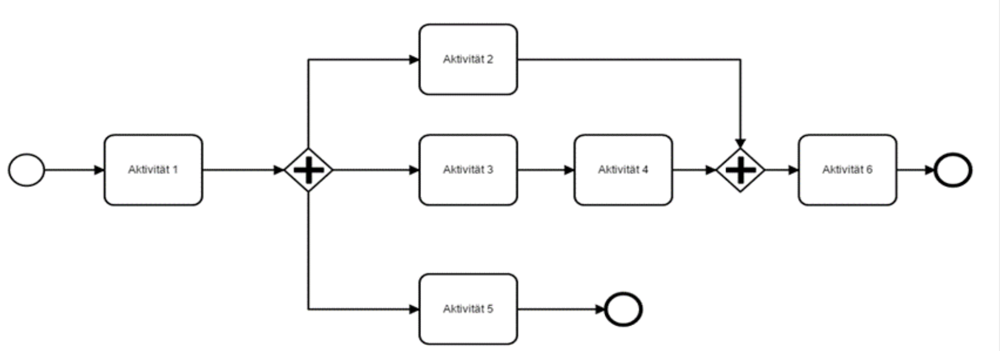
	- ### Prozess mit Schleife
		- 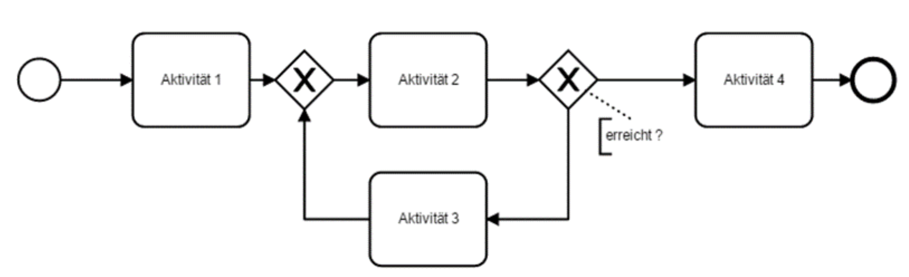
-