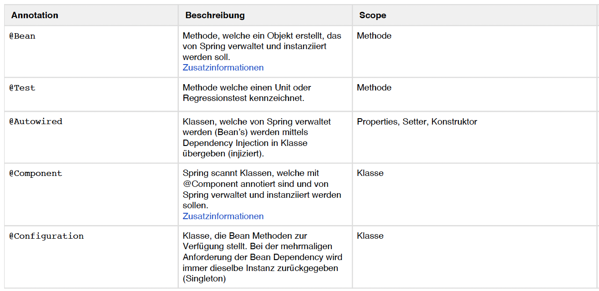
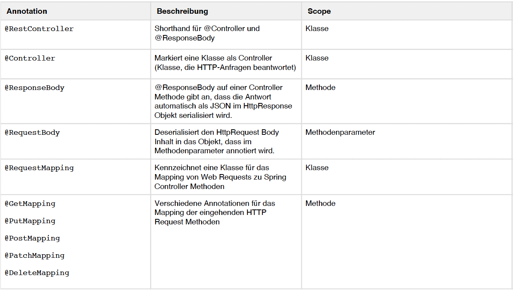
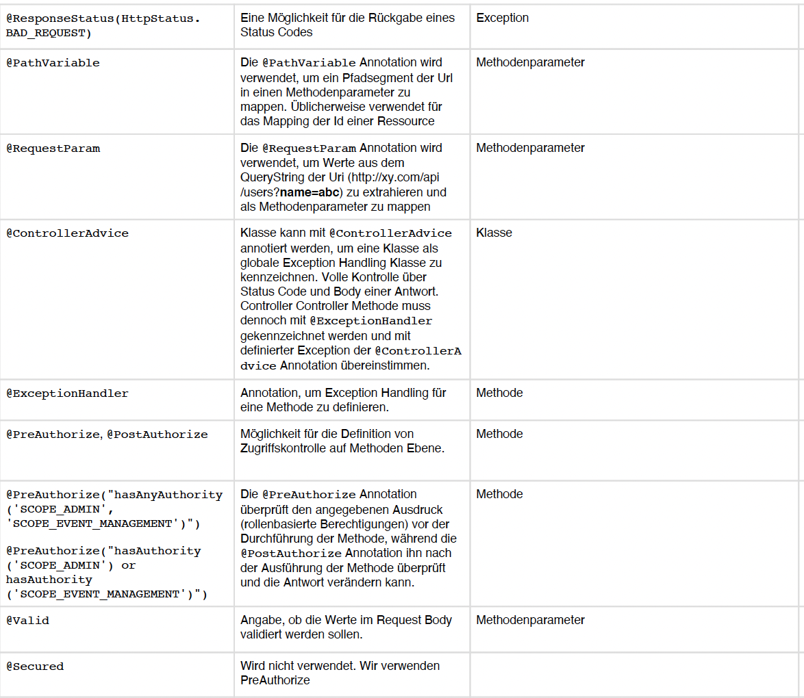
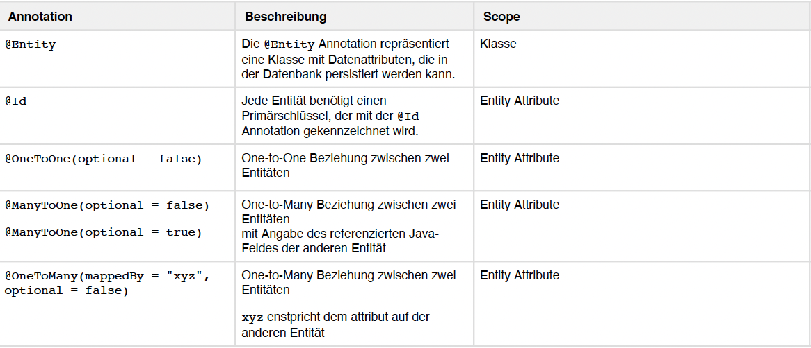
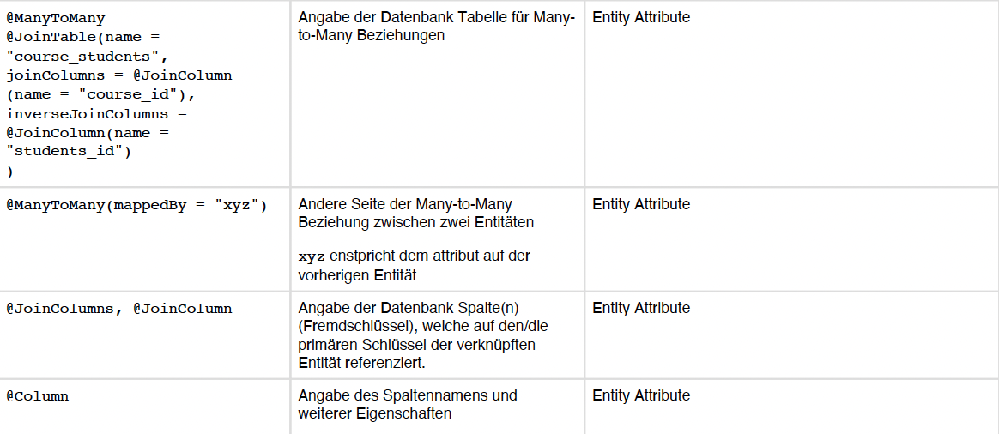
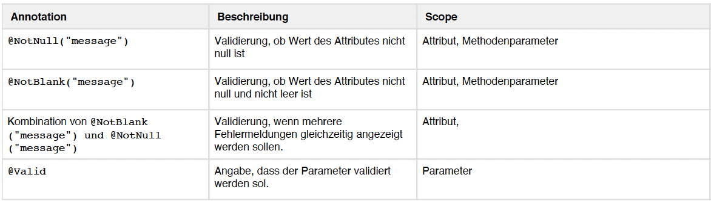
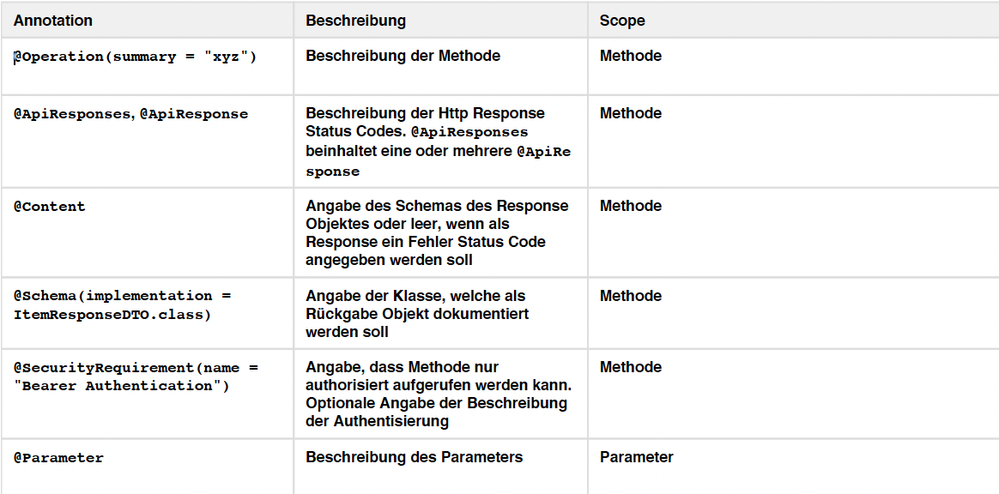

- #BBC
- [[HTTP Request Methods]]
- [[Spring Boot]]
- [[Data JPA]]
- # RESTful API
  collapsed:: true
	- **R**epresentational **S**tate **T**ransfer
	- Merkmale:
		- Client-Server-Model
		- Einheitlich Schnittstelle
		- Zustandlos (Stateless / keine Session auf Server)
		- Cachable
- # DataJPA
	- https://www.baeldung.com/the-persistence-layer-with-spring-data-jpa
- # DataJPA DB-Einbinden
  collapsed:: true
	- ## Annotations
	  collapsed:: true
		- ### Controller
			- #### Klasse
				- @RequestController
					- Diese Klasse enhält Rest-Endpunkte
					- Muss bei den Controllern vorhanden sein
				- @RequestMapping("[path]")
					- Definiert den URI des Controllers
				- ```Java
				  @RequestController
				  @RequestMapping("/items")
				  public class ItemController {
				    ...
				  }
				  ```
			- #### Methoden
				- bestimmt die http-Methode
				- kann Pfad erweitern
					- Bsp.
					- ```java 
					  @GetMapping("{id}") // /items/1
					  ```
				- @GetMapping
				- @PostMapping
				- @PatchMapping
				- @DeleteMapping
			- #### Methoden-Parameter
				- @Pathvariable
					- var aus dem Pfad => /items/**1**
					- ```java 
					  public Item findById(@PathVariable Integer id)
					  ```
				- @RequestParam
					- http-GET Parameter => /items**?name=foo**
					- kann default Wert definieren
					- ```java
					  public List<Item> findItems(@RequestParam(required = false) String name)
					  ```
				- @RequestBody
					- http-POST/PATCH
					- Daten kommen aus dem Body
					- ```java
					  public Item insert(@RequestBody Item item)
					  ```
		-
	- ## Spring mit DB verbinden
	  collapsed:: true
		- ### Entity (Klasse)
			- parameterloser Konstruktor
			- Klassen-Annotation **@Entity**
			- Primärschlüssel: Attribut mit **@Id**
			- ```java
			  @Entity
			  public class Person {
			    
			    @Id
			    @GeneratedValue(strategy = GenerationType.IDENTITY)
			    private Integer id;
			    
			    private String username;
			    
			    private String password;
			    
			    //...getter & setter
			  }
			  ```
			- Zusätzliche Optionen
				- ```java
				  @Table(name = "tbl_peson") 
				  //wenn sich DB. oder Tabellennamen unterscheiden
				  
				  @Column(name = "vorname")
				  //wenn sich Spaltennamen unterscheiden
				  
				  @Column(insertable = false, updatable = false)
				  //wenn das Feld von der Applikation nicht gesetzt werden darf
				  
				  @Column(unique = true)
				  //wenn das Feld einzigartig sein soll
				  
				  @GeneratedValue
				  //falls Id Datenbankseitig vergeben wird  (Best Pratice)
				  ```
		- ### Repository (Interface)
			- JpaRepository<(Entity), (Schlüssel)>
			- ```java
			  public interface ItemRepository extends JpaRepository<Item, Interger> {
			    //alle Methoden definieren
			    List<Item> findByNameContains(String name)
			      
			    //Man kann auch spezifizieren, wie die Methode funktionieren
			    @Query("SELECT i FROM Item i" +
			           "JOIN LinkedTags t" +
			           "WHERE t.name LIKE CONCAT('%', :tagName, '%')")
			    List<Item> findByTagName(@Param("tagName") String tagName);
			  }
			  ```
			- Einbinden im Controller
				- Kontruktor mit **@Autowired**
				- Als Param im Konstruktor mitgeben
				- ```java
				  @RequestController
				  @RequestMapping("/items")
				  public class ItemController {
				    
				    private ItemRepository itemRepository;
				    
				    @Autowired
				    public ItemController(ItemRepository itemRepository) {
				      this.ItemRepository = itemRepository;
				    }
				  }
				  ```
- # CheatSheet Spring Annotations
  collapsed:: true
	- ## General
		- 
	- ## REST
		- 
		- 
	- ## ERM/JPA
		- 
		- 
	- ## Validation
		- 
	- ## Swagger
		- 
		-
-