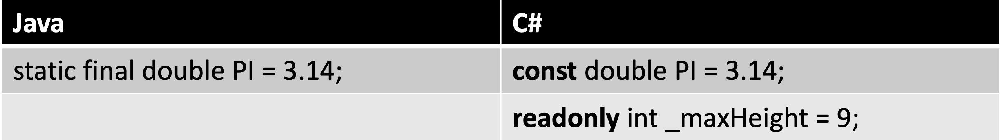
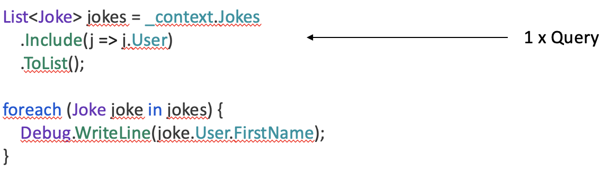

tags:: Programmieren, BBC

- Eine vollwertige objektorientierte Programmiersprache
- Syntaxist eine Mischung zwischen [[Java]] und [[C++]]
- # .NET
  collapsed:: true
	- Eine Bibliothek von standardisierten C# Klassen
	- Beinhaltet eine Laufzeitumgebung, die Common Language Runtime (CLR)
	- Übersetzt C# - Code in eine Zwischensprache,welche vom CLR ausgeführt werden kann
	- ## **.NET Framework / .NET Standard /.NET Core**
		- [https://docs.microsoft.com/de-de/archive/msdn-magazine/2016/april/net-core-net-goes-cross-platform-with-net-core](https://docs.microsoft.com/de-de/archive/msdn-magazine/2016/april/net-core-net-goes-cross-platform-with-net-core)
		- 
		- **.NET Framework**: Alle Features die Microsoft anbietet werden unterstützt, sind aber
		  z.B. auf Linux nur mit dem veralteten Mono (die JVM für Linux) ausführbar.
		- **.NET Core**: Ermöglicht eine volle Kompatibilität zu andern Betriebssystemen wie z.B. Linux oder macOS. Es werden jedoch noch nicht alle Features von .NET Framework unterstützt. Die Programmierung mit .NET Core soll mehr Richtung Cloud gehen.
		- **.NET Standard**: Features aus .NET Framework, welche bereits mit .NET Core
		  funktionieren.
- # Syntax
  collapsed:: true
	- ## Datentypen
		- 
		- decimal:
			- Exaktes Runden
		- float / double:
			- Kein exaktes Runden
	- ##  Reference Types
		- 
		-
	- ## Private Variablen
		- ```C#
		  private int _number;
		  ```
	- ## Konstanten
		- 
		- Im Gegensatz zu **const**, können **readonly** Felder im Konstruktor initialisiert werden.
		- Der Wert einer readonly Variable kann nur bei der Deklaration oder im Konstruktor gesetzt werden.
		- Const kann nicht im Konstruktor initialisiert werden
	- ## Operatoren
		- ### Vergleiche
			- ==   <   >   <=   >=   !=
		- ### Arithmetisch
			- +  -   *  /
			- %  (modulo)
			- Math.Pow(x, y)
		- ### Zuweisung
			- =  +=  -=   *=   /=    %=   &=
			- |=  ^=  <<=  >>=  ++  --
		- ## Bitweise
			- & |  ^   ~  <<  >>
		- ### Logical
			- && ||  &  |   ^   !
		-
	- ## Methoden
		- ```C#
		  //Main method
		  public static void Main(string[] args) {}
		  ```
	- ## String
		- ### Strings formatieren
			- ```C#
			  int answer = 42; 
			  string s = string.Format("{0} is the answer", answer);
			  Console.WriteLine(s);
			  	> 42 is the answer
			  
			  
			  
			  //Interpolation
			  
			  int answer = 42; 
			  string s  = $"{answer} is the answer";
			  Console.WriteLine(s);
			  	> 42 is the answer
			  
			  ```
		- ### StringBuilder
			- ```C#
			  StringBuilder buffer = new StringBuilder("zwei "); 
			  buffer.Append("drei "); 
			  buffer.Insert(0, "eins "); 
			  buffer.Replace("zwei", "ZWEI"); 
			  
			  Console.WriteLine(buffer); 
			  	> eins ZWEI drei 
			  
			  ```
	- ## Schleifen
		- ```C#
		  while (i < 10) 
		  i++;
		  
		  
		  for (i = 2; i <= 10; i ++) 
		  Console.WriteLine(i);
		  
		  
		  do  
		  i++; 
		  while (i < 10);
		  
		  
		  foreach (int i in numArray)  
		  sum += i;
		  
		  
		  foreach (Object o in list)
		  Console.WriteLine(o);
		  ```
	- ## Array
		- ```C#
		  int[] nums = {1, 2, 3};
		  for (int i = 0; i < nums.Length; i++)
		    Console.WriteLine(nums[i])
		    
		    
		  string[] names = new string[5];
		  names[0] = "David";
		  
		  
		  float[,] twoD = new float[rows, cols];
		  twoD[2,0] = 4.5f; 
		  ```
	- ## If / else
		- ```C#
		  if (a == b) {
		     Console.WriteLine("a == b");
		  } else {
		     Console.WriteLine("a != b");
		  }
		  
		  
		  int c = a > b ? a : b;
		  ```
	- ## Enumaration
		- ```C#
		  enum Action {
		     Start, 
		     Stop, 
		     Rewind, 
		     Forward
		  }
		  
		  Action a = Action.Stop;
		  if (a != Action.Start)
		    Console.WriteLine(a);  // prints Stop 
		  
		  Console.WriteLine((int)a);  // prints 1 
		  
		  ```
	- ## Properties
		- ```C#
		  public class Human
		  {
		     /// <summary>
		     /// Gets or sets the name of the human.
		     /// </summary>
		     /// <value>
		     /// The name of the human.
		     /// </value>
		     public string Name { get; set; }
		  }
		  
		  ```
		- ### Setter & Getter
			- ```C#
			  public class Human {
			     private string _name;
			  
			     public string Name {
			        get { return _name; }
			        set {
			           if (value == string.Empty) {
			              throw new InvalidHumanException("Empty string is not a valid human name");
			           }
			           _name = value;
			        }
			     }
			  }
			  
			  ```
		- ### Main-Programm
			- 
			- Es wird automatisch erkannt, wenn ein Wert gesetzt oder gelesen wird und die entsprechenden get bzw. set-Methoden werden aufgerufen.
	-
- # Collections
  collapsed:: true
	- 
	- ## IEnumerable<T>
		- Beim **foreach** wird automatisch mit ==GetEnumerator()== auf den Enumerator zugegriffen.
		- Wird gebraucht zum Iterieren (Ienumerable erlaubt es über eine Collection, List u.s.w. zu iterieren)
		- ```c#
		  foreach (Person person in people) {
		     // Do something
		  }
		  ```
	- ## Enumerator (Schlaufen)
		- Ein Enumerator zeigt auf ein bestimmtes Element eines Arrays. Mit MoveNext()
		  zeigt der Enumerator auf das nächste Element.
		- Current gibt immer das aktuelle Element zurück.
		- ```c#
		  public class MyEnumerator<T> : IEnumerator<T> {
		     private int _position = -1;
		     private readonly T[] _items;
		  
		     public MyEnumerator(T[] items) {
		        _items = items;
		     }
		  
		     public bool MoveNext() {
		        _position++;
		        return (_position < _items.Length);
		     }
		  
		     public void Reset() {
		        _position = 0;
		     }
		  
		     public T Current { get { return _items[_position]; } }
		  
		     object IEnumerator.Current {
		        get { return Current; }
		     }
		  }
		  ```
	- ## ICollection <T>
		- The ICollection<T> interface is **the base interface for classes in the System. Collections. Generic namespace**.
		- Reihenfolge spielt keine Rolle
		- Einträge hinzufügen / entfernen
		- Einträge zählen
		- Alle Einträge entfernen
		- ```c#
		  void Add(T item)
		  bool Remove(T item)
		  void Clear()
		  int Count{ get; }
		  ```
	- ## Collection
		- Eine Implementierung von ICollection<T>
		- ```c#
		  ICollection<Person> people = new Collection<Person>();
		  Person person1 = new Person {Firstname = "Foo", Lastname = "Bar"};
		  people.Add(person1);
		  people.Remove(person1);
		  ```
	- ## IList <T>
		- Reihenfolge spielt eine Rolle
		- Einträge an bestimmter Position einfügen / entfernen
		- ```c#
		  void RemoveAt(int index)
		  void Insert(int index, T item)
		  T this[int index]
		  Object this[int index]
		  ```
	- ## List<T>
		- Eine Implementierung von IList<T>
		- ```c#
		  IList<Person> people = new List<Person>();
		  Person person1 = new Person {Firstname = "Foo1", Lastname = "Bar1"};
		  Person person2 = new Person { Firstname = "Foo2", Lastname = "Bar2" };
		  people.Add(person1);  // Add ist von ICollection
		  people.Insert(0, person2); // Insert ist von Ilist// Der Aufruf mit [] ist nur mit IList möglich
		  Debug.WriteLine(people[0].Firstname); 
		  ```
			- Die Syntax mit [] ist die selbe wie bei einem Array, macht aber nicht das selbe.
			- Dynamische Liste nicht benutzen.
				- Dynamische Liste, welche Elemente vom Typ object beinhaltet.
				- Schnell beim Anhängen/Löschen neuer Elemente am Ende der Liste
	- ## Stack<T>
		- Last in first out (LIFO)
		- Funktioniert wie ein Kartenstapel (Stack = Stapel)
		- ```c#
		  Person alice = new Person{ Name = "Alice" };
		  Person bob = new Person { Name = "Bob" };
		  
		  Stack<Person> myStack = new Stack<Person>();
		  myStack.Push(alice);
		  myStack.Push(bob);
		  Debug.WriteLine(myStack.Pop().Name);
		  
		  ```
		- Was gibt dieser Code aus? => bob
	- ## Dictionary <TKey, TValue>
		- Eine Implementierung von IDictionary<TKey, TValue>
		- Auflistung von ==Schlüssel-Wert-Paaren==, deren Reihenfolge anhand des Schlüssels bestimmt wird
		- Ein Schlüssel ist nur einmal in einem Dictionary vorhanden
		- ```c#
		  Dictionary<int, string> myDictionary = new Dictionary<int, string>();
		  myDictionary.Add(6, "LOL");
		  myDictionary.Add(3, "YOLO");
		  
		  if (myDictionary.ContainsKey(6)) {
		      Debug.WriteLine(myDictionary[6]);
		  }
		  ```
	- ## Queue<T>
		- First in first out (FIFO) Warteschlange
		- 
		- ```c#
		  Person alice = new Person { Name = "Alice" };
		  Person bob = new Person { Name = "Bob" };
		  
		  Queue<Person> myQueue = new Queue<Person>();
		  myQueue.Enqueue(alice);
		  myQueue.Enqueue(bob);
		  Debug.WriteLine(myQueue.Dequeue().Name);
		  ```
		- Was gibt dieser Code aus? => alice
	- ## HashSet<T>
		- Eine Implementierung von ISet<T>
		- Reihenfolge spielt keine Rolle
		- Schneller Zugriff mit Contains(T element)
		- Add(T item) fügt nur hinzu wenn Element nicht vorhanden
		- ```c#
		  Random random = new Random();
		  ISet<int> ids = new HashSet<int>();
		  for (int i = 0; i < 10; i++) {
		      int number = random.Next();
		      if (!ids.Contains(number)) {
		          ids.Add(number);
		      }
		  }
		  ```
	- ## SortedSet<T>
		- Eine Implementierung von ISet<T>
		- Einträge sind sortiert
		- Schneller Zugriff mit Contains(T element)
		- Add(T item) fügt nur hinzu wenn Element nicht vorhanden
		- ```c#
		  ISet<int> zahlen = new SortedSet<int>();
		  zahlen.Add(9);
		  zahlen.Add(3);
		  zahlen.Add(3);
		  zahlen.Add(7);
		  foreach (int zahl in zahlen) {
		      Debug.WriteLine(zahl);
		  }
		  ```
		- Was gibt dieser Code aus?
			- 3
			- 7
			- 9
	-
	- ## Übersicht
		- 
		- 
			-
- # Objektorientierung (OOP)
  collapsed:: true
	- ## Access Modifiers
		- ==public==
		  collapsed:: true
			- Von überall zugreifbar.
		- ==private==
		  collapsed:: true
			- Nur innerhalb der selben Klasse zugreifbar.
		- ==protected==
		  collapsed:: true
			- Nur innerhalb der selben Klasse und Unterklassen zugreifbar.
		- ==internal==
		  collapsed:: true
			- Nurinnerhalb des selben Projektes (Assembly) zugreifbar.
	- ## System.Object als Oberklasse
		- Beispiel: Klasse *Person* abgeleitet von *System.Object*
		- {:height 500, :width 600}
		- 
	- ## Eigene Oberklasse
		- Beispiel: Klasse *Ritter* abgeleitet von *Person*
			- {:height 500, :width 600}
			- {:height 250, :width 200}
		- ## Schlüsselwort base
			- Auch **base** ist eine Referenz so wie **this**
			- Für Zugriff auf Methoden und Instanzvariablen, die in einer Oberklasse definiert sind
			- Private Attribute und Methoden einer Oberklasse können vom Code der Unterklasse **nicht** angesprochen werden
			- Falls Unterklasse keine gleichbenannten Attribute oder Methoden wie ihre Oberklasse
			  besitzt, ist das Schlüsselwort **base** implizit
		- ## Überschreiben
			- 
		- ### Überladen
			- ```c#
			  public class Inf {
			  
			      public string Name { get; set; }
			  
			      public void Program() {
			          Console.WriteLine("'{0}' is programming.", Name);
			      }
			  
			      public void Program(string language) {
			          Console.WriteLine("'{0}' is programming in {1}.", Name, language);
			      }
			  
			  }
			  
			  ```
		- ### Abstrakte Klassen
			- Abstrakte Klassen können nicht direkt instanziiert werden.
			- 
			- ```c#
			  public abstract class AbstractHuman {
			          
			      public string Name { get; set; }
			  
			      public virtual void Walk() {
			          Console.WriteLine("Human with name '{0}' is walking.", Name);    
			      }
			  
			      public virtual void Sleep() {
			          Console.WriteLine("Human with name '{0}' is sleeping.", Name);    
			      }
			  
			      public virtual void Eat() {
			          Console.WriteLine("Human with name '{0}' is eating.", Name);    
			      }
			  }
			  
			  ```
				- Diese abstrakte Klasse implementiert das Grundverhalten eines Menschen.
		- ### Abstrakte Methoden
			- ```c#
			  public abstract class AbstractHuman {
			          
			      public string Name { get; set; }
			  
			      public virtual void Walk() {
			          Console.WriteLine("Human with name '{0}' is walking.", Name);    
			      }
			  
			      public virtual void Sleep() {
			          Console.WriteLine("Human with name '{0}' is sleeping.", Name);    
			      }
			  
			      public virtual void Eat() {
			          Console.WriteLine("Human with name '{0}' is eating.", Name);    
			      }
			  
			      public abstract void Talk();
			  }
			  
			  ```
			- Talk() muss von der Unterklasse implementiert werden.
		- ### Interfaces definieren
			- Wenn du dir Klassen als Baupläne von Objekte vorstellst, dann könnte man ein Interface als Bauaufsichtsamt betrachten. Um ein Bauplan für ein Haus zu entwerfen, muss sich ein Architekt an bestimmte Regeln halten, damit das Ergebnis auch als Haus bezeichnet werden kann. Genauso definieren Interfaces Regeln, die für Klassen gelten müssen,
			  damit diese in einer bestimmte Gruppe von Klassen aufgenommen werden können.
			  Sie definieren eine Menge an Methoden, die eine beliebige Klasse bereitstellen
			  muss, um den Schnittstellenvertrag zu erfüllen.
			- 
		- ### Interfaces implementieren
			- ```c#
			  public abstract class AbstractHuman : IHuman {
			          
			      public string Name { get; set; }
			  
			      public virtual void Walk() {
			          Console.WriteLine("Human with name '{0}' is walking.", Name);    
			      }
			  
			      public virtual void Sleep() {
			          Console.WriteLine("Human with name '{0}' is sleeping.", Name);    
			      }
			  
			      public virtual void Eat() {
			          Console.WriteLine("Human with name '{0}' is eating.", Name);    
			      }
			  
			      public abstract void Talk();
			  }
			  
			  ```
			- 
		- ### Interfaces
			- ```c#
			  public class Inf : AbstractHuman, IInf {
			  
			      public void Program() {
			          Console.WriteLine("Program");
			      }
			  
			      public void Program(string language) {
			          Console.WriteLine("Program(string language)");
			      }
			  
			      public void InstallServer() {
			          Console.WriteLine("Install Server");
			      }
			  
			      public override void Talk() {
			          Console.WriteLine("Talk");
			      }
			  }
			  
			  ```
			- Hier könnten noch weitere Interfaces hinzugefügt werden (kommagetrennt)
			- Aber Achtung! Nur **eine** Oberklasse ist möglich. Die Oberklasse wird **immer
			  vor **den Interfaces hingeschrieben (AbstrctHuman)
		- ### Polymorphie
			- 
		- ### Down- oder Upcast ?
			- Downcast
			- ```c#
			  private void Send_Click(object sender, EventArgs e) {
			     if (sender is Button) {
			        ((Button)sender).Hide();
			     }
			  }
			  ```
- # Unittest
  collapsed:: true
	- ## MSTest
		- Standard Testing Framework für C#
		- Seit v2 Open Source
		- Weniger komplex als XUnit
		- Assert
			- ```java
			  [TestMethod()]
			  public void ElephantWalk() {
			     IAnimal elephant = new Elephant(5, "bob", 10);
			     elephant.Walk(5);
			     Assert.AreEqual(elephant.DistanceWalked, 5);
			     
			     elephant.Walk(6);
			     Assert.AreEqual(elephant.DistanceWalked, 5);
			     
			     elephant.Walk(5);
			     Assert.AreEqual(elephant.DistanceWalked, 10);
			  
			     elephant.Walk(-1);
			     Assert.AreEqual(elephant.DistanceWalked, 10);
			  
			  ```
				- Assert bedeutet auf Deutsch eine Behauptung.
				- Mit Assert.AreEqual(…) behaupten wir, dass die beiden Parameter equal sind.
				- Falls dies nicht der Fall ist, gilt der Test als nicht bestanden.
		- Exceptions testen
			- ```java
			  [TestMethod()]       
			  [ExpectedException(typeof(NullReferenceException))]
			  public void AddAnimalNullExceptionTest() {
			     IZoo zoo = new Zoo();
			     zoo.AddAnimal(null);
			  }
			  ```
		- ### Unit Test Projekt erstellen
			- Mit dotnet Templates
			- ```java
			  dotnet new mstest
			  ```
			-
	-
	-
- # Linq
  collapsed:: true
	- ==Language Integrated Query==
	- Es kann damit auf Daten in Collections oder Datenbanken zugegriffen werden.
	- ## Wieso Linq?
	  collapsed:: true
		- Kürzerer Code
		- Übersichtlicher
		- Kann SQL ersetzen und ist daher typsicher.
		- Sicherheit für Datenbanken (SQL-Injection)
		- ### Beispiel 1
			- ```c#
			  --ohne LinQ:
			  List<int> numbers = new List<int>() { 5, 4, 1, 3, 9, 8, 6 };
			  List<int> moreThanFive = new List<int>();
			  foreach (int number in numbers) {
			      if (number > 5) {
			          moreThanFive.Add(number);
			      }
			  }
			  
			  --mit LinQ
			  List<int> numbers = new List<int>() { 5, 4, 1, 3, 9, 6, 7 };
			  List<int> lowerThanFive = numbers.Where(n => n < 5).ToList()
			  ```
			- 
		- ### Beispiel 2
			- ```c#
			  --ohne
			  public ICollection<User> GetActiveUsers(ICollection<User> users) {
			      ICollection<User> activeUsers = new List<User>();
			      foreach (User user in users) {
			          if (user.Active) {
			              activeUsers.Add(user);
			          }
			      }
			      return activeUsers;
			  }
			  
			  --mit
			  public ICollection<User> GetActiveUsers(ICollection<User> users) {
			      return users.Where(user => user.Active).ToList();
			  }
			  => user entspricht allen Userobjekten in der Collection
			  
			  ```
	- ## LinQ Select
	  collapsed:: true
		- Wie bei SQL bestimmt Select, was im Resultat beinhaltet sein soll.
			- ```c#
			    public IList<string> GetSchoolAddresses(IList<School> schools) {
			        return schools.Select(s => s.Address).ToList();
			    }	
			  ```
		- Mit Select können neue Objekttypen erstellt werden.
			- ```c#
			  public IList<Person> JokesToPeople(IList<Joke> jokes) {
			     return jokes.Select(j => new Person { Name = j.User.Nickname }).ToList();
			  } 
			  ```
	- ## LinQ Where
	  collapsed:: true
		- Wie bei SQL filtert Where das Resultat.
			- ```c#
			  public IList<string> AddressesByFilter(IList<School> schools, string filter) {
			     return schools
			        .Where(s => s.Address.Contains(filter))
			        .Select(s => s.Address).ToList();
			  } 
			  ```
			- Mehrere LinQ-Funktionen können aneinander gehängt werden.
	- ## LinQ OrderBy
	  collapsed:: true
		- Sortiert alle Elemente nach einem bestimmten Wert.
		- ```c#
		  public IList<Student> SortByGrade(IList<Student> students, OrderEnum direction) {
		     if (direction == OrderEnum.Ascending) {
		        return students.OrderBy(s => s.Grade).ToList();
		     }
		     return students.OrderByDescending(s => s.Grade).ToList();
		  }
		  ```
	- ## LinQ Any
		- Überprüft, ob **mindestens ein Element **eine Bedingung erfüllt.
			- ```c#
			  public bool GradeExists(IList<Student> students, decimal grade) {
			     return students.Any(s => s.Grade == grade);
			  }
			  ```
	- ## LinQ All
		- Überprüft, ob **alle Elemente **eine Bedingung erfüllen.
		- ```c#
		  public bool AllUsersActive(IList<User> users) {
		     return users.All(u => u.Active);
		  }
		  ```
	- ## LinQ Count
		- Zählt alle Elemente.
		- Optional kann eine Bedingung angegeben werden
		- ```c#
		  public int StudentsWithGrade(IList<Student> students, decimal grade) {
		     return students.Count(s => s.Grade == grade);
		  }
		  ```
	- ## LinQ FirstOrDefault
		- Gibt ein einzelnes Element zurück, welches eine Bedingung erfüllt.
		- Falls kein Element gefunden wird, wird **null** zurückgegeben.
		- ```c#
		  public Student GetStudentById(IList<Student> students, int id) {
		      return students.FirstOrDefault(s => s.Id == id);
		  }
		  ```
	- ## Weitere Linq-Funktionen
		- First():
			- Wenn kein Element gefunden wurde, wird eine Exception geworfen
		- Single():
			- Gibt das gesuchte Element zurück mit der Bedingung, dass es das einzige Element ist, welches dem Suchkriterium entspricht. Ansonsten wird eine Exception geworfen.
		- SingleOrDefault():
			- Wie Single(), nur dass null zurückgegeben wird statt eine Exception
- # Entity Framework
  collapsed:: true
	- ## Was ist Entity Framework Core?
		- ORM-Framework (Object Relational Mapping)
		- Basiert auf ADO.NET (.NET Klassen für Datenbankzugriff)
	- ## Was ist ein ORM?
		- 
	- ## Vorteile
		- Mit Objekten statt Tabellen arbeiten
		- Security ist bereits vorhanden
		- Validierung automatisch im Code (z.B. max. Länge einer Zeichenkette)
		- Einheitliche Abfragesprache (LinQ)
		- Fast Developer Speed
		- Keine SQL-Kenntnisse erforderlich
	- ## Nachteile
		- Unterstützt nicht alle Datenbanken.
		- Man kann in Performancefalle tappen, vor allem bei grossen Datenmengen.
	- ## Installation
		- Wird über NuGet Package Manager installiert .
			- Microsoft.EntityFrameworkCore.Sqlite -> DataAccess.EFCore
			- Microsoft.EntityFrameworkCore.Design -> JokesConsole
		- Oder über cmd
			- ```c#
			  --Im Data Projekt:
			  dotnet add package Microsoft.EntityFrameworkCore.Sqlite
			  
			  --Im Start Projekt:
			  dotnet add package Microsoft.EntityFrameworkCore.Design 
			  ```
	- ## Erstellen des Models
		- ```c#
		  public class User {
		    private ISet<Joke> _jokes = new HashSet<Joke>();
		    
		    [Key]
		    [DatabaseGenerated(DatabaseGeneratedOption.Identity)]
		    public int Id { get; set; }
		    
		    [Required(AllowEmptyStrings = false)]
		    public string Email { get; set; }
		    
		    public ISet<Joke> Jokes {
		      get => _jokes;
		      set => _jokes = value;
		    }
		  }
		  ```
		- Beim Erstellen des Datenmodells können ähnlich wie in Spring Boot Attribute verwendet werden.
		- Statt mit @ wie in Spring Boot werden Attribute in Eckigen Klammern geschrieben.
		- Die hier gesetzten Attribute sollten für euch selbsterklärend sein.
	- ## Erstellen des Context
		- ```c#
		  public class JokeDbContext : DbContext
		  {
		      private readonly IConfiguration _configuration;
		  
		      public JokeDbContext(IConfiguration configuration)
		      {
		      _configuration = configuration;
		      }
		      protected override void OnConfiguring(DbContextOptionsBuilder options)    {        options.UseSqlite(_configuration.GetConnectionString("Default"));    }    public DbSet<User> Users { get; set; }
		      public DbSet<Joke> Jokes { get; set; }
		  }
		  
		  ```
		- Der Datenbank-Context ermöglicht uns den Zugriff auf die Datenbank.
		- Diese Klasse erbt von DbContext und ist somit die Wurzel/Einstiegspunkt von Entity Framework.
		- Damit die Konfigurations-Einstellungen wie beispielsweise der Speicherort der SQLite Datei nicht hardcodiert angegeben werden müssen, verwenden wir die IConfiguration Schnittstelle, wo sämtliche .Net Core Konfigurationseinstellungen gespeichert sind.
		- In dieser Klasse werden alle vorhandenen Tabellen als DbSet registriert.
	- ## ConnectionString
		- [https://www.connectionstrings.com/](https://www.connectionstrings.com/)
		- ```c#
		  appsettings.json
		  
		  {
		    …
		    "JsonImportFile": "json/jokes.json",
		    "ConnectionStrings": {
		    "Default": "Data Source=C:\\Dev\\Jokes.db"
		    }
		  }
		  
		  ```
		- Die appsettings.json Datei wird für die Konfiguration der App verwendet und befindet sich immer im Start-Projekt.
		- Falls die Datei noch nicht existiert, muss sie hinzugefügt werden.
		- Der ConnectionString ist bei allen DB-Varianten unterschiedlich
		- Für SQLite wird der Pfad zur Datei angegeben
	- ## Repositories für Datenbankzugriff
		- Klassen, die Methoden für den DB-Zugriff enthält
		- Verwendet für den DB Zugriff den DB Context
		- Enthält CRUD Methoden (Create, Read, Update, Delete)
		- Meistens eine Repository Klasse pro Entität
			- ### Create
				- ```c#
				  public class CategoryRepository : ICategoryRepository
				  {
				    private readonly JokeDbContext _context;
				    
				    public CategoryRepository(JokeDbContext context)
				    {
				    _context = context;
				    }
				    
				    public Category Add(Category category)
				    {
				    _context.Categories.Add(category);
				    _context.SaveChanges();
				    return category;
				    }
				   }
				  
				  ```
			- ### Read
				- ```c#
				  public class CategoryRepository : ICategoryRepository
				  {
				    private readonly JokeDbContext _context;
				    public CategoryRepository(JokeDbContext context)
				    {
				    _context = context;
				    }
				    
				    public Category? GetById(int id)
				    {
				      return _context.Categories.FirstOrDefault(c => c.Id == id);
				    }
				   }
				  
				  ```
			- ### Update
				- ```c#
				  public class CategoryRepository : ICategoryRepository
				  {
				    private readonly JokeDbContext _context;
				    public CategoryRepository(JokeDbContext context)
				    {
				    _context = context;
				    }
				    
				    public Category Update(Category category)
				    {
				    _context.Categories.Update(category);
				    _context.SaveChanges();
				    return category;
				    }
				  }
				  
				  ```
			- ### Delete
				- ```c#
				  public class CategoryRepository : ICategoryRepository
				  {
				    private readonly JokeDbContext _context;
				    public CategoryRepository(JokeDbContext context)
				    {
				    _context = context;
				    }
				    
				    public Category Delete(int id)
				    {         
				    var existingCategory = GetById(id);
				    _context.Categories.Remove(existingCategory);
				    _context.SaveChanges();
				    }
				  }
				  
				  ```
		- ## Dependency Injection
			- Repository erstellt Instanz des DB Contextes nicht selber, sondern erhält diese über den Konstruktor.
			- DB Context wird beim Applikationsstart erstellt und konfiguriert und dem Repository mitgegeben.
			- ```c#
			  public class CategoryRepository : ICategoryRepository {
			    private readonly JokeDbContext _context;
			    public CategoryRepository(JokeDbContext context)
			    {
			      _context = context;
			    }
			  
			      ...
			    }
			  
			  ```
			- Die Repository Klassen brauchen für den DB Zugriff eine Instanz des DB Context.
			- Ein DB Context enthält intern eine Liste der gelesenen Daten. Anhand dieser Liste wird
			- festgestell, welche Eigenschaften einer Entität verändert wurden. Eine Instanz eines DB Kontextes kann dabei für mehrere DB-Abfragen verwendet werden.
			- Die Repository Klasse kann nicht immer stelber feststellen, wann es sinnvoll ist, eine neue Instanz des Context zu erstellen. Deshalb wird der Klasse mit dem Konstruktor von aussen eine Instanz mitgegeben.
			- Damit ist die Repository Klasse vielfältig einsetzbar, weil von aussen gesteuert werden kann, wann ein neuer Context erstellt werden soll.
			- ### Warum müssen wir das machen?
				- Entkoppeln von festen Abhängigkeiten
				- Dependency Injection wird verwendet, um feste Abhängigkeiten einer Klasse zu vermeiden.
				- Die Klasse sagt nur, was sie für Abhängigkeiten hat, aber ist nicht selber verantwortlich, diese auch zu erstellen.
				- In einer zentralen Stelle wird konfiguriert, welche Instanzen es gibt und beim Erstellen einer Klasse wird die Abhängigkeit von der zentralen Stelle angefordert und herausgegeben.
				- 
			- ### Wie machen wir das ?
				- Konfiguration beim Applikations-Start (Program.cs)
				- In der Datei Program.cs können neue Instanzen registriert und ausgelesen werden.
				- Das dotnet Framework kann selber herausfinden, welche Abhängigkeiten eine Klasse hat. Solange alle Abhängigkeiten konfiguriert sind, kann
				  dotnet alle Abhängigkeiten auflösen.
				- 
		- ## Initiale Migration erstellen (Im Terminal)
			- Installiert die Tools zum Erstellen von DB-Migrationen.
				- `dotnet tool install --global dotnet-ef`
			- Nach dem Ausführen des Befahls =="dotnet ef migrations add …"== wird im angegebenen Project ein Ordner „Migrations“ erstellt. In den darin generierten Files befindet sich C# -Code zur Erstellung der Datenbank.
				- `MyProject> dotnet ef migrations add Initial --project DataAcces.EFCore --startup project JokesConsole`
					- (Microsoft.EntityFrameworkCore.Design muss im Startup Projekt installiert sein)
			- Beim Erstellen einer Migration erkennt EF automatisch unser ganzes Modell inkl. Relationen.
		- ## Datenbank erstellen / updaten (Im Terminal)
			- `MyProject> dotnet ef database update --project DataAccess.EFCore --startup-project JokesConsole`
	- ## Daten laden
		- ### Lazy Loading
		  collapsed:: true
			- Beim Lazy Loading werden Datensätze nachgeladen, wenn auf Properties einer Klasse zugegriffen wird.
			- In diesem Beispiel wird auf das User Property eines Jokes zugegriffen.
			- Für jeden Joke wird eine zusätzliches SELECT Query für das Auslesen des
			  Users generiert.
			- Lazy Loading funktioniert nur, wenn die Unter-Abfragen in derselben DB
			  Context Instanz erfolgt, in der auch die initiale DB Abfrage gemacht wurde.
			- Nehmen wir an, 8 User haben einen Joke erstellt
				- 
		- ### Eager Loading
			- Beim Eager Loading teilen wir dem Entity Framework mit, welche Entitäten wir mitladen wollen.
			- Anhand dieser Information kann das Entity Framwork ein einzelnes, optimiertes SELECT Query mit einem Join erstellen.
			- Nehmen wir an, 8 User haben einen Joke erstellt
				- 
		- ### Explicit Loading
			- Beim expliziten Loading wird die abhängige Entität im Voraus geladen.
			- Dadurch befindet sich die Liste im Context und wenn später darauf zugegriffen wird, kann der User ergänzt werden.
			- Zu beachten ist, dass in diesem Beispiel alle User geladen werden.
			- Nehmen wir an, 8 User haben einen Joke erstellt
				- 
		- ### What's best ?
			- Kommt auf die Situation an.
			- Manchmal sind mehrere Queries schneller als eine einzige und umgekehrt.(wir gehen hier nicht weiter in die Tiefe)
			- Braucht Eager Loading für Joins
			- Wenn ihr Performanceprobleme habt, wisst ihr wo zu suchen ;-)
		- ### SQL Queries loggen
			- Mit dieser Konfiguration können die SQL Queries in der Console ausgegeben werden.
			- Zuvor muss das angegebene Package installiert werden.
			- Im DataAccess.EFCore Projekt:
				- `dotnet add package Microsoft.Extensions.Logging.Console`
			- ```c#
			  private static readonly ILoggerFactory MyLoggerFactory
			  	= LoggerFactory.Create(builder => { builder.AddConsole(); });
			  	
			  public JokeDbContext(IConfiguration configuration)
			  {
			    _configuration = configuration;
			  }
			  
			  protected override void OnConfiguring(DbContextOptionsBuilder options)
			  {
			    options
			      .UseLoggerFactory(MyLoggerFactory)
			      .UseSqlite(_configuration.GetConnectionString("Default"));
			  }
			  
			  ```
		-
	- #
- # Web API
  collapsed:: true
	- ## Controller
		- ### Routing
			- [controller] wird durch den Namen der Controllers ersetzt, zum Beispiel «jokes».
			- ```c#
			  [Route("api/[controller]")]
			  [ApiController]
			  public class JokesController : ControllerBase
			  {
			  …
			  }
			  
			  ```
			- ### Konstruktor dependency injection
				- Die mitgegebenen Parameter im Konstruktor werden automatisch instanziiert.
				- Damit der Controller weiss, was er instanziieren soll, muss im Program.cs ein entsprechender Eintrag gemacht werden.
				- ```c#
				  public class UsersController : ControllerBase
				  {
				  	private readonly UsersRepository _usersRepository;
				      public UsersController(UsersRepository usersRepository)
				      {
				      _usersRepository = usersRepository;
				      }
				  }
				  ```
			- ### Instanzen registrieren im Program.cs
				- Damit ein Controller instanziert werden kann, müssen alle Abhängigkeiten
				  (Dependencies) registriert werden. Wenn Dotnet einen
				  Controller erstellt, erkennt es, welche Abhängigkeiten ein Konstruktor hat, schaut bei sich in der Tabelle, wo die registrierten Abhängigkeiten gespeichert sind, ob die entsprechende Schnittstelle oder Klasse registriert ist und erstellt dann die Instanz.
				- ```c#
				  builder.Services.AddDbContext<JokeDbContext>();
				  
				  builder.Services.AddScoped<IUserRepository, UserRepository>();
				  
				  // Auch normale Klassen können hinzugefügt werden
				  builder.Services.AddScoped<CurrencyConverter>();
				  
				  
				  ```
			- ### Connection String im appsettings.json
				- ```c#
				  {
				    "Logging": {
				      "LogLevel": {
				        "Default": "Information",
				        "Microsoft.AspNetCore": "Warning"
				        }
				    },
				    "AllowedHosts": "*",
				    "ConnectionStrings": {
				      "DefaultConnection": "Data Source=C:\\DEV\\Jokes.db"
				      }
				  }
				  
				  ```
			- ### GetById
				- In einem REST Api liefern die Endpunkte HTTP Status Codes zurück. Wenn z. Bsp. eine Ressource nicht gefunden wird, soll 404 zurück gegeben werden. Dafür muss im Controller ActionResult als Rückgabeparameter angegeben werden. Die Methode NotFound() kommt aus ControllerBase.
				- Es gibt bei ASP.NET Core API mehrere Möglichkeiten, wie Rückgabetypen angegeben werden können.
				- ```c#
				  // GET: api/users/5
				  [HttpGet("{id}")]
				  public async ActionResult<User> Get(int id)
				  {
				    var user =  _usersRepository.GetById(id);
				    if (user == null)
				    {
				      return NotFound();
				    }
				    return user;
				  }
				  
				  ```
				- [Mehr über Controller Rückgabe Typen](https://learn.microsoft.com/en-us/aspnet/core/web-api/action-return-types)
			- ### GetAll
				- ```c#
				  [HttpGet]
				  public ActionResult<IEnumerable<User>> Get()
				  {
				    return _usersRepository.GetAll();
				  }
				  
				  ```
			- ### Put
				- Wie DTOs benutzt werden können:
				  https://docs.microsoft.com/en-us/aspnet/core/web-api/handle-errors?view=aspnetcore-6.0
				- BadRequest(), NotFound() kommen aus ControllerBase
				- ```c#
				  [HttpPut("{id}")]
				  public ActionResult<User> Put(int id, [FromBody] User user)
				  {
				    if (!ModelState.IsValid)
				      return BadRequest(user);
				    return _userRepository.Exists(id)
				      ? _userRepository.Update(user)
				      : _userRepository.Add(user);
				  }
				  
				  ```
				- [Mehr über Model Validierung](https://code-maze.com/aspnetcore-modelstate-validation-web-api/)
			- ### Post
				- CreatedAtAction(…) ruft nach dem Hinzufügen ein GetUser auf mit dem neu erstellten User auf und gibt das Resultat zurück
				- ```c#
				  [HttpPost]
				  public ActionResult<User> Post([FromBody] User user)
				  {
				    if (_userRepository.Exists(user.Id))
				      return Conflict("User with this id already exists");
				    
				    if (!ModelState.IsValid)
				      return BadRequest(user);
				      
				    	_userRepository.Add(user);
				    
				  	return CreatedAtAction(nameof(Get), new { id = user.Id }, user);
				  }
				  
				  ```
			- ### Delete
				- ```c#
				  [HttpDelete("{id}")]
				  public IActionResult Delete(int id)
				  {
				    var user = _userRepository.GetById(id);
				    if (user == null)
				      return NotFound();
				    _userRepository.Delete(user);
				    return new NoContentResult();
				  }
				  
				  ```