tags:: Webdesign

- # Einfügen eines Stylesheets
  collapsed:: true
	- WICHTIG: Auf Viewport eingehen!
	- 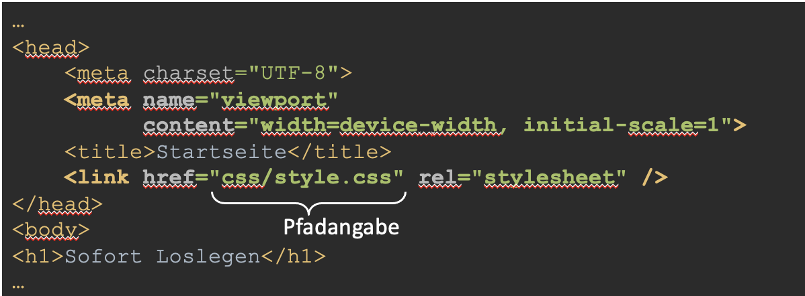{:height 284, :width 749}
	- ## Relative Pfadangaben
		- Eine relative Pfadangabe ist immer relativ zum Pfad, in welchem sich die verschiedenen
		  Dateien befinden.
		- In der Datei index.html haben wir die relative Pfadangabe „css/style.css“
		- Da sich die Datei index.html im Ordner „C:\Meine Seite“ befindet, ist der Pfad
		  relativ zu „C:\Meine Seite“, „css/style.css“ wird also an „C:\Meine Seite“ angefügt.
		- 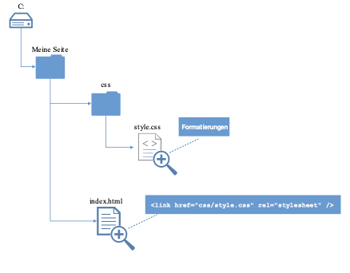
	- ## HTML/CSS trennen
		- ### Wieso?
			- Wiederverwendbarer CSS-Code
			- Templates können erstellt werden (Ganzes Look & Feel kann durch Ersetzen einer CSS-Datei geändert werden)
			- Struktur und Design werden sauber getrennt (Übersichtlicher, besser verwaltbar)
			- Alle HTML-Elemente können zentral angesteuert werden
	- ## CSS-Formatierungen
		- ```css
		  selektor {
		    eigenschaft: wert;
		    [weitere eigenschaft: wert;]
		  }
		  
		  ```
		- Beispiel
			- ```css
			  h1 {
			    color: #00517e;
			    font-family: Arial,sans-serif;
			    font-size: 1.5em;
			    text-transform: uppercase;
			  }
			  ```
		- [https://developer.mozilla.org/de/docs/Web/CSS/CSS_Referenz](https://developer.mozilla.org/de/docs/Web/CSS/CSS_Referenz)
- # CSS Masseinheiten
  collapsed:: true
	- Pixel (px):
		- (Referenz)pixel des Bildschirmes
	- Punkte (pt):
		- Absolutgrösse aus dem Buchdruck
	- Ems (em):
		- Relativ zur Schriftgrösse des
		  Eltern-Elements
	- Rems (rem):
		- Relativ zur Schriftgrösse der Browsereinstellungen (r = Root)
	- Prozent (%):
		- Relativ zum verfügbaren Platz
	- [http://www.w3.org/TR/WCAG10-CSS-TECHS/#units](http://www.w3.org/TR/WCAG10-CSS-TECHS/)
	- [https://developer.mozilla.org/de/docs/Web/CSS/length](https://developer.mozilla.org/de/docs/Web/CSS/length)
- # CSS-Formatierungen
  collapsed:: true
	- ### Line Height
		- 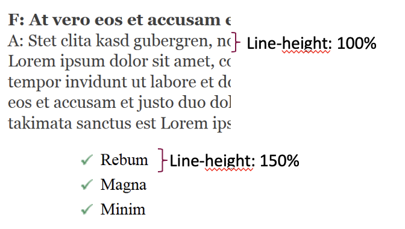{:height 388, :width 672}
			-
	- ### Shorthand properties
		- 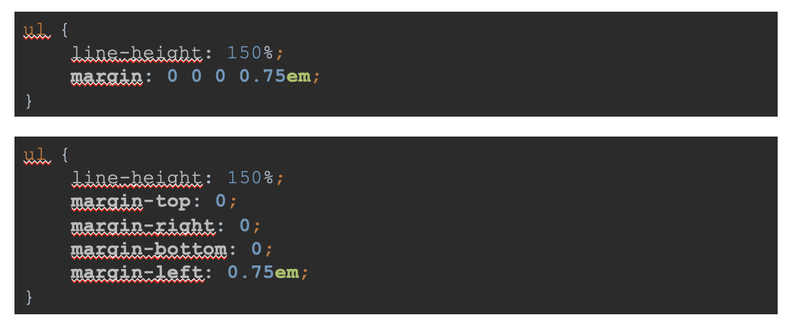
		- Nicht genauer auf margin eingehen, Properties können auch mehrere Werte annehmen.
- # Selektoren
  collapsed:: true
	- [https://](https://developer.mozilla.org/de/docs/Web/CSS/CSS_Selectors)[developer.mozilla.org/de/docs/Web/CSS/CSS_Selectors](https://developer.mozilla.org/de/docs/Web/CSS/CSS_Selectors)
	- ## HTML Attribut id
		- Das HTML Attribut id gibt einem HTML-Element einen Identifikationsnamen
		- Jedes HTML-Element kann **nur einen Identifikationsnamen** haben
		- Dieselbe **id** darf nur einmal pro HTML-Seite **vergeben werden
		- Wird normalerweise nur für JavaScript und nicht für Styling verwendet
		- ```css
		  <article id="main">
		    <h1>Titel</h1>
		    <p>Lorem <span>ipsum</span>dolor sit</p>
		  </article>
		  
		  ```
	- ## HTML Attribut class
		- Das Attribut class gibt einem HTML-Element einen Klassennamen
		- Jedes HTML-Element kann ein oder mehrere Klassennamen haben
		- Elemente einer HTML-Klasse können mit CSS gestylt werden
		- ```css
		  <article class="content short">
		  	<h1>Titel</h1>
		  	<p>Lorem <span class="important">ipsum</span>dolor sit</p>
		  </article>
		  
		  ```
	- ## HTML mit CSS formatieren
		- ### HTML
			- ```html
			  <section id="main">
			    <article class="content">
			      Lorem <span class="important">ipsum</span> dolor sit amet, consetetur sadipscing elitr, sed diam nonumy eirmod tempor invidunt ut labore et dolore magna aliquyam erat, sed diam voluptua. At vero eos et accusam et justo duo dolores et ea rebum.
			    </article>
			  </section>
			  
			  
			  ```
		- ### CSS
			- ```css
			  #main {
			    width: 16.6%;
			  }
			  
			  .content {
			    color: gray;
			  }
			  
			  .important {
			    color: red;
			  }
			  ```
			- "#" wird benutzt um HTML-IDs anzusteuern
			- "." wird benutzt um HTML-Klassen anzusteuern
			- 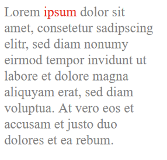
			- 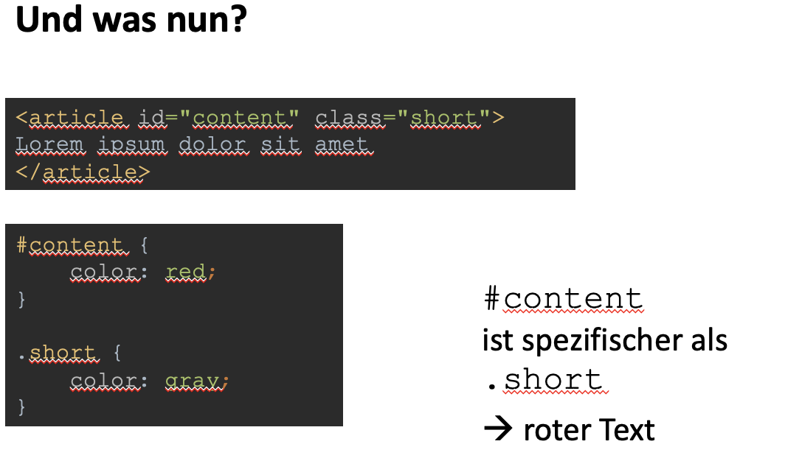
				- Spezifität -> alles was genauer, eindeutiger, unverwechselbarer selektiert ist zieht eher.
		- ### Kombination von Selektoren
			- 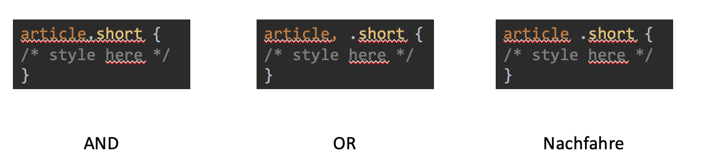
- # BoxModel
  collapsed:: true
	- ## Innen- und Ausssenabstand
		- Margin = aussenabstand
		- Padding = innenabstand
		- ```css
		  img {
		    margin: 0 0 0 7.5em;
		    padding:0;
		  }
		  
		  ```
	- ## Boxmodell
	  collapsed:: true
		- 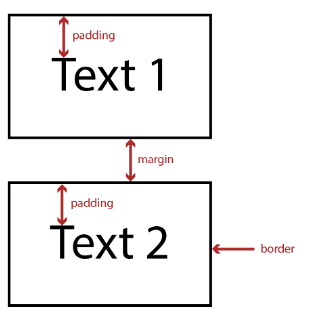
		- 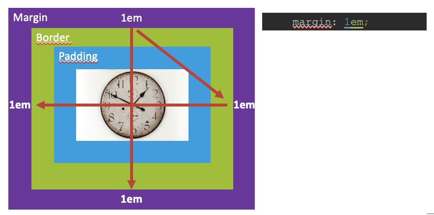
			-
		- ## Box-sizing
			- 
			- [http://guyroutledge.github.io/box-model](http://guyroutledge.github.io/box-model)
			-
	-
- # Webseiten strukturieren
  collapsed:: true
	- ## HTML Block-Elemente
		- https://developer.mozilla.org/de/docs/Web/HTML/Block-level_elements
		- Das HTML **<div>** Element ist ein Block-Element
		- Block-Elemente dehnen sich in der Breite so weit wie möglich aus=>  Nächstes Element auf der nächsten Zeile
		- Block-Elemente werden z.B. als Container benutzt, um andere Elemente zu gruppieren
		- ```css
		  <div>
		  	<p>Lorem ipsum dolor sit amet</p>
		  	<p>Consetetur sadipscing elitr, sed diam</p>
		  </div>
		  ```
	- ## HTML Inline-Elemente
		- https://developer.mozilla.org/de/docs/Web/HTML/Inline_elements
		- Das HTML **<span>** Element ist ein Inline-Element
		- Inline-Elemente sind nur so breit wie deren Inhalt => Nächstes Element auf der selben Zeile
		  (wenn Platz vorhanden)
		- Inline-Elemente werden z.B. benutzt, um einzelne Textausschnitte verschieden zu gestalten
		- ```css
		  <p>Lorem <span>ipsum</span> dolor sit amet</p>
		  ```
- # Flex Box
  collapsed:: true
	- Elemente im zur Verfügung stehenden Platz des Container verteilen
	- Spalten & Zeilen
	- 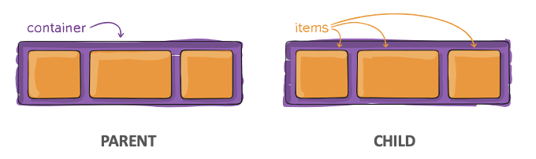
	- 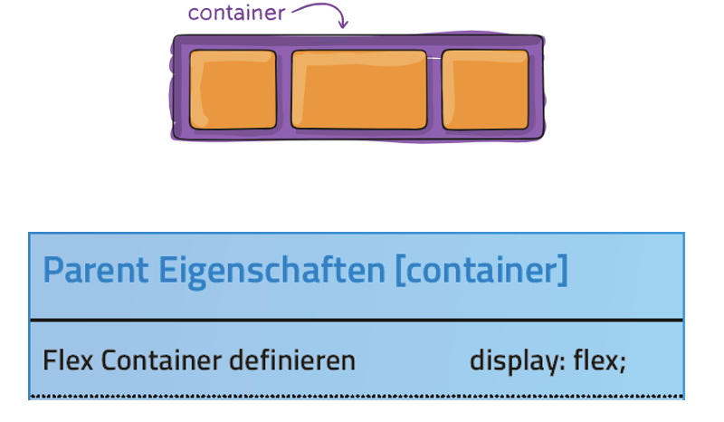
	- 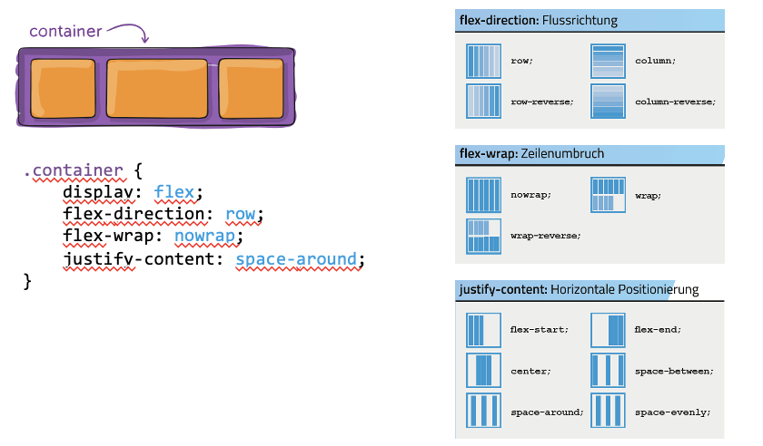
	- 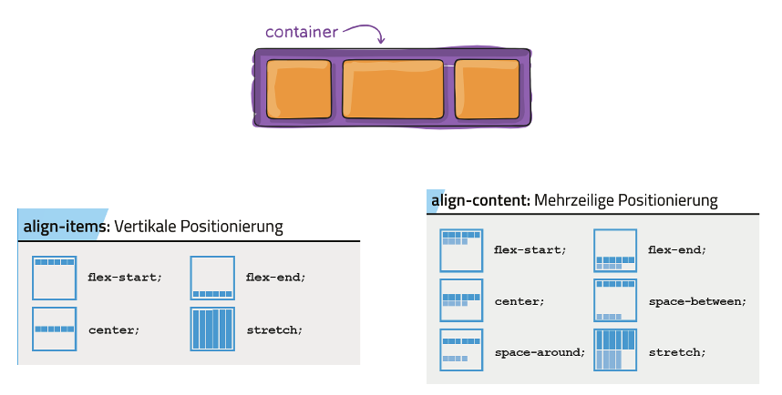
		- align-items -> Wenn 1 Zeile
		- align-content -> Wenn mehrere Zeilen
	- 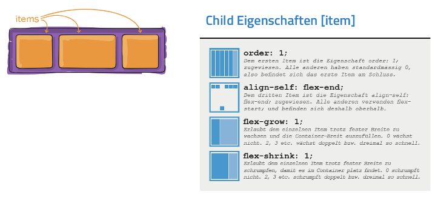
	- https://flexboxfroggy.com/#de üben
- # Grid
  collapsed:: true
	- ## Grid und Verschachtelung
		- Gutes Video für Grid: https://youtu.be/HgwCeNVPlo0
		- 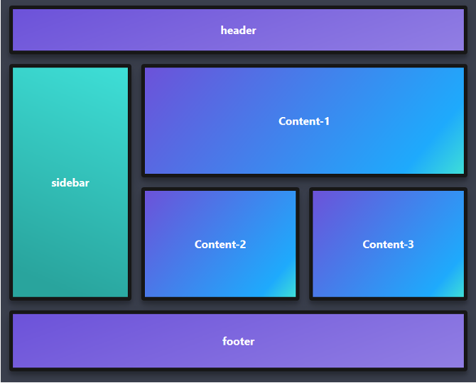
		-
- # Patterns
  collapsed:: true
	- ## Position fixed
		- Fixiert Elemente «fix» im Viewport
		- Auch wenn gescrollt wird, bleibt das Element da, wo es mit top, left,
		  bottom, right platziert wird
		- Nutzen: Overlays, Modals
		- ```css
		  </style>
		   button {
		      position: fixed;
		      right: 32px;
		      bottom: 32px;
		  }
		  </style>
		  
		  <button>
		    Help
		  </button>
		  ```
		- 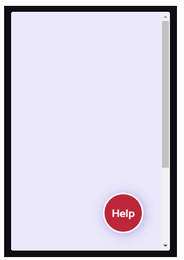
			-
	- ## Position sticky
		- Klebt Elemente an Viewport Rand
		- Wenn weiter gescrollt wird, bleibt das Element da, wo es mit top, left, bottom, right platziert wird.
		- Elemente, die im DOM folgen, werden automatisch verschoben
		- Ist nur solange sticky, wie Parent Container im sichtbaren Bereich ist
		- Nutzen: Fixierte Header / Footer
		- ```css
		  header {
		      background: skyblue;
		      padding: 0.5em;
		      text-align: center;
		      position: sticky;
		      top: 0;
		      left: 0;
		      width: 100%;
		      display: flex;
		      justify-content: space-between;
		  }
		  //Es muss mindestens eine Position angegeben werden. Z. Bsp. Top
		  ```
		- 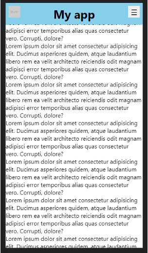
		-
	- ## grid-template-areas
		- https://www.digitalocean.com/community/tutorials/css-css-grid-holy-grail-layout
		- Gridbereiche können visuell definiert werden
		- Elemente können direkt an Bereiche zugewiesen werden
		- Kombinierbar mit grid-template-rows und grid-template-columns
		- 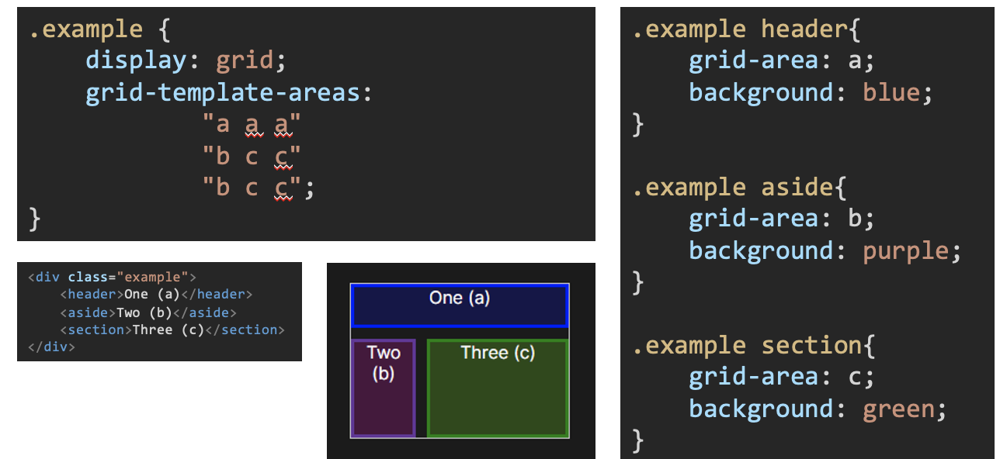
		- https://developer.mozilla.org/en-US/docs/Web/CSS/grid-template-areas
	- ## Responsive Kacheln
		- https://css-tricks.com/auto-sizing-columns-css-grid-auto-fill-vs-auto-fit/
		- https://www.geeksforgeeks.org/auto-fit-vs-auto-fill-property-in-css-grid/
		- ```css
		  grid-template-columns: repeat(auto-fit, minmax(200px, 1fr));
		  ```
		- **repeat**: repetiert Definiton
		- **auto-fit**: füllt row bis zu vorhandenem Platz auf
		- **minmax**: min 200px, max 1fr
		- Vielseitig anwendbar
	- ## Flex vs Grid
		- Richtlinien
			- Grid kann grundsätzlich für alles verwendet werden
			- Flex bietet sich für 1-dimensionale Elemente an (horizontal oder vertikal)
			- Guter Ansatz: Layout mit Grid, simple Elemente mit flex.
- # Bildformate Pixel vs. Vektor
  collapsed:: true
	- ## Bildformate: Vektor vs. Raster
	  collapsed:: true
		- Es gibt verschiedene Wege, die gleiche Information als Bild darzustellen.
		- Wir unterscheiden hier grundsätzlich zwischen **Vektor-** und **Rastergrafiken**.
		- 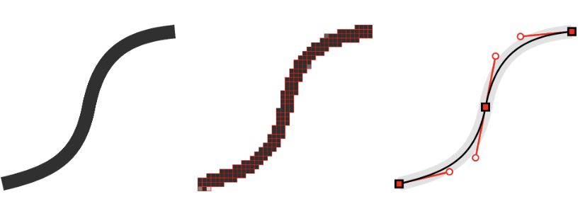{:height 258, :width 718}
	- ## Was sind Vektorgrafiken?
	  collapsed:: true
		- Vektorgrafiken beschreiben Bilder gemäss ihrer geometrischen Formen.
		- Der Verlauf jeder Linie wird durch mathematische Ausdrücke definiert.
		- 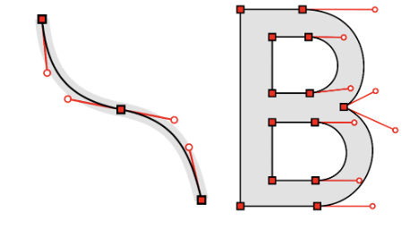
		- **Vorteile**
			- Verlustfrei skalierbar
			- Linien und Punkt sind immer scharf
			- Kann in hoher Auflösung gedruckt werden
			- Gut für gezeichnete Grafiken
		- **Nachteile**
			- Gezeichnete Grafiken sehen schnell Cartoon mässig aus.
			- Gute Kenntnisse gefordert um Fotorealistische Zeichnungen herzustellen.
		- ### Für was werden Vektorgrafiken gebraucht?
			- 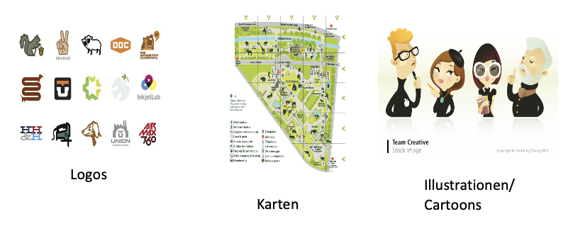
			- 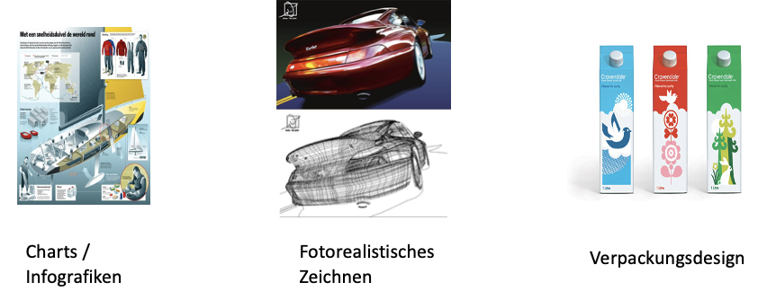
			- Die Form des Automodelles in der Mitte ist mit Vektoren erfasst. Die Texturen (das äussere Aussehen) sind jedoch Pixelgrafiken.
		- ### Häufig benutzte Vektorformate
			- ==Web: SVG==
			- #### EPS (Encapsulated Postscript)
				- ist in der Grafikerbranche weit
				  verbreitet und ist so wie ein PDF für Vektorgrafiken. Wenn Grafiker untereinander Vektorgrafiken austauschen
				  oder die Grafiken einer Druckerei schicken müssen, wird meistens in das
				  EPS-Format exportiert.
			- #### SVG (Scalable Vector Graphics, benutzt XML)
				- ein offener Standard und wird im Web für Vektorgrafiken verwendet.
				  id:: 64c20c70-4cfb-4c08-8553-7a29c265a767
			- #### WMF (Windows Meta File)
				- Braucht bitte das WMF-Format nicht, es ist proprietär von Microsoft und nicht alle Systeme können mit diesem Format umgehen.
	- ## Was ist eine Pixelgrafik?
	  id:: 64c20c1d-c33b-46d0-a994-02e17d351542
	  collapsed:: true
		- Je nachdem in welchem Format (JPEG, PNG, GIF, u.s.w.) diese Pixelgrafik gespeichert wird,
		  trifft diese Theorie nicht mehr zu (ein JPEG braucht z.B. mehr Bits pro Pixel).
		- Einfachheitshalber bleiben wir bei diesem allgemeinen Beispiel.
		- Dies ist ein Beispiel einer 8-Bit Pixelgrafik. 8 Bits (1 Byte) definieren je Rot, Grün und Blau eines Pixels. D.h. wir haben 3 Bytes pro Pixel.
		- 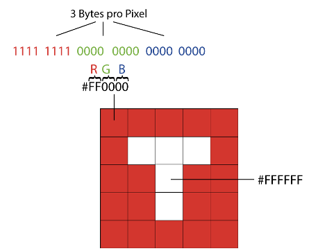
		- **Wie gross (in Bytes) ist eine 8-Bit-RGB-Pixelgrafik mit 5x5 Pixel?**
			- Bytes = Total Pixel · Farbtiefe / 8 Bit
			- 75 = 5*5 * 24Bit / 8Bit
			- 5px * 5px * 3byte = 75byte
			- 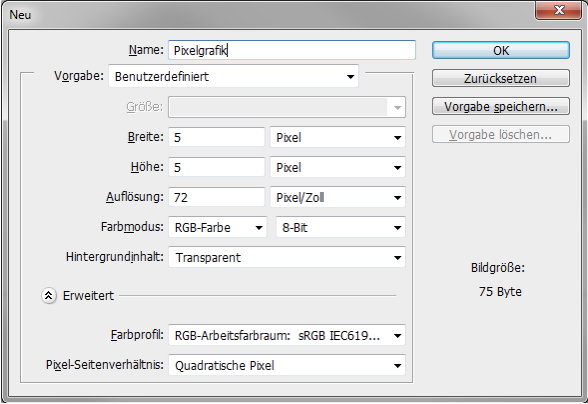
		- **Vorteile**
			- Jedes einzelne Pixel ist veränderbar
			- Programmunabhängiges Dateiformat
			- Reichtum an Farbabstufungen
			- Flächen können verschoben und kopiert werden
		- **Nachteile**
			- Grosser Speicherverbrauch
			- Nur mit Verlust skalierbar
		- ### Für was werden Pixelgrafiken gebraucht?
			- 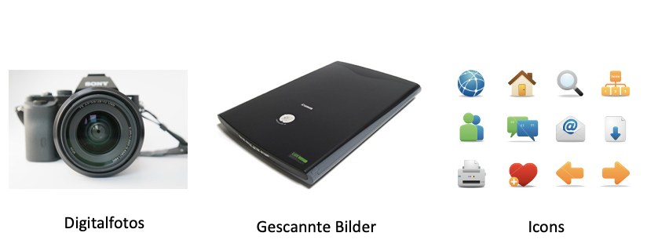
		- ### Häufig benutzte Pixelgrafikformate
			- ==Web: PNG + JPEG==
			- #### BMP (Microsoft Windows Bitmap formatted image)
				- Nicht brauchen, dies ist ein proprietäres Format von Microsoft und ist zu wenig kompatibel mit anderen Systemen.
				- BMP ist nicht komprimiert und braucht dementsprechend viel Speicher.
			- #### GIF (CompuServe's Graphics Interchange Format)
				- Aussprache nicht JIF! Nur max. 256 Farben möglich, jedoch verlustfrei komprimierbar. Animationen und Transparenz sind möglich.
			- #### JPEG oder JPG (Joint Photographic Experts Group)
				- Gut für detaillierte Farbverläufe. Mit Verlust komprimierbar (sehr hohe Kompression
				  möglich). Im Web oft gebraucht, weil das Auge den Verlust fast nicht sieht.
			- #### PNG (Portable Network Graphic)
				- Verlustfrei komprimierbar, jedoch nicht so hoch wie JPEG. Ist ein besseres GIF (mehr als 256 Farben). Transparenz ist möglich. Das einzige komprimierbare, verlustfreie Format um im Web Fotos darzustellen. Falls Originalfoto (ohne Verlust) auf web dargestellt werden soll, ist PNG das richtige Format
			- #### TIFF (Tagged Image File Format)
				- Verlustfrei, nicht komprimiert. Riesen File-Size, daher nicht für Web geeignet.
	- ## Das -Tag
	  collapsed:: true
		- Mit  lassen sich Pixel- oder Vektorgrafiken in die Seite einbinden.
		- ```html
		  
		  
		  ```
		- ==src== definiert den Pfad, wo das Bild gespeichert ist
		- ==alt== ist ein Text, der das Bild so gut wie möglich ersetzen soll, wenn es nicht angezeigt werden kann.
		- ### Styling mit CSS
			- Wenn nur die Grösse einer Seite gesetzt wird, passt sich die andere proportional an
				- ```css
				  img {
				      width: 300px;
				  }
				  ```
			- Wenn beide Seiten verändert werden, kann sich das Bild verzerren
				- ```css
				  img {
				      width: 300px;
				      height: 200px;
				  }
				  ```
			- Mit ==object-fit kann== man festlegen, wie das Bild sein -Tag ausfüllt.
				- 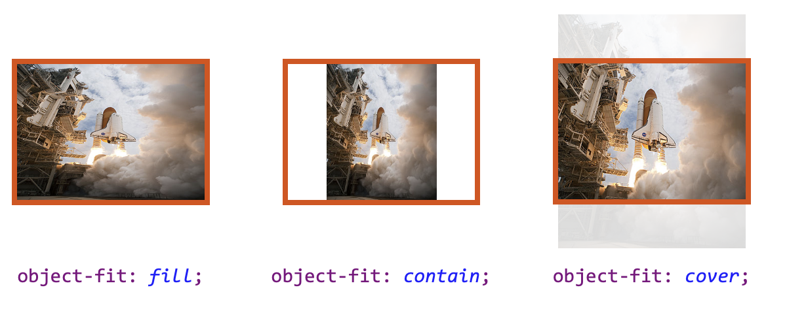
				- **fill**: Standardwert; Bild bedeckt ganzes  und wird nötigenfalls verzerrt
				- **contain**: Ganzes Bild wird innerhalb des  dargestellt, wenn nötig mit leeren Flächen
				- **cover**: Ganzes  wird vom Bild bedeckt, wenn nötig werden Teile des Bildes abgeschnitten
				- **Nicht dargestellt: object-fit: none;** => skaliert das Bild gar nicht und zeigt es innerhalb des in Originalgrösse an
			- Mit ==object-position== bestimmt man die Position des Bildes innerhalb des -Tags
				- 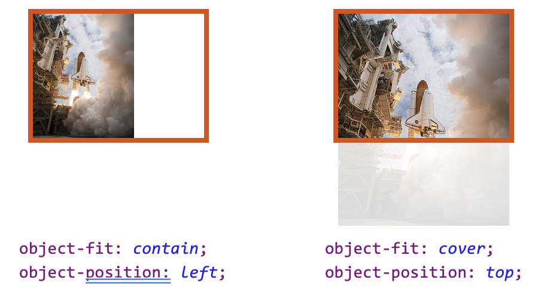
				- Mögliche Werte neben top/left/right/bottom sind alle möglichen CSS-Masseinheiten wie px, %, em, etc.
				- Mehrere Werte sind möglich, z.B. object-fit: 0px 30px;
					-
	- ## Das <figure>-Tag
		- Das <figure>-Tag kann ein Bild enthalten, aber auch ein Zitat, ein Code-Snippet oder anderes.
		- ```css
		  <figure>
		      
		      <figcaption>
		          Liftoff für die letzte Mission des Space Shuttle
		      </figcaption>
		  </figure>
		  
		  ```
		- Das optionale <figcaption>-Tag enthält eine Beschreibung, die semantisch eindeutig dem
		  Bild zugeordnet ist.
		- 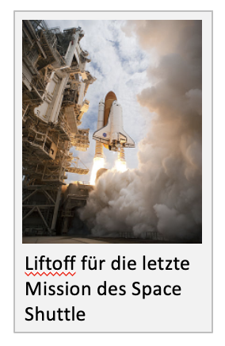
		- Den Vorteil von Figure und Figcaption sieht man bei der Google-Bildersuche, wo oft unpassende Bilder erscheinen, die im Text irgendwo in der Nähe des gesuchten Stichworts auftauchen.
		- Die Figcaption sollte nicht identisch mit dem alt-Attribut sein. Wenn der Inhalt der Figcaption das Bild ausreichend gut beschreibt, kann man das alt auch leer lassen.
	- ## Hintergrundbilder mit CSS
		- Für viele Elemente kann mit background-image ein Hintergrundbild definiert werden.
			- ```css
			  #container {
			      background-image: url(circle.svg);
			  }
			  ```
			- 
		- Das background-image wird über der background-color dargestellt.
			- ```css
			  #container {
			      background-image: url(circle.svg);
			      background-color: #d8ef98;
			  }
			  
			  ```
			- 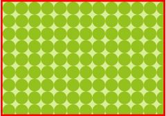
	- ## Hintergrundbilder anordnen
		- 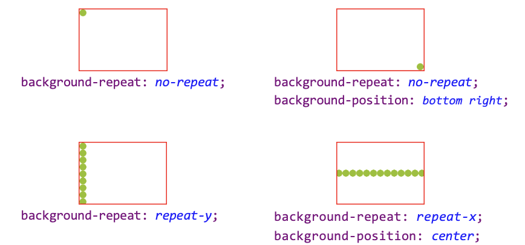
		- background-position kennt auch weitere CSS-Masseinheiten wie px, %, etc.
	- ## Hintergrundbilder skalieren
		- 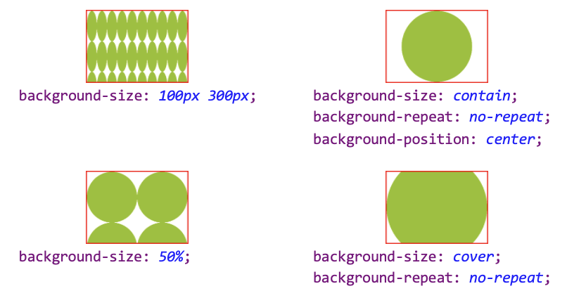
		- background-size:
			- 100px 300px; mit der datei circle.svg verhält sich in chrome anders als hier dargestellt. Vermutlich ist das ein Fehler; Pixelgrafiken verhalten sich immer so wie gezeigt.
		- contain und cover sind fast identisch wie object-fit bei Bildern, ausser:
			- Standardmässig wird das Bild nicht zentriert, dazu braucht es background-position: center
			- Standardmässig ist background-repeat: repeat; aktiv, was man bei background-size: contain merkt
	- ## Shorthand: background
		- Mit background lassen sich manche background-*-Eigenschaften kombinieren.
			- ```css
			  background: url(circle.svg) no-repeat center/300px;
			  ```
			- 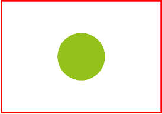
		- Durch Kommas getrennt können mehrere Hintergründe kombiniert werden.
			- ```css
			  background:
			      url(sts-135.jpg) no-repeat center/contain,
			      url(circle.svg),
			      #d8ef98;
			  
			  ```
			- 
		- Die Hintergrundgrösse muss nach einem Slash nach der Position genannt werden, daher das center/300px
		- Bei mehreren Hintergründen ist der erste in der Liste zuoberst.
	- ## Richtige Verwendung von Bildern
		- Bilder sollten im Original etwa so gross sein, wie sie auf der Website dargestellt
		  werden.
		- Eine Gallerie mit vielen Vorschaubildern, die je mehrere MB gross sind und per CSS verkleinert werden, lädt langsam und verbraucht viel Bandbreite.
		- Bei Fotos, die als Hintergrundbild den ganzen Bildschirm füllen, aber für den
		  Inhalt nicht unbedingt wichtig sind, kann man auch die JPEG-Kompression etwas aggressiver einstellen.
		- Hintergrundbilder sollten nicht vom Inhalt ablenken, und Text muss immer noch gut lesbar sein.
		- Bilder, auf denen "viel los ist", eignen sich also eher weniger.
	- ## Urheberrechte
		- ### Creative Commons
			- 
			- Oft wollen Urheber nicht strikt auf ihrem Copyright beharren, sondern es anderen
			  erlauben, ihre Werke weiterzuverwenden
			- Die Bedingungen dieser Weiterverwendung in einem Lizenzvertrag genau zu definieren
			  wäre jedoch viel Arbeit, und für juristische Laien nicht einfach
			- Wenn ich ein Bild auf meiner Seite verwenden möchte, will ich nicht zuerst
			  seitenweise Lizenztexte lesen
			- **Deshalb hat die Organisation *****Creative Commons***** standardisierte Lizenzen definiert, mit denen Urheber die Verwendung ihrer
			  Werke regeln können.**
			- 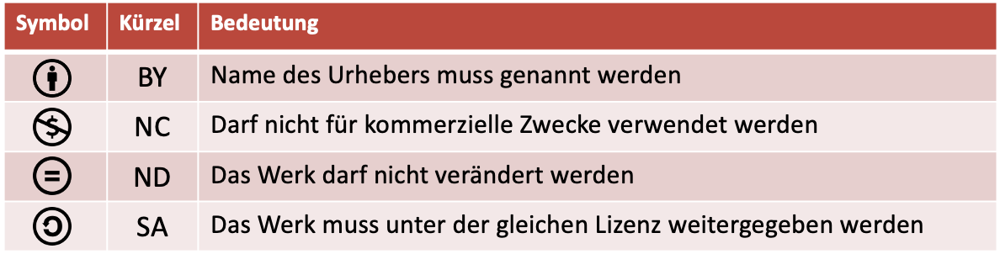
				- Creative-Commons-Lizenzen geben an, mit unter welchen Bedingungen ein Werk weiterverarbeitet werden darf
				- Diese Bedingungen können aus den folgenden vier Bausteinen zusammengesetzt werden
			- 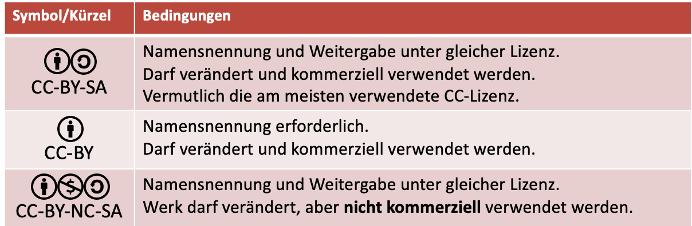
				- **Oft verwendete Creative-Commons-Lizenzen**
		- ### Public Domain
			- Auf manche Werke ist auch gar kein Copyright anwendbar.
			- Diese nennt man ***gemeinfrei**, sie sind in der **Public Domain**
			- Viele Werke von Behörden und Verwaltungen, beispielsweise Gesetzestexte
			- Werke, die vom Autor explizit als gemeinfrei veröffentlicht wurden, zum Beispiel mit
			  der Creative-Commons-Lizenz CC0
			- Auch bei gemeinfreien Werken ist esmeist sinnvoll, die Quelle anzugeben.
			-
- # :hover
  collapsed:: true
	- Hover bedeutet Schweben
	- Mit <Elementname**:hover**> kann das Aussehen eines Elementes definiert werden, wenn mit dem Mauszeiger auf dieses gezeigt wird
	- ```css
	  a {
	    text-decoration: none;
	  }
	  
	  a:hover {
	    text-decoration: underline;
	  }
	  
	  ```
	- Wenn die Maus über dem Link schwebt. Nicht Touch fähig! (auch laptops) => geeignet für Ästhetik, nicht für Funktionen verwenden