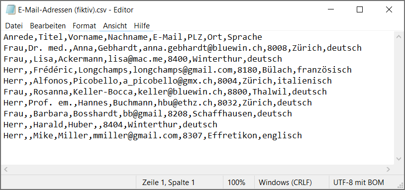

-
- Steht für **comma-separated-values**  und ist ein Dateiformat, das zur Speicherung von Daten in tabellarischer Form verwendet wird.
- In einer CSV-Datei werden die Daten in Form von Zeilen und Spalten gespeichert, wobei die Werte durch **Kommas** oder **andere Trennzeichen** voneinander getrennt sind.
- **Verwendung**: Die Formate werden oft verwendet, um Daten zwischen unterschiedlichen Programmen auszutauschen oder um Daten zu archivieren. Zum Beispiel können Kontaktdaten, Produktlisten, oder Finanzdaten in CSV-Dateien gespeichert werden.
- 