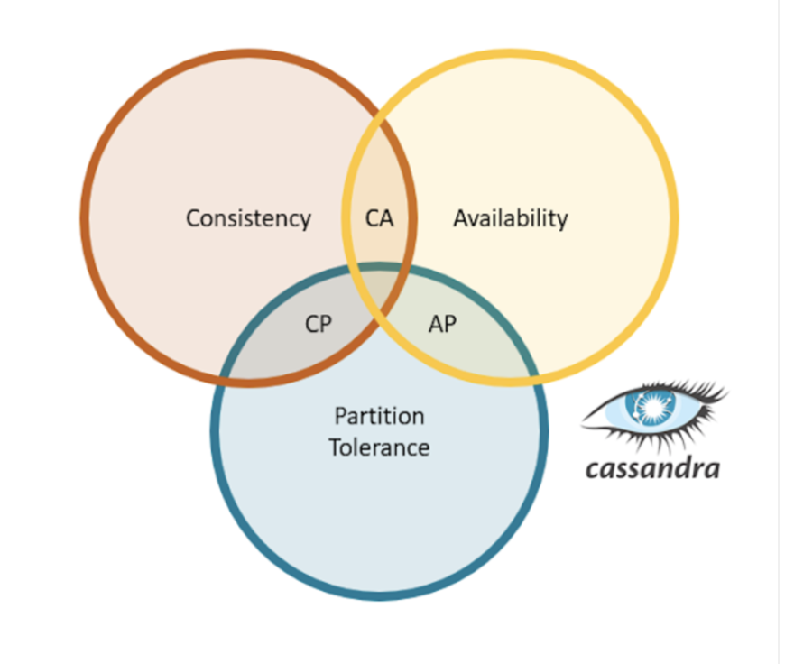
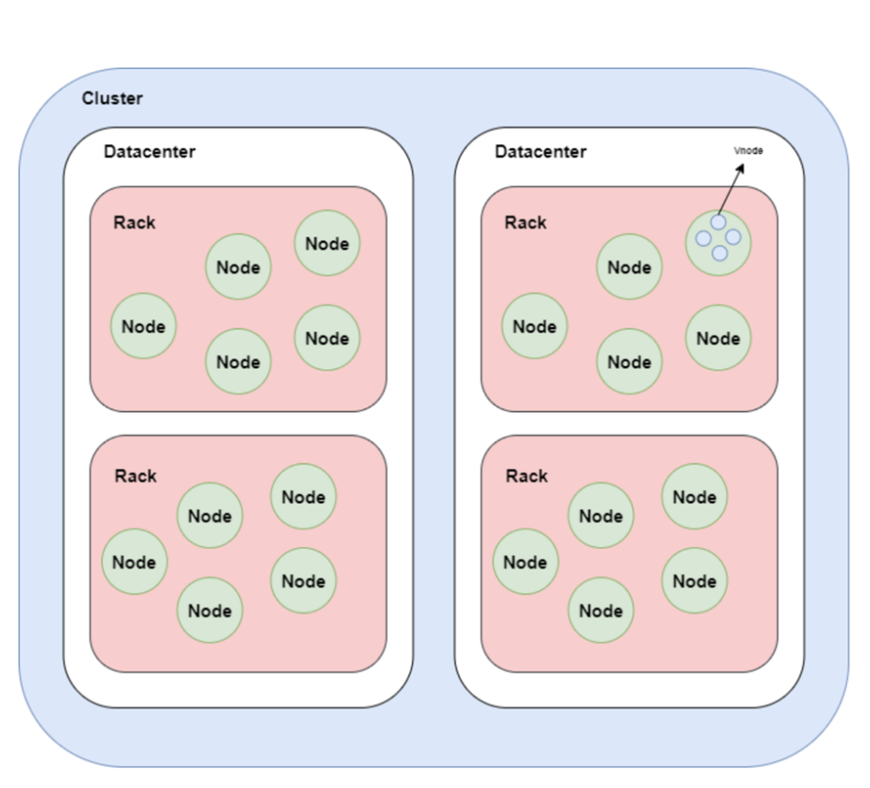

tags:: [[NoSQL-Datenbank]]

- ## Was ist Cassandra?
	- Freie Software (ähnlich wie Open-Source-Software)
	- eine spaltenorientierte NoSQL-Datenbank
	- Die Partitionierung erfolgt hingegen zeilenbasiert
	- ein verteiltes Datenbankverwaltungssystem für sehr grosse, strukturierte Daten
	- hat eine gute Performance und Skalierbarkeit
	- sehr ausfallsicher (kein Single-Point-of-Failure)
	- kann als Real-Time-Datenbank für Online-Applikationen und als Datenbank für intelligente Geschäftssysteme verwendet werden
- ## Cassandra im CAP-Theorem
  collapsed:: true
	- Cassandra wird normalerweise den AP-Systemen zugeordnet
	- Cassandra kann aber auch als CP-System konfiguriert werden
	- 
	- ##
- ## Vorteile und Nachteile
- ## Architektur
  collapsed:: true
	- {:height 561, :width 534}
	- Eine **Datenbank** kann aus mehreren Clustern bestehen.
	- Es handelt sich um eine voll funktionsfähige Maschine, die mit anderen Knoten im Cluster über das interne Netzwerk verbunden ist.
	- Jeder Node verfügt über eine einzelne Instanz von Cassandra, die technisch gesehen ein **Server** ist.
	- ### Cluster
		- enthält **ein** oder **mehrere Rechenzentren**.
		- Er ist der äusserste Speichercontainer in der Datenbank
	- ### Datencenter (Rechenzentrum)
		- ein logisches Set von Racks
	- ### Rack
		- eine logische Gruppierung von Nodes
	- ### Node
		- die grundlegende Komponente von Cassandra
- ## Ring-Topologie
- ## Replikation und Partitionierung
	-