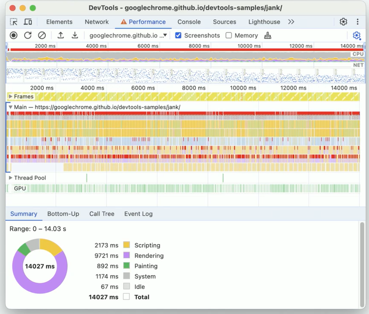
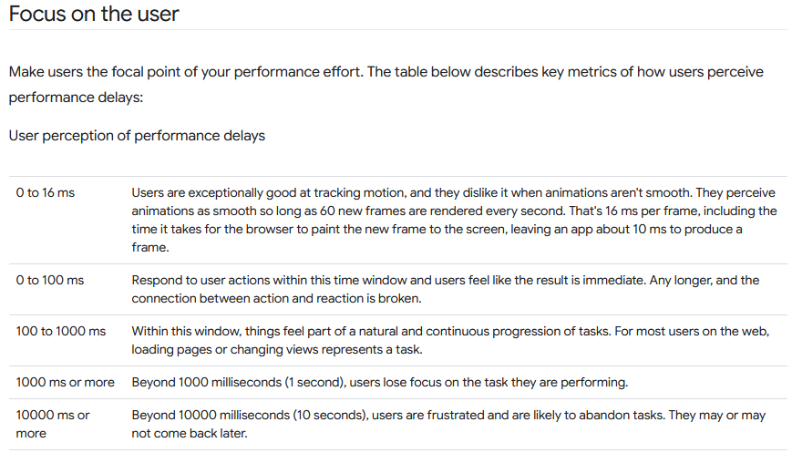

tags:: [[Chrome]], [[The Network Waterfall]], [[Dev-Tools]]

-
- ## Courses & Links
	- https://developer.chrome.com/docs/devtools
	- https://developer.chrome.com/blog
	- https://frontendmasters.com/courses/dev-tools-v4/
	-
- ## Essential Chrome DevTools
  collapsed:: true
	- **Inspecting Elements & Styles**
		- View computed styles, box model and event listeners
		- Edit the DOM structure live
		- **Useful for layout debugging and quick fixes**
		  background-color:: red
	- **Network Tab**
		- Monitor HTTP requests/response
		- Inspect status codes, headers, payloads and timings
		- **Useful for diagnosing performance issues and API errors**
		  background-color:: red
	- **Measuring Performance**
		- Record and analyze runtime performance
		- Detect slow rendering, long tasks, and memory leaks
		- View the main thread activity, FPS and frame rendering
	- **Console & Sources Tabs**
		- Run JavaScript commands
		- View errors, warnings and logs
		- Use `console.log()`, `console.table()` and debugging methods like `debug()`
	- **Memory Usage**
		- Identify memory leaks and monitor heap usage
		- Take heap snapshots, view DOMS nodes and retained objects
	- **Lighthouse Reports**
		- Run audits for performance, accessibility and best practice
	- **Device Simulation**
		- Simulate mobile devices, screen sizes and network conditions
		- Test responsive desgin and touch events
- ## Network Performance
	- ### Network optimization
	  collapsed:: true
		- **Website waterfall**
			- The order in which assets (HTML, CSS, JS, images) are loaded
		- **Browser caching** strategies:
			- Reduce redundant downloads.
			- Improve repeat visit speed.
			- Set `Cache-Control`, `ETag`, and `Expires` headers to manage asset caching behavior.
		- **Compression Techniques**
			- To reduce transfer size over the network:
				- **Gzip** and **Brotli** are compression algorithms used to shrink files before they’re sent.
					- **Gzip** is widely supported.
					- **Brotli** often provides **better compression ratios** for text-based assets.
	- ### Browser priority
		- Browsers assign **priority levels** to assets to determine **download order**
			- HTML is **high priority**
			- CSS and JS are usually **medium priority**
			- Images and fonts are typically **lower priority** (unless used above the fold)
	- ### `preload` and `prefetch`
		- **`<link rel="preload">`**
			- Tells the browser to **load critical assets earlier** (e.g., fonts, hero images, essential JS).
			- **Used when we know the asset is needed soon**
			  background-color:: red
		- **`<link rel="prefetch">`**
			- Hints to the browser to **download assets for future use** (e.g., next page scripts).
			- **Used for non-blocking, low-priority preloads**
			  background-color:: red
	- ### Lighthouse web audits
		- **Lighthouse** is an open-source, automated tool to help developers improve the quality of web pages.
		- Lighthouse runs a series of audits across **five main categories**:
			- **Performance**: Page load speed, time to interactive, render-blocking resources
			- **Accessibility**
			- **Best Practices**: General web dev practices like HTTPS use, safe JavaScript, proper image formats
			- **SEO**: Page is optimized for search engines (e.g. meta tags, crawlability)
			- **Progressive Web App (PWA)**: Checks if your site can behave like an app (offline, installable, etc.)
		-
- ## Performance Profiling
  collapsed:: true
	- ### Overview Performance-Tab
	  collapsed:: true
		- **Frames**  = how smooth your app looks
			- A frame is like one picture in a video. Our screen tries to show **60 frames per second** (60 FPS) for smooth animation. If something is slow (like heavy JavaScript), we miss frames and things feel **laggy**.
			- In the Performance tab => green = good frame, red = slow or skipped frame.
		- **Threads** = who's doing the work?
			- Threads are like **workers** doing different jobs.
			- **Main Thread**
				- Does most of the work: runs JavaScript, styles, layout, etc.
				- If this gets busy, your app feels slow.
			- **Compositor Thread**
				- Helps draw things on screen (like animations).
				- Tries to help keep things smooth.
			- **Raster Thread**
				- Turns images and graphics into pixels.
				- Works in the background to take pressure off the main thread.
		- {:height 460, :width 537}
	- ### Measure Performance with RAIL
	  collapsed:: true
		- https://web.dev/articles/rail
		- **RAIL** stands for:
			- **Response**: Interactions should feel **instant** – within **100ms**.
			- **Animation**: Should run smoothly at **60fps**, meaning **16ms per frame**.
			- **Idle**: Do background work when the browser is idle, in **50ms chunks** max.
			- **Load**: Get content on screen in under **1 second** on mobile.
		- Anything slower than 1 second risks frustrating users
		- RAIL helps developers prioritize performance based on user experience
		- 
	- ### Page Jank
		- Happens when website or app feels **laggy, choppy, or unresponsive**. Instead of smooth scrolling or animations, we see things **jump, freeze, or stutter**.
		- #### Why Does Jank Happen?
			- The browser tries to show **60 frames per second**.
			- That means it has **about 16ms** to do all the work for each frame (run JavaScript, layout, paint, etc.).
			- If it takes too long, the browser misses frames→ get **jank**.
		- #### Common Causes
			- Running too much JavaScript at once
			- Doing heavy layout or style calculations
			- Not using efficient tools like `requestAnimationFrame`
		- #### How to avoid
			- Split big tasks into smaller ones
			- Use Web Workers to offload work
			- Use CSS Transform
			- Animate with `requestAnimationFrame`
	- ### `requestAnimationFrame`
		- Is a special JavaScript function that lets you run code right before the browser draws the next frame. It’s the best way to create **smooth animations** in the browser.
			- It runs at the **perfect time**. Synced with the screen refresh (usually 60 times per second).
			- It helps avoid jank by not blocking the browser.
			- Pauses automatically** when the tab is inactive → saves battery and CPU.
		- **Example**.
		  collapsed:: true
			- ```js
			  // Unoptimized animation loop causing layout thrashing
			  function moveBalls() {
			    balls.forEach((ball) => {
			      // Read layout properties (causes reflow)
			      let x = ball.element.offsetLeft;
			      let y = ball.element.offsetTop;
			  
			      // Update positions
			      x += ball.vx;
			      y += ball.vy;
			  
			      // Collision detection with walls
			      if (x <= 0 || x >= container.clientWidth - 20) {
			        ball.vx = -ball.vx;
			      }
			      if (y <= 0 || y >= container.clientHeight - 20) {
			        ball.vy = -ball.vy;
			      }
			  
			      // Write layout properties (causes repaint)
			      ball.element.style.left = x + "px";
			      ball.element.style.top = y + "px";
			    });
			  }
			  
			  let animationInterval = setInterval(moveBalls, 16); // ~60fps
			  
			  function optimizeAnimation() {
			    performance.mark("optimizeClicked");
			  
			    clearInterval(animationInterval); // Stop the unoptimized animation
			  
			    // Hide the optimize button
			    document.getElementById("optimizeBtn").style.display = "none";
			    document.querySelector("h1").innerText = "Bouncing Balls - Optimized Version";
			  
			    // Reset 'left' and 'top', and adjust positions
			    balls.forEach((ball) => {
			      // Reset positioning properties
			      ball.element.style.left = "0px";
			      ball.element.style.top = "0px";
			  
			      // Positions are already stored in ball.x and ball.y
			      // No need to adjust them here
			    });
			  
			    function optimizedMoveBalls() {
			      balls.forEach((ball) => {
			        // Update positions
			        ball.x += ball.vx;
			        ball.y += ball.vy;
			  
			        // Collision detection with walls
			        if (ball.x <= 0) {
			          ball.x = 0;
			          ball.vx = -ball.vx;
			        } else if (ball.x >= container.clientWidth - 20) {
			          ball.x = container.clientWidth - 20;
			          ball.vx = -ball.vx;
			        }
			  
			        if (ball.y <= 0) {
			          ball.y = 0;
			          ball.vy = -ball.vy;
			        } else if (ball.y >= container.clientHeight - 20) {
			          ball.y = container.clientHeight - 20;
			          ball.vy = -ball.vy;
			        }
			  
			        // Write positions using transform
			        ball.element.style.transform = `translate(${ball.x}px, ${ball.y}px)`;
			      });
			  
			      requestAnimationFrame(optimizedMoveBalls);
			    }
			  
			    requestAnimationFrame(optimizedMoveBalls);
			  }
			  ```
- ## Memory
  collapsed:: true
	- ### Memory Leak
		- Happens when our web keeps using memory but never gives it back, even when it’s no longer needed. Over time, it **uses more and more memory** → app gets **slow**, **lags**, or even **crashes**.
		- #### Types
			- **Global Variables**
				- Declaring variables without `let`, `const`, or `var` makes them global. These stay in memory as long as the page is open.
				- ```js
				  function doSomething() {
				    leakedVar = "oops"; // becomes global
				  }
				  ```
			- **Closure**
				- Functions that **remember** variables can hold onto large objects even when they’re no longer needed
				- ```js
				  function createClosure() {
				    let bigData = new Array(1000000);
				    return () => console.log(bigData.length);
				  }
				  ```
			- **Zombie event listeners**: Adding listeners without removing them when elements go away
			- **Uncleared setInterval / setTimeout**:
		- #### How to identify it?
			- You have 3 great tools for finding memory leaks in Chrome:
				- Chrome Task Manager
				- Performance Panel
				- Memory Panel
		- ### Garbage Collection
			- https://developer.mozilla.org/en-US/docs/Web/JavaScript/Guide/Memory_management#garbage_collection
			- Is the process where JavaScript automatically removes data from memory when it's no longer needed
			- JavaScript keeps track of what’s still being used. If something (like a variable or object) is **no longer reachable** , meaning nothing is using it anymore, the **garbage collector deletes it** from memory.