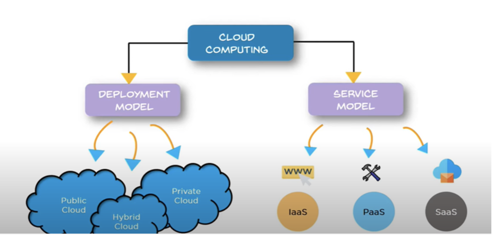
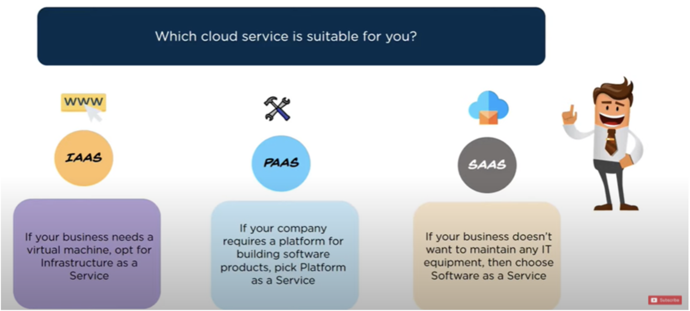
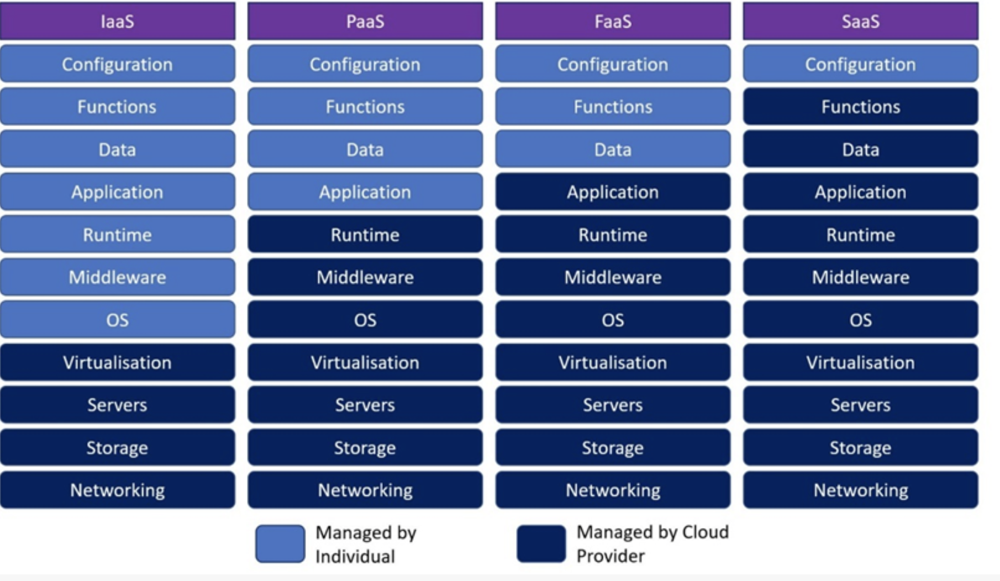

tags:: [[GIBB]]

- **M346**
- ## Was ist Cloud Computing?
  collapsed:: true
	- In jeder Cloud werden Ressourcen in einem Netzwerk skalierbar zur Verfügung gestellt.
	- ermöglicht flexible Anpassungen ohne Serverausschaltung und unterstützt plattformunabhängiges Computing.
	- Jede Cloud umfasst Betriebssystem, Managementplattform und APIs. Virtualisierungs- und Automatisierungssoftware kann für erweiterte Funktionen integriert werden
	- 
	- Man unterteilt Cloud-Computing in Deployment Model (Bereitstellungsmodell) und Service Model.
- ## Bereitstellungsmodelle
	- ### Private Cloud
		- Accessible to everyone
		- Cloud-Umgebungen, die typischerweise aus IT-Infrastukturen erstellt werden, die nicht dem **Endbenutzer** gehöre
		- In einer Public Cloud teilen sich mehrere Kunden die gleiche physische Infrastruktur, jedoch sind ihre virtuellen Umgebungen voneinander isoliert.
		- Die Services in einer Public Cloud stehen öffentlich über das Internet zur Verfügung. Jeder, der die erforderlichen Zugriffsberechtigungen hat, kann auf die Ressourcen zugreifen.
		- Anbieter: Alibaba Cloud, Amazon Web Services (AWS), Google Cloud, IBM Cloud und Microsoft Azure.
	- ### Public Cloud
		- Owned by a single person
		- Als Cloud-Umgebungen definieren, die nur einem Endbenutzer oder einer Nutzergruppe zugeteilt und üblicherweise hinter der Firewall dieses Nutzers oder dieser Gruppe ausgeführt werden.
	- ### Hybrid Cloud
		- Rent a taxi driver
		- Eine Lösung, die eine Private Cloud mit einem oder mehreren Public Cloud Services kombiniert und mittels proprietärer Software eine Kommunikation zwischen unterschiedlichen Services ermöglicht
- ## Cloud Servicemodelle
  collapsed:: true
	- Bei Cloud-Services handelt es sich um **Infrastrukturen**, **Plattformen** oder **Software**, die von einem Drittanbieter gehostet und Nutzern über das Internet zur Verfügung gestellt werden.
	- 
	- ### IaaS (Infrastructure-as-a-Service)
		- 
			-
	- ### PaaS (Platforms-as-a-Service)
	- ### SaaS (Software-as-a-Service)
	- ### FaaS (Function as-a Service / Serverless)
- ## Private Cloud
	- [[Private Cloud Installation]]
	- [[Private Cloud Betreiben]]
-
	-
-