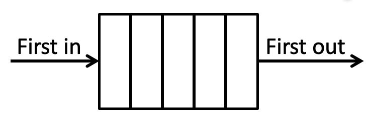

tags:: [[C#]], [[Java]]

- ## C#
  collapsed:: true
	- ### Collections
	  collapsed:: true
		- 
	- ### IEnumerable<T>
	  collapsed:: true
		- Beim **foreach** wird automatisch mit ==GetEnumerator()== auf den Enumerator zugegriffen.
		- Wird gebraucht zum Iterieren (Ienumerable erlaubt es über eine Collection, List u.s.w. zu iterieren)
		- ```c#
		  foreach (Person person in people) {
		     // Do something
		  }
		  ```
	- ### Enumerator (Schlaufen)
	  collapsed:: true
		- Ein Enumerator zeigt auf ein bestimmtes Element eines Arrays. Mit MoveNext()
		  zeigt der Enumerator auf das nächste Element.
		- Current gibt immer das aktuelle Element zurück.
		- ```c#
		  public class MyEnumerator<T> : IEnumerator<T> {
		     private int _position = -1;
		     private readonly T[] _items;
		  
		     public MyEnumerator(T[] items) {
		        _items = items;
		     }
		  
		     public bool MoveNext() {
		        _position++;
		        return (_position < _items.Length);
		     }
		  
		     public void Reset() {
		        _position = 0;
		     }
		  
		     public T Current { get { return _items[_position]; } }
		  
		     object IEnumerator.Current {
		        get { return Current; }
		     }
		  }
		  ```
	- ### ICollection <T>
	  collapsed:: true
		- The ICollection<T> interface is **the base interface for classes in the System. Collections. Generic namespace**.
		- Reihenfolge spielt keine Rolle
		- Einträge hinzufügen / entfernen
		- Einträge zählen
		- Alle Einträge entfernen
		- ```c#
		  void Add(T item)
		  bool Remove(T item)
		  void Clear()
		  int Count{ get; }
		  ```
	- ### Collection
	  collapsed:: true
		- Eine Implementierung von ICollection<T>
		- ```c#
		  ICollection<Person> people = new Collection<Person>();
		  Person person1 = new Person {Firstname = "Foo", Lastname = "Bar"};
		  people.Add(person1);
		  people.Remove(person1);
		  ```
	- ### IList <T>
	  collapsed:: true
		- Reihenfolge spielt eine Rolle
		- Einträge an bestimmter Position einfügen / entfernen
		- ```c#
		  void RemoveAt(int index)
		  void Insert(int index, T item)
		  T this[int index]
		  Object this[int index]
		  ```
	- ### List<T>
	  collapsed:: true
		- Eine Implementierung von IList<T>
		- ```c#
		  IList<Person> people = new List<Person>();
		  Person person1 = new Person {Firstname = "Foo1", Lastname = "Bar1"};
		  Person person2 = new Person { Firstname = "Foo2", Lastname = "Bar2" };
		  people.Add(person1);  // Add ist von ICollection
		  people.Insert(0, person2); // Insert ist von Ilist// Der Aufruf mit [] ist nur mit IList möglich
		  Debug.WriteLine(people[0].Firstname); 
		  ```
			- Die Syntax mit [] ist die selbe wie bei einem Array, macht aber nicht das selbe.
			- Dynamische Liste nicht benutzen.
				- Dynamische Liste, welche Elemente vom Typ object beinhaltet.
				- Schnell beim Anhängen/Löschen neuer Elemente am Ende der Liste
	- ### Stack<T>
	  collapsed:: true
		- Last in first out (LIFO)
		- Funktioniert wie ein Kartenstapel (Stack = Stapel)
		- ```c#
		  Person alice = new Person{ Name = "Alice" };
		  Person bob = new Person { Name = "Bob" };
		  
		  Stack<Person> myStack = new Stack<Person>();
		  myStack.Push(alice);
		  myStack.Push(bob);
		  Debug.WriteLine(myStack.Pop().Name);
		  
		  ```
		- Was gibt dieser Code aus? => bob
	- ### Dictionary <TKey, TValue>
	  collapsed:: true
		- Eine Implementierung von IDictionary<TKey, TValue>
		- Auflistung von ==Schlüssel-Wert-Paaren==, deren Reihenfolge anhand des Schlüssels bestimmt wird
		- Ein Schlüssel ist nur einmal in einem Dictionary vorhanden
		- ```c#
		  Dictionary<int, string> myDictionary = new Dictionary<int, string>();
		  myDictionary.Add(6, "LOL");
		  myDictionary.Add(3, "YOLO");
		  
		  if (myDictionary.ContainsKey(6)) {
		      Debug.WriteLine(myDictionary[6]);
		  }
		  ```
	- ### Queue<T>
	  collapsed:: true
		- First in first out (FIFO) Warteschlange
		- 
		- ```c#
		  Person alice = new Person { Name = "Alice" };
		  Person bob = new Person { Name = "Bob" };
		  
		  Queue<Person> myQueue = new Queue<Person>();
		  myQueue.Enqueue(alice);
		  myQueue.Enqueue(bob);
		  Debug.WriteLine(myQueue.Dequeue().Name);
		  ```
		- Was gibt dieser Code aus? => alice
	- ### HashSet<T>
	  collapsed:: true
		- Eine Implementierung von ISet<T>
		- Reihenfolge spielt keine Rolle
		- Schneller Zugriff mit Contains(T element)
		- Add(T item) fügt nur hinzu wenn Element nicht vorhanden
		- ```c#
		  Random random = new Random();
		  ISet<int> ids = new HashSet<int>();
		  for (int i = 0; i < 10; i++) {
		      int number = random.Next();
		      if (!ids.Contains(number)) {
		          ids.Add(number);
		      }
		  }
		  ```
	- ### SortedSet<T>
	  collapsed:: true
		- Eine Implementierung von ISet<T>
		- Einträge sind sortiert
		- Schneller Zugriff mit Contains(T element)
		- Add(T item) fügt nur hinzu wenn Element nicht vorhanden
		- ```c#
		  ISet<int> zahlen = new SortedSet<int>();
		  zahlen.Add(9);
		  zahlen.Add(3);
		  zahlen.Add(3);
		  zahlen.Add(7);
		  foreach (int zahl in zahlen) {
		      Debug.WriteLine(zahl);
		  }
		  ```
		- Was gibt dieser Code aus?
			- 3
			- 7
			- 9
		-
	- ### Übersicht
		- 
		- 
			-