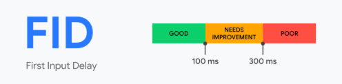
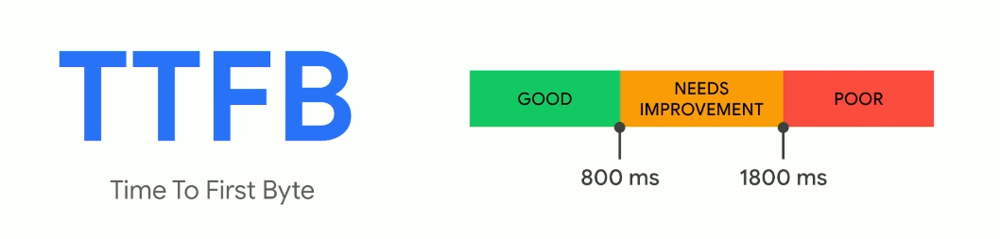
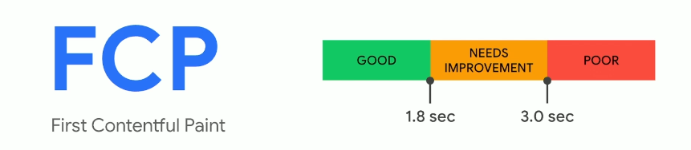

tags:: [[Chrome Developer Tools]], [[Web Performance]]

- Aa set of performance metrics defined by **Google** to measure real-world user experience on websites
- **It measures**
  background-color:: blue
	- How fast the site visibly loads
	- How smooth things load
	- How quickly users can interact
-
- ## Core Metrics
  collapsed:: true
	- {:height 419, :width 714}
	- ### LCP - Largest Contentful Paint  (Loading Performance)
		- Tracks how long it takes for the **largest visible content element** on a page to appear. This could be a big **image, video, or text block**
		  background-color:: blue
		- **Faster LCP = better UX**
		  background-color:: pink
		- It shows how quickly he page feels useful to the user
		- **How it’s calculated:** LCP only considers elements **visible in the viewport** (what the user can see without scrolling)
		- **Tips to improve:** Optimize images, preload important resources, reduce server response time, and remove render-blocking scripts
		-
	- ### INP - Interaction to Next Paint (Interactivity)
		- An **interaction** is user actions like a **click, tap, drag or key press**.  INP measures how quickly a site reacts tzo user input
		  background-color:: blue
		- **Faster interactions = smoothers, better UX**
		  background-color:: pink
		- **Considerations**
			- There might not be an interaction -> Some users just read or scroll, so not every visit has an interaction  to measure
			- We don't know the worst until it's over -> INP reports the **slowest interaction** on the page, so the final score is only known after session ends
			- Heavily influenced by device capability -> a slow phone or old laptop will naturally have worst INP scorces than a fast device
		-
	- ### CLS - Cumulative Layout Shift (Visual Stability)
		- Measures how much a web page's content moves around while loading
		  background-color:: blue
		- **Highers score = the page feels unstable to users**
		  background-color:: pink
		- Every time an element (an img, button or ads) shifts position unexpectedly, it adds to the CLS score.
		- Keep CLS **as low as possible** (ideally under 0.1) to ensure a smooth, stable experience. High CLS can frustrate users and hurt SEO, because it makes the page feel jumpy or broken.
		-
- ## Why are Core Web Vitals important?
  collapsed:: true
	- Google uses them as **ranking factors**.
	- They directly impact **user satisfaction**, **bounce rate**, and **conversion rate**.
	- Faster, smoother sites = happier users = better SEO.
- ## Tools to check Core Web Vitals
  collapsed:: true
	- https://pagespeed.web.dev/
	- https://search.google.com/search-console/about
	- Lighthouse (trong Chrome DevTools)
	- Web Vitals Extension (Chrome)
-
- ## Other Metrics
  collapsed:: true
	- ### FID - First Input Delay
		- 
		- Measures the **delay between the user’s first interaction** (like clicking a button) and when the browser starts responding.
		- **Good FID** = site feels responsive.
		- Affected by: heavy JavaScript blocking the main thread.
	- ### TTFB - Time to First Byte
		- {:height 132, :width 496}
		- Mesures how long it takes for the **first piece of data** from the server to reach the browser after a request
		- **Good TTFB** = the server responds quickly.
		- Affected by: server speed, network latency, and backend processing.
	- ### FCP - First Contenttful Paint
		- {:height 180, :width 498}
		- The time it takes for the **first piece of content** (like text, image, or background) to appear on the screen.