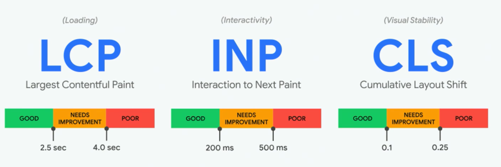

tags:: [[Chrome Developer Tools]]

- **Core Web Vitals** are a set of performance metrics defined by **Google** to measure real-world user experience on websites — especially focusing on **loading speed**, **interactivity**, and **visual stability**. These metrics are part of Google's **ranking signals** for SEO.
- 
- ## The 3 main Core Web Vitals
	- ### LCP (Largest Contentful Paint)  – Loading Performance
		- Measures how long it takes for the largest visible content (e.g., image or text block) to appear on screen.
		- **Good score:** Less than **2.5 seconds**.
	- ### FID (First Input Delay)- *Interactivity*
		- Measures the delay between a user's first interaction (click, tap, etc.) and when the browser responds.
		- **Good score:** Less than **100 milliseconds**.
	- ### CLS (Cumulative Layout Shift) –  Visual Stability
		- Measures how much visible content shifts unexpectedly while the page is loading.
		- **Good score:** Less than **0.1**.
		-
- ## Why are Core Web Vitals important?
	- Google uses them as **ranking factors**.
	- They directly impact **user satisfaction**, **bounce rate**, and **conversion rate**.
	- Faster, smoother sites = happier users = better SEO.
- ### Tools to check Core Web Vitals
	- https://pagespeed.web.dev/
	- https://search.google.com/search-console/about
	- Lighthouse (trong Chrome DevTools)
	- Web Vitals Extension (Chrome)