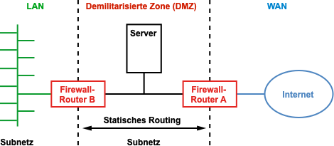

- Eine Demilitarisierte Zone bezeichnet ein Computernetz mit sicherheitstechnisch kontrollierten Zugriffsmöglichkeiten auf die daran angeschlossenen Server
- Die DMZ dient dazu, eine zusätzliche Sicherheitsebene zu schaffen, indem sie potenziell unsichere externe Verbindungen von direktem Zugriff auf interne Ressourcen trennt.
- 