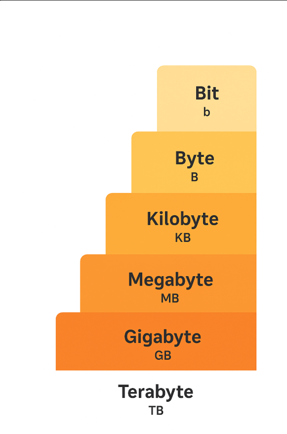

-
- |**Unit**|**Binary Value (2^x)**|**Decimal Value (10^x)**|**Notes**|
  |--|--|--|--|
  |Bit (**b**)|1 bit|1 bit|Smallest unit / 0 or 1|
  |Byte (**B**)|8 bits|8 bits|Basic storage unit, often 1 character|
  |Kilobyte (**KB**)|1,024 B|1,000 B||
  |Megabyte (**MB**)|1,024 KB = 1,048,576 B|1,000,000 B||
  |Gigabyte (**GB**)|1,024 MB = 1,073,741,824 B|1,000,000,000 B||
  |Terabyte (**TB**)|1,024 GB|1,000,000,000,000 B|Large storage, e.g., HDD/SSD|
- {:height 597, :width 295}