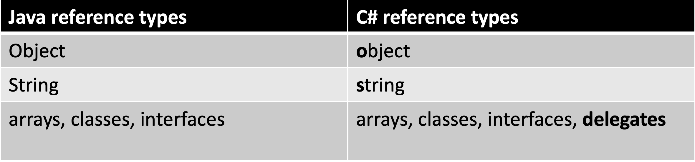

tags:: [[C#]], [[Java]] [[JavaScript]]

- ## C#
  collapsed:: true
	- ### Primitive Data Types
	  collapsed:: true
		- 
	- ###  Reference Types
	  collapsed:: true
		- 
- ## Java
  collapsed:: true
	- ### Primitive Data Types
	  collapsed:: true
		- https://docs.oracle.com/javase/tutorial/java/nutsandbolts/datatypes.html
		- #### byte
		  collapsed:: true
			- Is a 8-bit integer and has a range of -128 to 127
		- #### Integer (int)
		  collapsed:: true
			- numbers with no digits behind the decimal separator (whole numbers).
			- Examples are `-6`, `0`, `1`, `25`, `976` and `-500000`.
			- Is a 32-bit integer
		- #### short
		  collapsed:: true
			- Represents 16-bit signed integers and has a range of -32,768 to 32,767.
		- #### long
		  collapsed:: true
			- Represents 64-bit signed integers and has a range of -2^63 to 2^63 - 1.
		- ####  double
		  collapsed:: true
			- numbers with zero or more digits behind the decimal separator.
			- Examples are `-20.4`, `0.1`, `2.72`, `16.984025` and `1024.0`.
			- Is a 64-bit floating-point number.
		- #### float
		  collapsed:: true
			- Represents single-precision 32-bit floating-point numbers.
		- #### boolean
		  collapsed:: true
			- Booleans in Java are represented by the `boolean` type, which values can be either `true` or `false`.
			- Boolean operators:
				- `!` (NOT): negates the boolean
				- `&&` (AND): takes two booleans and results in true if they're both true
				- `||` (OR): results in true if any of the two booleans is true
				- ```
				  true || false // => true	
				  false || false // => false
				  false || true // => true
				  true && false // => false
				  true && true // => true
				  !true // => false
				  !false // => true
				  ```
				- The `&&` and `||` operators use **short-circuit evaluation**, which means that the right-hand side of the operator is only evaluated when needed.
				- `!` is sometimes classified as a bitwise operation in the documentation but it has the conventional *NOT* semantics.
		- #### char
		  collapsed:: true
			- Represents a single 16-bit [[Unicode]] character.
	- ### String
	  collapsed:: true
		- an object that represents immutable text as a sequence of Unicode characters (letters, digits, punctuation, etc.)
		- ```java
		  String fruit = "Apple";
		  ```
		- #### Formatting strings
		  collapsed:: true
			- ##### `%b`
			  collapsed:: true
				- `%b` is used as a format specifier for a boolean value. It is often used in the context of formatting strings with boolean values, where `%b` will be replaced with "true" for `true` boolean values and "false" for `false` boolean values.
				- ```java
				  boolean isTrue = true;
				  String formattedString = String.format("The value of isTrue is %b", isTrue);
				  // Resulting formattedString: "The value of isTrue is true"
				  ```
			- #### `%d`
			  collapsed:: true
				- `%d` is commonly used as a format specifier for integers (decimal integers). When you use `%d` in a string, it's typically a placeholder for an integer value that will be inserted into the string.
				- ```java
				  String intFormattedString = String.format("The answer is %d", number);
				          System.out.println(intFormattedString); // Output: "The answer is 42"
				  ```
	- ### Array
	  collapsed:: true
		- Data structures that can hold zero or more elements are known as *collections*.
		- An **array** is a collection that has a fixed size/length and whose elements must all be of the same type. Elements can be assigned to an array or retrieved from it using an index.
			- ```java
			  // Declare array with explicit size (size is 2)
			  int[] twoInts = new int[2];
			  
			  // Assign second element by index
			  twoInts[1] = 8;
			  
			  // Retrieve the second element by index and assign to the int element
			  int element = twoInts[1];
			  ```
		- Arrays can also be defined using a shortcut notation that allows you to both create the array and set its value.
			- ```java
			  // Two equivalent ways to declare and initialize an array (size is 3)
			  int[] threeIntsV1 = new int[] { 4, 9, 7 };
			  int[] threeIntsV2 = { 4, 9, 7 };
			  ```
	- ### Characters
		- https://docs.oracle.com/javase/tutorial/java/data/characters.html
		- #### Escape Sequences
			- `\t`   Insert a tab in the text at this point.
			- `\b`  Insert a backspace in the text at this point.
			- `\n` Insert a newline in the text at this point.
			- `\r`  Insert a carriage return in the text at this point.
			- `\f`  Insert a form feed in the text at this point.
			- `\'`  Insert a single quote character in the text at this point.
			- `\"` Insert a double quote character in the text at this point.
			- `\\`  Insert a backslash character in the text at this point.