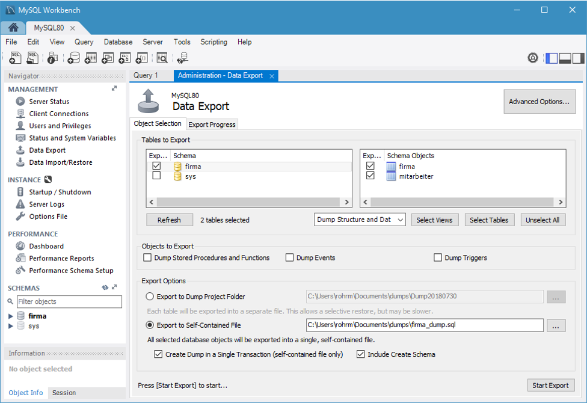
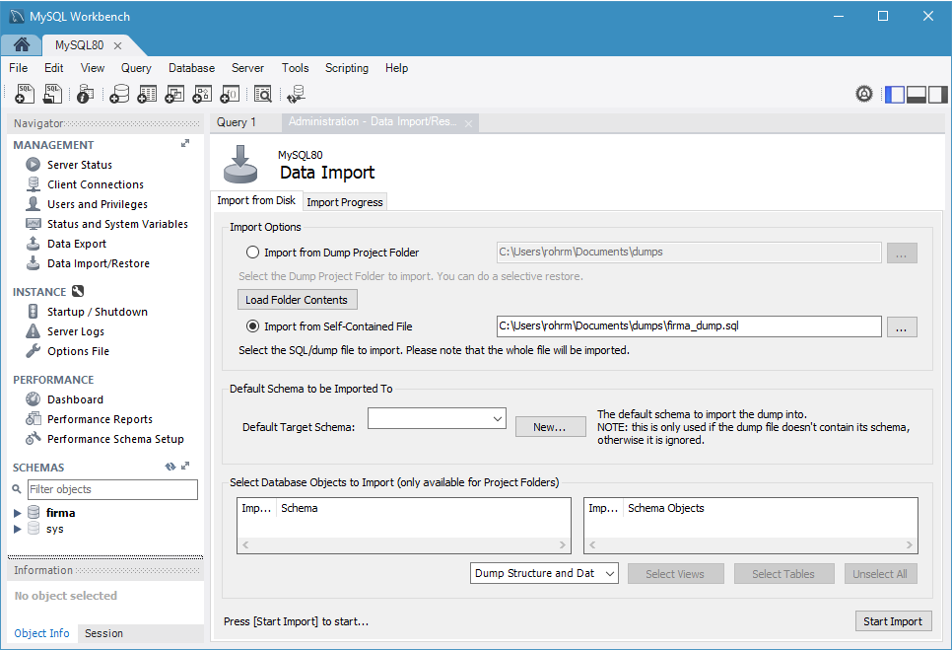

tags:: Datenbank, MySQL

- Daten importieren und exportieren
- # Export aus MySQL DB Dump File
  collapsed:: true
	- 
- # Import von Daten aus Dump File
  collapsed:: true
	- 
- # Import von Datensätzen aus CSV Datei
	- ```sql
	  LOAD DATA INFILE 'C:\\ProgramData\\MySQL\\MySQL Server 8.0\\Uploads\\test.csv'
	  INTO TABLE test
	  CHARACTER SET utf8mb4
	  FIELDS TERMINATED BY ';'
	  LINES TERMINATED BY '\r\n'
	  IGNORE 1 ROWS 
	  (id, name, vorname);
	  
	  ```
	- **LOAD DATA INFILE**
		- Nur Files aus erlaubtem Ordner
			- ```sql
			  show variables like ‘secure_file_priv’;
			  ```
			- Vermutlich: *C:\ProgramData\MySQL\MySQLServer8.0\Uploads*
		- Trennzeichen angeben
			- ```sql
			  FIELDS TERMINATED BY ';'  
			  LINES TERMINATED BY '\r\n’ # Windows, Linux nur \
			  ```
		- Zeilen ignorieren
			- ```sql
			  IGNORE number {Lines|Rows}
			  ```
			- Spaltenliste angeben: => bsp. (id, name, vorname)
			- Spaltennamen wie in der DB-Tabelleund Reihenfolge wie in der CSV Datei