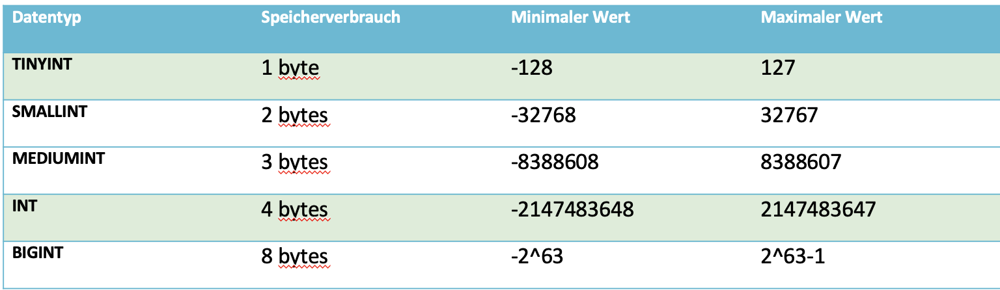
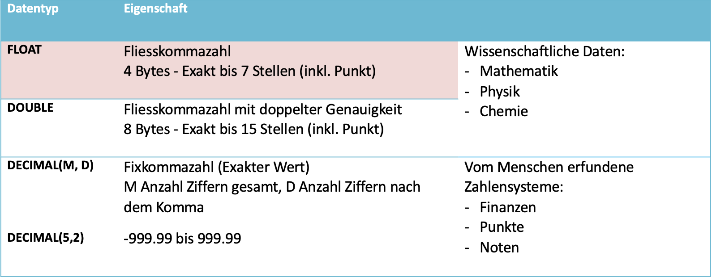
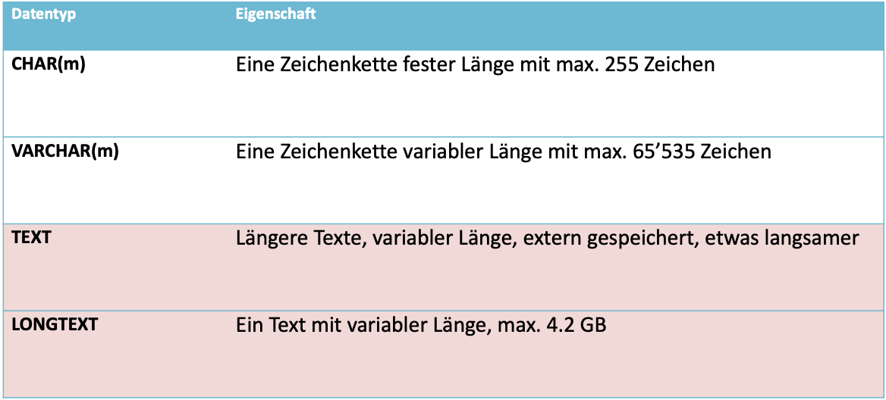
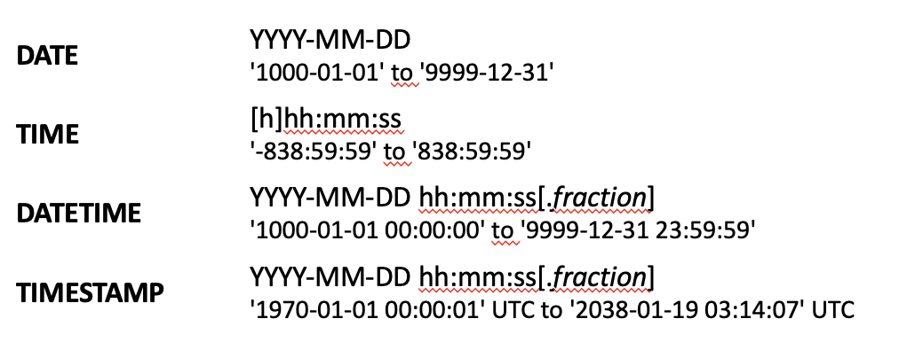

tags:: MySQL, Datenbank

- # Ganzzahlen
  collapsed:: true
	- https://dev.mysql.com/doc/refman/8.0/en/numeric-type-overview.html
	- 
	- ==INT(11)== hat keinen Einfluss auf die Grösse der gespeicherten Zahl!
	- 11 ist die «display width» => wie viele Stellen sollen angezeigt werden
- # Kommazahlen
  collapsed:: true
	- https://dev.mysql.com/doc/refman/8.0/en/problems-with-float.html
	- 
	-
- # Textformate
  collapsed:: true
	- https://dev.mysql.com/doc/refman/8.0/en/char.html
	- 
		- Es gibt zwei sehr wichtige Text-Datentypen:
			- ==CHAR== (Länge) - hat eine festgelegte Länge, die immer voll verwendet wird.
			- ==VARCHAR== (Länge) - hat eine flexible Länge bis zum Maximum und nutzt nur so viel Platz wie nötig.
			- **Beispiel**: Textwert
			  «Peter» in eine Spalte
			- Mit **char (10)**:      «Peter_____» (wird aufgefüllt da fix,also String hat 10 Zeichen)
			- Mit **varchar (10)**: «Peter» (flexibel, jedoch maximal 10 Zeichen möglich) è platzsparender
			- ==CHAR== nimmt man nur bei festgelegten Grössen, wenn die Werte in der Spalte wirklich nur diese Anzahl Zeichen haben. Z.B.: Länderabkürzungen oder PLZ.
			- Name, Städte, etc. hat nicht die  gleiche Grösse also ==VARCHAR==.
- # Date / Time
  collapsed:: true
	- https://dev.mysql.com/doc/refman/8.0/en/date-and-time-types.html
	- 
		-
	-
- # Weitere Datentypen
  collapsed:: true
	- ## BOOL
		- Gleich wie TINYINT(1) => 0 ist **false**, der Rest ***true***
	- ## ENUM
		- Liste von möglichen Werten
		- https://dev.mysql.com/doc/refman/8.0/en/enum.html
	- ## BLOB
		- Dateien (z.B. Bilder)
		- https://dev.mysql.com/doc/refman/8.0/en/blob.html
		-