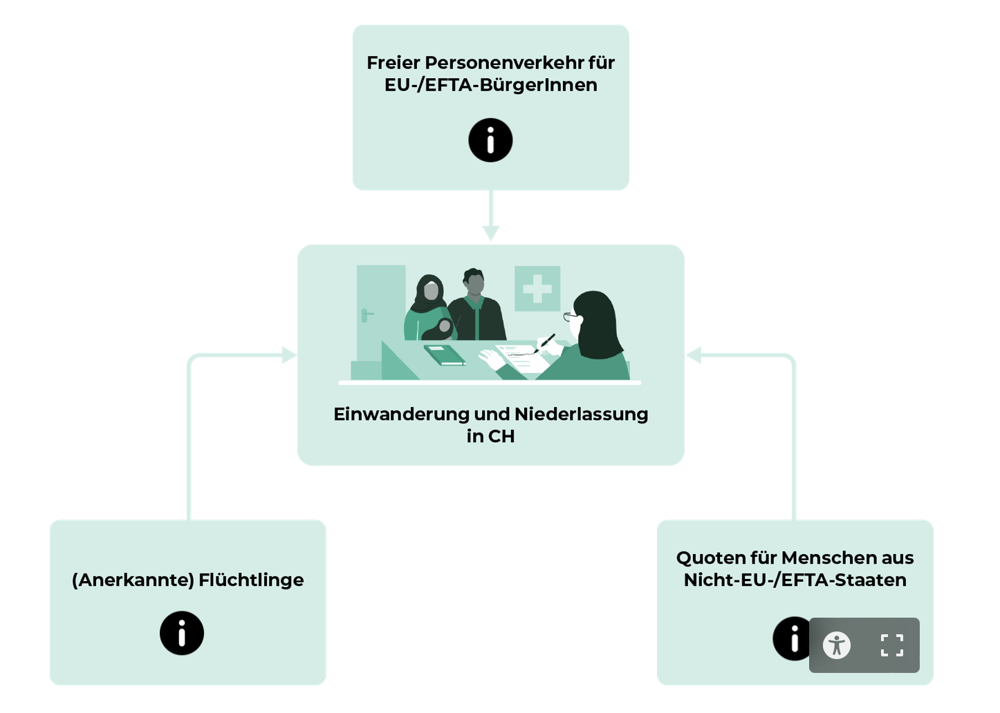

tags:: [[GIBB]], [[ABU]]

- ## Wenn sich Kulturen begegnen
  collapsed:: true
	- ### Die grössten Herausforderungen, die durch Migration für die ankommenden Menschen entstehen, sehen wir darin, dass …
		- Eine der größten Hürden ist die Sprachbarriere.
		- Viele haben Schwierigkeiten, sich in eine neue Kultur zu integrieren.
		- Der Zugang zu Arbeitsplätzen und Bildung ist oft schwierig.
		- Hinzu kommen rechtliche und bürokratische Herausforderungen.
		- Viele Migranten haben traumatische Erlebnisse hinter sich.
		- Sie müssen sich in einem fremden Umfeld soziale Netzwerke aufbauen.
		- Diskriminierung und Vorurteile in der neuen Gesellschaft sind weitere Hindernisse.
	- ### Die grössten Herausforderungen, die durch Migration für die ansässigen Menschen entstehen, sehen wir darin, dass …
		- Es kann zu Missverständnissen aufgrund kultureller Unterschiede kommen.
		- Einige Menschen haben Angst vor einem Verlust ihrer eigenen Identität und Traditionen.
		- Die Integration von Migranten kann Ressourcen wie Bildung und Wohnraum beanspruchen.
		- Manchmal entstehen Spannungen durch wirtschaftliche Konkurrenz um Arbeitsplätze.
		- Vorurteile und Unsicherheiten gegenüber den Neuankömmlingen sind ebenfalls verbreitet.
		- Es besteht die Herausforderung, eine Balance zwischen Integration und dem Erhalt eigener Werte zu finden.
		- Kommunikation und der Abbau von Vorurteilen sind wichtig, um ein harmonisches Zusammenleben zu ermöglichen.
	- ### Die grössten Chancen, welche Migration einem Land eröffnet, sehen wir darin, dass …
		- Kultur verbreiten, kulturelle Vielfalt
		- Wirtschaft stärken
		- demografische Herausfoderungen mindern
		- Technologienforschritt
		- Arbeitskräfte
	- ### Gewünschte Strategie von Neuankömmlingen
		- Aktiver Intergration (Mitmachen), Interessant an Intergration
		- Gute Arbeit leisten
- ## Wer darf in der Schweiz leben
	- **Leute mit einem Schweizerpass**
	- **Arbeitsmigranten (gültiger Arbeitsvertrag mit einer Firma in der Schweiz)**
		- *Personenfreizügigkeitsvertrag mit der EU/EFTA*
			- Anzahl unbeschränkt, B oder C-Ausweis
		- *Jahreskontingente für Drittstaaten*
			- Anzahl beschränkt, B oder C-Ausweis
	- **Leute nach Asylverfahren**
		- *Asylsuchend*
			- N-Ausweis während Prozess
		- *Annerkannte Flüchtlinge*
			- B-Ausweis bei angenommenem Asylantrag (an Leib und Leben verfolgt)
		- *Vorläufig aufgenommene Ausländer|innen*
			- F-Ausweis, Rückkehr unzulässig/unzumutbar/unmöglich
		- *Schutzbedüftige*
			- S-Ausweis, vorübergehender Aufenhalt
- ## Wie wird man Schweizer:in
	- **Mindesten ein Elternteil ist Schweizer:in**
		- Geburt
		- Adoption
	- **Einbügerung (kantonale- oder Gemeinderegelung)**
		- *Ordentlich*
			- 10 Jahren in der Schweiz, C-Ausweis
		- *Erleichtert*
			- Verheiratet mit Schweizer:in
			- 3.Ausländer:innengeneration
	-
-
- ## Interview-Projekt Fragen
  collapsed:: true
	- **Pull / Push -Faktoren**
		- Welche spezifischen Gründe hast du dazu veranlasst, deine Heimat zu verlassen?
		- Hattest du Erwartungen an die Schweiz? Wenn ja, was?
		- Hattest du Gründe für das Verlassen deines Heimatlandes?
	- **Rassismus**
		- Hast du jemals Rassismus erfahren? Wenn ja, wie ist es passiert?
		- Wie gehst du mit rassistischen Erfahrungen um?
		- Welche Gefühl hast du, wenn du so etwas erlebt?
		- Welche Gefühle hattest du, als du solche Erfahrungen gemacht hast?
	- **Angewendete Integrationsstrategien**
		- Wie hast du unternommen, um dich in die Gesellschaft zu integrieren?
		- Wie wichtig war für dich das Erlernen der Sprache und wie bist du das angegangen?
		- Gab es spezifische Herausforderungen bei der Integration und wie hast du diese überwunden?
	- **Reaktionen der Aufnahmegesellschaft**
		- Wie würdest du die allgemeine Reaktion der Aufnahmegesellschaft auf deine Ankunft beschreiben?
		- In welchen Bereichen des gesellschaftlichen Lebens fühlst du dich besonders willkommen oder ausgeschlossen?
		- Wie hat sich die Einstellung der Aufnahmegesellschaft dir gegenüber im Laufe der Zeit verändert?
	- **Durchlaufene Phasen der Identitätsentwicklung**
		- Wie hat sich dein Selbstbild seit deiner Migration verändert?
		- Wie verbindest du deine Herkunftskultur mit der Kultur der Schweiz in deinem täglichen Leben?
	- **Meinung gegenüber der jeweiligen Migrationspolitik**
		- Wie bewertest du die Migrationspolitik der Schweiz?
		- Welche Aspekte der schweizerischen Migrationspolitik hat dir bei deiner Integration geholfen, und welche haben es dir erschwert?
		- Wie stehst du zu den aktuellen politischen Diskussionen über Migration in der Schweiz?
	- ### Einleitung
		- Migration betrifft weltweit Millionen von Menschen, auch viele, die in die Schweiz kommen. In unserem Projekt schauen wir uns die Migrationsgeschichten von zwei jungen Menschen an, die als Kinder mit ihren Familien in die Schweiz eingewandert sind.
		- Durch ausführliche Interviews beleuchten wir verschiedene Aspekte ihrer Erfahrungen.
		- Unser Ziel ist es, durch den Vergleich ihrer Geschichten besser zu verstehen, welche Chancen und Schwierigkeiten Migration mit sich bringt. Wir wollen zeigen, wie unterschiedlich, aber auch ähnlich die Erfahrungen sein können, und so zur Diskussion über Migration und Integration beitragen.
		- Unsere erste Gesprächspartnerin ist Yeega, eine 19-jährige junge Frau. Sie kommt ursprünglich aus Italien und zog 2019, als sie 15 Jahre alt war, mit ihrer Mutter nach Interlaken in die Schweiz. Der Grund für den Umzug war, dass ihre Mutter dort eine neue Arbeit gefunden hatte.
	- ### Analyse
		- #### Rassismus
			-
			- Bei Yeega war die Situation eindeutig: Während der Corona-Pandemie nannten ihre Mitschüler sie „Corona“. Diese Beleidigung war klar und deutlich.
			- Milan fühlte sich auch ausgeschlossen, jedoch weniger direkt. Er konnte keine bestimmten Vorfälle nennen, bei denen er diskriminiert wurde, spürte aber eine allgemeine Ausgrenzung.
			-
			- **Ähnlichkeit**
				- Was beide gemeinsam haben, ist, dass sie sich schon einmal ausgeschlossen gefühlt haben und sich angepasst haben, um besser mit der Situation klarzukommen.
			- **Unterschied**
				- Sonst gibt es grosse Unterschiede in den beiden Geschichten
				- Der wichtigste Unterschied liegt darin, wie sie die Diskriminierung erlebt haben. Yeega wurde direkt und verbal angegriffen, was klar und offensichtlich war. Bei Milan war die Ausgrenzung weniger konkret; er hatte das Gefühl, ausgeschlossen zu sein, konnte aber keine spezifischen Vorfälle nennen.
				- Auch ihre Reaktionen waren unterschiedlich. Yeega entschied sich, die Beleidigungen zu ignorieren und ließ sich emotional nicht davon beeinflussen. Milan hingegen fühlte sich anfangs stark ausgeschlossen, bemühte sich aber intensiv, sich anzupassen und besser zu integrieren. Mit der Zeit half ihm das, sich wohler zu fühlen. Er verbesserte seine Deutschkenntnisse und arbeitete aktiv daran, sich in die schweizerische Kultur einzufügen.
			- **Fazit**
				- Diskriminierung kann sich in verschiedenen Formen zeigen und die Art und Weise, wie Menschen darauf reagieren, kann sehr unterschiedlich sein. Yeega und Milan haben uns auf ihre eigene Weise gezeigt, wie man mit Ausgrenzung umgehen kann. Ihre Erfahrungen sind wertvolle Beispiele dafür, wie wichtig es ist, individuelle Strategien zur Bewältigung von Herausforderungen zu entwickeln und sich nicht entmutigen zu lassen.
				- Diskriminierung kann auf unterschiedliche Weise passieren, sei es durch direkte Beleidigungen oder durch versteckte Ausgrenzung. Menschen reagieren darauf ganz verschieden, je nach Persönlichkeit und Situation.  Beide zeigen, dass jeder seinen eigenen Weg findet, mit Diskriminierung umzugehen
				- Wir sollten andere mit Respekt behandeln.
		- #### Angewendete Integrationsstrategien
			- Wir betrachten nun die Intergrationerfahrungen von Yeega und Milan.
			- **Ähnlichkeit**
			- Beide mussten Deutsch lernen und fanden soziale Kontakte sehr wichtig für ihre Integration. Yeega ging zur Schule, verbrachte viel Zeit mit ihren Kollegen und lernte dabei die Sprache.  Er ging auch mit Leuten raus, machte Sport und baute aktiv Kontakte auf. Milan hingegen fand, dass er durch das Reden mit anderen schneller Deutsch lernte als aus Büchern.
			- Was mich überrascht, ist, dass beide keine besonderen Herausforderungen hatten.
			- **Unterscheide**
				- Der Unterschied zwischen ihnen ist, dass Milan mehr Wert auf aktive Kommunikation und Aktivitäten wie Sport legte, um Deutsch zu lernen und sich zu integrieren. Yeega konzentrierte sich eher auf ihre bestehenden Freundschaften.
				- Milan war dabei aktiver, suchte bewusst nach neuen Kontakten und Aktivitäten wie Sport, während Yeega mehr auf ihre bestehenden Freundschaften setzte.
				-
			- Zusammengefasst zeigt sich, dass soziale Kontakte sehr wichtig für die Integration sind. Sowohl Yeega als auch Milan haben durch den Austausch mit anderen ihre Deutschkenntnisse verbessert. M Es gibt verschiedene Wege, sich gut zu integrieren, aber am wichtigsten ist, offen für den Kontakt mit anderen zu sein.
- ## Testvorbereitung
	- ### Begriffen
		- **Immigrant**
			- Ein Immigrant ist eine Person, die in ein anderes Land *zuwandert*. Sie hat ihren ursprünglichen Wohnsitz verlassen und sich dauerhaft oder vorübergehend in einem neuen Land niedergelassen.
			- **Beispiel:** Eine Person, die aus Italien in die Schweiz zieht, um dort zu arbeiten oder zu studieren, ist ein Immigrant in der Schweiz.
		- **Emigrant**
			- Ein Emigrant ist das Gegenteil eines Immigranten. Es ist eine Person, die aus ihrem Heimatland *auswandert*. Sie verlässt ihr Heimatland dauerhaft oder vorübergehend, um in einem anderen Land zu leben.
			- **Beispiel:** Eine Person, die aus Deutschland in die USA auswandert, ist ein Emigrant aus Deutschland und ein Immigrant in den USA
		- **Arbeitsmigrant**
			- Ein Arbeitsmigrant ist eine spezielle Form des Immigranten. Er oder sie migriert in ein anderes Land, um dort einer Erwerbstätigkeit nachzugehen.
			- **Beispiel:** Ein polnischer Bauarbeiter, der in Deutschland auf einer Baustelle arbeitet, ist ein Arbeitsmigrant
		- **Asylbewerber**
			- Ein Asylbewerber ist eine Person, die in einem anderen Land Asyl beantragt. Sie flieht vor Verfolgung in ihrem Heimatland aufgrund von Rasse, Religion, Nationalität, politischer Überzeugung oder Zugehörigkeit zu einer bestimmten sozialen Gruppe.
			- **Beispiel:** Eine Person aus Syrien, die vor dem Krieg flieht und in Deutschland Asyl beantragt, ist ein Asylbewerber.
	- ### Warum Menschen ein- und auswandern (Pull-/ Push Faktoren)
		- **Pull-Faktoren** sind hingegen jene Anreize, die Menschen in ein anderes Land ziehen
			- **Wirtschaftliche Gründe:**
				- Hohe Lebensstandards
				- Gute Arbeitsmöglichkeiten
				- Wirtschaftswachstum
				- Sozialleistungen
			- **Politische Gründe:**
				- Demokratie
				- Rechtsstaatlichkeit
				- Freiheit
			- **Soziale Gründe:**
				- Toleranz
				- Vielfalt
				- Gute Bildungsmöglichkeiten
			- **Umweltbezogene Gründe:**
				- Hohe Lebensqualität
				- Schöne Natur
			- politische und wirtschaftliche Stabilität
			- hoher Lebensstandard und Wohlstand
			- Sicherheit vor Verfolung
			- Einhaltung der Meschenrechte
		- **Push-Faktoren** sind jene Gründe, die Menschen dazu bewegen, ihren Heimatort zu verlassen
			- **Wirtschaftliche Gründe**
				- Hohe Arbeitslosigkeit
				- Niedrige Löhne
				- Armut
				- Mangel an wirtschaftlichen Prespektiven
				- Inflation (lam phat)
			- **Politische Gründe**
				- Krieg oder Bürgerkrieg
				- Politische Verfolgung
				- Menschenrechtsverletzungen
				- Mangel an Demokratie
			- **Sozial Gründe**
				- Diskriminierung
				- Intoleranz
				- Mangel an Bildungsmöglichkeiten
			- **Umweltbezogene Gründe**
				- Klimawandel
				- Umweltverschmutzung
				- Naturkatastrophen
		- *Was könnte „Migration erzeugt weitere Migration“ bedeuten?*
			- Migrantinnen und Migranten bevorzugen Staaten, in denen sich bereits viele ihrer Landsleute befinden.
	- ### Gründe für den hohen Ausländeranteil in der Schweiz
		- Gute Verdienstmöglichkeiten
		- hoher Lebensstandard und Wohlstand
		- Sicherheit vor Verfolgung
		- Einhaltung der Menschenrechte Einbürgerung: Gerade EU-Bürger wollen sich oft nicht einbürgern lassen. Fast in keinem andern Land Europas ist es so schwierig sich einbürgern zu lassen.
		- Tuân thủ nhân quyền Nhập tịch: Công dân EU nói riêng thường không muốn được nhập tịch. Hầu như không có quốc gia nào ở Châu Âu khó nhập tịch như vậy.
		- *Pull- und Push-Faktoren, die Sie – zumindest vorübergehend – dazu bewegen könnten, in eine andere Region der Schweiz zu ziehen (z.B. von der Stadt aufs Land oder vom Norden in den Süden oder von einem Sprachgebiet in ein anderes)*
			- **Push-Faktoren**
				- Wenig Ausgehmöglichkeiten
				- Abgeschiedenheit
				- Lärm
				- enge Platzverhältnisse
			- **Pull-Faktoren**
				- Vielseitiges kulturelles Angebot
				- vorteilhaftere klimatische Bedingungen
				- Spracherwerb (z.B. im Rahmen eines Austauschjahres)
				- Ruhe, Natur
	- ### Asyl
		- ### Asylgründe
			- Asyl wird in der Schweiz auf Grundlage der Genfer Flüchtlingskonvention und des Schweizerischen Asylgesetzes (AsylG) gewährt. Die zentralen Kriterien für die Asylgewährung sind.
			- **Verfolgung aufgrund bestimmter Merkmale:**
				- Asylbewerber müssen glaubhaft machen, dass sie in ihrem Herkunftsland aufgrund ihrer **Rasse, Religion, Nationalität, politischen Überzeugung oder Zugehörigkeit zu einer bestimmten sozialen Gruppe** verfolgt werden.
			- **Unmittelbare Gefahr für Leben oder Freiheit:**
				- Die Verfolgung muss schwerwiegend genug sein, um eine Bedrohung für das Leben, die Freiheit oder die körperliche Unversehrtheit darzustellen. Dazu gehören auch Fälle, in denen Gefahr von Folter, unmenschlicher oder erniedrigender Behandlung oder Bestrafung besteht.
			- **Unzumutbarkeit der Rückkehr ins Heimatland:**
				- Wenn die Rückkehr unzumutbar ist, weil die Person durch staatliche oder nicht-staatliche Akteure bedroht wird und keinen Schutz im Heimatland findet, kann Asyl gewährt werden
			- Wer diese Kriterien erfüllt, wird als Flüchtling anerkannt und erhält Asyl sowie eine Aufenthaltsbewilligung B.
		- ### Gründe für vorläufige Aufnahme
			- Die vorläufige Aufnahme (Status F) ist eine Schutzmaßnahme für Personen, die die strengen Anforderungen des Asyls nicht erfüllen, aber dennoch nicht in ihr Herkunftsland zurückgeschickt werden können. Gründe für eine vorläufige Aufnahme sind:
			- **Unzumutbare Rückkehr:**
				- Die Rückkehr gilt als unzumutbar, wenn der Herkunftsstaat die Person möglicherweise nicht akzeptiert oder kein Schutz bietet. Dies kann auch der Fall sein, wenn der Staat keine Reisepapiere ausstellt oder es unmöglich ist, sicher zurückzukehren.
			- **Humanitäre Gründe:**
				- Wenn besondere individuelle Gefahren (wie eine schwere Krankheit) oder eine hohe Verwundbarkeit vorliegen und die Rückkehr menschenrechtlich bedenklich wäre, kann eine vorläufige Aufnahme erfolgen.
			- **Kriegs- oder Katastrophensituation:**
				- In Situationen von Bürgerkrieg, allgemeinen Kriegsgefahren oder Naturkatastrophen kann die Schweiz entscheiden, die Rückkehr vorübergehend auszusetzen.
		- ### Unterschied zwischen Asyl und vorläufiger Aufnahme
			- **Asyl** ist eine dauerhafte Lösung für anerkannte Flüchtlinge, die aufgrund persönlicher Verfolgung Schutz brauchen.
			- Die **vorläufige Aufnahme** hingegen ist eine temporäre Maßnahme für Personen, die zwar nicht als Flüchtlinge gelten, aber auch nicht sicher in ihr Heimatland zurückkehren können.
	- ### Arbeitsmigrationsbedingungen der Schweiz
		- In der Schweiz gibt es klare Regeln, wer aus dem Ausland zum Arbeiten kommen darf. Dabei wird unterschieden, ob jemand aus einem EU/EFTA-Land oder aus einem sogenannten Drittstaat (Nicht-EU/EFTA) kommt.
		- #### Einfacher Zugang für EU/EFTA-Bürger
			- **Freie Wahl des Arbeitsplatzes:** Menschen aus EU- und EFTA-Ländern (wie Deutschland, Italien oder Norwegen) dürfen in der Schweiz arbeiten, ohne dass besondere Einschränkungen gelten. Sie können in die Schweiz kommen und eine Arbeit aufnehmen oder als Selbständige tätig sein.
			- **Anmeldung nötig:** Wer länger als 90 Tage in der Schweiz bleibt, muss sich bei den Behörden anmelden, erhält aber in der Regel eine Aufenthaltsbewilligung.
		- #### Strenge Regeln für Personen aus Drittstaaten (Nicht-EU/EFTA)
			- **Nur für hochqualifizierte Fachkräfte:** Menschen aus Drittstaaten (z. B. aus den USA, Indien oder Brasilien) dürfen nur in die Schweiz kommen, wenn sie eine hohe Qualifikation und Berufserfahrung haben, die in der Schweiz dringend benötigt wird.
			- **Begrenzte Anzahl an Bewilligungen:** Die Schweiz hat jedes Jahr nur eine begrenzte Anzahl an Bewilligungen für Arbeitskräfte aus Drittstaaten. Arbeitgeber müssen nachweisen, dass sie für die Stelle keine Person aus der Schweiz oder der EU/EFTA finden konnten.
	- ### Regulierung der Immigration in CH
		- 
		- **Freier Personenverkehr für EU-/EFTA-BürgerInnen**: Das Personenfreizügigkeitsabkommen als Teil der Bilateralen Verträge, regelt die Zulassung und den Aufenthalt von EU/EFTA-BürgerInnen. Im Rahmen des freien Personenverkehrs können Menschen aus der EU und den EFTA-Staaten in einem anderen EU- oder EFTA-Land wohnen und arbeiten.
		- **(Anerkannte) Flüchtlinge**: Das Asylgesetz regelt das Asylverfahren und die Rechtsstellung von (anerkannten) Flüchtlingen. Anerkannte Flüchtlinge können in der ganzen Schweiz wohnen und arbeiten.
		- **Quoten für alle Menschen aus Nicht-EU-/EFTA-Staaten**
			- Quoten für alle Menschen aus Nicht-EU-/EFTA-Staaten = Der Bund legt jährliche Höchstzahlen fest.
			- Kriterien: – Keine qualifizierte Person in CH oder EU/EFTA für bestimmten Job zu finden – Berufliche Qualifikation – Integrationsfähigkeit
			- Das Ausländer- und Integrationsgesetz regelt insbesondere die Zulassung und den Aufenthalt von Ausländerinnen ausserhalb des EU- und EFTA-Raums (Amerika, Asien, Afrika usw.).
	- ### Die Zielgebiete für die Arbeitsmigration
		- In der Schweiz gibt es einige Bereiche, in denen dringend ausländische Arbeitskräfte gebraucht werden. Hier die wichtigsten Zielgebiete:
		- #### Gesundheitswesen
			- **Hoher Bedarf:** Es fehlen Ärzt:innen und Pflegekräfte in Spitälern und Pflegeheimen. Viele kommen aus dem Ausland, vor allem aus der EU.
		- #### IT und Technik
			- **Fachkräfte gesucht:** In der IT und bei technischen Berufen wie Ingenieurwesen gibt es oft zu wenig Fachkräfte in der Schweiz. Deshalb werden hier viele aus dem Ausland eingestellt, vor allem in Städten wie Zürich und Genf.
		- #### Baugewerbe
			- **Saisonarbeit:** Im Bau werden besonders im Sommer viele Arbeitskräfte gebraucht. Oft kommen sie aus dem Ausland, da es hier nicht genug Personal gibt.
		- #### Gastronomie und Tourismus
			- **Saisonale Jobs:** In Hotels und Restaurants, besonders in touristischen Gegenden wie den Alpen, fehlen regelmäßig Arbeitskräfte. Hier werden oft ausländische Saisonarbeiter eingestellt.
		- #### Forschung und Wissenschaft
			- **Spezialisten gesucht:** Universitäten und Forschungsinstitute brauchen oft internationale Fachkräfte, besonders in Städten wie Zürich, Lausanne und Basel.
	- ### Folgen der Migration auf Ziel- und Herkunftsland
		- Migration hat verschiedene Auswirkungen auf das Land, in das die Menschen einwandern, und auf das Land, das sie verlassen.
		- ### Folgen für das Zielland
			- **Positiv**
				- **Arbeitskräfte werden gewonnen:** Migrant füllen oft Lücken in Bereichen wie Gesundheit, Bau oder IT, wo es nicht genug einheimische Arbeitskräfte gibt.
				- **Wirtschaftlicher Gewinn:** Migrant zahlen Steuern und Sozialabgaben, was der Wirtschaft hilft.
				- **Kulturelle Vielfalt:** Migration bringt neue Kulturen, Sprachen und Traditionen ins Land, was die Gesellschaft vielfältiger macht.
			- **Negativ**
				- **Belastung der Sozialsysteme:** Wenn viele Menschen einwandern, können Gesundheitssystem, Schulen und Sozialhilfe überlastet werden.
				- **Kulturelle Spannungen:** Manchmal gibt es Spannungen zwischen Einheimischen und Migrant, wenn es Schwierigkeiten bei der Integration gibt.
				- **Konkurrenz um Arbeitsplätze:** In manchen Berufen kann es durch mehr Arbeitskräfte zu grösserem Wettbewerb kommen, was Löhne senken kann.
		- ### Folgen für das Herkunftsland
			- **Positiv**
				- **Netzwerke und Verbindungen:** Durch die Migration entstehen internationale Kontakte, die Handel und Zusammenarbeit zwischen dem Herkunfts- und Zielland erleichtern können.
				- **Geldüberweisungen:** Migrant schicken oft Geld an ihre Familien zurück. Dieses Geld hilft den Familien und der Wirtschaft im Herkunftsland.
				- **Kulturelle Veränderungen:** Menschen, die ins Herkunftsland zurückkehren, bringen neue Ideen und Erfahrungen mit, was die Gesellschaft dort verändern kann.
			- **Negativ**
				- **Fachkräftemangel:** Wenn viele gut ausgebildete Menschen das Land verlassen, fehlen dort Arbeitskräfte, was die Wirtschaft schwächen kann.
				- **Abhängigkeit von Geldüberweisungen:** Familien im Herkunftsland sind oft auf das Geld angewiesen, das ihnen Migrant schicken, statt selbst genug zu verdienen.
				- **Alternde Bevölkerung:** Wenn viele junge Menschen auswandern, bleiben oft mehr ältere Menschen zurück, was das Sozialsystem des Herkunftslandes belastet.
	- ### Migration – Strategien und Kategorien
		- #### Seitens der Migranten
			- **Assimiliation**
				- Migrant passen sich vollständig an die Kultur des Ziellandes an. Sie übernehmen die Sprache, Traditionen und Werte des neuen Landes und lassen ihre eigene Kultur weitgehend hinter sich.
			- **Integration**
				- Migrant behalten ihre eigene Kultur, passen sich aber gleichzeitig an die neue Gesellschaft an. Sie nehmen an der Gesellschaft teil und respektieren die Gesetze, ohne ihre Identität zu verlieren.
			- **Separation**
				- Migrant wählen es, sich von der Mehrheitsgesellschaft zu trennen und ihre eigene Kultur zu bewahren, ohne viel Kontakt mit der neuen Gesellschaft zu haben.
		- #### Seitens der Aufnahmegesellschaft
			- **Melting Pot**
				- Alle Migrant und Einheimischen vermischen sich zu einer gemeinsamen Gesellschaft. Jeder bringt etwas aus seiner Kultur mit, aber am Ende entsteht eine neue, gemeinsame Kultur.
			- **Mulitikulturalismus**
				- Die Gesellschaft akzeptiert und fördert die Vielfalt der Kulturen. Verschiedene Kulturen leben nebeneinander und behalten ihre Eigenheiten, ohne dass eine Kultur die andere ersetzt.
			- **Segregation**
				- Migrant und die einheimische Bevölkerung leben getrennt voneinander. Es gibt wenig Austausch oder Integration, und oft entstehen eigene Gemeinschaften der Migrant in bestimmten Bereichen der Gesellschaft.
	- ### Weshalb es für die EU so schwierig ist Flüchtlingspolitik zu betreiben
		- **Unterschiedliche Meinungen der Mitgliedsländer:** Jedes Land in der EU hat unterschiedliche Ansichten und Prioritäten, wenn es um Flüchtlinge geht. Einige Länder sind bereit, viele Flüchtlinge aufzunehmen, während andere Länder sich dagegen sträuben.
		- **Verschiedene Kapazitäten und Ressourcen:** Einige EU-Länder sind besser ausgestattet, um Flüchtlinge zu unterstützen, etwa durch mehr Arbeitsplätze oder Sozialleistungen. Andere Länder haben weniger Ressourcen und fühlen sich überfordert.
		- **Politische und gesellschaftliche Spannungen:** In einigen Ländern gibt es Angst vor zu vielen Flüchtlingen, was zu politischen Spannungen führen kann. Manche Menschen fürchten, dass Flüchtlinge die Kultur oder Wirtschaft ihres Landes negativ beeinflussen könnten.
		- **Unfaire Verteilung:** Es gibt keine einheitliche Lösung zur Verteilung der Flüchtlinge auf die EU-Länder. Manche Länder nehmen weniger Flüchtlinge auf als andere, was zu Ungerechtigkeit und Frustration führt.
		- **Herausforderung der Integration:** Die Integration von Flüchtlingen in die Gesellschaft ist komplex und erfordert Zeit, Geld und Ressourcen. Nicht alle Länder sind bereit, diese Verantwortung zu übernehmen.
	- ### Globale Zusammenhänge der Migration in einem Netzwerk ergänzen können