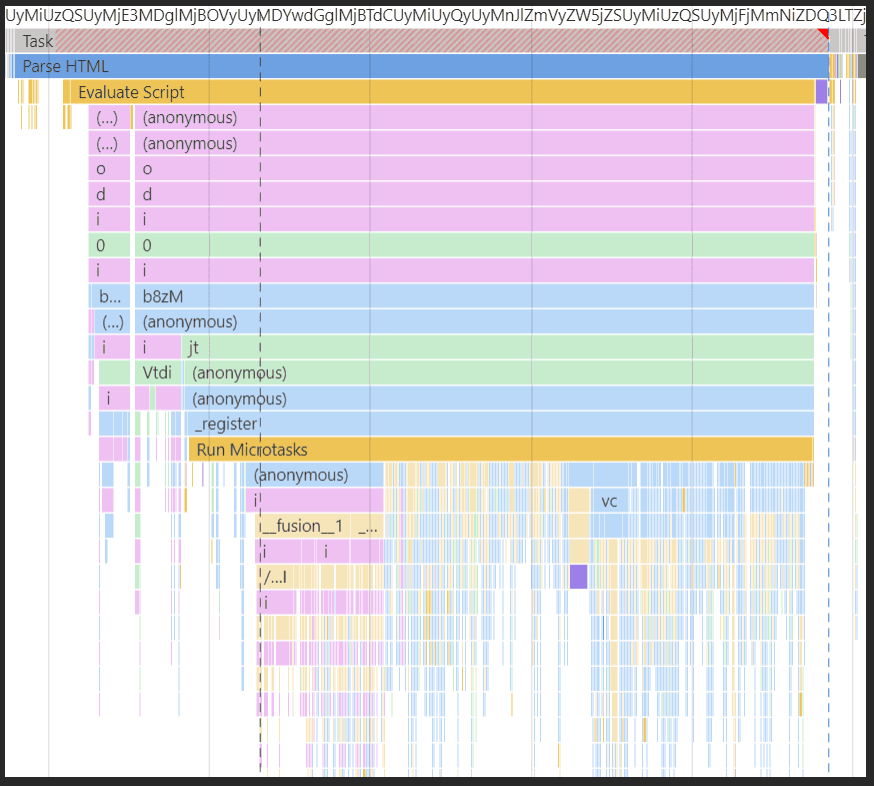

tags:: [[Web Performance]]

- A flame chart shows how web apps run JS over time
-
- ## How to read it?
	- **Blocks** -> Each block is a function or task
	- **Colors** -> Different types of work (scripting, rendering, paiting)
	- **Wide Blocks** = Tasks that take a long time
	- **Tall stacks** = functions calling many other functions
	- **Gap** = idle time (nothing happening)
-
- {:height 513, :width 488}