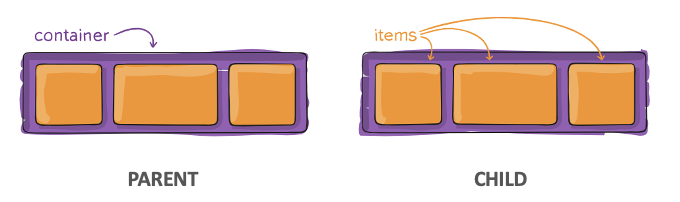
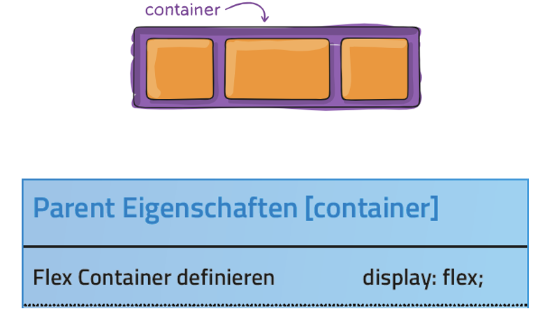
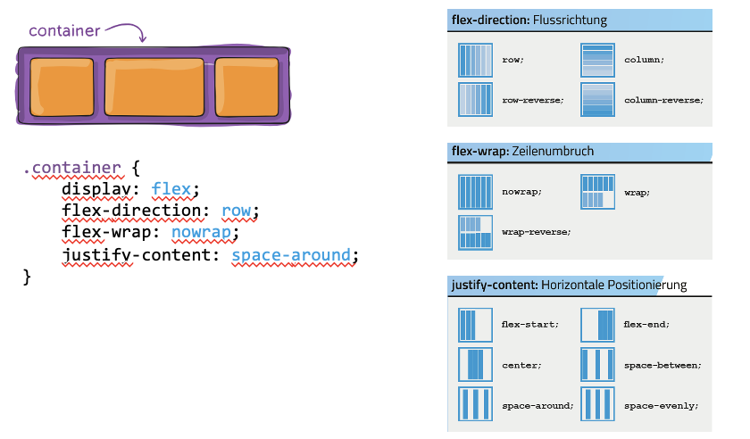
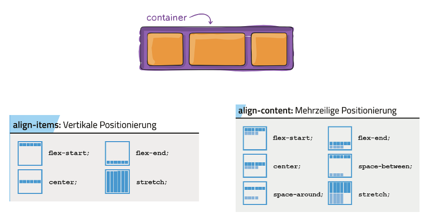
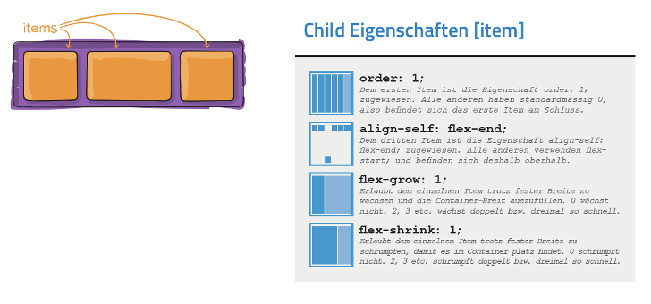

tags:: [[CSS]]

- Elemente im zur Verfügung stehenden Platz des Container verteilen
- Spalten & Zeilen
- 
- 
- 
- 
	- align-items -> Wenn 1 Zeile
	- align-content -> Wenn mehrere Zeilen
- 
- https://flexboxfroggy.com/#de üben