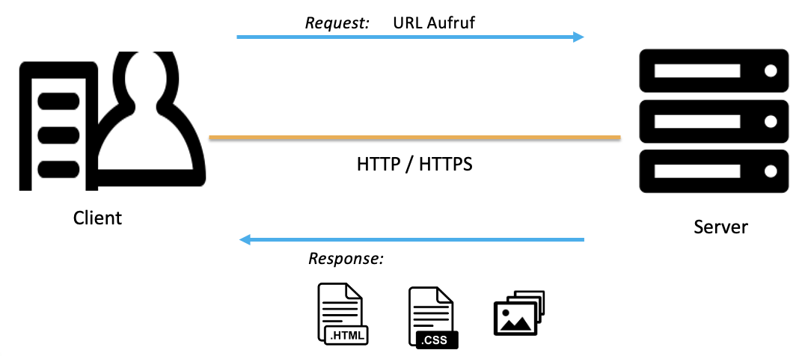
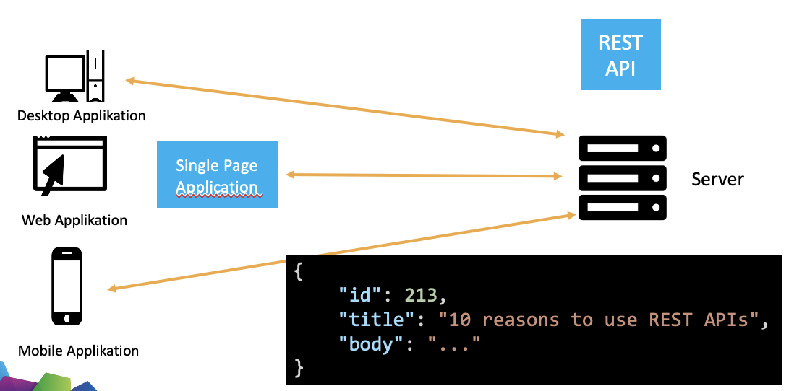
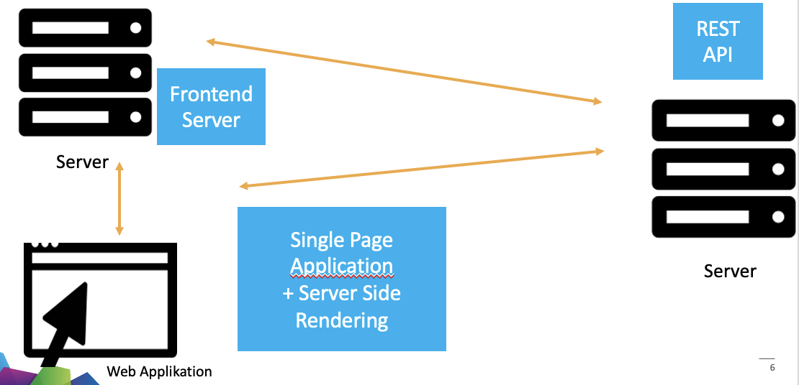
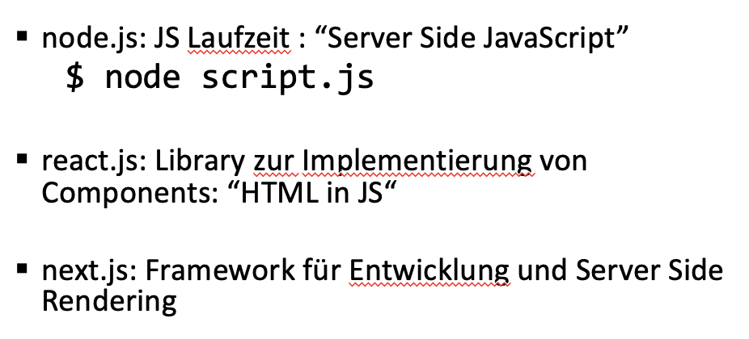

tags:: [[BBC]]

- [[React]]
- ## Frontendarchitektur
  collapsed:: true
	- ## Klassische Architektur
		- 
		- Der Client erhält bei Anfragen gesamtes HTML, der anzuzeigenden Seite (inklusive
		  JavaScript, CSS, Bilder etc)
		- Anfragen werden per URL, per Formular oder per Javascript gesendet
		- **Vorteile**:
			- Performance durch Caching: generierte HTML-Seiten können gespeichert und für weitere Anfragen verwendet werden, ohne dass der Server die Seite neu generieren muss
		- **Nachteile**:
			- Komplexe UIs nur schwer umsetzbar, da für jede Zustandsänderung im UI ein
			  Request an den Server gemacht werden muss und daher der gesamte Zustand der Seite neu generiert wird
			- Geschäftslogik kann nicht für Desktop- und Mobileapplikationen wiederverwendet werden
	- ## Moderne Architektur mit Rest API und Single Page Application
		- 
		- Der Client sendet und erhält bei Anfragen nur noch Daten im JSON-Format
		- Der Client stellt die Daten dar und über die Navigation clientseitig
		- Eine solche Webapplikation nennt man **Single Page Application: **
			- Beim ersten Aufruf der Seite wird nur 1 index.html, das nötige JavaScript und CSS geladen
			- Seiten Navigation per JavaScript (window.history API)
			- Daten laden per window.fetch API
		- **Vorteile**
			- Komplexe UIs umsetzbar, Entkopplung von Entwicklung Frontend / Backend
		- **Nachteile**
			- Ladezeiten können beim ersten Aufruf problematisch werden, wenn viele Daten nötig sind
	- ## Frontend: Server Side Rendering
		- 
		- Um lange Startzeiten zu eliminieren, rendert der Frontend Server beim ersten Request unsere Seite wie in der klassischen Architektur (also statisches HTML)
		- Diesen Vorgang nennt man **Server Side Rendering**
		- Ab dann werden alle weiteren Requests wieder per JS gemacht und dargestellt
		- ### Tools und Frameworks in diesem Modul
			- 
				-
				-
			-
			-
-
-