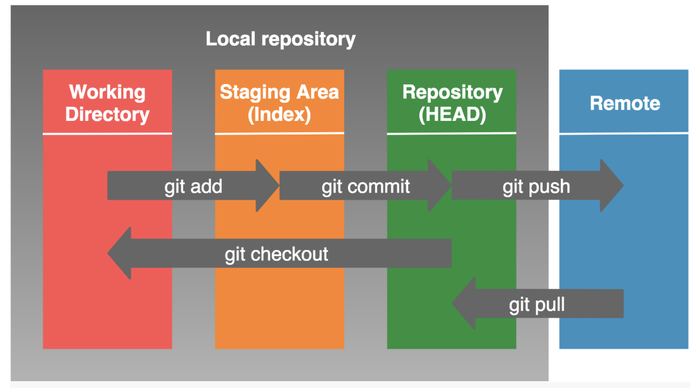

-
- ## Architektur
  collapsed:: true
	- 
	- **Arbeitsdaten (Working Directory):** Die Dateien, an denen wir arbeiten, wie z.B. `program.cs`, sind auf unserem PC im Ordner `C:\Projekt\` gespeichert.
	- **Staging Area und lokales Repository:** In einem versteckten Unterordner `C:\Projekt\.git\` befinden sich die Staging Area und das lokale Repository. Wir müssen uns nicht um die innere Struktur dieses Ordners kümmern.
	- **Remote Repository:** Das Remote Repository, das in einer Cloudumgebung gespeichert ist, haben wir bereits ausgewählt.
- ## Operation
  collapsed:: true
	- ### Initialisierung neues Projekt
		- Zuerst muss Git wissen, dass wir es für unser Projekt verwenden möchten. Dazu gehen wir in den Projektordner und führen den Befehl `git init` aus.
			- ```shell
			  cd C:\Projekt\
			  git init
			  ```
		- **Staging Area und lokales Repository:** Durch diesen Befehl werden die Staging Area und das lokale Repository erstellt. Dies erkennt man am neuen, versteckten `.git` Ordner im Projektverzeichnis. Ab diesem Punkt überwacht Git alle Änderungen in diesem Ordner und seinen Unterordnern.
		- **Ändern des Standardzweig-Namens:** Seit 2020 hat sich der Standardzweig-Name von `master` auf `main` geändert. Da nicht alle Git-Clients dies automatisch anpassen, ändern wir den Namen manuell
			- ```shell
			  git branch -m main
			  ```
	- ### Staging
		- Fügt alle Dateien, Unterordner und Dateien in Unterordner der Staging Area hinzu. Es kann auch mit Filtern gearbeitet werden
			- ```shell
			  git add -A
			  ```
		- | Operation | Wirkung auf Staging Area |
		  | `git add -A` | Fügt alle Dateien, Unterordner und deren Dateien hinzu (gelöschte werden gelöscht) -> 1:1 Kopie des aktuellen Projekts |
		  | `git add .` | Fügt alle Dateien, Unterordner und deren Dateien hinzu (gelöschte bleiben erhalten) |
		  | `git add *` | Fügt alle Dateien des aktuellen Verzeichnisses hinzu |
		  | `git add *.cs` | Fügt alle Dateien mit Endung .cs des aktuellen Verzeichnisses hinzu |
	- ### Commit
		- ```shell
		  git commit -m "Message"
		  ```
	- ### Checkout
		- Zurückgehen auf eine alte Version:
		- ```apl
		  git checkout "Dateiname"
		  ```
	- ### Diff
		- ```shell
		  //zeigt alle Commits an
		  git log 
		  
		  //zeigt die Unterschiede an
		  git show <id>
		  ```
-
- ## Versionierung zentrales Repository
	- **Remote Repository anbinden**
		- ```shell
		  git remote add origin https://gibbdev@dev.azure.com/gibbdev/LearnScrum/_git/gitdemo 
		  ```
		- Dadurch wird der Pfad zum Remote Repository hinterlegt. Diese Einstellung gilt nur für dieses Projekt!
	- **Push (Hochladen)**
		- Alle noch nicht gepushte Versionen (commits) werden auf das Remote Repository hochgeladen mittels.
		- ```shell
		  git push -u origin --all
		  ```
	- **Pull (Herunterladen)**
		- In welchem Fall wird vom Remote Repository heruntergeladen? Wenn ein anderes Teammitglied Anpassungen hinterlegt (gepushed) hat, und ich die neuste Version erhalten möchte oder wenn ich selber auf verschiedenen Maschinen entwickle.
	- Zuvor würde ich mich über die Anpassungen informieren, dazu aktualisieren wir die Angaben zu den Commits mittels:
	- `git fetch`
	- So werden alle Angaben über Commits (und Branches, siehe unten) abgefragt. Dateien werden keine übertragen: