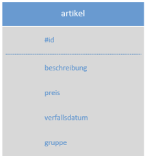
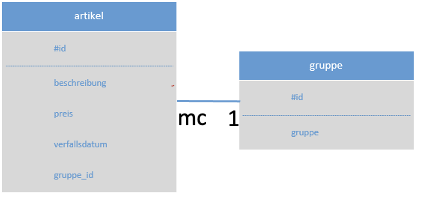
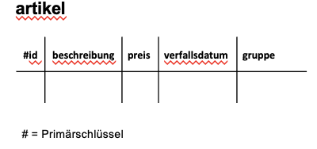
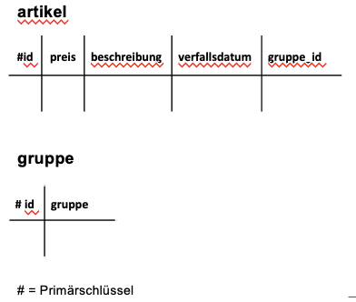
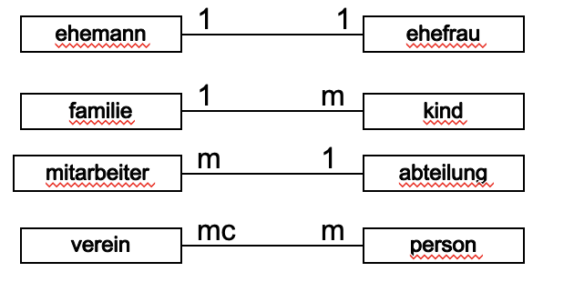
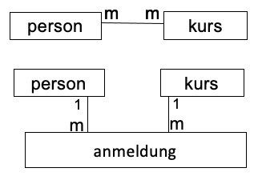
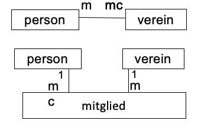

- #Datenbank-Entwurf #Datenbank
- # Abstecken des Problemrahmens
  id:: 6485df42-460f-4ded-a452-be874227b3ca
  collapsed:: true
	- Problem definieren
	- Problem analysieren und abgrenzen
	- Substantive anstreichen **(Entitätstypen suchen)**
- # Bildung von Entitätstypen und Attributen
  id:: 6485df47-5a3a-458f-8682-795b5a4941a1
  collapsed:: true
	- Entitätstypen definieren
	- Mögliche Attribute zuordnen
	- Entitätstypen zeichnen
	- ## Darstellung
		- ### Diagramm
			- 
			- 
		- ### Tabellenform
			- 
			- 
- # Festlegen von Beziehungen
  id:: 6485e028-a4f5-4786-972d-5b00dd56d7b7
  collapsed:: true
	- Entitätstypen verbinden
	- Art der Kardinalität festlegen
	- ## Kardinalitäten
		- {:height 302, :width 598}
		- ==m==
		  collapsed:: true
			- must, multiple
			- 1 oder mehrere Elemente
		- ==c==
		  collapsed:: true
			- choice, can
			- 0 oder 1 Element
		- ==mc==
		  collapsed:: true
			- must-can
			- 0, 1 oder mehrere Elemente
			-
- # Beziehungen überprüfen
  id:: b9d44628-10a0-4bf2-a673-2cdae5f3e384
  collapsed:: true
	- ==m:m== kann nicht in Tabellen gespeichertwerden!
	- auflösen von komplexen Beziehungen ==[m:m]== und ==[m:mc]==
	- überprüfen der Beziehungen => keine ==[1:1], [1:c]== oder ==[c:c]== (begrenzt
	  sinnvoll)
	- Attribute allenfalls neu zuordnen
	- Bsp.
		- {:height 150, :width 300}
		- {:height 150, :width 300}
			-