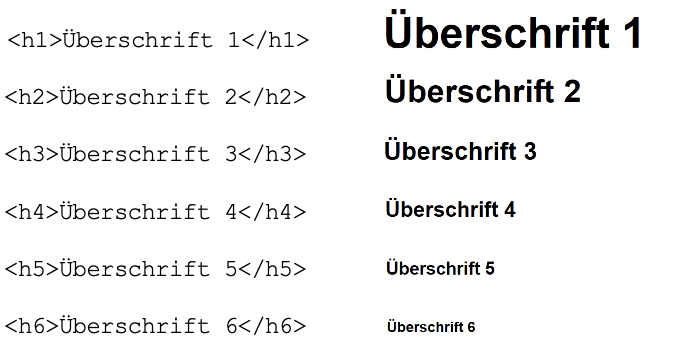
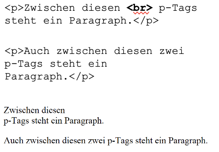
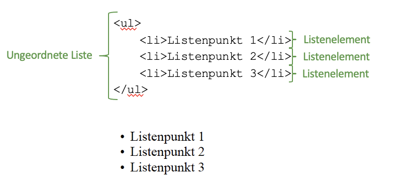
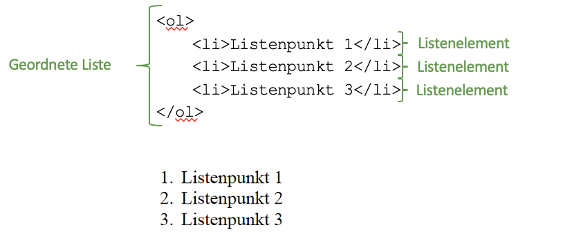
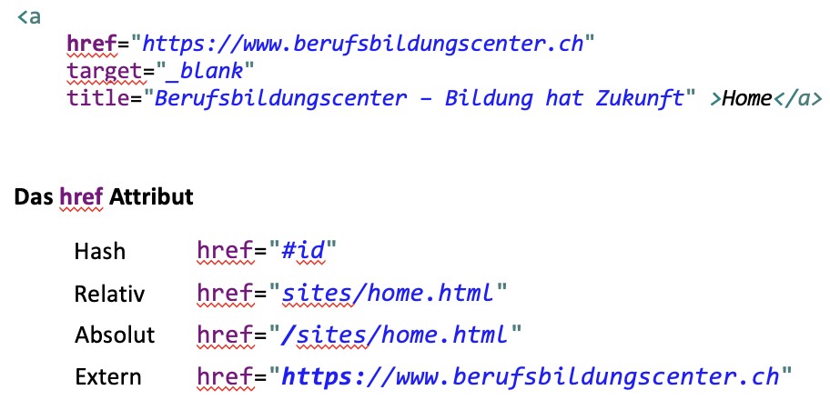
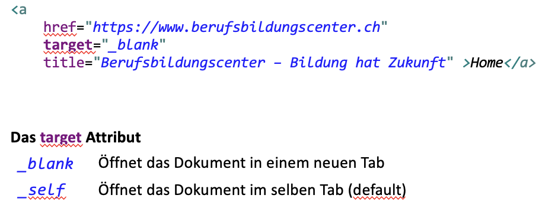
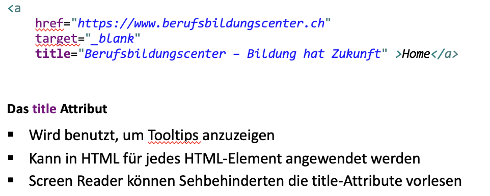
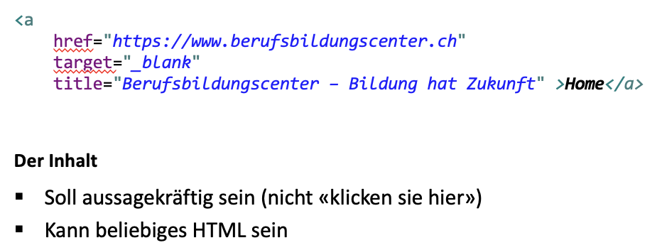

tags:: [[HTML]]

-
- ## Script - <script>
- ## Heading - <h1> – <h6>
  collapsed:: true
	- 
- ## Paragraph - 

  collapsed:: true
	- 
		-
- ## Break -  
  collapsed:: true
	- {:height 242, :width 310}
- ## Unordered List / List Item - <ul> / <li>
  collapsed:: true
	- {:height 135, :width 457}
- ## Ordered List / List Item - <ol>/ <li>
  collapsed:: true
	- {:height 228, :width 461}
- ## Bilder - 
  collapsed:: true
	- Auf Bilder wird in einer späteren Präsi genauer eingegangen.
	- Kurz src und alt erklären
	- Placeholder.com bietet eine einfache Schnittstelle für generierte Platzhalter – hier ein 300x400 px grosses png (obviously) Verwendet eure Zeit für HTML, und nicht für die Bildersuche!
- ## Links - <a>
  collapsed:: true
	- {:height 270, :width 476}
	- {:height 184, :width 482}
	- {:height 225, :width 489}
	- {:height 215, :width 487}
		- Belehrt den User nicht! Denkt an die Screen Reader und Suchmaschienen« àlink
		  zur Quelle» ist schon aussagekräftiger als «<a> klicken Sie hier </a> für die Quelle»
		- Wir können auch ein Bild oder eine Liste zum link machen. Von Vorteil simpel halten. (Bild oder Text)
		- Was soll passieren, wenn auf einen Button im Link geklickt wird?
		-
		-
- ## Button - <button>
	- #+BEGIN_CAUTION
	  default `type` is `submit`, multiple submit button in a form are not good
	  #+END_CAUTION