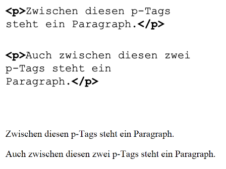
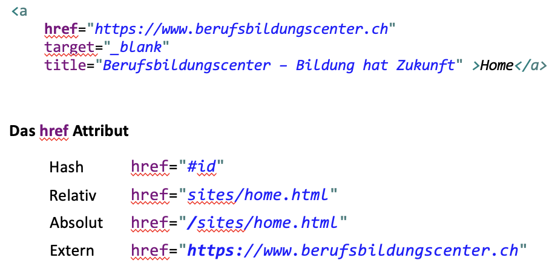
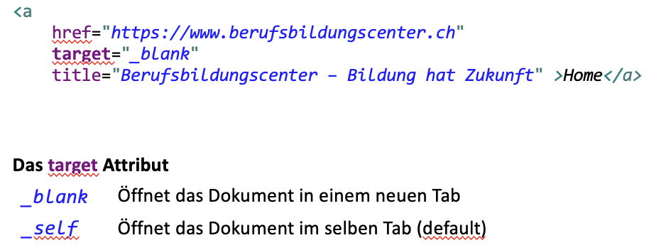
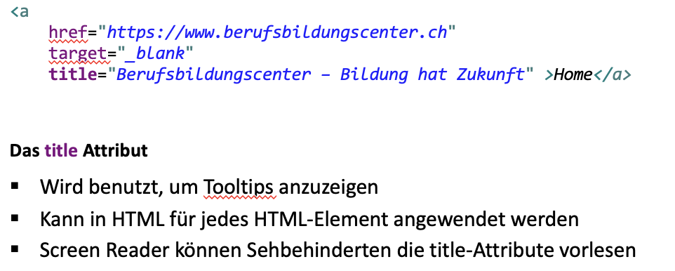
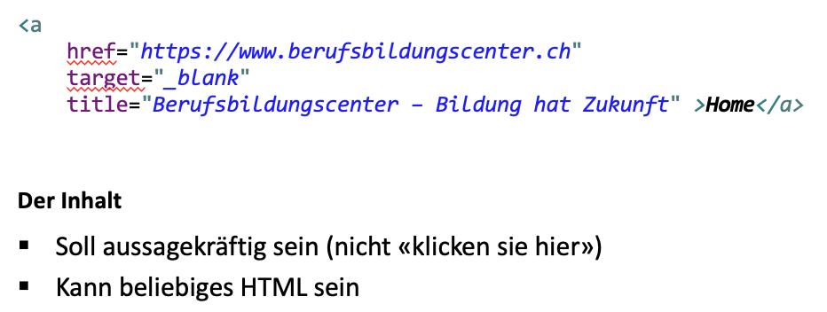

- #Webdesign #BBC
- # Semantik & HTML Einführung
  collapsed:: true
	- **Semantik** (von altgr. σημαίνειν *sēmaínein*, ‚bezeichnen‘, ‚zum Zeichen gehörig‘),
	  auch **Bedeutungslehre**, nennt man die Theorie oder Wissenschaft von der Bedeutung der **Zeichen**.
	- ## Zeichen?
		- Festgelegte, mit einer bestimmten Bedeutung verknüpfte und eine ganz bestimmte Information
		  vermittelnde (grafische) Einheit.
	- ## Semantik im Zusammenhang zum Web
		- Struktur von Webseiten: Beschreibungssprache (HTML).
		- Jedes Zeichen (Tags) dieser Beschreibungssprache hat eine **Bedeutung.**
		- Je besser die Bedeutungen zugewiesen sind, desto besser können Maschinen die
		  Struktur verstehen
	- ## Semantik in einer Webseite
		- 
		- Mit HTML machen wir nichts anderes als die auf einer Webseite enthaltene Information zu
		  strukturieren und den einzelnen Informationen so viel Bedeutung zu geben wie möglich.
	- ## Was ist HTML?
		- HyperText Markup Language
		- HTML ist ein Beschreibungssprache
		- Sprache zur **Strukturierung** aller Elemente einer Webseite
		- Sammlung vordefinierter Tags
		- Ermöglicht das Einbinden von Scriptsprachen
		- Plattformunabhängig
		- Zur Darstellung der Inhalte einer HTML-Datei ist eine „Rendering Engine“
		  notwendig. Dieser ist wesentlicher Bestandteil eines Web-Browsers
		- **Beispiel HTML**
			- {:height 360, :width 718}
			- 
- # Tags
  collapsed:: true
	- ## Heading (<h1> – <h6>)
		- 
	- ## Paragraph (<p>)
		- 
			-
	- ## Break (<br>)
		- 
	- ## Unordered List / List Item (<ul> / <li>)
		- 
	- ## Ordered List / List Item (<ol>/ <li>)
		- 
	- ## Bilder ()
		- Auf Bilder wird in einer späteren Präsi genauer eingegangen.
		- Kurz src und alt erklären
		- Placeholder.com bietet eine einfache Schnittstelle für generierte Platzhalter – hier ein 300x400 px grosses png (obviously) Verwendet eure Zeit für HTML, und nicht für die Bildersuche!
	- ## Links (<a>)
		- 
		- 
		- 
		- 
			- Belehrt den User nicht! Denkt an die Screen Reader und Suchmaschienen« àlink
			  zur Quelle» ist schon aussagekräftiger als «<a> klicken Sie hier </a> für die Quelle»
			- Wir können auch ein Bild oder eine Liste zum link machen. Von Vorteil simpel halten. (Bild oder Text)
			- Was soll passieren, wenn auf einen Button im Link geklickt wird?
			-
			-
- # LATER Schemantische Tags
	- ## Navigation (<nav>)
		-
	- ## Table (<table>)
		- ```css
		  
		  <tabel>
		  	<tr>
		      	<th>Firstname</th>
		          <th>Lastname</th>
		          <th>Points</th>
		      </tr>
		      <tr>
		      	<td>Firstname</tdv>
		          <td>Lastname</td>
		          <td>Points</td>
		      </tr>
		      <tr>
		      	<td>Firstname</td>
		          <td>Lastname</td>
		          <td>Points</td>
		      </tr>
		  </table>
		  ```
	-