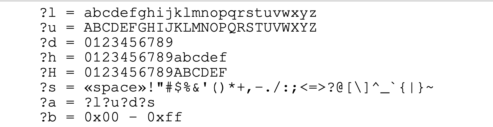

tags:: [[Brute Force]],  [[Dictionary Attack]], [[Hashing]],

- ## Hash Type `-m`
	- `-m 0` => MD5
	- `-m 900`=> MD4
	- `-m 1400` => SHA256
	- `-m 1750` => sha512
	- `-m 11300` => bitcoin
- ## Attack Mode `-a`
	- `-a 0` => Dictionary #[[Dictionary Attack]]
	- `-a 3` => Mask-Attack #[[Brute Force]]
	- `-a 6`=> Hybrid
- ## Hashcat
	- **Show cracked**: `hashcat --show HASHTYPE FILE` => `hashcat --show -m 0 root.txt`
	- **Crack:**
		- `hashcat -a ATKMOD -m HASHTYP FILE CHARMSK [--increment]`
		- `hashcat -a ATKMOD -m HASHTYP FILE -1 CHARMSK ?1[?1]... [--increment]`
-
- ## Built-in charsets
	- 
-
- ## Cracking with Brute Force
	- ### Example
		- **Crack**
			- ```bash
			  hashcat -m 0 -a 3 geheim.txt ?l?l?l?l --force
			  ```
			- **`-m 0`** → Sets the **hash type** to **MD5**.
			- **`-a 3`** → Activates the **Mask Attack mode** (brute force using patterns).
			- **`geheim.txt`** → The **file containing the MD5 hash values**.
			- **`?l?l?l?l`** → The **mask** (defines which passwords to try), `?l` → Lowercase letter (`a-z`).
			- Since it appears **four times**, it tests **all 4-letter lowercase passwords** (e.g., `abcd`, `zxyw`).
			- **`--force`** → Forces Hashcat to run **even if the GPU drivers are not perfectly optimized**.
	- ### Mask Key Character
		- These pattern in **Hashcat** represents a **mask** used in brute-force attacks. Each `?` followed by a letter is a **placeholder** that defines the type of character Hashcat should try.
		- | Mask 	|                      Meaning                     	| Example 	|
		  | ?d   	| Digit (0-9)                                      	| 123456  	|
		  | ?l   	| Lowercase letter (a-z)                           	| abcxyz  	|
		  | ?u   	| Uppercase letter (A-Z)                           	| HELLO   	|
		  | ?a   	| Any printable character (a-z, A-Z, 0-9, symbols) 	| @bC9$!  	|
		  | ?s   	| Special characters (!@#$%^&*()_+)                	| @#!$%   	|
-
- ## Cracking with Ditionary Attack
	- ### Installation der RockYou-Wordlist
		- `wget https://github.com/danielmiessler/SecLists/raw/master/Passwords/Leaked-Databases/rockyou.txt.tar.gz`
		- **Entpacken**: `tar -xvzf rockyou.txt.tar.gz`
	- ### Example :
		- ```bash
		  hashcat -m 0 -a 0 md5_8_smallletters.txt rockyou.txt --force
		  ```