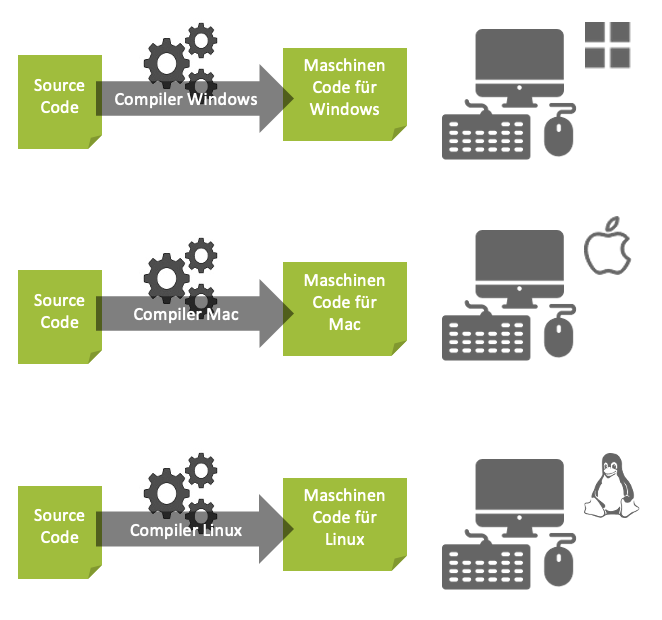
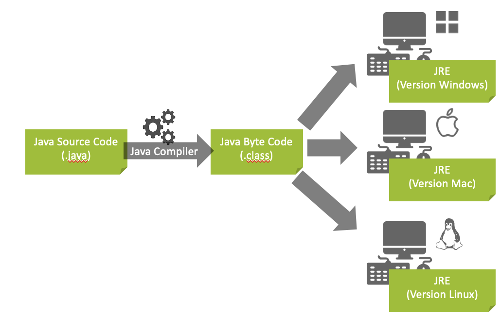

- #Java
	- # Was macht ein Compiler?
		- **Compiler**: Übersetzt Source Code in Maschinen Code
		- **Maschinen Code **kann von einem Computer ausgeführt werden (1 und 0)
		- Jeder Rechnertyp bzw. Prozessortyp verfügt über seinen eigenen Befehlssatz von
		  Maschinen Code
		- 
		- ## Problem
		  collapsed:: true
			- Jeder Rechnertyp hat seinen eigenen Maschinen Code:
			- „Dein Code muss für jeden Rechnertyp separat kompiliert werden!
			- 
				-
		- ## Lösung
		  collapsed:: true
			- JVE - Java Runtime Environment (Laufzeitumgebung)
			- Source Code **(.java)** wird zu **Java Byte Code (.class)** kompiliert
			- Zur **Laufzeit** (Ausführzeit) übersetzt das **JRE** den Java Byte Code zu Rechnertyp spezifischem Maschinen Code
			- Für jeden Rechnertyp existiert eine eigene JRE
			- 
-
	- # Installation
		-