- #BBC
- [[node.js]]
- # Syntax
  collapsed:: true
	- Eingebettet im HTML
	  collapsed:: true
		- ```jsx
		  <script>… </script>
		  ```
	- Ähnliche Syntax wie Java
	- Schwach typisiert (Keine Angaben von Datentypen im Code)
	- Semikolons sind optional
	- 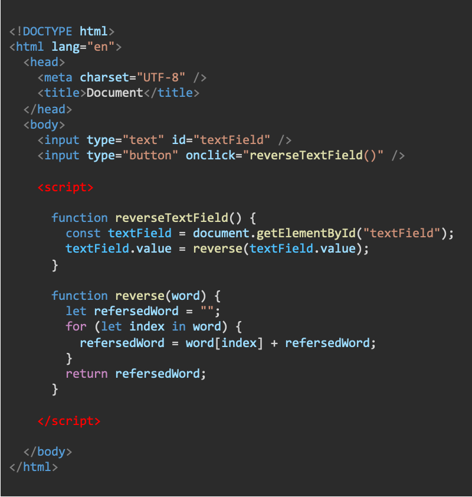
	- ## Variablen
	  collapsed:: true
		- “**let**“ deklariert eine Variable
		- “**const**“ deklariert eine Konstante
		- “**var**“ deklariert globale Variablen und sollte nicht mehr verwendet werden
		- Variable ohne Zuweisung sind ‘**’undefined**’’
		- Falls möglich verwende “**const**“, sonst “**let**“
		- 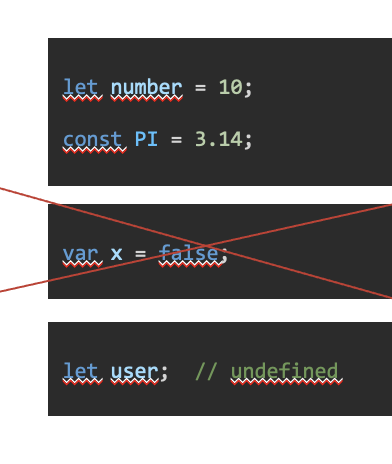
	- ## Die wichtigsten Datentypen
		- Einfacher als bei Java
		- Es wird nicht zwischen Integer und Double unterschieden
		- 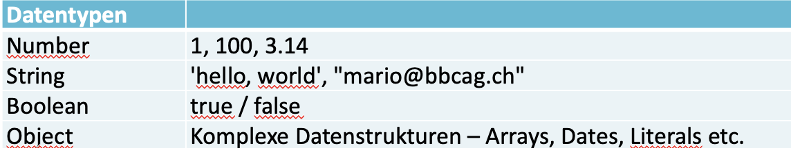
		- ### String
		  collapsed:: true
			- ```jsx
			  
			  let text = "John";                 // Datentyp: String
			  let text2 = text + " " + "Doe";
			  let text3 = `Hey ${text}`;	// Template String
			  let text4 = `overlay ${menu.isOpen ? "" : "hidden"}`;
			  let char = text[0]                 
			  let size = text.length;       
			  // Datentyp: Number
			  text = text.substring(2, 2) 
			  text = text.toUpperCase();
			  text = text.replace("John", "Sam");
			  
			  
			  ```
	- ## Steuerlogik
	  collapsed:: true
		- ```jsx
		  
		  if (bedingung) {
		    anweisungen;
		  } else if (bedingung) {
		    anweisungen;
		  } else {
		    anweisungen;
		  }
		  
		  ```
		- ```jsx
		  switch (variable) {
		    case wert1:
		      anweisungen;
		      break;
		    case wert2:
		      anweisungen;
		      break;
		    default:
		      anweisungen;
		  }
		  ```
		- ```jsx
		  while (bedingung) {
		    anweisungen;
		    break;
		    continue;
		  }
		  do {
		    anweisungen;
		  } while (bedingung);
		  
		  ```
		- ```jsx
		  for (let schritt = 0; schritt < 5; schritt++) {
		    anweisungen;
		  }
		  ```
		- ```jsx
		  try {
		    anweisungen;
		  } catch (exception) {
		    anweisungen;
		  } finally {
		    anweisungen;
		  }
		  throw new Error("...");
		  
		  
		  ```
	- ## Vergleichsoperatoren
	  collapsed:: true
		- Vergleiche immer mit ===
		- == vergleicht nur den Wert
		- === vergleicht den Wert und den Typ
		- ```jsx
		  let x = 10;
		  let y = "10"
		  if (x == y) { /* x ist hier gleich wie y */ }
		  if (x === y) { /* x ist hier nicht gleich wie y */ }
		  if (x != y) { }
		  if (x !== y) { }
		  
		  ```
		-
	- ## Array
	  collapsed:: true
		- ```jsx
		  
		  const cars = ["Saab", "Volvo", "BMW"];
		  cars[0] = "Audi";
		  let myCar = cars[2];
		  
		  let size = cars.length;
		  
		  cars.push("Audi"); 	// Fügt ein Element hinzu
		  let car = cars.pop(); 	// Löscht das letzte Element
		  for (let x of cars) {
		    text += x;
		  }
		  
		  cars.forEach(car => {
		    text += `<p>${car}</p>`;
		  });
		  
		  
		  ```
	- ## Klassen
	  collapsed:: true
		- JS kennt Klassen ähnlich wie Java.
		- Verwende wenn möglich **keine Klassen**, sondern **JS Objekte!**
		- ```jsx
		  
		  class Car {
		    constructor(brand) {
		      this.carname = brand;
		    }
		    present() {
		      return 'I have a ' + this.carname;
		    }
		  }
		  class Model extends Car {
		    constructor(brand, mod) {
		      super(brand);
		      this.model = mod;
		    }
		    show() {
		      return this.present() + ', it is a ' + this.model;
		    }
		  }
		  
		  mycar = new Model("Ford", "Mustang");
		  mycar.present();
		  
		  
		  ```
	- ## JS Objekt
	  collapsed:: true
		- Entspricht dem Objekt bei Java
		- Assoziatives Array (Key-Value Pairs)
		- Kapselt Daten, manchmal auch Verhalten
		- JS Objekte sind viel flexibler
		- ```jsx
		        
		    const ronald = {
		        vorname: "Ronald",
		        nachname: "Reagan",
		        männlich: true,
		        AnzahlKinder: 3,
		        Geburtsdatum: "1911-02-06",
		        Partei:
		        {
		          Name: "Republican Party",
		          Hauptsitz: "Washington, D.C.",
		          Gründungsdatum: "1854-03-20",
		          Gründungsort: "Ripon"
		        },
		        Amt: "US-Präsident"
		      };
		  
		  
		  ```
		- JS Objekte sind **dynamisch** typisiert. Attribute und Methoden können jederzeit hinzugefügt werden.
			- ```jsx
			  //beispiel1
			  const user = {
			  
			    name: "Mario",
			    login: "admin",
			     
			    getName() {
			        return this.name
			    }
			  }
			  let userName = user.name;
			  let userName = user["name"];
			  let userName = user.getName();
			  
			  
			  //beispiel2
			  user.password = "1234";
			  let userPassword = user.password;
			  user.setName = function(newName) {
			    this.name = newName;
			  }
			  user.setName("Luigi");
			  
			  
			  ```
			- Der Code zeigt, wie man bei Js Object Literals nach der Erstellung Attribute und
			  Funktionen dynamisch hinzufügen kann.
			- Das „this“-Keyword innerhalb eines Js Object Literals zeigt, wie bei Java auf die
			  Instanz.
			-
- # JS im Browser
  collapsed:: true
	- https://developer.mozilla.org/en/
	- JS wird vom Browser ausgeführt
		- beim Laden von [[<script>]] tags in [[HTML]]
		- beim Laden von externen JS-Dateien
		- bei Browserevents (Maus, Tastatur, Touch,...)
	- ## Globaler Kontext
		- 1 Browser Tab = 1 **Window Objek**t im Browserspeicher
		- F5 erstellt das **Window Objek**t neu
		- ```
		  console.log("AHA!");
		  alert("Hallo Javascript");
		  setTimeout(/* … */);
		  setInterval(/* … */);
		  fetch(/* … */); // wird morgen relevantlocation.replace("/index.html"); // Browser springt zu index.html
		  history.back(); // Springe zur letzten Seite
		  history.forward() // Springe wieder zur aktuellen Seite
		  navigator.language; // "de-DE" Sprache des Browsers
		  
		  // "document" zeigt auf den DOM -> nächste Folie …
		  document.getElementById("button"); 
		  ```
	- ## DOM (Document Object Model)
	  collapsed:: true
		- bezeichnet die HTML Baustruktur
		- document beitet Zugriff auf das DOM
		- HTML und CSS können beliebig verändert werden
		- 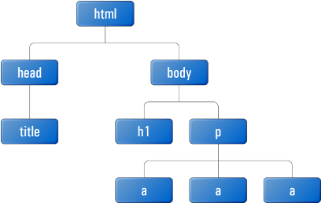
		-
	- ## Die wichtigsten Attribute aller HTML Elemente
	  collapsed:: true
		- ```jsx
		  
		  const htmlElement = document.getElementById("myBtton"); 
		    
		  // Element verändern
		  htmlElement.innerText = "Code zwischen Start- und Endtag ersetzen";
		  htmlElement.append("<h1>Neu</h1>");
		  // Arbeiten mit CSS Styles
		  htmlElement.style = "background-color: #4CAF50; border: none; color: white;";
		  htmlElement.style.visibility = "hidden"; visible | hidden | collapse
		  // Best Practice: Arbeite mit CSS Class und setze Attribute nicht direkt!
		  htmlElement.classList.add("red");
		  htmlElement.classList.remove("red");
		  htmlElement.classList.toggle("red");
		  htmlElement.addEventListener("click", () => {});
		  
		  
		  ```
	- ## Weitere Zugriffsmethoden
	  collapsed:: true
		- **querySelector()** und **querySelectorAll()** erhalten als Argument eine CSS-Selektor-String.
		- ```jsx
		        
		  document.querySelector("input"); // das erste HtmlInputElement
		  document.querySelectorAll("#container.item"); 
		  
		  document.getElementById("id");
		  document.getElementsByName("name");
		  document.getElementsByClassName("class");
		  
		  ```
		- document repäsentiert das DOM
		- this.document liegt im Window Objekt
		- Der Code zeigt mögliche Zugriffsmethoden auf den DOM
		- querySelector() und querySelectorAll() sind neuer, besser Typisierten und am flexibelsten
		-
	- ## Events
		- EventListener und Events sind ähnlich wie in JAVA
		- Es existieren viele unterschiedliche Events
		- Unterschiedliche HTML Elemente haben unterschiedliche Events
		- 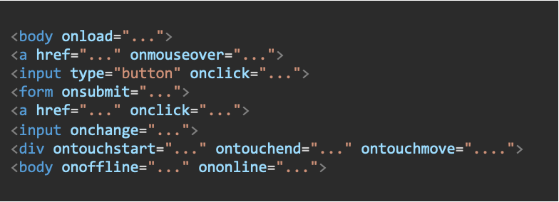
		- Du hast unterschiedliche Möglichkeiten eine EventListener zu registrieren.
		- Meist möchtest du dabei kein JS in deinen HTML Files.
		- 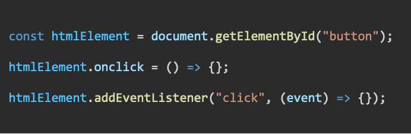
		-
- # Kommunikation mit dem Webserver
  collapsed:: true
	- ## Der Begriff Webserver
	  collapsed:: true
		- Liefert Dokumente an Clients aus
			- HTML-Seiten an unseren Browser
			- Dasselbe mit CSS, JavaScript, JSON und Bilder
		- Andere Funktionen
			- Zugriffbeschränkungen (intern, extern)
			- Sicherheit (HTTPS)
			- Logs
			- Caching
	- ## Verarbeiten einer Anfrage
	  collapsed:: true
		- 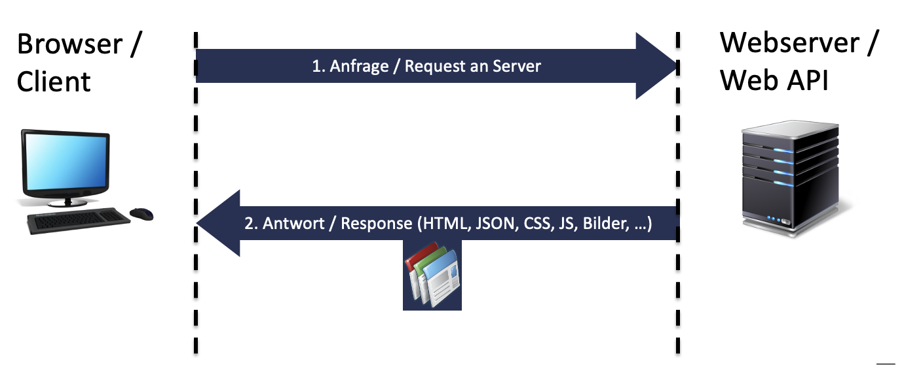
			-
	- ## HTML Link
	  collapsed:: true
		- Browser lädt eine Seite vom Webserver
		- Per HTTP-GET
		- Ganze Seite wir neu geladen (neuer DOM wird erstellt)
		- 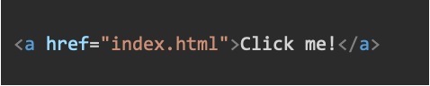
		- 
			-
	- ## HTML Formulare
	  collapsed:: true
		- Browser lädt eine Seite vom Webserver
		- Benutzereingaben werden als Key/Value Pairs mitgesendet
		- Ganze Seite wir neu geladen
		- *method* = GET oder POST (GET ist Default)
		- *action* = URL des Request Empfängers
		- 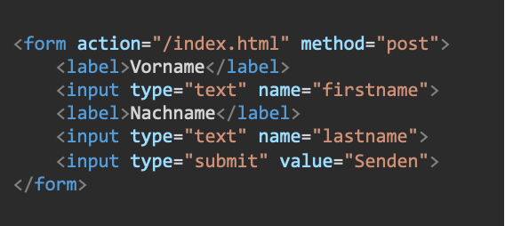
		-
	- ## Fetch API
	  collapsed:: true
		- await fetch(url) ;
		- Laden von Serverresourcen mittels JS (JSON, HTML, Bilder, …)  Typischste Anwendung: CRUD Operationen bei einer Rest-API
		- Nur Teile einer Seite können neu geladen werden. Bessere UX!
		- 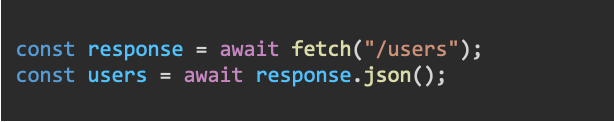
		- ### Read
			- 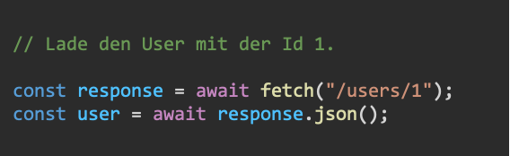
			- 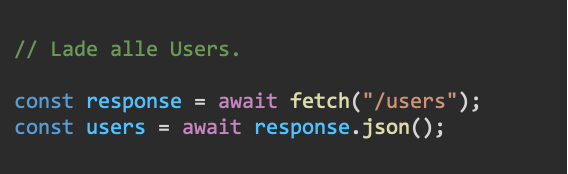
		- ### Create
			- 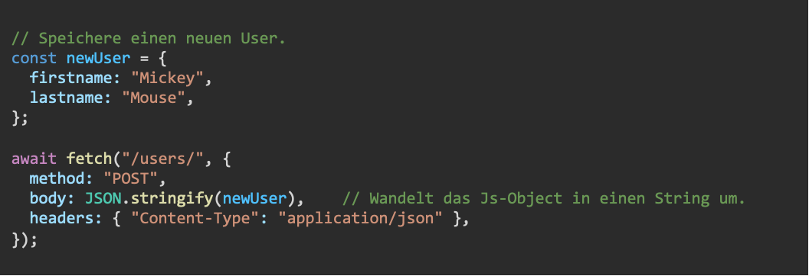
		- ### Update und Delete
			- 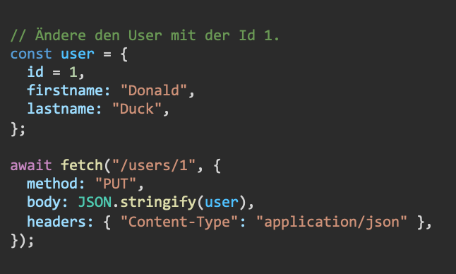
			- 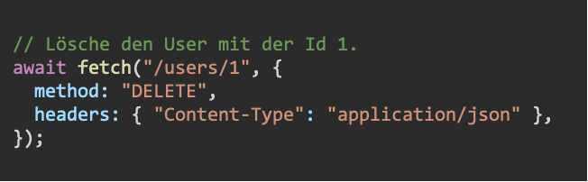
		-
	- ## Asynchrone Methoden
	  collapsed:: true
		- **await** darf nur in asynchronen Funktionen verwendet werden
		- Asynchrone Funktionen sind mit dem Keyword **async** markiert.
		- 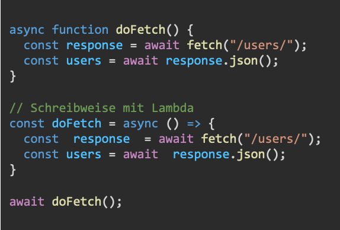
		-
- # Promise, await und async
  collapsed:: true
	- ## Was ist ein Callback-Funktion?
		- Eine **Callback-Funktion** ist eine Funktion, welche als Argument übergeben wird.
		- Beispiel:
			- *setTimeout() *startet eine **Callback-Funktion** nach 10 Millisekunden
			- 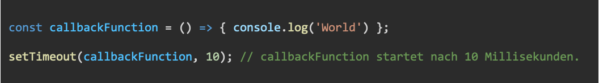
	- ## Threads bei JS
	  collapsed:: true
		- JS läuft standardmässig auf dem UI Thread
		- UI Thread blockiert === Browser eingefroren
		- Langanhaltende Tasks **müssen** asynchron ausgeführt werden
		- «asynchron» im Sinne von parallel, auf einem weiteren Thread
		- 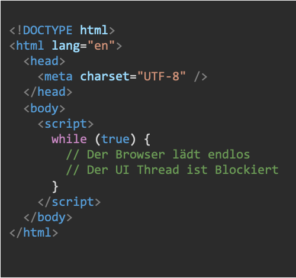
			- Der Code zeigt, wie mit einer Endlosschleife der Browser eingefroren wird.
			-
	- ## Asynchron Funktionen
	  collapsed:: true
		- Eine **asynchrone Funktionen** wird auf einem eigenen Threads ausgeführt.
			- 1. Start asynchrone Funktion 1
			- 2. Start asynchrone Funktion 2
			- 3. Asynchrone Funktion 1 wird ausgeführt
			- 4. Asynchrone Funktion 2 wird ausgeführt
			- 5. Asynchrone Funktion 1 ist fertig
			- 6. Asynchrone Funktion 2 ist fertig
			- 7.…
		- 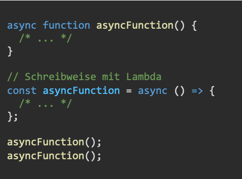
			- Eine Funktion bei JS wird durch das Keyword «async» zu einer asynchronen Funktion.
			- Der Code zeigt zwei Schreibweise einer asynchronen Funktion.
	- ## Promise
		- Asynchrone Funktionen geben ein **Promise****<T>** zurück. Dies ist ein Platzhalter für ein Versprechen, dass vielleicht erfüllt wird, vielleicht aber auch nicht.
		- Erläuterung zu Promise: https://www.w3schools.com/js/js_promise.asp
		- Erläuterung zu fetch(): https://developer.mozilla.org/en-US/docs/Web/API/fetch
		- 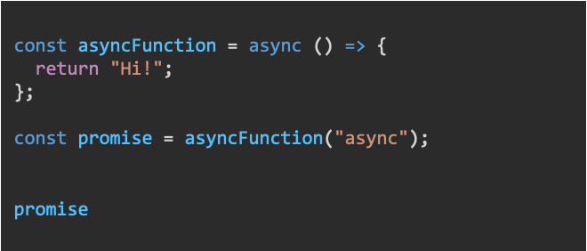
		- *promise.then**(**thenCallback**) : **Promise**<T>*
		- *promise.catch**(**catchCallback**) : **Promise**<T>*
		- *thenCallback* wird mit dem Resultat aufgerufen, falls der Code ohne Exception durchgelaufen ist.
		- *catchCallback* im Falle einer Exception.
		- 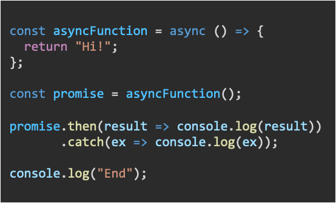
			- Ein Promise Objekt kennt zwei Methoden, then() und catch().  Beide Methoden geben jeweils wieder ein Promise Objekt zurück, dadurch können die Aufrufe aneinandergereiht werden.
			- Then() nimmt als Argument eine Callback-Funktion entgegen, welche im Erfolgsfall mit
			  dem Resultat der asynchronen Funktion aufgerufen wird.
			- Catch() nimmt als Argument eine Callback-Funktion entgegen, welche im Exceptionfall mit der Excption der asynchronen Funktion aufgerufen wird.