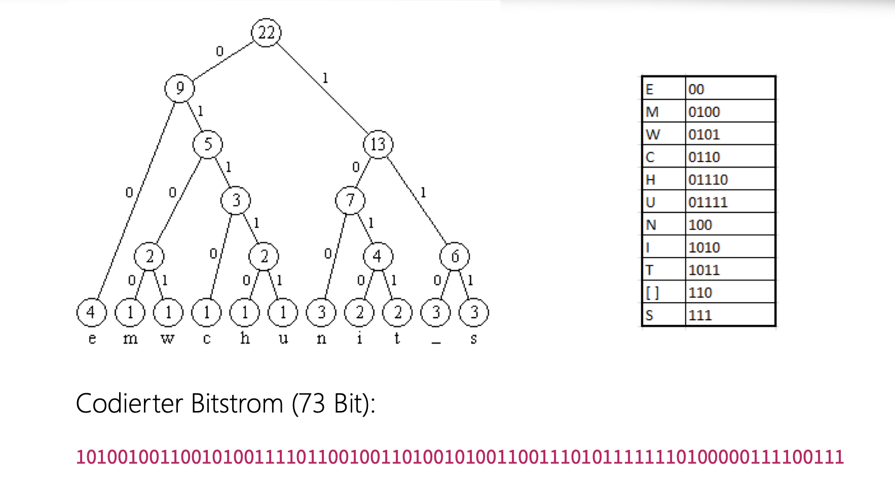
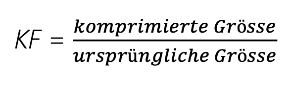
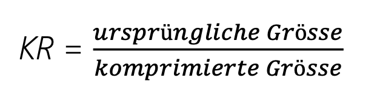

- #[[Speicherplatz als rares Gut]] #[[Modul 114]]
- # Definition
	- Die Datenkompression oder Datemkomprimierung ist ein Vorgang, bei dem die Menge digitaler daten reduziert wird.
	- Ziele sind:
		- Speicherplatz einsparen
		- Übertragungszeit wird kurzer
	- ### Verlustfreie Kompression
		- Es werden **Redundanzen** ausgenutzt, es geht keine Information verloren
	- ### Verlustbehaftete Kompression
		- Es wird **irrelevante Information** weggelassen (wie z.B Bild-, Ton- und Videosübertragung)
# Huffman Codierung
	- Mit dem Huffman-Algorithmus wird ein Code generiert , welcher für den vorliegenden Text optimal gestaltet ist
		- Häufige Zeichen → kürzester Code
		- Seltene Zeichen → längerer Code
		- Aus allen Zeichen-Codes wird ein eindeutiger Bitstrom (keine Trennzeichen),
		  d.h. **präfix-frei**
		- Liefert einen von meist mehreren optimalen Codes
	- ## Anleitung zur Codierung
		- Bsp: IM WESTEN NICHT NEUES
			- id:: 64031b64-334f-4edf-884c-5aa39fdd2be2
			  1. Jedes vorkommende Zeichen unten aufschreiben
			  2. Die Häufigkeit jedes Zeichen aufzählen .
			  3. Verbinde die beiden tiefsten (freien) Häufigkeitswerte 
			  4. Wiederhole Schritt 3 bis Du den Stammknoten gebildet hast (Totalsumme)
			  5. Schreibe unter jeden Knoten jeweils eine Null und eine Eins zur Identifikation der Verzweigungen.
			  6. Den Binärcode jedes Zeichens vom Stammknoten her ablesen.
			- 
- # Kompressionsfaktor und Kompressionsrate
	- ## Kompressionsfaktor:
		- Die Grösse, wenn wir das Resultat unserer Huffman-Codierung mit dem Originaltext in Unicode vergleichen.
		- **Formel**
			- 
	- ## Kompressionsrate
		- Ist der Kehrwert des Kompressionsfaktors
		- **Formel**
			- 
-
	-