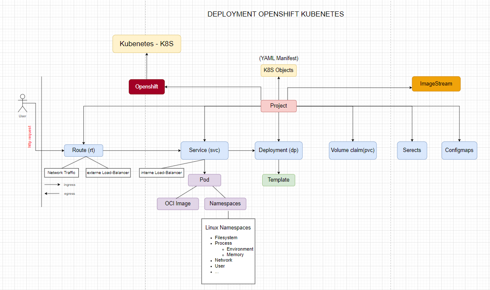

alias:: K8S

- https://kubernetes.io/
- open-source system for automating deployment, scaling, and management of containerized applications.
-
- 
- ## Container Image
	- Created by using [[Podman]]
- ## Manifest
	- create with [[yaml]] files
	- ## ImageStream
		- is used to manage container images #Podman
		- tag a locally built container image
			- `podman tag localhost/time-svc:latest default-route-openshift-image-registry.apps.ipip-ocp.ipip.ch/test-qai-hello-openshift/time-svc:latest`
	- ## Deployment (dp)
		- A resource object used to manage the deployment and scaling of a set of replica Pods.
		- Deployments provide a declarative way to define and update the desired state of an application in a Kubernetes cluster.
	- ## Route (rt)
		- a resource used to expose services outside of the cluster, making them accessible from external networks, such as the internet.
	- ## Service (svc)
		- An abstraction that defines a set of Pods and a policy for accessing them.
		- Services enable network communication between different parts of your application, both within the cluster and from external sources.
		- They act as a stable endpoint to which other applications or services can connect, regardless of the underlying Pods' dynamic nature.
-
	-