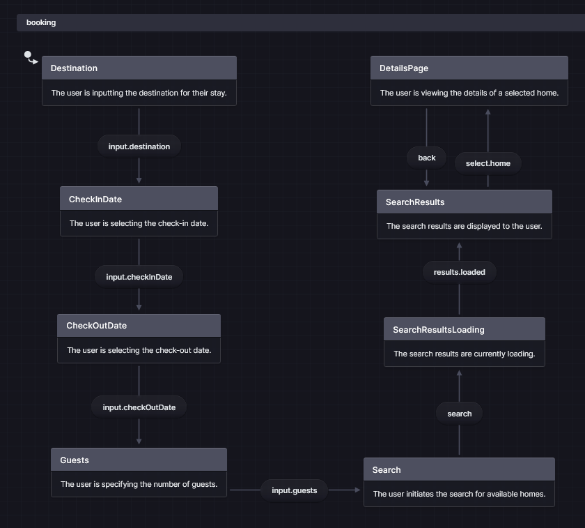

- Are visual tools used in software development and system design to represent different aspects of a system or application. **They help us understand, communicate and plan the structure, behavior and interactions within the systems.**
-
- ## Entity Relationship Diagram (ERD)
  id:: 6899c9af-1166-49ac-9d00-cafc968cd160
	- **Preferred tool**: [DBDiagram](https://dbdiagram.io/)
	- **Purpose:** Shows the data model — how different data entities (like users, orders, products) relate to each other.
	- **Use:** Helps you understand and design the database or data structure.
	- **Example:** A User has many Orders; an Order contains many Products.
	- **Text-based ERD Example:**
		- ```
		  # Booking System Entities
		  
		  ## User
		  - id: string (primary key)
		  - email: string (unique)
		  - name: string
		  - createdAt: datetime
		  
		  ## Flight
		  - id: string (primary key)
		  - airline: string
		  - departure: datetime
		  - arrival: datetime
		  - price: number
		  - availableSeats: number
		  
		  ## Hotel
		  - id: string (primary key)
		  - name: string
		  - location: string
		  - rating: number (1-5)
		  - pricePerNight: number
		  
		  ## Booking
		  - id: string (primary key)
		  - userId: string (foreign key -> User.id)
		  - flightId: string (foreign key -> Flight.id)
		  - hotelId: string (optional, foreign key -> Hotel.id)
		  - status: enum (pending, confirmed, cancelled)
		  - totalPrice: number
		  - createdAt: datetime
		  
		  # Relationships
		  - User has many Bookings (1:n)
		  - Flight has many Bookings (1:n)
		  - Hotel has many Bookings (1:n)
		  - Booking belongs to User, Flight, and optionally Hotel
		  ```
	-
- ## Sequence Diagram
	- **Purpose:** Shows how different parts of the system interact over time, in the order events happen.
	- **Use:** Helps you understand workflows or how functions/methods call each other step-by-step.
	- **Example:** A user logs in → system checks credentials → system responds with success or failure.
	- **Preferred tool**: [Swimlanes](https://swimlanes.io/)
	- **Text-based Sequence Example:**
		- ```
		  # Flight Booking Sequence
		  
		  UI -> flightSearch: searchFlights(criteria)
		  flightSearch -> UI: show flight options
		  
		  UI -> hotelSearch: searchHotels(location, dates)
		  hotelSearch -> UI: show hotel options
		  
		  UI -> api: createBooking(flight, hotel)
		  api -> db: save booking
		  db -> api: booking saved
		  api -> UI: show confirmation
		  ```
-
- ## State Diagram
	- **Preferred tool**: [State.new](https://state.new/)
	- **Purpose:** Shows the different states an object can be in and how it moves between these states.
	- **Use:** Helps you understand object behavior, especially for things that change state (like a shopping cart, order status).
	- **Example:** Order state changes from *Pending* → *Processed* → *Shipped* → *Delivered*.
	- **Text-based State Flow Example:**
		- ```
		  Start with destination
		  When the destination si input, put in the check in date
		  Then put in the checkout date
		  Then add the number of guests
		  And then when the user presses search, it'll take us to a search results page
		  The search results will be loading, and eventually show up
		  The user can click on one of the homes and be taken to a details page
		  They can go back from the details page back to the search page
		  ```
	- 