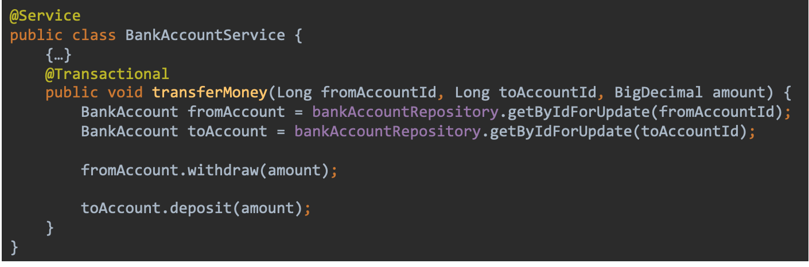
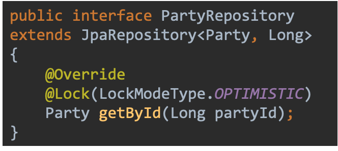
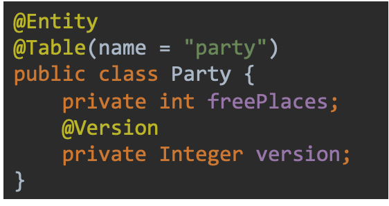
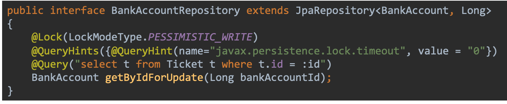

- #BBC
- # Transaktionen
	- ## Spring Boot
		- Transaktion pro Request
		- REQUIRED Propagation (Immer in einer Transaktion ausführen)
		- Best Practice: Selber deklarieren
		- Obwohl Spring für jeden Request standartmässig eine Transaktion startet oder eine bestehende verwendet sollten Methoden oder Services, die in einer Transaktion ausgeführt werden sollen immer explizit mit @Transactional annotiert werden.
		- Dies ermöglicht auch die Steuerung der Propagation und der Isolationslevel und für welche
		  Exceptions ein Rollback gemacht werden soll und für welche nicht.
		- Quelle:
		  https://reachnikhil14.medium.com/using-transactional-with-spring-boot-rest-endpoints-a04d73b6eb0f
		- ## @Transactional
		  collapsed:: true
			- Klassen- oder Methodenebene
			- Startet eine Transaktion
			- Steuerung der Isolationslevel
			- Steuerung des Rollback
			- Beispiel
			- 
				- Die Annotation wird vorzugsweise im Service verwendet, denn dort befindet sich die Businesslogik. Wenn die Transaktion bereits im Controller gestartet wird erhält dieser die Exceptions, die während der Transaktionen auftreten nicht.
		- ## Locking
			- ### Optimistic
				- Geht davon aus, dass es keine Konflikte geben wird
				- Reagiert auf Konflikt mit Rollback
				- Starvation möglich
				- Zusätzliches Versions Feld auf der Entität
					- Numerischer Wert (empfohlen)
					- Timestamp
				- Version wird beim Schreiben inkrementiert
				- Wenn zwischen Lesen und schreiben die Version geändert wurde wird ein Fehler geworfen
				- 
				- 
			- ### Pessimistic
			  collapsed:: true
				- Geht davon aus, dass es zu Konflikten kommt
				- Verhindert Konflikte mit Zugriffssperren
				- Starvation kann verhindert werden
			- ### Pessimistic write
			  collapsed:: true
				- Transaktion zwingend
				- Entität wird beim Lesen gelocked
				- 
					- Wird im Repository verwendet – Eigenes Query, das bei update verwendet wird. Eigentlich ein selectById, hat aber zusätzlich noch das Lock.
					- Mit dem QueryHint kann eingestellt werden, wie lange eine Transaktion wartet, bis sie das Lock erhält oder einen Fehler wirft. Mit 0 wird direkt eine Exception geworfen, wenn der Datensatz gelocked ist.
				-
			- ### Lock Modes
				- OPTIMISTIC -> Optimistischer Read lock
				- OPTIMISTIC_FORCE_INCREMENT -> Optimisischer Read lock, erhöht die Version auch wenn nichts geändert wird
				- NONE
				- PESSIMISTIC_READ -> Datenbank Read lock (Daten können nicht geändert oder gelöscht werden)
				- PESSIMISTIC_WRITE -> Datenbank Write Lock (Daten können nicht mehr gelesen, geändert oder gelöscht werden)
				- PESSIMISTIC_FORCE_INCREMENT -> Daten können nicht geändert oder gelöscht werden. Version wird erhöht
		- ## Rollback
		  collapsed:: true
			- ### Durch Exception Rollback auslösen
				- Rollback bei @Transactional wird bei jeder Exception ausgeführt
				- Z.B. beim Zusammenfügen von existierender und ändernder Instanz mit throw new
				  Exception()
				- Wird im Service gemacht
				- Bei einem update einer Entity wird das existierende und das ändernde Objekt zusammengeführt. Alles was im ändernden nicht vorhanden ist bleibt gleich. Hier kann z.B. geprüft werden, ob eine Anzahl unter 0 fallen würde, wenn die beiden zusammengeführt werden und in diesem Fall kann selber eine Exception
				  geworfen werden, was ein Rollback der Transaktion auslöst.
				-
-