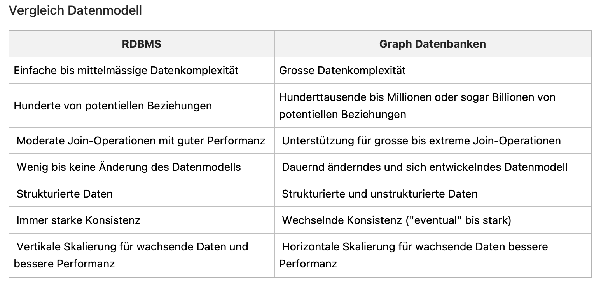

-
- ## Die Unterschiede zwischen RDBMS und Graph Stores?
	- 
	  :LOGBOOK:
	  CLOCK: [2024-02-22 Thu 13:13:23]
	  :END:
	-
- ## Datenmodell
	- {:height 349, :width 643}
- ## Eigenschaften
- ## Neo4j im CAP-Theorem?
	- Neo4j ist wie alle ACID- und SQL-Datenbanken ein CA-System
	- {:height 440, :width 602}
- ## Vor- und Nachteile