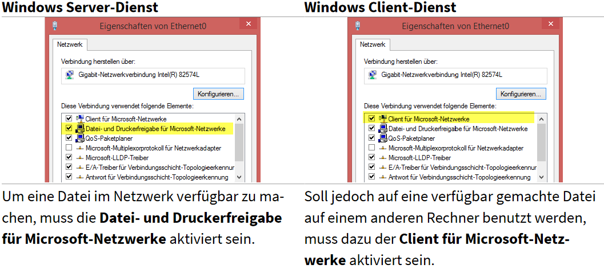

## Definition
collapsed:: true
	- Netzwerke erlauben es den Benutzern, Ressourcen gemeinsam zu verwenden.
	- Der Zugriff auf diese Ressourcen muss gesteuert werden um folgenden geordneten Zugriff sicherzustellen:
		- Eine Ressource muss für autorisierte Benutzer verfügbar gemacht werden.
		- Eine Ressource muss gegenüber nicht autorisierten Benutzern geschützt werden
	- Zu den gebräuchlichsten Netzwerkressourcen gehören Dateisysteme, Drucker und Datenbanken
- ## Dienstkonfiguration
  collapsed:: true
	- Damit Ressourcen in einem Netzwerk verfügbar sind, müssen diese erst mal freigegeben werden
	- Das Protokoll, dass dabei verwendet wird, ist [[SMB]]: Server Message Block
	- ### Windows
	  collapsed:: true
		- 
		-
	- ### Linux
	  collapsed:: true
		- ### Linux Server-Dienst
			- Um für Windows-Rechner Dateien auf einem Linux-Rechner freizugeben, wird das Paket Samba benötigt, welches in der Regel nicht zu der Standardinstallation gehört.
		- ### Linux Client-Dienst
			- Damit ein Linux-Client Windows-Freigaben verfügbar hat, benötigt dieser eine entsprechende Client-Software. Die gehört bei den meisten Linux-Distributionen zur Standardinstallation.
- ## Dateifreigaben
	- ## Anzeigen der aktuellen Netzlaufwerke
		- cmd:  ` net use `
		- ps   :  ` Get-PSDrive `
		-
- ## Dateifreigaben und Berechtigungen
	- Um den Zugriff auf die verschiedenen Ressourcen zu steuern, werden in der Regel Zugriffsrechte beziehungsweise Berechtigungen verwendet.