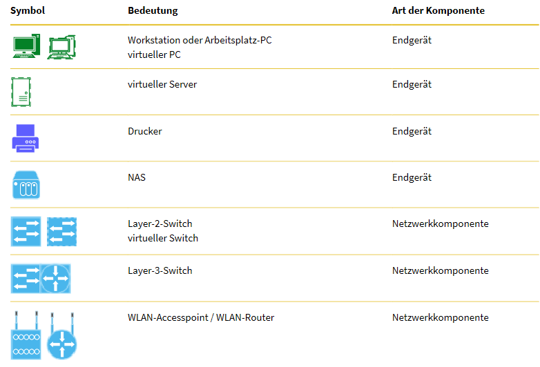
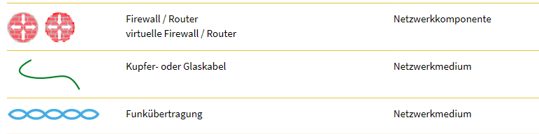

- [[Informatik- und Netzinfrastruktur für ein kleines Unternehmen realisieren]]
- # Definition
	- Das ==logische Netz== zeigt den Datenfluss zwischen den Endgeräten auf
	- Ein logisches Netz kann auch als [[Subnetz]] bezeichnet werden.
	- {{embed [[Subnetz]]}}
- # KOMPONENTEN
	- 
	- 
- # Netzwerk verbinden
	- In einem modernen Netzwerk werden die Endgeräte PC und Drucker innerhalb eines Subnetzes über Netzwerkkomponenten wie Switches und Access-Points miteinander verbunden.
	- Subnetze untereinander werden mit Hilfe von den Netzwerkkomponenten Router und Firewall verbunden.
	- Die heute aktuellen Netzwerkmedien sind [[Funk]], [[Kupferkabel]] und [[Glaskabel]].
- # IP-Adressen
-
-