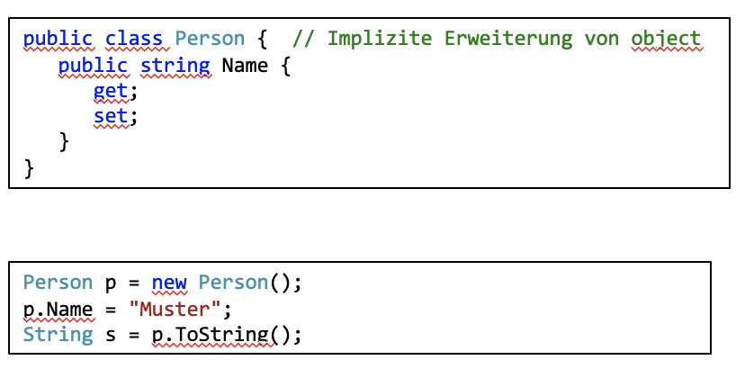
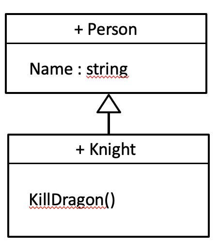
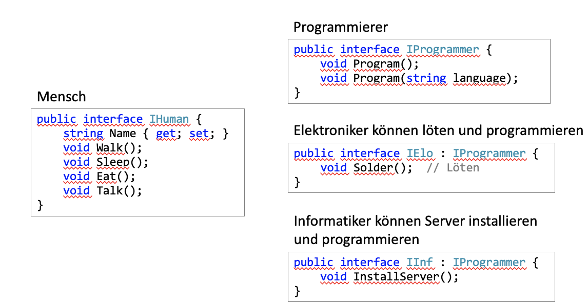

tags:: [[C#]], [[Java]]

- Object-Oriented Programming
- The primary benefits of an object-oriented language are this association between data and functionality in class units and the ability of classes to *encapsulate* or hide details, freeing the developer from worrying about low-level details.
- ## C#
  collapsed:: true
	- ### Access Modifiers
	  collapsed:: true
		- ==public==
		  collapsed:: true
			- Von überall zugreifbar.
		- ==private==
		  collapsed:: true
			- Nur innerhalb der selben Klasse zugreifbar.
		- ==protected==
		  collapsed:: true
			- Nur innerhalb der selben Klasse und Unterklassen zugreifbar.
		- ==internal==
		  collapsed:: true
			- Nurinnerhalb des selben Projektes (Assembly) zugreifbar.
	- ### System.Object als Oberklasse
	  collapsed:: true
		- Beispiel: Klasse *Person* abgeleitet von *System.Object*
		- {:height 500, :width 600}
		- 
	- ### Eigene Oberklasse
		- Beispiel: Klasse *Ritter* abgeleitet von *Person*
		  collapsed:: true
			- {:height 500, :width 600}
			- {:height 250, :width 200}
		- #### Schlüsselwort base
		  collapsed:: true
			- Auch **base** ist eine Referenz so wie **this**
			- Für Zugriff auf Methoden und Instanzvariablen, die in einer Oberklasse definiert sind
			- Private Attribute und Methoden einer Oberklasse können vom Code der Unterklasse **nicht** angesprochen werden
			- Falls Unterklasse keine gleichbenannten Attribute oder Methoden wie ihre Oberklasse
			  besitzt, ist das Schlüsselwort **base** implizit
		- #### Überschreiben
		  collapsed:: true
			- 
		- #### Überladen
		  collapsed:: true
			- ```c#
			  public class Inf {
			  
			      public string Name { get; set; }
			  
			      public void Program() {
			          Console.WriteLine("'{0}' is programming.", Name);
			      }
			  
			      public void Program(string language) {
			          Console.WriteLine("'{0}' is programming in {1}.", Name, language);
			      }
			  
			  }
			  
			  ```
		- #### Abstrakte Klassen
		  collapsed:: true
			- Abstrakte Klassen können nicht direkt instanziiert werden.
			- 
			- ```c#
			  public abstract class AbstractHuman {
			          
			      public string Name { get; set; }
			  
			      public virtual void Walk() {
			          Console.WriteLine("Human with name '{0}' is walking.", Name);    
			      }
			  
			      public virtual void Sleep() {
			          Console.WriteLine("Human with name '{0}' is sleeping.", Name);    
			      }
			  
			      public virtual void Eat() {
			          Console.WriteLine("Human with name '{0}' is eating.", Name);    
			      }
			  }
			  
			  ```
				- Diese abstrakte Klasse implementiert das Grundverhalten eines Menschen.
		- #### Abstrakte Methoden
		  collapsed:: true
			- ```c#
			  public abstract class AbstractHuman {
			          
			      public string Name { get; set; }
			  
			      public virtual void Walk() {
			          Console.WriteLine("Human with name '{0}' is walking.", Name);    
			      }
			  
			      public virtual void Sleep() {
			          Console.WriteLine("Human with name '{0}' is sleeping.", Name);    
			      }
			  
			      public virtual void Eat() {
			          Console.WriteLine("Human with name '{0}' is eating.", Name);    
			      }
			  
			      public abstract void Talk();
			  }
			  
			  ```
			- Talk() muss von der Unterklasse implementiert werden.
		- ####  Interfaces definieren
		  collapsed:: true
			- Wenn du dir Klassen als Baupläne von Objekte vorstellst, dann könnte man ein Interface als Bauaufsichtsamt betrachten. Um ein Bauplan für ein Haus zu entwerfen, muss sich ein Architekt an bestimmte Regeln halten, damit das Ergebnis auch als Haus bezeichnet werden kann. Genauso definieren Interfaces Regeln, die für Klassen gelten müssen,
			  damit diese in einer bestimmte Gruppe von Klassen aufgenommen werden können.
			  Sie definieren eine Menge an Methoden, die eine beliebige Klasse bereitstellen
			  muss, um den Schnittstellenvertrag zu erfüllen.
			- 
		- #### Interfaces implementieren
		  collapsed:: true
			- ```c#
			  public abstract class AbstractHuman : IHuman {
			          
			      public string Name { get; set; }
			  
			      public virtual void Walk() {
			          Console.WriteLine("Human with name '{0}' is walking.", Name);    
			      }
			  
			      public virtual void Sleep() {
			          Console.WriteLine("Human with name '{0}' is sleeping.", Name);    
			      }
			  
			      public virtual void Eat() {
			          Console.WriteLine("Human with name '{0}' is eating.", Name);    
			      }
			  
			      public abstract void Talk();
			  }
			  
			  ```
			- 
		- #### Interfaces
		  collapsed:: true
			- ```c#
			  public class Inf : AbstractHuman, IInf {
			  
			      public void Program() {
			          Console.WriteLine("Program");
			      }
			  
			      public void Program(string language) {
			          Console.WriteLine("Program(string language)");
			      }
			  
			      public void InstallServer() {
			          Console.WriteLine("Install Server");
			      }
			  
			      public override void Talk() {
			          Console.WriteLine("Talk");
			      }
			  }
			  
			  ```
			- Hier könnten noch weitere Interfaces hinzugefügt werden (kommagetrennt)
			- Aber Achtung! Nur **eine** Oberklasse ist möglich. Die Oberklasse wird **immer
			  vor **den Interfaces hingeschrieben (AbstrctHuman)
		- #### Polymorphie
		  collapsed:: true
			- 
		- #### Down- oder Upcast ?
		  collapsed:: true
			- Downcast
			- ```c#
			  private void Send_Click(object sender, EventArgs e) {
			     if (sender is Button) {
			        ((Button)sender).Hide();
			     }
			  }
			  ```
- ## Java
	- ### Classes
		- Classes are the fundamental building blocks of most object-oriented languages
		- A *class* is a group of data items with associated functions that can perform operations on that data.
		- data items => variables, function => method
	- ### Constructor
		- A constructor is called to set up a new instance of a class.
		- When a new object is created, Java allocates storage for it, sets instance variables to their default values, and calls the constructor method for the class to do whatever application-level setup is required.