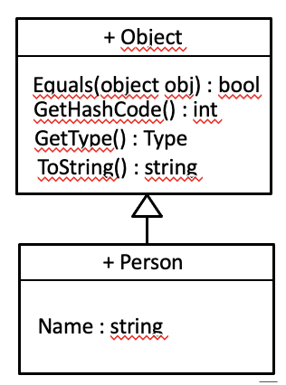
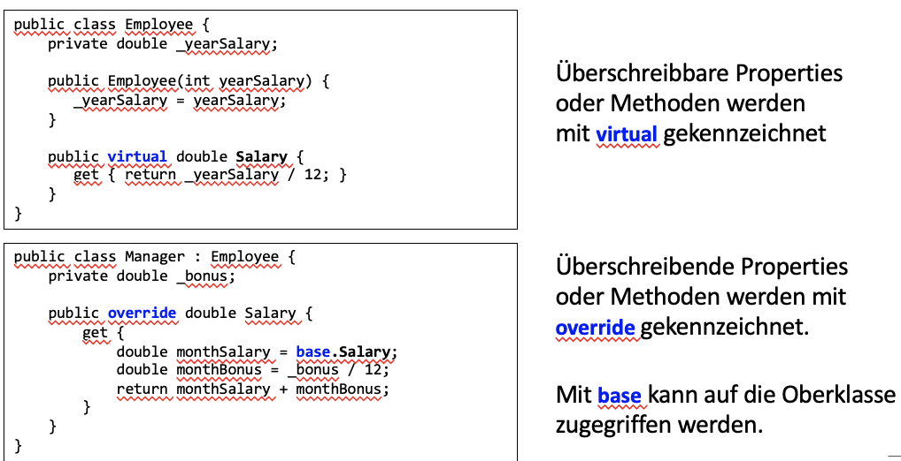
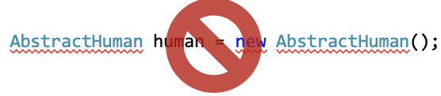
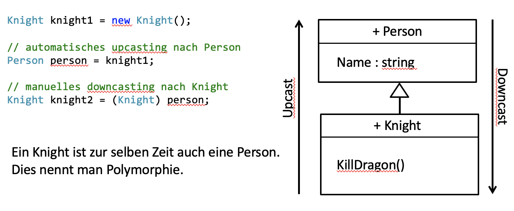

tags:: [[C#]], [[Java]], [[4 Pillars of OOP]]

- Object-Oriented Programming
- The primary benefits of an object-oriented language are this association between data and functionality in class units and the ability of classes to *encapsulate* or hide details, freeing the developer from worrying about low-level details.
  collapsed:: true
- ## C#
  collapsed:: true
	- ### Access Modifiers
	  collapsed:: true
		- ==public==
		  collapsed:: true
			- Von überall zugreifbar.
		- ==private==
		  collapsed:: true
			- Nur innerhalb der selben Klasse zugreifbar.
		- ==protected==
		  collapsed:: true
			- Nur innerhalb der selben Klasse und Unterklassen zugreifbar.
		- ==internal==
		  collapsed:: true
			- Nurinnerhalb des selben Projektes (Assembly) zugreifbar.
	- ### System.Object als Oberklasse
	  collapsed:: true
		- Beispiel: Klasse *Person* abgeleitet von *System.Object*
		- {:height 500, :width 600}
		- 
	- ### Eigene Oberklasse
		- Beispiel: Klasse *Ritter* abgeleitet von *Person*
		  collapsed:: true
			- {:height 500, :width 600}
			- {:height 250, :width 200}
		- #### Schlüsselwort base
		  collapsed:: true
			- Auch **base** ist eine Referenz so wie **this**
			- Für Zugriff auf Methoden und Instanzvariablen, die in einer Oberklasse definiert sind
			- Private Attribute und Methoden einer Oberklasse können vom Code der Unterklasse **nicht** angesprochen werden
			- Falls Unterklasse keine gleichbenannten Attribute oder Methoden wie ihre Oberklasse
			  besitzt, ist das Schlüsselwort **base** implizit
		- #### Überschreiben
		  collapsed:: true
			- 
		- #### Überladen
		  collapsed:: true
			- ```c#
			  public class Inf {
			  
			      public string Name { get; set; }
			  
			      public void Program() {
			          Console.WriteLine("'{0}' is programming.", Name);
			      }
			  
			      public void Program(string language) {
			          Console.WriteLine("'{0}' is programming in {1}.", Name, language);
			      }
			  
			  }
			  
			  ```
		- #### Abstrakte Klassen
		  collapsed:: true
			- Abstrakte Klassen können nicht direkt instanziiert werden.
			- 
			- ```c#
			  public abstract class AbstractHuman {
			          
			      public string Name { get; set; }
			  
			      public virtual void Walk() {
			          Console.WriteLine("Human with name '{0}' is walking.", Name);    
			      }
			  
			      public virtual void Sleep() {
			          Console.WriteLine("Human with name '{0}' is sleeping.", Name);    
			      }
			  
			      public virtual void Eat() {
			          Console.WriteLine("Human with name '{0}' is eating.", Name);    
			      }
			  }
			  
			  ```
				- Diese abstrakte Klasse implementiert das Grundverhalten eines Menschen.
		- #### Abstrakte Methoden
		  collapsed:: true
			- ```c#
			  public abstract class AbstractHuman {
			          
			      public string Name { get; set; }
			  
			      public virtual void Walk() {
			          Console.WriteLine("Human with name '{0}' is walking.", Name);    
			      }
			  
			      public virtual void Sleep() {
			          Console.WriteLine("Human with name '{0}' is sleeping.", Name);    
			      }
			  
			      public virtual void Eat() {
			          Console.WriteLine("Human with name '{0}' is eating.", Name);    
			      }
			  
			      public abstract void Talk();
			  }
			  
			  ```
			- Talk() muss von der Unterklasse implementiert werden.
		- ####  Interfaces definieren
		  collapsed:: true
			- Wenn du dir Klassen als Baupläne von Objekte vorstellst, dann könnte man ein Interface als Bauaufsichtsamt betrachten. Um ein Bauplan für ein Haus zu entwerfen, muss sich ein Architekt an bestimmte Regeln halten, damit das Ergebnis auch als Haus bezeichnet werden kann. Genauso definieren Interfaces Regeln, die für Klassen gelten müssen,
			  damit diese in einer bestimmte Gruppe von Klassen aufgenommen werden können.
			  Sie definieren eine Menge an Methoden, die eine beliebige Klasse bereitstellen
			  muss, um den Schnittstellenvertrag zu erfüllen.
			- 
		- #### Interfaces implementieren
		  collapsed:: true
			- ```c#
			  public abstract class AbstractHuman : IHuman {
			          
			      public string Name { get; set; }
			  
			      public virtual void Walk() {
			          Console.WriteLine("Human with name '{0}' is walking.", Name);    
			      }
			  
			      public virtual void Sleep() {
			          Console.WriteLine("Human with name '{0}' is sleeping.", Name);    
			      }
			  
			      public virtual void Eat() {
			          Console.WriteLine("Human with name '{0}' is eating.", Name);    
			      }
			  
			      public abstract void Talk();
			  }
			  
			  ```
			- 
		- #### Interfaces
		  collapsed:: true
			- ```c#
			  public class Inf : AbstractHuman, IInf {
			  
			      public void Program() {
			          Console.WriteLine("Program");
			      }
			  
			      public void Program(string language) {
			          Console.WriteLine("Program(string language)");
			      }
			  
			      public void InstallServer() {
			          Console.WriteLine("Install Server");
			      }
			  
			      public override void Talk() {
			          Console.WriteLine("Talk");
			      }
			  }
			  
			  ```
			- Hier könnten noch weitere Interfaces hinzugefügt werden (kommagetrennt)
			- Aber Achtung! Nur **eine** Oberklasse ist möglich. Die Oberklasse wird **immer
			  vor **den Interfaces hingeschrieben (AbstrctHuman)
		- #### Polymorphie
		  collapsed:: true
			- 
		- #### Down- oder Upcast ?
		  collapsed:: true
			- Downcast
			- ```c#
			  private void Send_Click(object sender, EventArgs e) {
			     if (sender is Button) {
			        ((Button)sender).Hide();
			     }
			  }
			  ```
- ## Java
	- ### Classes
	  collapsed:: true
		- [Classes and Objects - Fundamentals Of Object-Oriented Programming: Java and IntelliJ [Video]](https://learning.oreilly.com/videos/fundamentals-of-object-oriented/9781837635702/9781837635702-video3_2/) #[[Fundamentals of object-oriented Programming Java]]
		- Classes are the fundamental building blocks of most object-oriented languages
		- A *class* is a group of data items with associated functions that can perform operations on that data.
		- data items => variables, function => method
	- ### Constructor
	  collapsed:: true
		- [Constructors and Access Specifiers (Setters and Getters) - Fundamentals Of Object-Oriented Programming: Java and IntelliJ [Video]](https://learning.oreilly.com/videos/fundamentals-of-object-oriented/9781837635702/9781837635702-video3_3/) #[[Fundamentals of object-oriented Programming Java]]
		- A constructor is called to set up a new instance of a class.
		- When a new object is created, Java allocates storage for it, sets instance variables to their default values, and calls the constructor method for the class to do whatever application-level setup is required.
	- ### Inheritance (Vererbung)
	  collapsed:: true
		- [Inheritance - Fundamentals Of Object-Oriented Programming: Java and IntelliJ [Video]](https://learning.oreilly.com/videos/fundamentals-of-object-oriented/9781837635702/9781837635702-video3_5/) #[[Fundamentals of object-oriented Programming Java]]
		- [Multi-Level Inheritance, Polymorphism - Fundamentals Of Object-Oriented Programming: Java and IntelliJ [Video]](https://learning.oreilly.com/videos/fundamentals-of-object-oriented/9781837635702/9781837635702-video3_6/)
	- ### Abstract Class
	  collapsed:: true
		- [Abstract Class - Fundamentals Of Object-Oriented Programming: Java and IntelliJ [Video]](https://learning.oreilly.com/videos/fundamentals-of-object-oriented/9781837635702/9781837635702-video3_7/) #[[Fundamentals of object-oriented Programming Java]]
		- A class that cannot be instantiated on its own and is typically used as a base or template for other classes.
		- ```java
		  abstract class Shape {
		      // Abstract method (no implementation provided)
		      public abstract double calculateArea();
		  
		      // Concrete method
		      public void displayInfo() {
		          System.out.println("This is a shape.");
		      }
		  }
		  
		  class Circle extends Shape {
		      private double radius;
		  
		      public Circle(double radius) {
		          this.radius = radius;
		      }
		  
		      @Override
		      public double calculateArea() {
		          return Math.PI * radius * radius;
		      }
		  }
		  
		  class Rectangle extends Shape {
		      private double width;
		      private double height;
		  
		      public Rectangle(double width, double height) {
		          this.width = width;
		          this.height = height;
		      }
		  
		      @Override
		      public double calculateArea() {
		          return width * height;
		      }
		  }
		  
		  public class Main {
		      public static void main(String[] args) {
		          Circle circle = new Circle(5.0);
		          Rectangle rectangle = new Rectangle(4.0, 6.0);
		  
		          circle.displayInfo();
		          System.out.println("Circle Area: " + circle.calculateArea());
		  
		          rectangle.displayInfo();
		          System.out.println("Rectangle Area: " + rectangle.calculateArea());
		      }
		  }
		  
		  ```
			- In this example, `Shape` is an abstract class with an abstract method `calculateArea()` and a concrete method `displayInfo()`. The `Circle` and `Rectangle` classes are concrete subclasses that inherit from `Shape` and provide implementations for the abstract method `calculateArea()`. The program demonstrates how polymorphism allows objects of both `Circle` and `Rectangle` to be treated as `Shape` objects.
	- ### Interfaces
	  collapsed:: true
		- [Interfaces - Fundamentals Of Object-Oriented Programming: Java and IntelliJ [Video]](https://learning.oreilly.com/videos/fundamentals-of-object-oriented/9781837635702/9781837635702-video3_8/) #[[Fundamentals of object-oriented Programming Java]]
		- An interface is a construct that defines a contract or a set of rules 
		  that classes must follow.
		- Specifies a list of methods (with their signatures) that classes implementing the interface must provide
		- Unlike **abstract classes**, interfaces do not contain method implementations; they only define method signatures.
		- Classes that implement an interface must provide concrete implementations for all the methods defined in that interface.
		- ```java
		  // Interface definition
		  interface Printable {
		      void print(); // Method signature
		  }
		  
		  // Classes implementing the Printable interface
		  class Document implements Printable {
		      private String content;
		  
		      public Document(String content) {
		          this.content = content;
		      }
		  
		      @Override
		      public void print() {
		          System.out.println(content);
		      }
		  }
		  
		  class Image implements Printable {
		      private String filename;
		  
		      public Image(String filename) {
		          this.filename = filename;
		      }
		  
		      @Override
		      public void print() {
		          System.out.println("Printing image: " + filename);
		      }
		  }
		  
		  public class Main {
		      public static void main(String[] args) {
		          Printable document = new Document("This is a text document.");
		          Printable image = new Image("image.jpg");
		  
		          // Polymorphism: Both Document and Image can be treated as Printable
		          document.print();
		          image.print();
		      }
		  }
		  
		  ```
			- In this example, `Printable` is an interface with a single method `print()`. The `Document` and `Image` classes implement the `Printable` interface by providing concrete implementations for the `print()` method. The `main` method demonstrates how objects of both `Document` and `Image` classes can be treated as `Printable` and invoke the `print()` method polymorphically.
	- ### Const, Enum, Static, Final
	  collapsed:: true
		- [Const, Enum, Static, Final - Fundamentals Of Object-Oriented Programming: Java and IntelliJ [Video]](https://learning.oreilly.com/videos/fundamentals-of-object-oriented/9781837635702/9781837635702-video3_9/) #[[Fundamentals of object-oriented Programming Java]]
		- #### Const
		  collapsed:: true
			- not used for defining constants as it is in some other programming languages.
			- Java uses the `final` keyword to declare constants.
			- ```java
			  public class Constants {
			      public static final int MY_CONSTANT = 42;
			  }
			  ```
		- #### Enum
		  collapsed:: true
			- used to define enumerated types, which are a set of named constant values.
			- Enums are often used to represent a fixed set of related values.
			- ```java
			  public enum DayOfWeek {
			      SUNDAY, MONDAY, TUESDAY, WEDNESDAY, THURSDAY, FRIDAY, SATURDAY
			  }
			  DayOfWeek today = DayOfWeek.MONDAY;
			  ```
		- #### Static
		  collapsed:: true
			- **Static Variables:** It is used to declare class-level variables that are shared among all instances of a class. Static variables are associated with the class rather than individual objects.
			- **Static Methods:** It is used to declare static methods that are associated with the class itself rather than with instances of the class.
			- ```java
			  public class MyClass {
			      static int staticVariable = 10;
			      static void staticMethod() {
			          System.out.println("Static method");
			      }
			  }
			  ```
		- #### Final
			- used to indicate that a variable, method, or class cannot be modified, overridden, or extended, depending on where it is applied.
			- **Final Variable:** A final variable cannot be reassigned once it is initialized.
			  **Final Method:** A final method cannot be overridden by subclasses.
			  **Final Class:** A final class cannot be extended by other classes
			- ```java
			  public class MyClass {
			      final int finalVariable = 42;
			      final void finalMethod() {
			          // This method cannot be overridden.
			      }
			  }
			  final class MyFinalClass {
			      // This class cannot be extended.
			  }
			  ```
	- ### Collections
		- [Collections - Fundamentals Of Object-Oriented Programming: Java and IntelliJ [Video]](https://learning.oreilly.com/videos/fundamentals-of-object-oriented/9781837635702/9781837635702-video3_10/) #[[Fundamentals of object-oriented Programming Java]]
		- a group of related classes and interfaces that provide high-level data structures and algorithms to store, manipulate, and manage groups of objects.