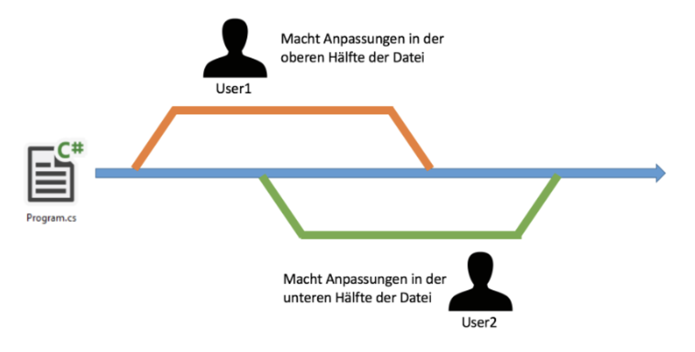

tags:: [[Software mit agilen Methoden entwickeln]], [[Git]]

- ## Versionverwaltung
  collapsed:: true
	- Die Lösung für eine saubere Verwaltung von Dateien und deren Veränderungen
	- ### Mit exklusivem Zugriff
		- Wenn ein Benutzer eine Datei ändern möchte, **check** er sie aus.
		- Das bedeutet, er reserviert die Datei für sich. Während dieser Zeit kann nur dieser Benutzer die Datei bearbeiten. Andere Benutzer können die Datei nur ansehen, aber nicht ändern.
		- Sobald der Benutzer mit den Anpassungen fertig ist, **checkt** er die Datei wieder ein, damit auch andere sie wieder bearbeiten können.
		- Dieser Vorgang, bei dem eine Datei für Änderungen reserviert wird, nennt sich **Sperrung**
		- **Nachteile**
			- **Wartezeiten:** Andere Benutzer müssen warten, bis die Datei wieder freigegeben wird, um sie bearbeiten zu können.
			- **Produktivitätseinbussen:** Arbeitsabläufe können ins Stocken geraten, wenn mehrere Benutzer auf dieselbe Datei zugreifen möchten.
			- **Verwaltungskomplexität:** Es kann schwierig sein, den Überblick über gesperrte Dateien und deren Bearbeitungsstatus zu behalten.
	- ### Versionsverwaltung mit parallelem Zugriff
		- Damit viele Entwickler gleichzeitig effizient arbeiten können, dürfen sie sich nicht durch Sperrungen in die Quere kommen. Damit dies nicht geschieht, müssen mehrere Entwickler parallelen Zugriff auf die gleiche Datei haben.
		- 
		- **Parallel arbeiten:** Zwei Entwickler arbeiten gleichzeitig an derselben Datei. Sie beginnen beide mit der aktuellen Version der Datei.
		- **Eigene Versionen:** Jeder Entwickler erstellt seine eigene Version der Datei mit seinen Änderungen.
		- **Zusammenführen (Merge):** Wenn sie fertig sind, werden die beiden Versionen zu einer einzigen zusammengeführt. Dies nennt man **Merge**. Das Zusammenführen funktioniert nicht immer reibungslos.
		- **Konflikte:** Wenn beide Entwickler denselben Teil des Codes ändern, entsteht ein **Konflikt**. Der Entwickler, der den Konflikt verursacht, muss ihn manuell lösen. Glücklicherweise sind Konflikte selten.
		- **Versionsverwaltung:** Speichern bedeutet hier nicht einfach das Überschreiben der alten Datei. Die aktuelle und die neue Version werden zusammengeführt. Die alte Version wird nicht gelöscht, sondern archiviert.
		- **Repository:** Ein System, das all diese Funktionen bietet, nennt man **Repository**.
-