- #Frontend #BBC
- A JavaScript library for building user interfaces
- Mit JavaScript und JSX werden **Components** definiert
- Aufruf wie HTML-Tags!
- Applikationen und Elemente bestehen aus verschachtelten Components
- https://reactjs.org/
- Tutorial: https://beta.reactjs.org/learn
- ## Component
  collapsed:: true
	- (React) Apps bestehen aus Components
	- Ein Component ist ein Teil des UI (Benutzeroberfläche), der über eine eigene Logik und ein
	  eigenes Erscheinungsbild verfügt
	- Eine Komponente kann so klein wie eine Schaltfläche oder so gross wie eine ganze Seite sein.
	- 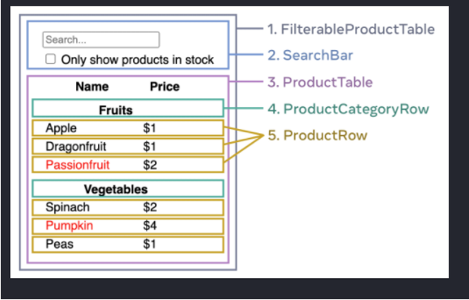
	- 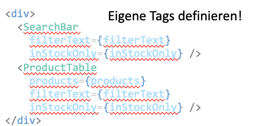{:height 256, :width 510}
	- ## react.js
		- [https://reactjs.org/](https://reactjs.org/)
		- Library, um UI Components zu entwickeln
		- Arbeitet mit JSX: “HTML in JS”
		- Component: “Eigene HTML-Tags” mit innerem Zustand
		- UIs werden aus verschachtelten Components gebaut
		- 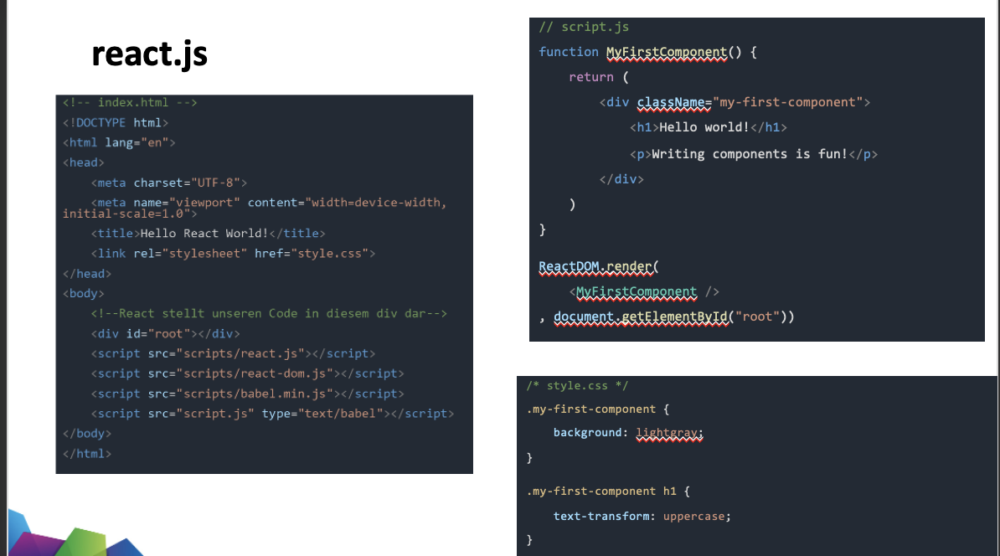
	- ## next.js
		- https://nextjs.org/
		- Filebasiertes Routing
		- Server Side Rendering
		- Entwicklungsserver (Livereload)
		- Bietet die Möglichkeit, Seiten statisch zu generieren und erst wenn nötig, nur zu generieren:
		  Incremental Static Regeneration
		- 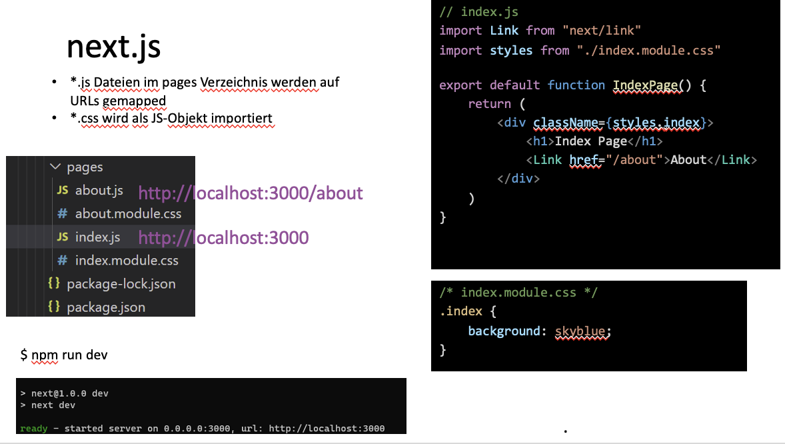
	- ## Links
		- [https://nodejs.org/en/](https://nodejs.org/en/)
		- [https://reactjs.org/](https://reactjs.org/)
		- [https://beta.reactjs.org/learn](https://beta.reactjs.org/learn)
		- [https://nextjs.org](https://nextjs.org/)
	- ## Header
		- {:height 341, :width 749}
		- Um den gleichen HTML Code (Beispielsweise deinen HTML Header) auf mehreren Seiten
		  wieder verwenden zu können, kannst ihn in weitere Componenten auslagern.
		- Du hast im Auftrag bereits einen Component kennen gelernt: Link
		- Components **müssen immer gross geschrieben** sein!
		- ### Aufruf
			- 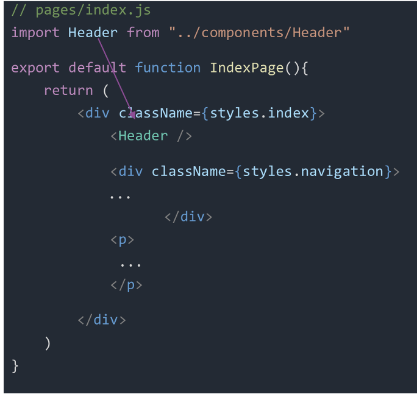
			- Wir können unsere Components wie HTML-Tags aufrufen und diese wiederverwenden
			- Wir machen nun das Gleiche für die Navigation
	- ## Navigation
		- 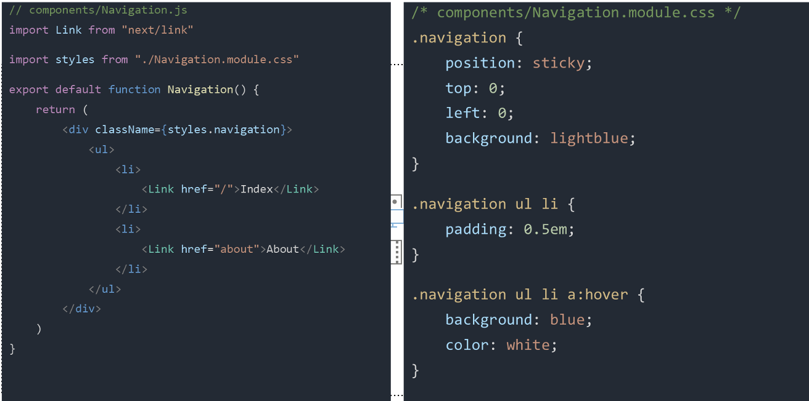
	- ## Header und Navigation
		- 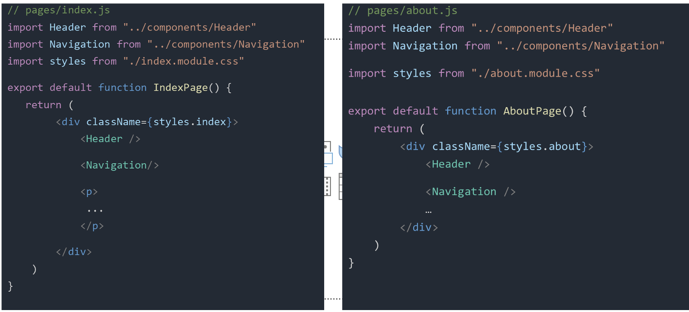
		-
	- ## Props
		- Da Components einfach JS-Funktionen sind, können wir ihnen auch Argumente in Form eines JS-Objektes übergeben: Dieses Objekt nennt man Props.
		- 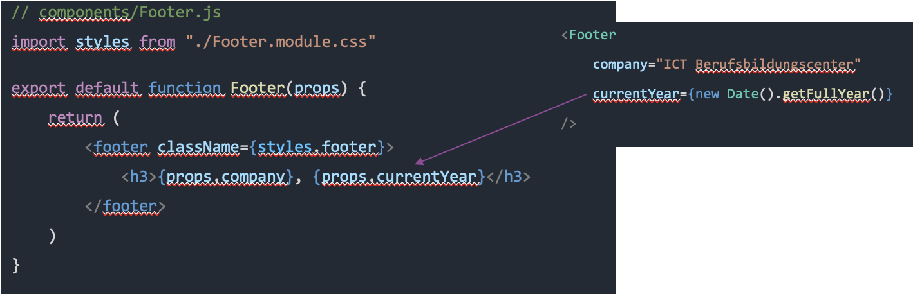{:height 250, :width 749}
		- Das heisst: jeden Wert, den wir unserem Component per Attribut übergeben, finden wir untern demselben Attributnamen im Props-Objekt!
		- ### Arrays und die map Funktion
			- 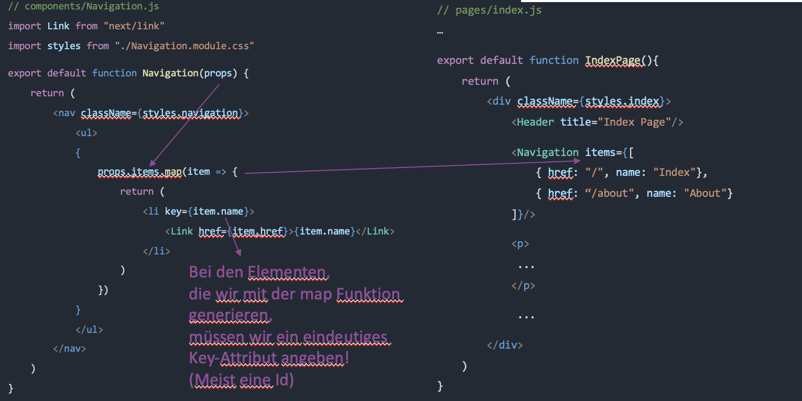
		- ### Children-Attribut
			- JSX, das wir anderen Components via Props mitgeben, ist auf dem Props Objekt unter dem Attribut props.children verfügbar.
			- React Apps sind nur verschachtelte Components!
			- 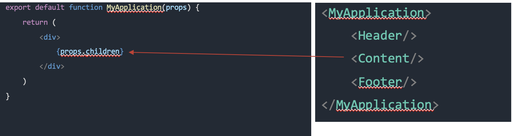
		- ### Layouts mit **pages /_app.js**
			- 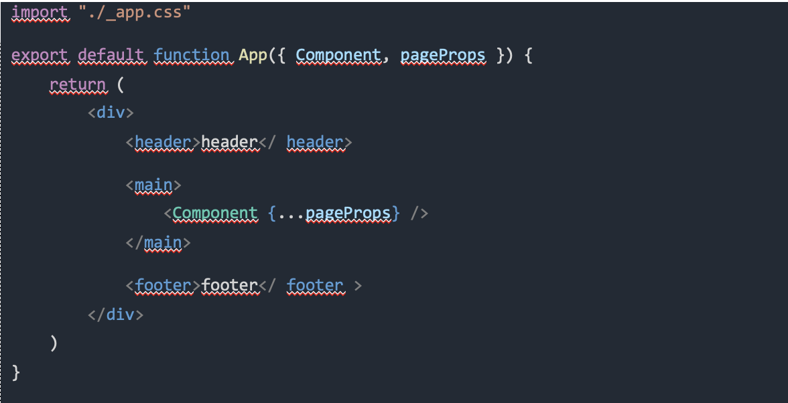
			- Der Component App, der in der Datei pages/_app.js ist, wird von next.js als Rootcomponent unserer App genutzt. Alles JSX, das wir hier einfügen, ist auf allen Seiten sichtbar.
			- Das Argument Component ist die aufgerufene Seite.
			- Das Argument pageProps sind die Props, die jede Seite beim Aufruf erhält.
		- ### Destructuring Assignment für Props
			- 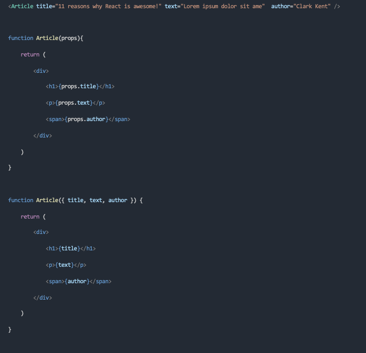{:height 696, :width 714}
		- ### Spread Operator für Props
			- 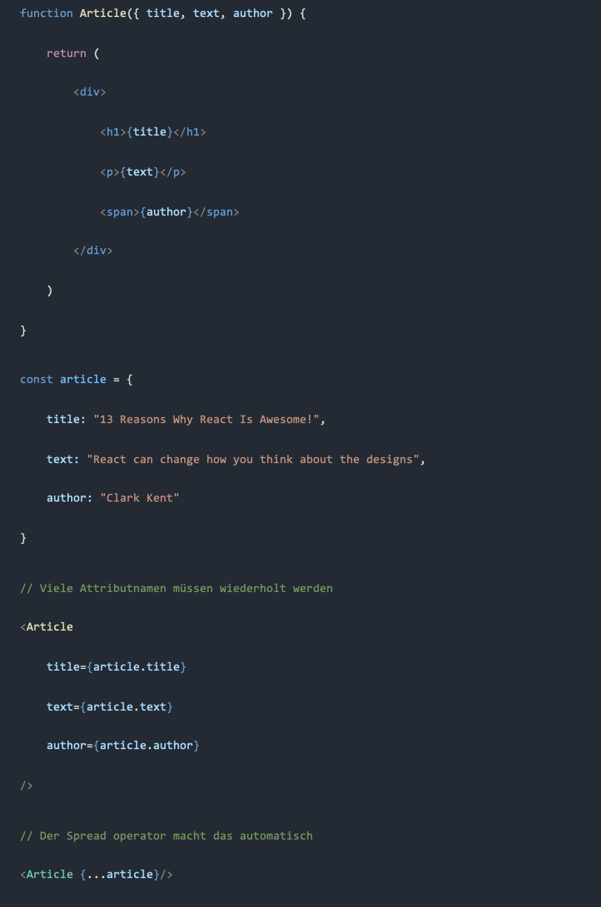
				-
				-
				-
- ## Hooks
	- [https://reactjs.org/docs/hooks-effect.html](https://reactjs.org/docs/hooks-effect.html)
	- [https://nextjs.org/docs/basic-features/data-fetching/overview](https://nextjs.org/docs/basic-features/data-fetching/overview)
	- [[React Hooks]]
	- ### useEffect
	  collapsed:: true
		- Mit der useEffect Funktion können wir einerseits auf Updates unserer state Variablen reagieren und Funktionen zu bestimmten Zeitpunkten ausführen
		- 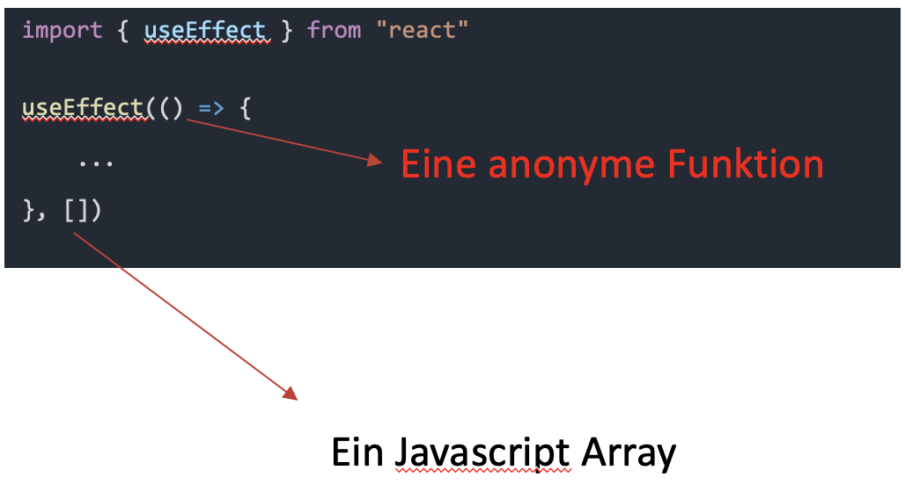
		- ### Auf Änderung des States reagieren
		  collapsed:: true
			- Wenn wir in den Array Variablen schreiben, die mit useState definiert wurden, wird die Funktion jedes mal ausgeführt, wenn sich der Wert der Variable ändert
			  (also die setter Funktion aufgerufen wurde)
			- ```jsx
			  export default function LoggingCounter() {
			      const [count, setCount] = useState(0)
			      useEffect(() => {
			          console.log("count has changed to", count)
			      }, [count])
			      const handleClick = (e) => {
			          setCount(count + 1)
			      }
			      return (
			          <div>
			              Count: {count}
			              <br/>
			              <button onClick={handleClick}>Increment</button>
			          </div>
			      )
			  }
			  
			  ```
		- ### Funktionen zu bestimmen Zeitpunkten ausführen
		  collapsed:: true
			- Wenn wir den Array leer lassen, dann wird die Funktion genau 1 mal ausgeführt, wenn unser Component im DOM landet
			- Wenn wir eine Funktion zurückgeben, wird diese ausgeführt, wenn unser Component aus dem DOM genommen wird
			- ```jsx
			  function CatImage({ src }) {
			      useEffect(() => {
			          console.log("CatImage Component is in the DOM")
			          return () => {
			              console.log("CatImage Component has left the DOM")
			          }
			      }, [])
			      return (
			          
			      )
			  }
			  
			  ```
			- In diesem Beispiel wird der CatImage Component (vorherige Folie) dynamisch angezeigt und seine useEffect Funktionen werden ausgelöst
			- ```jsx
			  export default function LifeCyclePage() {
			      const [showCat, setShowCat] = useState(false)
			      useEffect(() => {
			          console.log(`The value of the showCat variable is ${showCat ? "true": "false"}`)
			      }, [showCat])
			      useEffect(() => {
			         console.log("Hello there, you've entered the LifeCyclePage")
			      }, [])
			      return (
			          <div className={styles.lifecycle}>
			              <h1>Open the dev tools and look at the console!</h1>
			              <button onClick={() => setShowCat(!showCat)}>Toggle the cat image</button>
			              { showCat && <CatImage src="/cat.jpeg"/>}
			          </div>
			      )
			  }
			  ```
		- ### Listen- und Detailansicht mit **fetch** API
		  collapsed:: true
			- 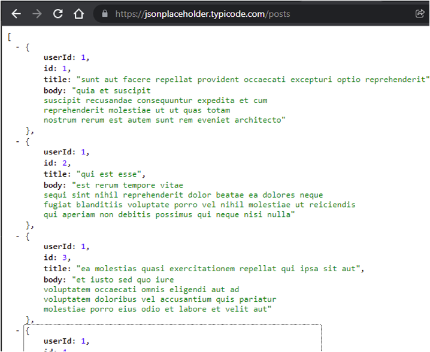
			- 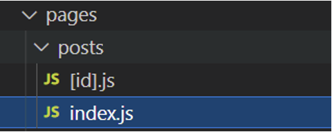
				- Einzelner Post mit id als Parameter
			- Wir stellen mit useState und useEffect eine Liste von Posts dar, die wir per fetch Request als JSON laden
				- ```jsx
				  // pages/posts.js
				  import { useState, useEffect } from "react"
				  import Link from "next/link"
				  
				  const URL = "https://jsonplaceholder.typicode.com/posts"
				  
				  export default function PostsPage() {
				      const [posts, setPosts] = useState([])
				      useEffect(() => {
				          const loadPosts = async () => {
				              const response = await fetch(URL)
				              const posts = await response.json()
				              setPosts(posts)
				          }
				          loadPosts()
				      }, [])
				      return (
				          <div>
				              {
				                  posts.map(post => {
				                      return (
				                          <Link key={post.id} href={`/posts/${post.id}`}>
				                              <div>
				                                  <h2>{post.title}</h2>
				                                  <p>{post.body}</p>
				                              </div>
				                          </Link>
				                      )
				                  })
				              }
				          </div>
				      )
				  }
				  ```
			- Mit dem Hook useRouter können wir die id aus dem Pfad auslesen
			- Wir initialisieren den Post mit null und laden ihn dann per fetch
				- ```jsx
				  // pages/posts/[id].js
				  import { useState, useEffect } from "react"
				  import { useRouter } from "next/router"
				  
				  const URL = "https://jsonplaceholder.typicode.com/posts"
				  export default function PostPage() {
				      const router = useRouter()
				      const { id } = router.query
				      const [post, setPost] = useState(null)
				      useEffect(() => {
				          if (!id) return
				          const loadPost = async () => {
				              const response = await fetch(`${URL}/${id}`)
				              const post = await response.json()
				              setPost(post)
				          }
				          loadPost()
				      }, [id]);
				      return post && (
				          <div>
				              <h1>{post.title}</h1>
				              <p>{post.body}</p>
				              <span>id: {post.id}</span>
				          </div>
				      )
				  }
				  
				  ```
		- ### Eventlistener
		  collapsed:: true
			- useEffect wird auch oft verwendet, um Eventlistener zu setzen, z.B. resize, scroll etc.
			- ```jsx
			  export default function WindowSize() {
			      const [width, setWidth] = useState(0)
			      const [height, setHeight] = useState(0)
			      useEffect(() => {
			          const updateDimensions = () => {
			              setWidth(window.innerWidth)
			              setHeight(window.innerHeight)
			          }
			          if (width === 0) updateDimensions()
			  	    window.addEventListener("resize", updateDimensions)
			          return () => {
			              window.removeEventListener("resize", updateDimensions)
			          }
			      }, [])
			      return (
			          <div>
			              Window: width: {width}, height: {height}
			          </div>
			      )
			  }
			  
			  ```
		- ### setInterval, setTimeut
			- Die Funktionen setInterval und setTimeout in einem weiteren Beispiel für den nutzen von useEffect
			- ```jsx
			  // components/Clock.js
			  import { useState, useEffect } from "react"
			  const currentLocalTimeString = () => new Date().toLocaleTimeString()
			  export default function Clock() {
			      const [currentTime, setCurrentTime] = useState(currentLocalTimeString());
			      
			      useEffect(() => {
			          const intervalHandle = setInterval(() => {
			              setCurrentTime(currentLocalTimeString())
			          }, 1000)
			          return () => clearInterval(intervalHandle)
			      }, [])
			      
			      return (
			          <span>
			              {currentTime}
			          </span>
			      )
			  }
			  
			  
			  ```
		- ### State mit **props** initialisieren
			- Wenn wir state Variablen mit Werten aus den Props initialisieren wollen, müssen wir auch useEffect brauchen.
			- Wenn unser Propsattribut gleich heisst, wie die State Variable, können wir kein Destructuring brauchen. (list => props.list)
			- 
	- ### useState
	  collapsed:: true
		- Hook  = Spezielle Hilfsfunktionen in der React Welt
		- Wir brauchen am Anfang die Hooks useState und useEffect von React
		- Wir werden noch den useRouter Hook von next.js kennenlernen
		- React lässt uns auch eigene Hooks schreiben
		- Mit der Funktion useState können wir Variablen und eine setter Funktion definieren
			- ```jsx
			  const [text, setText] = useState("Hello World!")
			  const [active, setActive] = useState(false)
			  const [count, setCount] = useState(1337)
			  const [positionX, setPositionX] = useState(3.14)
			  const [todos, setTodos] = useState([])
			  
			  ```
		- Nach einem Aufruf der setter Funktion wird unser Component automatisch mit dem neuen Wert der Variable dargestellt
			- ```jsx
			  const handleClick = (e) => {
			          setText(“Ich bin der neue Wert der Variable text")
			      }
			  
			  
			  ```
		- ### JSX Eventhandler
			- Wir definieren eine Funktion, die ein Event entgegennimmt und übergeben diese Funktion dem onClick Attribut
			- 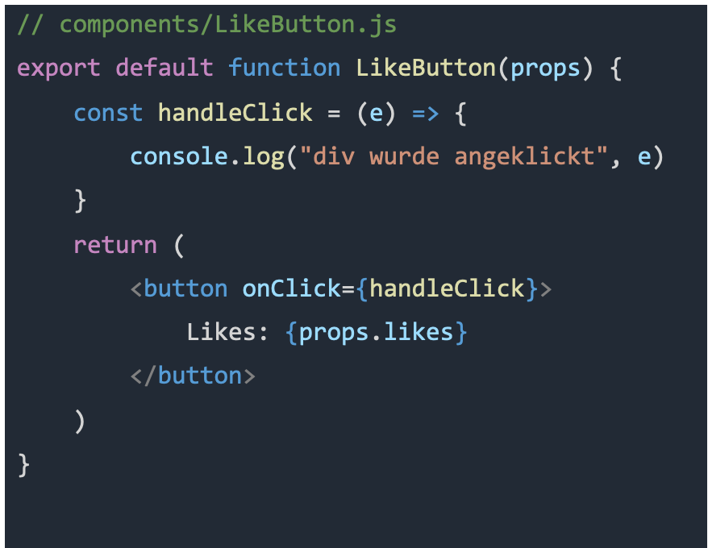
			- 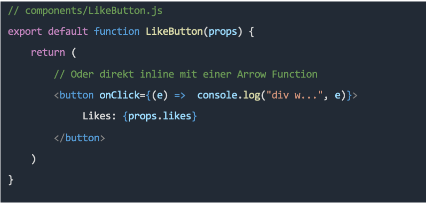
			-
		- ### Logisches und && / Ternary Operator ?
			- ```jsx
			  // components/Logic.js
			  import { useState } from "react"
			  export default function Logic() {
			      const [boolean, setBoolean] = useState(true)
			      return (
			          <div onClick={(e) => setBoolean(!boolean)}>
			              { boolean ? <div>yes</div> : <div>no</div>}
			              { boolean && <div>All right!</div>}
			          </div>
			      )
			  }
			  
			  
			  ```
		- ### useState und Formulare
			- Wir können mit useState in Kombination mit dem onChange Eventhandler und
			  der setter Funktion Formularwerte in Variablen speichern
			- ```jsx
			  const [newTodoText, setNewTodoText] = useState("")
			  
			  const handleChange = (e) => {
			    const inputValue = e.target.value
			    setNewTodoText(inputValue)
			  }
			  
			  <input type="text" onChange={handleChange} value={newTodoText} />
			  
			  ```
		- ### useState mit Arrays
			- 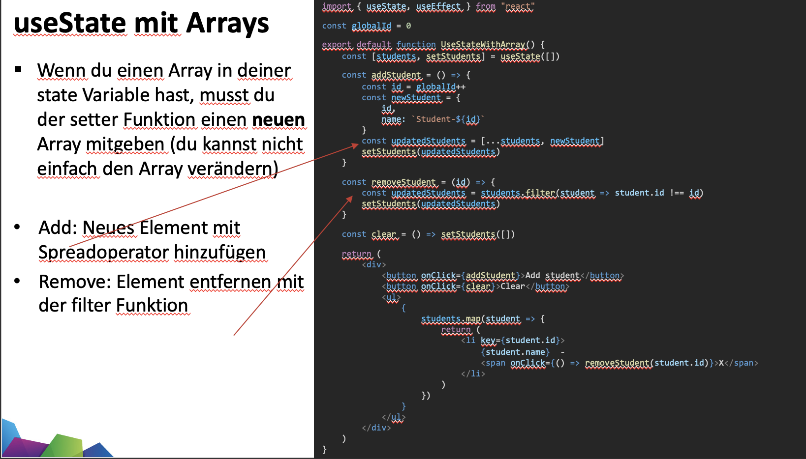
				-
- ## Advanced react.js
  collapsed:: true
	- ### Komplexere Components entwerfen
	  collapsed:: true
		- Mockup des Components
		- Datenstruktur analysieren
		- Component Hierarchie bestimmen und welche Components welche Daten
		  brauchen
		- Lift state up
		- Kommunikation Parent – Child über Callbackfunktionen
	- ### Beispiel
	  collapsed:: true
		- ### Mockup des Components
		  collapsed:: true
			- Was soll hier dargestellt werden?
				- Eine Liste von Produkten nach Kategorien geordnet mit den Attributen name und price
				- Ein Inputfeld, um nach den Namen der Produkte zu filtern
				- Eine Checkbox, um nur Produkte anzuzeigen, die an Lager sind
				- 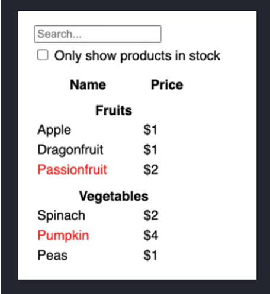
		- ### Datenstruktur analysieren
		  collapsed:: true
			- Was für Attribute braucht es?
			- Welche Attribute können abgeleitet werden? (firstName lastName = fullname)
			- Welche Attribute gehören zur Entität? Welche sind nur für das UI vorhanden?(z.B.
			  isVisible etc)
			- 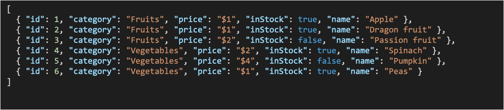
		- ### Component Hierachie  und  Abhängigkeiten bestimmen
		  collapsed:: true
			- FilterableProductTable bekommt die Produkte (products) via props
				- 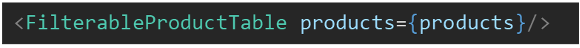
				- ProductTable braucht Suchanfrage (query) der Searchbar sowie den Wert der Checkbox (inStockOnly)
				- Beide Components brauchen Zugriff auf die selben Daten => Life state up!
				- 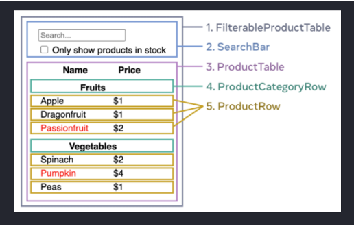
				- 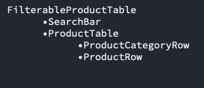
		- ### Lift state up
		  collapsed:: true
			- Wenn mehrere Components die selben Daten brauchen, “heben” wir den State nach oben in den Parentcomponent und geben die Daten via props an Childcomponents mit
			- 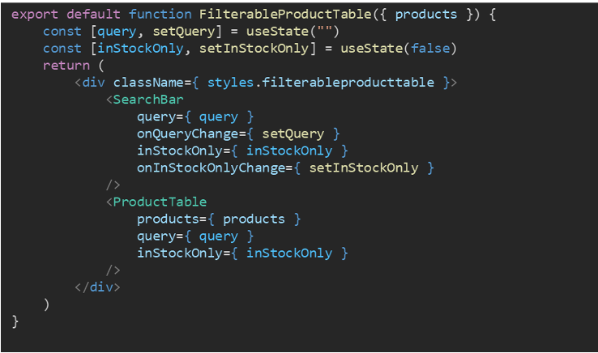
		- ### Lift state up in next.js
			- Haben wir bereits genutzt: useSession aus der Fallstudie, alle Seiten haben
			  Zugriff auf session, da in _app.js der Parentcomponent aller PageComponents ist.
			- 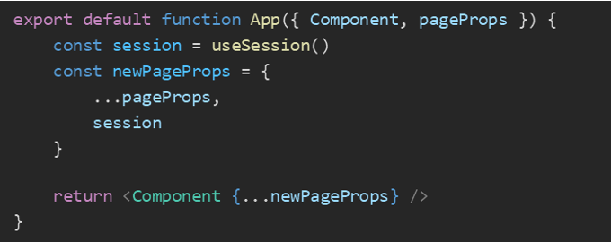
		- ### Kommunikation Parent – Child über Callbackfunktionen
		  collapsed:: true
			- Searchbar erhält die Suchanfage (query) und den “an Lager” Filterwert (inStocksOnly) via props
			- Erhält die beiden Funktionen onQueryChange und onInStockOnlyChange, um den Parentcomponent bei Änderungen zu benachrichtigen,via props
			- 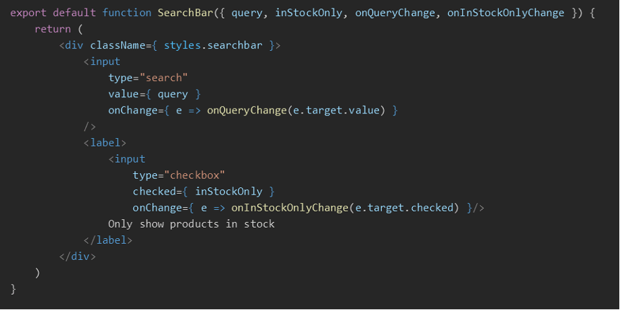
	- ### Eigene Hooks schreiben
	  collapsed:: true
		- useState, useEffect können in eigene Funktionen gepackt werden
		- Es bietet sich an, ein Objekt mit dem Wert und Methoden zu manipulation zu returnen
		- Eigene Funktion muss mit “use” beginnen
		- 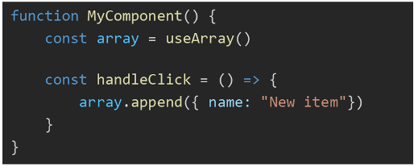
		- 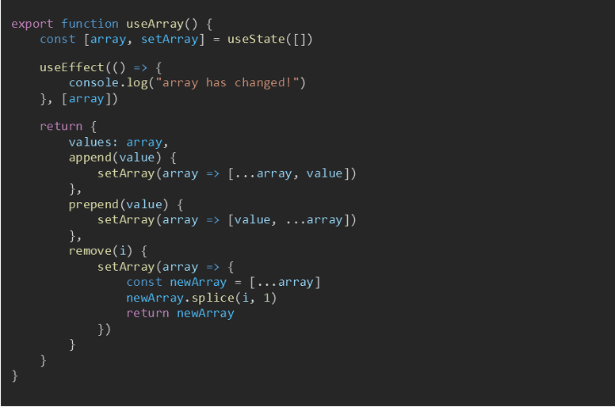
	- ### State mit props  initialisieren
	  collapsed:: true
		- Wenn wir state Variablen mit Werten aus den Props initialisieren wollen, müssen wir auch useEffect brauchen.
		- Wenn unser Propsattribut gleich heisst, wie dieState Variable, können wir kein Destructuring brauchen. (list => props.list)
		- 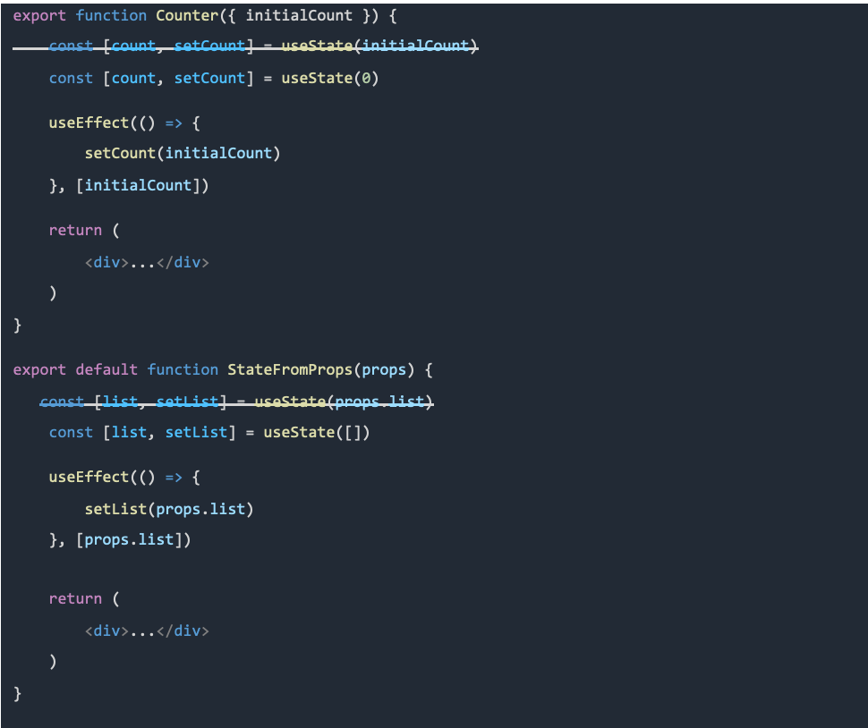
- ## Advanced next.js
	- ### Projekt aufsetzen mit create-next-app
	  collapsed:: true
		- `npx create-next-app my-app`
		- Erstellt eine fertige next.js App im Verzeichnis my-app
		- npx wurde mit node.js zusammen installiert
	- ### jsconfig.json für Imports
	  collapsed:: true
		- In der Datei jsconfig.json kann man beliebige Aliase für Pfade konfigurieren
		- 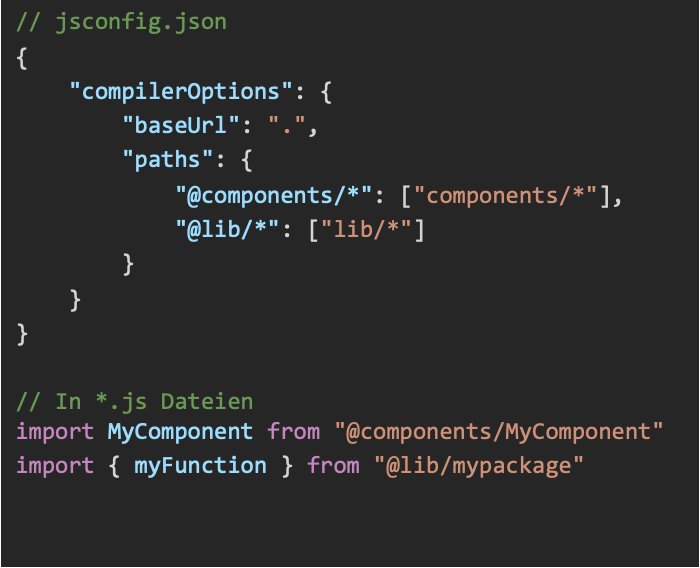
	- ### Image Component
	  collapsed:: true
		- Erhöht Performance beim Laden von Bildern
			- Nur sichtbare Bildern werden geladen
			- Bilder werden auf Server zugeschnitten
			- Verschwomener Platzhalter beim laden
		- 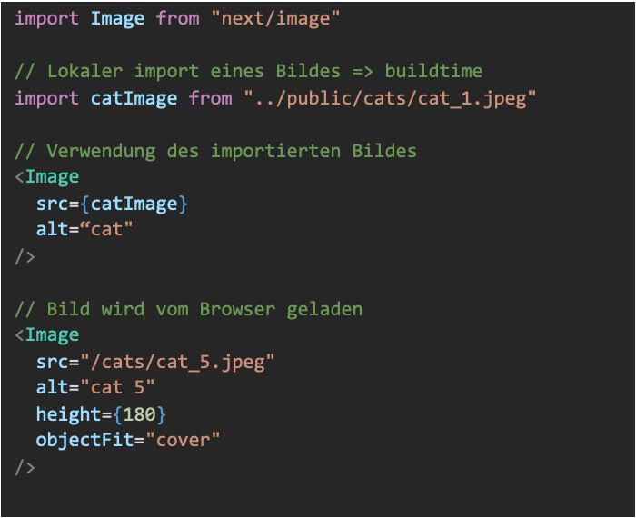{:height 578, :width 700}
	- ### API Routes
	  collapsed:: true
		- Im Verzeichnis pages/api können API Routen definiert werden
		- Datenbankabfragen, fetch, Dateien lesen / schreiben
		- Diese Routen können vom Client via fetch angesprochen werden
		- 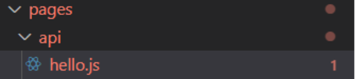
		- 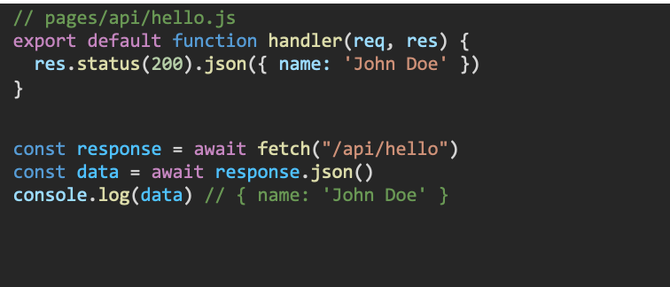
	- ### getStaticProps
	  collapsed:: true
		- #
		- Wenn eine Seite die Funktion getStaticProps exportiert, so werden diese Funktionen beim Ausführen des Befehls $ npm run build bzw. $ next build aufgerufen und es werden möglichst statische Seiten generiert.
		- Je nach Konfiguration können diese Seiten zur Laufzeit aktualisiert werden.
		- revalidate: 10 => die Seite wird maximal alle 10 sekunden neu generiert
		- 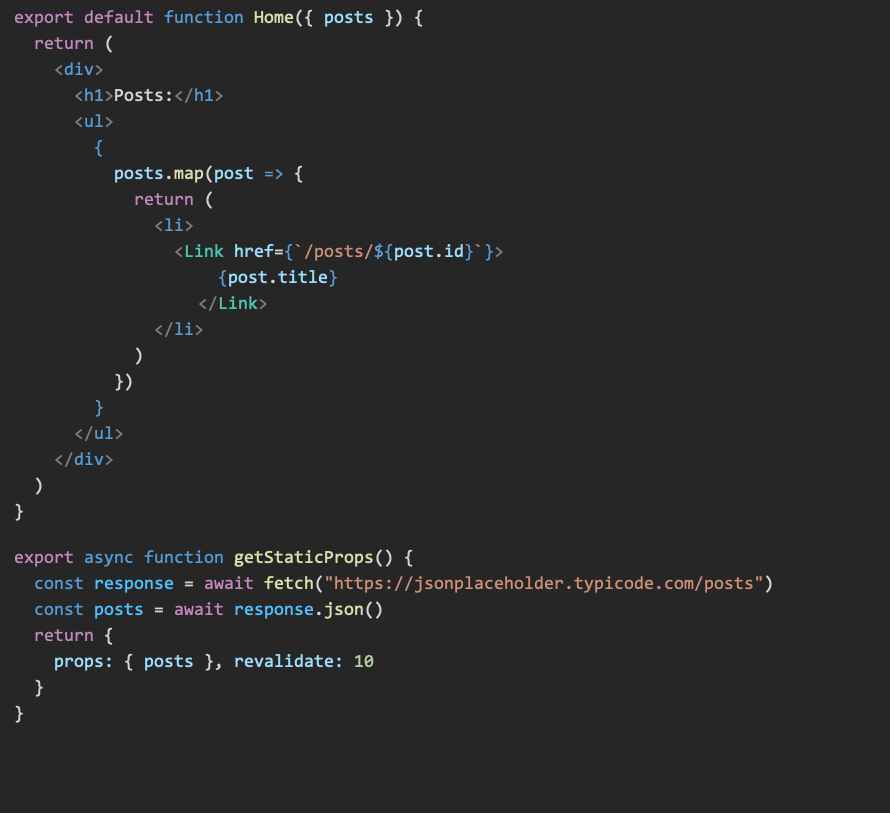
	- ### getStaticPaths
	  collapsed:: true
		- #
		- Wenn eine Seite einen Parameter hat(z.B. eine Id), dann muss auch die Funktion getStaticPaths exportiert werden.
		- Hier könnten wir noch genau angeben, für welche Posts HTML generiert
		  werden soll.
		- Fallback: true => Seiten werden beim Aufruf generiert falls nötig
		- 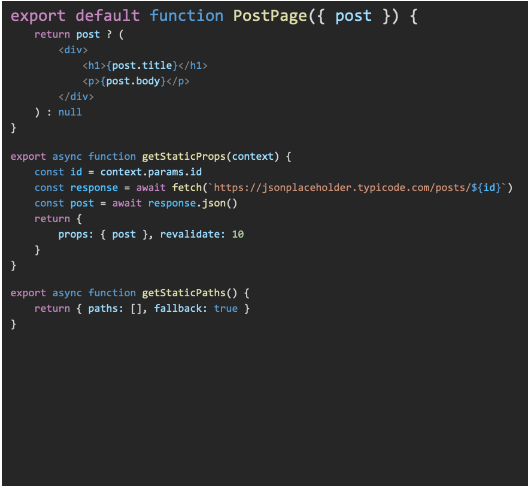
	- ### next build, next start, next export
	  collapsed:: true
		- `npm run build ` (next build)
			- Erstellung einer fertigen App (Production Build)
			- Generierung von Seiten (getStaticProps etc.)
			- Js, css, Bilder werden optimiert
		- `npm run start` (next start)
			- Startet den Server (nach next build)
		- `npm run export` (next export)
			- HTML Dateien werden generiert
		- 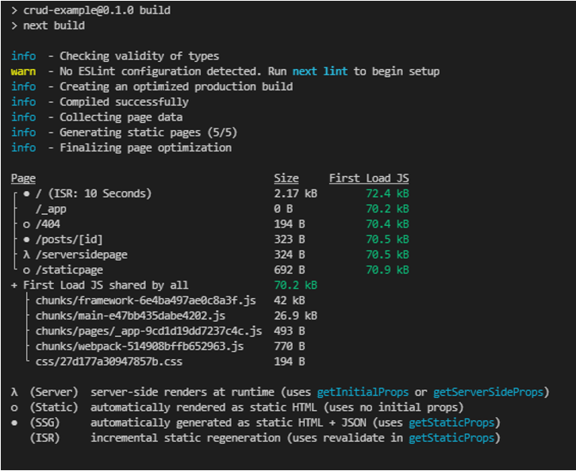