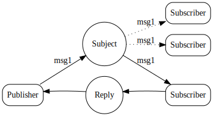

tags:: [[NATS]]

- https://docs.nats.io/nats-concepts/core-nats/reqreply
- https://natsbyexample.com/examples/messaging/request-reply/deno #JavaScript
- Using its core communication mechanism [[Publish-Subscribe]]
- A communication pattern where **a client sends a request to a server or another client**  and **waits for a response**.
- The client initiates the request and establishes a temporary communication channel to receive the
   reply.
- ## The pattern
	- In this pattern, a client makes a request to a server or service, and the server processes the request and sends a response back to the client.
	- 
	-
	- **Client sends a request**:
		- The client publishes a message with a **reply subject** and the **request payload**.
	- **Server processes the request**:
		- The server (subscriber) receives the request, processes it, and then publishes a response to the reply subject specified in the request.
	- **Client receives the response**:
		- The client (subscriber) listens on the reply subject for responses and processes the response received from the server.