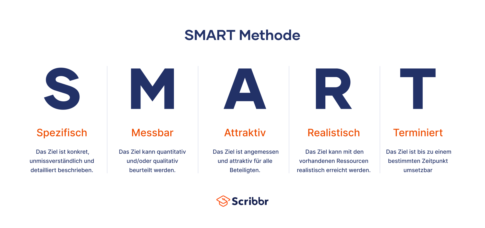

- **SMART Ziele **helfen dir dabei, Aufgaben und Ziele effektiv zu planen und sie dann zu erreichen. Mit ihnen** **kannst du also sowohl deine **privaten Ziele**, als auch **berufliche Ziele im Unternehmen** erfolgreich umsetzen!
- {:height 375, :width 780}
	- **S**pezifisch — *Was genau will ich erreichen?*
	- **M**essbar — *Wie überprüfe ich, ob ich das Ziel erreicht habe?*
	- **A**ttraktiv— *Möchte ich das Ziel überhaupt erreichen?*
	- **R**ealistisch — *Kann ich das Ziel mit meinen Mitteln erreichen?*
	- **T**erminiert — *Wann möchte ich das Ziel erreicht haben?*