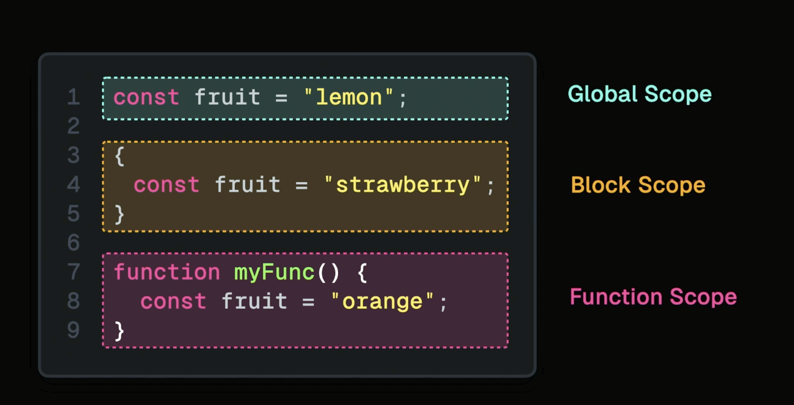

tags:: [[JavaScript]]

- ## Scope
  collapsed:: true
	- In JavaScript, "scope" refers to the context in which variables and functions are accessible. Understanding scope is crucial for controlling the visibility and lifespan of variables, functions, and objects in your code.
	- {:height 331, :width 552}
	- ## Global Scope
		- Variables declared outside any function or block have global scope.
		- They can be accessed from anywhere in the code.
		-
	- ## Local Scope
		- ### Block Scope
			- Variables declared with `let` and `const` within a block (denoted by `{}`) are scoped to that block.
			- This includes blocks within functions, `if` statements, loops, etc.
			- ```javascript
			  {
			      let blockScopedVariable = "I'm block scoped";
			      console.log(blockScopedVariable); // Accessible here
			  }
			  
			  ```
		- ### Funktion Scope
			- Variables declared within a function are scoped to that function.
			- They cannot be accessed outside the function
			- ```javascript
			  function myFunction() {
			      let functionScopedVariable = "I'm local to myFunction";
			      console.log(functionScopedVariable); // Accessible here
			  }
			  
			  ```
- ## Closure
  collapsed:: true
	- A feature that allows a function to retain access to its **lexical scope**, even when that function is executed outside of its original scope
	- ### Lexical Scope
		- Lexical scope refers to the fact that the scope of variables is determined by their physical location in the written code.
		- For instance, variables defined inside a function are not accessible outside of that function.