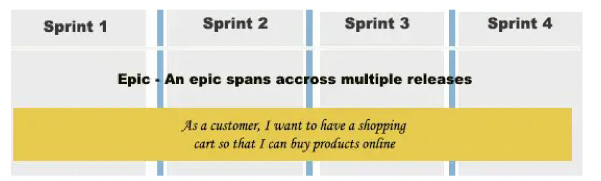

tags:: [[GIBB]]

- **M426**
- ## Was macht gutes ein Zusammenarbeit?
	- Gute Doku
	- Motivation
	- Empathie
	- Respekt
	- Vertrauen
- ## Agile Methode
	-
- ## SCRUM
	- ### Rollen (Roles)
		- In Scrum gibt es verschiedene Rollen, die jeweils **spezifische Verantwortlichkeiten**  innerhalb des Teams haben.
		- #### **Product Owner**:
		  collapsed:: true
			- **Aufgaben**
				- Verantwortlich für die Maximierung des Werts des Produkts und die Arbeit des Entwicklungsteams.
				- **Definiert die Produktvision**, **priorisiert die Produkt-Backlog-Artikel** und **sorgt dafür, dass das Entwicklungsteam die Anforderungen versteht.**
			- Gute Kommunikation
				- Klar kommuzieren
				- Zuhören
			- Produkverständnis
			- Einblick in die Firma und Developer Team um Möglichkeiten abzuschätzen
			- Durchsetzungsvermögen auch gegenüber dem Kunden
			- Mutig Dinge anzusprechen
			- "Top Down" Perspektive
			- Sowohl strukturiert wie auch kreativ sein
			- Sie verwaltet die Arbeits des Entwicklungsteams
		- #### **ScrumMaster**
		  collapsed:: true
			- **Aufgaben**
			  collapsed:: true
				- Verantwortlich dafür, sicherzustellen, dass das Scrum-Framework im Team korrekt angewendet wird.
				- Unterstützt das Team, Hindernisse zu beseitigen, fördert die Zusammenarbeit und hilft dabei, das Verständnis von Scrum-Praktiken innerhalb des Teams zu verbessern.
			- Gute Kommunikation
				- Zuhören
				- Gute Erklärung
				- Motivieren
			- Zeitmanagment im Griff haben
			- Selbständig
			- Alles gut organisieren können
			- Durchsetzungsvermögen, einfordern
			- Führungsqualitäten
				- Konflikte zu lösen
				- Verständnis für Mitarbeiter Empathie
			- Gute Verständnis für Technik
			- Sie verwaltet den SCRUM-Prozess
		- #### **Entwickler**
		  collapsed:: true
			- **Aufgaben**
				- Das Entwicklungsteam besteht aus Fachleuten, die das Produkt erstellen und liefern.
				- Es ist selbstorganisiert und trägt die Verantwortung dafür, wie die Arbeit organisiert und durchgeführt wird, um die Sprint-Ziele zu erreichen.
			- Gute Kommunikation
			- Bottom Up Perspektive
			- Kritikfähig
			- Zeitmanagement
			- Effizient
			- Verlässich
			- Meldet sich wenn ein Problem ist
			- Gut Developen
			- Tolerant andere Sichten akzeptieren
			- Hilfsbereitschaft
			- Sie entwickelt das Produkt. (Code schreiben)
			-
	- ### Artefakte der Planung (Artifacts)
		- Den Product Backlog und den Sprint Backlog umfassen
		- **Epics**:
			- **grosse**, **umfassende Anforderungen** oder **Initiativen**, die in kleinere, handhabbare Stücke aufgeteilt werden können.
			- Sie stellen oft die grössten und umfassendsten Elemente im Product Backlog dar und können in mehrere Features oder User Stories aufgeteilt werden.
			- 
		- **Features**:
			- Sind funktionsbezogene Gruppen von User Stories, die eine bestimmte Funktionalität oder einen bestimmten Nutzen für das Produkt repräsentieren.
			- Oft grösser als einzelne ==User Stories==, aber kleiner als Epics und dienen dazu, ähnliche Anforderungen oder Benutzerbedürfnisse zu gruppieren.
		- **User Stories (Product Backlog Items = PBI)**: User Stories sind kleine, eigenständige Beschreibungen von Funktionalitäten aus der Perspektive des Benutzers. Sie sind typischerweise in einer einfachen Sprache verfasst und beschreiben, was ein Benutzer tun können soll, warum es wichtig ist und welchen Wert es bietet. User Stories sind eine wichtige Einheit im Product Backlog und dienen als Basis für die Sprint-Planung und -Lieferung.
		- **Tasks**:
			- Die kleinste Arbeitseinheit innerhalb einer User Story.
			- Sie sind konkrete Aufgaben, die von den Teammitgliedern erledigt werden, um eine User Story abzuschliessen.
			- Tasks können alles umfassen, von Codierungs- und Designtätigkeiten bis hin zu Tests und Dokumentation.
			- Sie helfen dabei, die Arbeit einer User Story in handhabbare Teile aufzuteilen und den Fortschritt nachvollziehbar zu machen.