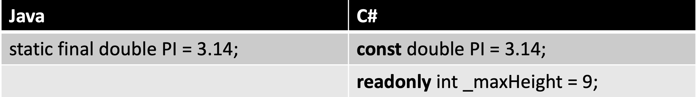
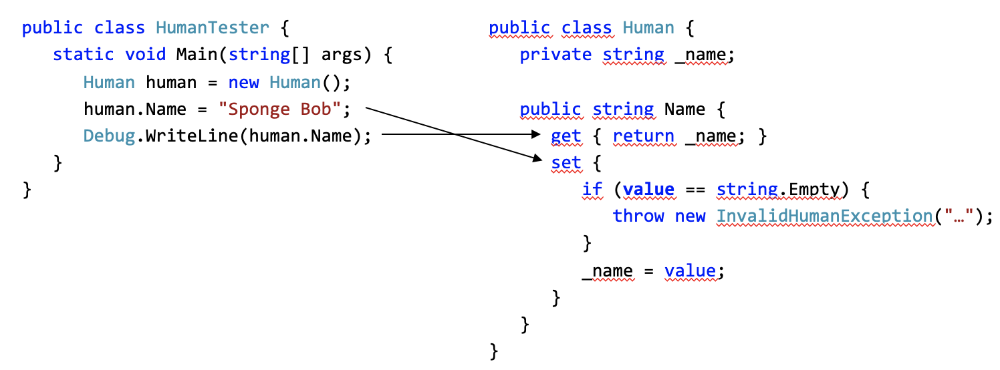

tags:: [[C#]], [[Java]], [[JavaScript]]

- ## C#
  collapsed:: true
	- ### Privat Variable
	  collapsed:: true
		- ```C#
		  private int _number;
		  ```
	- ### Konstanten
	  collapsed:: true
		- 
		- Im Gegensatz zu **const**, können **readonly** Felder im Konstruktor initialisiert werden.
		- Der Wert einer readonly Variable kann nur bei der Deklaration oder im Konstruktor gesetzt werden.
		- Const kann nicht im Konstruktor initialisiert werden
	- ### Operatoren
	  collapsed:: true
		- #### Compare
		  id:: 64f81fae-1b82-45b9-b84b-62408a02ff9b
			- `==`   `<`  `>`   `<=`   `>=` ` !=`
			  collapsed:: true
		- #### Arithmetic
			- `+` `-` `*`  `/`
			- `%`  (modulo)
			- Math.Pow(x, y)
		- #### Assignment
		  collapsed:: true
			- `=`  `+=`  `-=`  `*=` `/=`   `%=`  ` &=`
			  collapsed:: true
				- ```java
				  int a = 5;
				  a += 3; // Equivalent to a = a + 3; (a is now 8)
				  
				  int e = 10;
				  e %= 3; // Equivalent to e = e % 3; (e is now 1)
				  ```
			- `|=` => Bitwise OR and Assign
			  collapsed:: true
				- ```java
				  int permissions = 5; // Binary: 0101
				  permissions |= 2;   // Binary: 0111 (permissions is now 7)
				  ```
			- `&=` = Bitwise AND and Assign
				- ```java
				  int flags = 7; // Binary: 0111
				  flags &= 3;   // Binary: 0011 (flags is now 3)
				  ```
			- `^=` => Bitwise XOR and Assign
			  collapsed:: true
				- ```java
				  int mask = 12; // Binary: 1100
				  mask ^= 9;    // Binary: 1011 (mask is now 11)
				  ```
		- #### Bitwise
			- `&` => AND
			  collapsed:: true
				- Performs a bitwise AND operation between corresponding bits of two operands. It returns 1 if both bits are 1; otherwise, it returns 0.
				- ```java
				  int a = 5;   // Binary: 0101
				  int b = 3;   // Binary: 0011
				  int result = a & b;  // Result: 0001 (1 in decimal)
				  ```
			- `|` => OR
			  collapsed:: true
				- Performs a bitwise OR operation between corresponding bits of two operands. It returns 1 if at least one bit is 1; otherwise, it returns 0.
				- ```java
				  int x = 5;   // Binary: 0101
				  int y = 3;   // Binary: 0011
				  int result = x | y;  // Result: 0111 (7 in decimal)
				  ```
			- `^` => XOR
			  collapsed:: true
				- Performs a bitwise XOR (exclusive OR) operation between corresponding bits of two operands. It returns 1 if the bits are different; otherwise, it returns 0.
				- ```java
				  int p = 5;   // Binary: 0101
				  int q = 3;   // Binary: 0011
				  int result = p ^ q;  // Result: 0110 (6 in decimal)
				  ```
			- `~` => NOT
			  collapsed:: true
				- Inverts each bit of the operand, changing 0s to 1s and 1s to 0s.
				- ```java
				  int num = 5;     // Binary: 0101
				  int result = ~num;  // Result: 11111111111111111111111111111010 (-6 in decimal)
				  ```
			- `<<` => Left Shift
			  collapsed:: true
				- Shifts the bits of the left operand to the left by the number of positions specified by the right operand. Fills in zeros from the right.
				- ```java
				  int value = 5;      // Binary: 0101
				  int shifted = value << 2;  // Result: 20 (in decimal) or 10100 in binary
				  ```
			- `>>` => Right Shift
			  collapsed:: true
				- Shifts the bits of the left operand to the right by the number of positions specified by the right operand. Fills in the most significant bits with the original sign bit (arithmetic right shift for signed values).
				- ```java
				  int number = -16;  // Binary: 11111111111111111111111111110000
				  int shifted = number >> 2;  // Result: -4 (in decimal) or 11111111111111111111111111111100 in binary
				  ```
		- #### Logical
		  collapsed:: true
			- && ||  &  |   ^   !
	- ### If Statement
	  collapsed:: true
		- ```C#
		  if (a == b) {
		     Console.WriteLine("a == b");
		  } else {
		     Console.WriteLine("a != b");
		  }
		  
		  int c = a > b ? a : b;
		  ```
	- ### Methoden
	  collapsed:: true
		- ```C#
		  //Main method
		  public static void Main(string[] args) {}
		  ```
	- ### String
	  collapsed:: true
		- #### Strings formatieren
		  collapsed:: true
			- ```C#
			  int answer = 42; 
			  string s = string.Format("{0} is the answer", answer);
			  Console.WriteLine(s);
			  	> 42 is the answer
			  
			  
			  
			  //Interpolation
			  
			  int answer = 42; 
			  string s  = $"{answer} is the answer";
			  Console.WriteLine(s);
			  	> 42 is the answer
			  
			  ```
		- #### StringBuilder
		  collapsed:: true
			- ```C#
			  StringBuilder buffer = new StringBuilder("zwei "); 
			  buffer.Append("drei "); 
			  buffer.Insert(0, "eins "); 
			  buffer.Replace("zwei", "ZWEI"); 
			  
			  Console.WriteLine(buffer); 
			  	> eins ZWEI drei 
			  
			  ```
	- ### Loops
	  collapsed:: true
		- ```C#
		  while (i < 10) 
		  i++;
		  
		  
		  for (i = 2; i <= 10; i ++) 
		  Console.WriteLine(i);
		  
		  
		  do  
		  i++; 
		  while (i < 10);
		  
		  
		  foreach (int i in numArray)  
		  sum += i;
		  
		  
		  foreach (Object o in list)
		  Console.WriteLine(o);
		  ```
	- ### Array
	  collapsed:: true
		- ```C#
		  int[] nums = {1, 2, 3};
		  for (int i = 0; i < nums.Length; i++)
		    Console.WriteLine(nums[i])
		    
		    
		  string[] names = new string[5];
		  names[0] = "David";
		  
		  
		  float[,] twoD = new float[rows, cols];
		  twoD[2,0] = 4.5f; 
		  ```
	- ### Enumaration
	  collapsed:: true
		- ```C#
		  enum Action {
		     Start, 
		     Stop, 
		     Rewind, 
		     Forward
		  }
		  
		  Action a = Action.Stop;
		  if (a != Action.Start)
		    Console.WriteLine(a);  // prints Stop 
		  
		  Console.WriteLine((int)a);  // prints 1 
		  
		  ```
	- ### Properties
	  collapsed:: true
		- ```C#
		  public class Human
		  {
		     /// <summary>
		     /// Gets or sets the name of the human.
		     /// </summary>
		     /// <value>
		     /// The name of the human.
		     /// </value>
		     public string Name { get; set; }
		  }
		  
		  ```
		- ### Setter & Getter
		  collapsed:: true
			- ```C#
			  public class Human {
			     private string _name;
			  
			     public string Name {
			        get { return _name; }
			        set {
			           if (value == string.Empty) {
			              throw new InvalidHumanException("Empty string is not a valid human name");
			           }
			           _name = value;
			        }
			     }
			  }
			  
			  ```
		- ### Main-Programm
		  collapsed:: true
			- 
			- Es wird automatisch erkannt, wenn ein Wert gesetzt oder gelesen wird und die entsprechenden get bzw. set-Methoden werden aufgerufen.
- ## Java
  collapsed:: true
	- ### main() Method
	  collapsed:: true
		- ```java
		  public class HelloJava {
		    public static void main(String[] args) {
		      // ...
		    }
		  }
		  ```
		- It is this main() method that is called first when the application is started.
		- The bit labeled String [] args allows us to pass *command-line arguments* to the application
	- ### method
	  collapsed:: true
		- ```java
		  public class App {
		      public String getGreeting() {
		          return "Hello World!";
		      } //method syxtax
		  
		      public static void main(String[] args) {
		          System.out.println(new App().getGreeting());
		      }
		  }
		  ```
	- ### Operators
	  collapsed:: true
		- #### Arithmetic
		  collapsed:: true
			- `+` `-` `*`  `/`
			- `%`  => modulo
			- `++` =>  increment, `--` => decrement
				- ```java
				  int count = 5;
				  count++; // count is now 6
				  ```
		- #### Compare
		  collapsed:: true
			- `==`   `<`  `>`   `<=`   `>=` ` !=`
		- #### Logical
		  collapsed:: true
			- Java supports the three logical operators `&&` (AND), `||` (OR), and `!` (NOT).
		- #### Ternary
		  collapsed:: true
			- A lightweight, compact alternative for simple *if/else* statements.
			- Usually used in (but not restricted to) return statements, it needs just one single line to make the decision, returning the left value if the expression is `true` and the right value if `false`
			- ```java
			  boolean expr = 0 != 200;
			  
			  // Ternary statement
			  int value = expr ? 22 : 33;
			  // => 22
			  ```
	- ### If statement
	  collapsed:: true
		- ```java
		  int val;
		  
		  if(val == 9) {
		      // conditional code
		  }
		  ```
		- ```java  
		  if(val == 10) {
		      // conditional code
		  } else if(val == 17) {
		      // conditional code
		  } else {
		      // executes when val is different from 10 and 17
		  }
		  ```
	- ### Switch statement
	  collapsed:: true
		- ```java
		  int val;
		  
		  // switch statement on variable content
		  switch(val) {
		      case 1:
		          // conditional code
		          break;
		      case 2: case 3: case 4:
		          // conditional code
		          break;
		      default:
		          // if all cases fail
		          break;
		  }
		  ```
	- ### Loops
	  collapsed:: true
		- [Flow Control: Loops - WHILE | DO-WHILE | FOR - Fundamentals Of Object-Oriented Programming: Java and IntelliJ [Video]](https://learning.oreilly.com/videos/fundamentals-of-object-oriented/9781837635702/9781837635702-video2_8/) #[[Fundamentals of object-oriented Programming Java]]
		- #### For-Each
		  collapsed:: true
			- ```java
			  char[] vowels = { 'a', 'e', 'i', 'o', 'u' };
			  
			  for(char vowel:vowels) {
			      // Output the vowel
			      System.out.print(vowel);
			  }
			  
			  // => aeiou
			  ```
		- #### For
		  collapsed:: true
			- ```java
			  char[] vowels = { 'a', 'e', 'i', 'o', 'u' };
			  
			  for (int i = 0; i < 3; i++) {
			      // Output the vowel
			      System.out.print(vowels[i]);
			  }
			  
			  // => aei
			  ```
		- #### While
		  collapsed:: true
			- ```java
			  int i = 0;
			  
			          while (i < 10) {
			              System.out.println(i);
			              i++;
			          }
			  ```
		- #### Do-While
		  collapsed:: true
			- ```java
			  int i = 0:
			  do {
			    System.out.println(i);
			    i++;
			  } while (i < 15)
			  ```