- #BBC
- # Was ist Telematik
  collapsed:: true
	- Telematik (zusammengesetzt aus Telekommunikation und Informatik) ist eine Technik, welche die Bereiche Telekommunikation und Informatik verknüpft. Telematik ist also das Mittel der
	  Informationsverknüpfung von mindestens zwei Informationssystemen mit Hilfe
	  eines Telekommunikationssystems sowie einer speziellen Datenverarbeitung.
- # Was ist ein Netz?
  collapsed:: true
	- Ein Netzwerk ist ein **Zusammenschluss von zwei oder mehr Computern oder anderen elektronischen Geräten, der den Austausch von Daten und die Nutzung gemeinsamer Ressourcen ermöglicht**
	- ## Elektronische Kommunikation
		- Elektronische Kommunikation zwischen mindestens zwei Endpunkten
		- Wir benutzen diese täglich: Tik Tok, Snapchat, ect.
		- Was braucht es damit die Kommunikation zwischen zwei elektronischen Geräten funktioniert?
			- 2 Geräte
			- 1 Medium
	- ## Wie kann ein Netz aussehen?
		- ## Ausbreitung
		  collapsed:: true
			- ### PAN (Personal Area Network)
				- Handy und Bluetooth-Headset
			- ### LAN (Local Area Network)
				- Das Bbc-Office
			- ### CAN (Campus Area Network)
				- Die Berner Universität
			- ### MAN (Metropolitan Area Network)
				- Die Stadt Bern
			- ### WAN (Wide Area Network)
				- Ein Land, meist aber auch ein Synonym für die Welt, obwohl dies eigentlich ein GAN (Global Area Network) wäre.
		- ## Verbindungsart
		  collapsed:: true
			- ### Drahtlos
				- Dein Handy
				- WLAN Zuhause
				- WLAN in den Zügen
			- ### Drahtgebunden
				- Bbc und Edunet Gerät
		- ## Kommunkationsrichtung
		  collapsed:: true
			- ### Simplex
				- Radio (nur in eine Richtung)
				- Man hört nur zu
				- 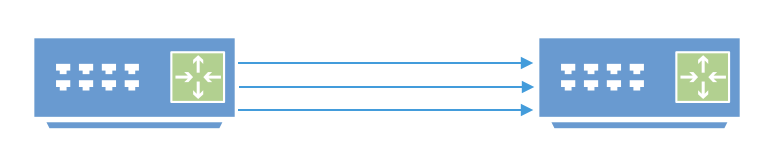
			- ### Halb-Duplex
				- Amateurfunk (abwechselnde Richtung)
				- Man spricht und hört zu, einfach nicht gleichzeitig.
				- 
			- ### Voll-duplex
				- Man spricht und hört zu, dies sogar gleichzeitig.
				- Reguläre Telefonie (gleichzeitig in beide Richtungen möglich)
				- 
		- ## Kommunikationsform
		  collapsed:: true
			- ### Unicast
				- 1:1
				- Website, Exklusivität (Video auf Webseite kann gespult werden)
				- 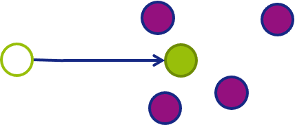{:height 190, :width 428}
			- ### Multicast
				- 1:Alle
				- Dienst ankündigen und Dienst suchen (z.B. Radio, TV über Sender)
				- 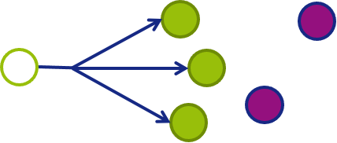
			- ### Broadcast
				- 1:n
				- Push Nachricht, MAC adressierbar («abonnieren»). (z.B. Image auf eine Auswahl an EduNet Rechner gleichzeitig verteilen)
				- 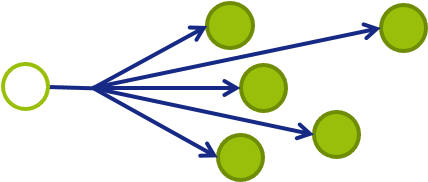
				-
	- ## Topologie
		- ### Vollvermaschung
		  collapsed:: true
			- 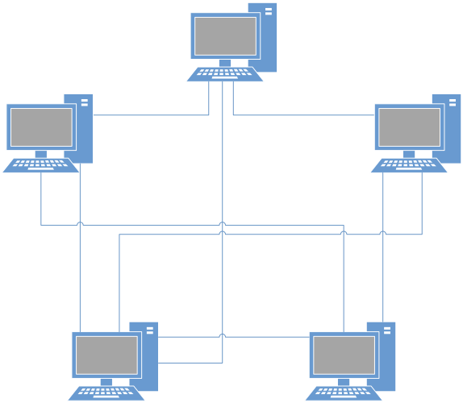
			- **Vorteile**
				- Jedes Gerät hat eine grosse Bandbreite zu jedem anderen Gerät im Netz.
				- Ausfall eines Gerätes oder einer Verbindung hat auf die anderen keinen Einfluss.
			- **Nachteile**
				- Braucht viel Hardware und Kabel. Ist daher sehr teuer.
		- ### Busnetz
		  collapsed:: true
			- 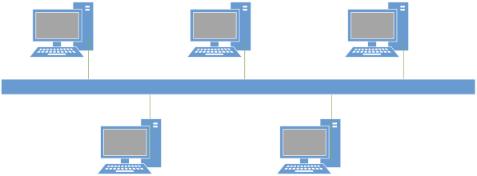
			- Veraltet und Heute nicht mehr im Einsatz
			- **Vorteile**
				- Es werden keine weiteren Geräte zur Übermittlung von Daten benötigt
				- Ausfall eines Rechners hat keine Konsequenzen
				- Geringe Kosten
				- Einfache Verkabelung und Erweiterung
			- **Nachteile**
				- Braucht viel Hardware und Kabel. Ist daher sehr teuer.
				- Daten können leicht abgehört werden
				- Eine Störung im Bus blockiert das ganze  Netz
				- Störungen sind schwer zu lokalisieren
		- ### Ringnetz
			- 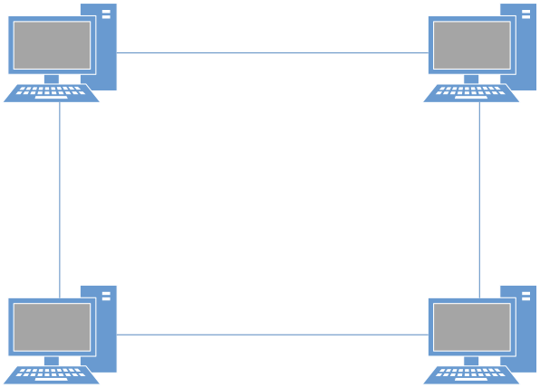
			- **Vorteile**
				- Alle Geräte können als Verstärker arbeiten
				- Klar definierte Richtung mit Vorgänger/Nachfolger
			- **Nachteile**
				- Ausfall eines Gerätes führt zu Störungen des Netzes
				- Hoher Verkabelungsaufwand
				- Kann leicht abgehört werden
		- ### Sternnetz
			- 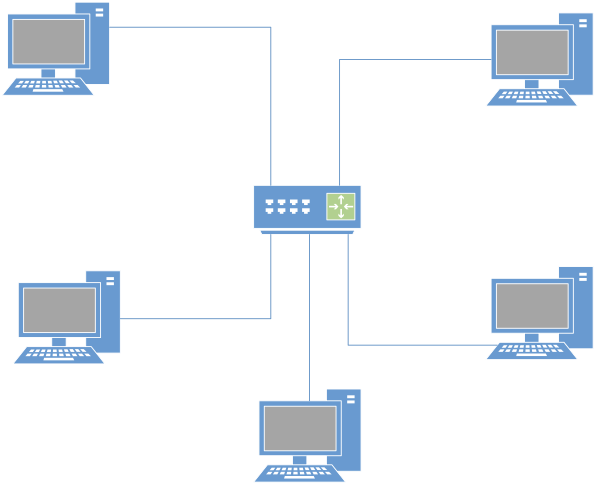
			- **Vorteile**
				- Ausfall eines Teilnehmers ohne Folgen für das Netz
				- Hohe Übertragungsrate mit Switch möglich
				- Einfach erweiterbar (bis Kapazitätsgrenze der Zentraleinheit)
				- Verständlich
				- Leichte Fehlersuche
			- **Nachteile**
				- Durch Ausfall des Zentralrechners (z.B. Switch) ist das Netz lahmgelegt
				- Zentraler Knoten kann zum Flaschenhals werden
		- ### Baum
			- 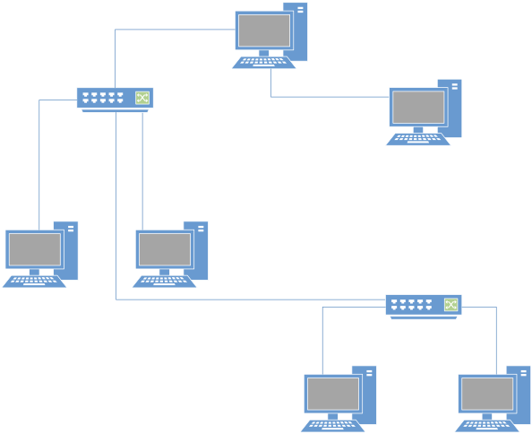
			- **Vorteile**
				- Einfache Konstruktion (z.B. für Gebäudeverkabelung)
				- Einfache strukturelle Erweiterbarkeit
				- übersichtlich
				- Relativ günstig
			- **Nachteile**
				- Bei einem Ausfall eines Vermittlungsgerätes: ganzer unterer Zweig abgeschnitten
				- Schwachstelle zentraler Knoten (Switch)
		- ### Hybride
			- 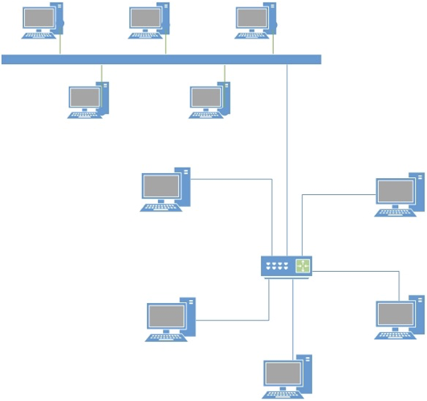
			- Topologien kommen auch in kombinierter Form vor
			- z.B.: Stern-Bus-Struktur
			-
		- ###
- # Übertragungsmedien und Stecker
  collapsed:: true
	- ## Übertragungsmedien
		- ### Drahtlos
			- #### Bluetooth
				- Meistens für PAN-LAN Netzwerke (40-400m)
				- Meistens für Sound-Übertragung (Nicht zwingend)
				- Datenraten sind ca. 3 Mbps
			- #### WLAN (IEEE802.11)
				- Es gibt diverse Implementationen
					- 802.11a-802.11ax Wi-Fi 6
					- In Entwicklung 802.11be
					- Wi-Fi 7
				- Datenraten bis zu 9607.8 Mbps möglich
			- #### NFC (Near field communication)
				-
		- ### Drahtgebunden
			- #### Kupfer
				- ##### Twisted Pair
					- Sind im Wesentlichen alles Synonyme für geschirmt/ungeschirmt, wobei screened sich vor allem auf die äusserste Schicht aus Kupfer-Geflecht bezieht. Mehr Details
					  folgen.
					- 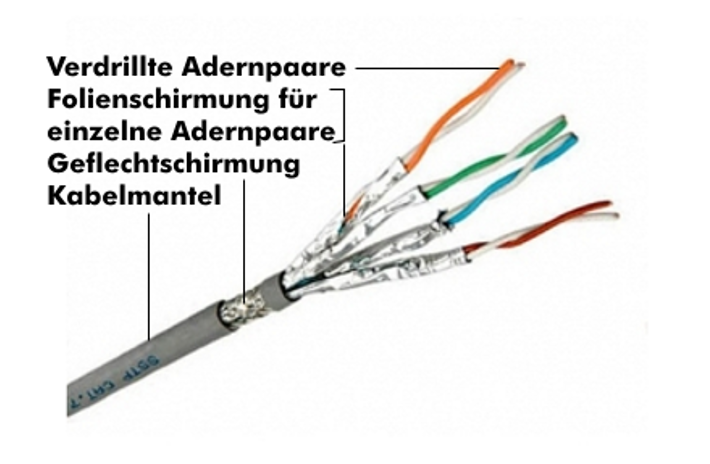
					- Screened / Unscreened
					- Shielded / Unshielded
					- Foiled / Unfoiled
					- 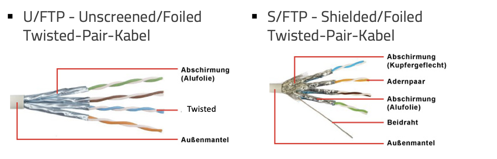
					- 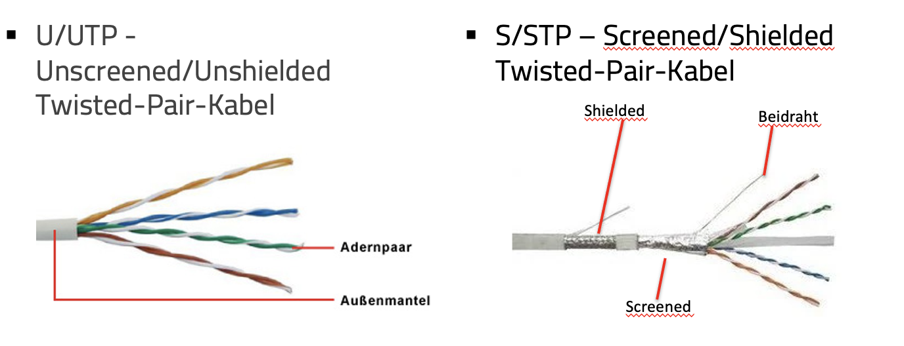{:height 34, :width 650}
						- UUTP Kabel natürlich am günstigsten. Gibt es keine grösseren Störquellen in der Nähe der Kabel, reichen diese aber auch bis und mit Cat 6 (folgende Folie) und sind ausserdem viel biegsamer/schmaler.
					- **Categories / Kategorien**
						- 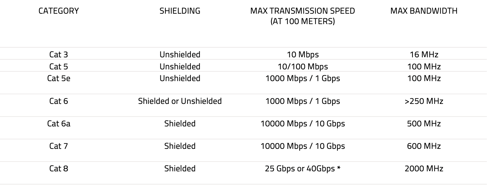
							-
							-
			- Twisted Pair
			- Koax (alt!)
			- Fiber
			- LWL
- LATER EINGESCANNTE FOTOS
-