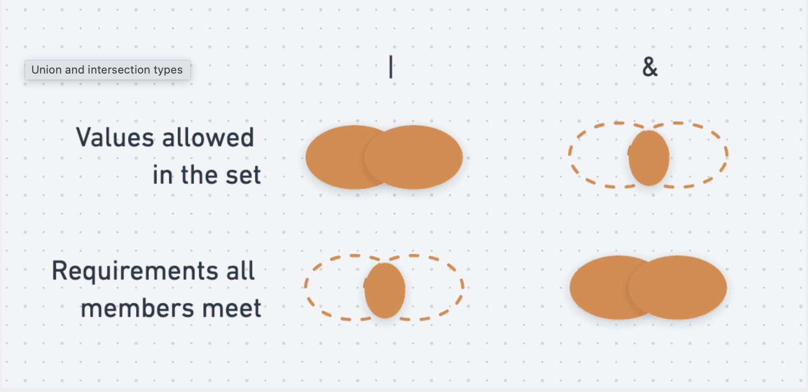
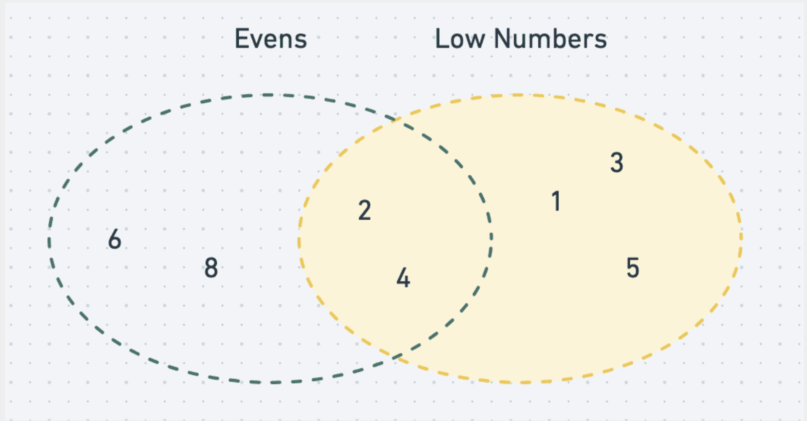

tags:: [[JavaScript]], [[Volta]], [[TypeScript Intermediate]], [[Making TypeScript Stick]] 
title:: TypeScript

- ## Declaration
  collapsed:: true
	- #+BEGIN_QUOTE
	  The "d.ts" file is used to provide typescript type information about an API that's written in JavaScript. The idea is that you're using something like jQuery or underscore, an existing javascript library. You want to consume those from your typescript code.
	  #+END_QUOTE
	  https://stackoverflow.com/questions/21247278/about-d-ts-in-typescript
	- https://www.typescriptlang.org/docs/handbook/module-resolution.html
- ## Learncourse
  collapsed:: true
	- https://frontendmasters.com/courses/typescript-v4/ #frontentmaster
		- https://www.typescript-training.com/course/fundamentals-v4
		- https://github.com/mike-north/typescript-courses/tree/main?tab=readme-ov-file
-
- ## Types
	- ### Union Types vs Intersection Types
	  collapsed:: true
		- 
	- ### Union Types `|`
	  collapsed:: true
		- Represent a value that can be any one of several types.
		- It's like a logical ==OR== for types.
		- *Essentially, **`|` means “anything in either set” in terms of the allowed values***, and because of this ***only the behavior that’s definitely present on every member of both sets is available to us**
		- **Example**
			- ```ts
			  type OneThroughFive = 1 | 2 | 3 | 4 | 5;
			  type Evens = 2 | 4 | 6 | 8;
			  
			  let evenOrLowNumber: Evens | OneThroughFive;
			  evenOrLowNumber = 6; // ✔️ An even number
			  evenOrLowNumber = 3; // ✔️ A low number
			  evenOrLowNumber = 4; // ✔️ Both an even and a low number
			  
			  ```
		- **Use Case**
			- Are often used **when a variable can hold multiple types**, such as the result of a function that can return different types based on certain conditions.
			- ```ts
			  function flipCoin(): "heads" | "tails" {
			    return Math.random() > 0.5 ? "heads" : "tails";
			  }
			  
			  const outcome = flipCoin();
			  
			  ```
		- **Union Types in Practice**
			- Consider a function that returns different types based on conditions
			- ```ts
			  type Success = { status: "success"; data: { name: string; email: string } };
			  type Failure = { status: "failure"; error: Error };
			  
			  function getUserInfo(): Success | Failure {
			    if (Math.random() > 0.5) {
			      return { status: "success", data: { name: "John", email: "john@example.com" } };
			    } else {
			      return { status: "failure", error: new Error("Something went wrong!") };
			    }
			  }
			  
			  const result = getUserInfo();
			  
			  if (result.status === "success") {
			    console.log(result.data.name);
			  } else {
			    console.error(result.error.message);
			  }
			  ```
	- ### Intersection Types `&`
		- Represent a value that must satisfy all of several types simultaneously. I
		- It's like a logical ==AND== for types.
		- *Essentially, ***`&` means “anything that is in both sets” in terms of the allowed values***, and because of this, we can use ***“any of the behavior definitely present on members of *either* set”.**
		- {:height 261, :width 519}
		- **Example**
			- ```ts
			  type OneThroughFive = 1 | 2 | 3 | 4 | 5;
			  type Evens = 2 | 4 | 6 | 8;
			  
			  let evenAndLowNumber: Evens & OneThroughFive;
			  evenAndLowNumber = 4; // ✔️ 4 is both an even number and a low number
			  
			  ```
		- **Use Case**
			- Are used **when you need to combine multiple types into one**, ensuring that the resulting type has all the properties of the intersected types.
			- ```ts
			  interface Name {
			    name: string;
			  }
			  
			  interface Age {
			    age: number;
			  }
			  
			  type Person = Name & Age;
			  
			  const person: Person = {
			    name: "John",
			    age: 30,
			  };
			  
			  ```
		- **Intersection Types in Practice**
			- Are useful when you want to combine multiple types to ensure an object has all required properties.
			- ```ts
			  interface Address {
			    street: string;
			    city: string;
			  }
			  
			  type ContactInfo = Name & Address;
			  
			  const contact: ContactInfo = {
			    name: "Jane",
			    street: "123 Main St",
			    city: "Anytown",
			  };
			  
			  ```
		-
	- ### Extract a type from an array
	  id:: 6638eb09-42c1-4e4f-aada-59c13006ceb8
	  collapsed:: true
		- ```ts
		  type Unpacked<T> = T extends (infer U)[] ? U : T;
		  
		  type InnerCacheType = Unpacked<CacheType>; // Event | User
		  ```
- ## Variables and Values
  collapsed:: true
	- *In TypeScript, variables are “born” with their types*
	- ### Variable Declarations & Inference
	  collapsed:: true
		- The `temperature` variable is declared using `let` and initialized with the value `6`.
		- TS infers the type of `temperature` to be `number`
		- ```ts
		  let temperature = 6; // Type inference
		  ```
		- **Re-assignability and Type-checking**
			- When we try to assign a string value to `temperature`, which is of type `number`.
			- TS will produce a type-checking error.
			- temperature = "warm"; // Type 'string' is not assignable to type 'number'.
		- **Literal Types**
			- The `humidity` variable is declared using `const` and initialized with the value `79`.
			- This makes `humidity` have a literal type `79`, meaning it can only hold the value `79`.
			- ```ts
			  const humidity = 79; // humidity has a literal type 79
			  ```
		- **Type Assignments and Compatibility**
			- `temp2` is a `let` variable with type `number`.
			- `humid2` is a `const` variable with a literal type `79`.
			- Assigning a different number (`23`) to `temp2` is valid.
			- Assigning `humid2` to `temp2` is valid because `79` is a subset of `number`.
			- Assigning `temp2` to `humid2` causes an error because `humid2` can only be `79`.
			- Assigning `79` to `humid2` is valid.
			- Assigning `78` to `humid2` causes an error because `humid2` can only be `79`.
			- ```ts
			  let temp2 = 19; // temp2's type is { all numbers }
			  let humid2 = 79 as const; // humid2's type is { 79 }
			  
			  temp2 = 23; // ✔️ Is each member in { 23 } also in { all numbers }? Yes.
			  temp2 = humid2; // ✔️ Is each member in { 79 } also in { all numbers }? Yes.
			  
			  humid2 = temp2; // Type-checking error: Is each member in { all numbers } also in { 79 }? No.
			  humid2 = 79; // ✔️ Is each member in { 79 } also in { 79 }? Yes.
			  humid2 = 78; // Type-checking error: Is each member in { 78 } also in { 79 }? No.
			  
			  ```
	- ### Type Casting - Any
	  collapsed:: true
		- `frontEndMastersFounding` is initialized as a `Date` object.
		- `date1` is another reference to the same `Date` object.
		- `date2` is cast to `any`, allowing it to bypass type-checking.
		- ```ts
		  let frontEndMastersFounding = new Date("Jan 1, 2012");
		  let date1 = frontEndMastersFounding;
		  let date2 = frontEndMastersFounding as any;
		  ```
		- This is something that you should do *very carefully*. It’s sometimes safe to cast to a *more general* type, but potentially dangerous to cast to a *more specific or unrelated* type.
		- **Unsafe Type Casting**
			- Casting the literal `79` to `number` is safe because `79` is indeed a number.
			- ```ts
			  const humid3 = 79 as number; // ✔️ is 79 a number? If so, this is safe!
			  ```
		- **Invalid Type Casting**
			- Casting `"oops"` to `any` and then to `Date` is incorrect. TypeScript will not catch this, but it will cause a runtime error when methods like `toISOString` are called.
			- Directly casting `"oops"` to `Date` is also incorrect and will lead to a runtime error.
			- ```stylus
			  // TypeScript thinks this is a Date now, but it's really a string
			  let date3 = "oops" as any as Date; 
			  
			  date3.toISOString(); // 💥 Runtime error: date3 is not actually a Date
			  
			  let date4 = "oops" as Date; // This would also cause a runtime error.
			  
			  ```
	- ### Ternary Operator
	  collapsed:: true
		- *Allows for concise conditional logic*
		- ````
		  condition ? exprIfTrue : exprIfFalse
		  ````
-
- ## Objects
  collapsed:: true
	- In general, object types are defined by
		- The ==names== of the properties that are (or maybe) present
		- The ==types== of those properties
	- For example, if we had the concept of a `Car` like “2002 Toyota Corolla” with properties:
		- `make`: the manufacturer (in this case, “Toyota”)
		- `model`: the particular product (in this case, “Corolla”)
		- `year`: the “model year” of the product (in this case, 2002)
		- ```ts
		  //object to represent this information
		  
		  {
		    make: "Toyota",
		    model: "Corolla",
		    year: 2002
		  }
		  
		  //the type that would describe this object’s structure
		  
		  {
		    make: string
		    model: string
		    year: number
		  }
		  ```
	- ### Optional Properties
	  collapsed:: true
		- We can state that this property is optional using the `?` operator:
		- ```ts
		  {
		    make: string
		    model: string
		    year: number
		    chargeVoltage?: number // number | undefined
		  }
		  ```
	- ### Excess property checking
	  collapsed:: true
		- TypeScript helps us catch a particular type of problem around the use of object literals.
		- ```ts
		  function printCar(car: {
		    make: string
		    model: string
		    year: number
		    chargeVoltage?: number
		  }) {
		    // implementation removed for simplicity
		  }
		   
		  printCar({
		    make: "Tesla",
		    model: "Model 3",
		    year: 2020,
		    color: "RED", // <------ EXTRA PROPERTY
		  // Object literal may only specify known properties, and 'color' does not 
		  // exist in type '{ make: string; model: string; year: number; chargeVoltage?: 
		  // number | undefined; }'.
		  })
		  ```
	- ### Index Signature
		- Represent a type for **dictionaries**, where values of a consistent type are retrievable by keys.
		- We can store phone numbers under a “key” — in this case `home`, `office`, `fax`, and possibly other words of our choosing — and each phone number is comprised of three strings
			- ```ts
			  const phones = {
			    home: { country: "+1", area: "211", number: "652-4515" },
			    work: { country: "+1", area: "670", number: "752-5856" },
			    fax: { country: "+1", area: "322", number: "525-4357" },
			  }
			  ```
		- We could describe this value using what’s called an *index signature*
			- ```ts
			  const phones: {
			    [k: string]: {
			      country: string
			      area: string
			      number: string
			    }
			  } = {}
			  ```
- ## Array Types
  collapsed:: true
	- Describing types for arrays is often as easy as adding `[]` to the end of the array member’s type
	- For example the type for *an array of `string`s* would look like `string[]`
		- ```ts
		  const fileExtensions: string[] = ["js", "ts"]
		  ```
	- We could use our more complicated car type too, following the type for our 3-property object with `[]`
		- ```ts
		  type Cars = { make: string; model: string; year: number;}[]
		  const cars: Cars = [
		    {
		      make: "Toyota",
		      model: "Corolla",
		      year: 2002,
		    },
		  ]
		  ```
- ## Tuples
  collapsed:: true
	- https://en.wikipedia.org/wiki/Tuple
	- To work with a multi-element, ordered data structure, where position of each item has some special meaning or convention.
	- ```ts
	  //          [Year, Make,     Model    ]
	  let myCar = [2002, "Toyota", "Corolla"]
	  
	  // destructured assignment is convenient here!
	  const [year, make, model] = myCar
	  ```
	- TypeScript has chosen **the most specific type that describes the entire contents of the array**. This is not quite what we wanted, in that:
		- it allows us to break our convention where the year *always* comes first
		- it doesn’t quite help us with the “finite length” aspect of tuples
		- ```ts
		  let myCar = [2002, "Toyota", "Corolla"]
		  //
		  // not the same convention or length!
		  myCar = ["Honda", 2017, "Accord", "Sedan"]
		  ```
	- ### `readonly`  tuples
		- Tuples in TypeScript are essentially arrays with a known fixed structure. However, at runtime, they still support all array methods, like `push`, `pop`, etc. This can lead to issues because these methods can alter the tuple's length and structure, breaking the type constraints.
			- ```ts
			  numPair.push(6); // [4, 5, 6] - Now it's not a [number, number] anymore
			  numPair.pop(); // [4, 5]
			  numPair.pop(); // [4]
			  numPair.pop(); // []
			  console.log(numPair.length); // 2 (incorrect, it should be 0 after all pops)
			  ```
	- To prevent mutating operations that can compromise the tuple's integrity, you can define a tuple as read-only. A read-only tuple does not support methods like `push` or `pop`.
		- ```ts
		  const roNumPair: readonly [number, number] = [4, 5];
		  console.log(roNumPair.length); // Output: 2
		  
		  // Error: Property 'push' does not exist on type 'readonly [number, number]'.
		  roNumPair.push(6); 
		  
		  // Error: Property 'pop' does not exist on type 'readonly [number, number]'.
		  roNumPair.pop(); 
		  
		  ```
- ## Structural vs Nominal Typing
  collapsed:: true
	- ### Type checking
	  collapsed:: true
		- Is about evaluating the compatibility or equivalence of types. It asks the question: **"Is type y equivalent to type x?"** or **"Does the type of y fit within the type of x?"** This evaluation can occur in various scenarios
	- ### Static vs Dynamic Type Systems
	  collapsed:: true
		- **Static Type Systems:** Type checking is performed at compile time. Examples include TypeScript, Java, C#, and C++. These languages can perform type inference, deducing types without explicit type annotations.
		- **Dynamic Type Systems:** Type checking is done at runtime. Examples include JavaScript, Python, Ruby, Perl, and PHP. Projects like Sorbet (for Ruby) and Mypy (for Python) add static type checking to these dynamic languages.
	- ### Duck Typing
	  collapsed:: true
		- Duck typing follows the principle: **"If it looks like a duck, swims like a duck, and quacks like a duck, then it probably is a duck."**
		- This means if an object has the ==necessary methods and properties==, it ==can be used in place of another type==. This is common in dynamic type systems and is similar to structural typing.
	- ### Nominal vs Structural Type Systems
		- #### Nominal Type Systems
			- Type compatibility and equivalence are determined by explicit declarations and names. For instance, in Java:
			- ```java
			  public class Car {
			    String make;
			    String model;
			    int year;
			  }
			  public class CarChecker {
			    public static String checkCar(Car car) {  }
			  }
			  Car myCar = new Car();
			  // TYPE CHECKING
			  // -------------
			  // Is `myCar` type-equivalent to what `checkCar` wants as an argument?
			  CarChecker.checkCar(myCar);
			  
			  ```
		- #### Structural Type Systems
			- Type compatibility is based on the structure or shape of data. TypeScript uses structural typing
			- In this example, the function `printCar` cares only about the properties `make`, `model`, and `year`. If an object has these properties with the correct types, it can be passed to `printCar`
			- ```ts
			  class Car {
			    make: string;
			    model: string;
			    year: number;
			    isElectric: boolean;
			  }
			  
			  class Truck {
			    make: string;
			    model: string;
			    year: number;
			    towingCapacity: number;
			  }
			  
			  const vehicle = {
			    make: "Honda",
			    model: "Accord",
			    year: 2017,
			  }
			  
			  function printCar(car: { make: string; model: string; year: number }) {
			    console.log(`${car.make} ${car.model} (${car.year})`);
			  }
			  
			  printCar(new Car()); // Fine
			  printCar(new Truck()); // Fine
			  printCar(vehicle); // Fine
			  
			  ```
-
- ## Interfaces
  collapsed:: true
	- Provide a way to define the shape of an object, similar to type aliases, but with additional capabilities such as inheritance
	- Interfaces are particularly useful for defining contracts that classes must adhere to
	- **Defining and Using**
		- An interface defines the structure of an object by specifying its properties and their types
		- ```ts
		  interface Amount {
		    currency: string;
		    value: number;
		  }
		  
		  function printAmount(amt: Amount) {
		    console.log(`${amt.currency} ${amt.value}`);
		  }
		  
		  ```
	- **Inheritance**
		- Interfaces can extend other interfaces, allowing for hierarchical and reusable type definitions
		- ```ts
		  interface Animal {
		    isAlive(): boolean;
		  }
		  
		  interface Mammal extends Animal {
		    getFurOrHairColor(): string;
		  }
		  
		  // The Hamster interface inherits properties and 
		  // methods from both Mammal and Animal
		  interface Hamster extends Mammal {
		    squeak(): string;
		  }
		  
		  function careForHamster(h: Hamster) {
		    console.log(h.isAlive());
		    console.log(h.getFurOrHairColor());
		    console.log(h.squeak());
		  }
		  ```
	- **Implementing Interfaces in Classes**
		- Classes can implement interfaces to enforce that they provide certain properties and methods
		- ```ts
		  interface AnimalLike {
		    eat(food: string): void;
		  }
		  
		  class Dog implements AnimalLike {
		    bark() {
		      return "woof";
		    }
		    
		    eat(food: string) {
		      console.log(`Eating ${food}`);
		    }
		  }
		  ```
	- ### Open Interfaces
		- TypeScript interfaces are “open”, meaning that unlike in type aliases, you can have multiple declarations in the same scope
		- ```ts
		  interface AnimalLike { // From before
		    eat(food): void
		  }
		  function feed(animal: AnimalLike) {
		    animal.eat
		           
		  (method) AnimalLike.eat(food: any): void
		    animal.isAlive
		             
		  (method) AnimalLike.isAlive(): boolean
		  }
		   
		  // SECOND DECLARATION OF THE SAME NAME
		  interface AnimalLike {
		    isAlive(): boolean
		  }
		  ```
			- These declarations are merged together to create a result identical to what you would see if both the `isAlive` and `eat` methods were on a single interface declaration.
- ## Type Aliases
  collapsed:: true
	- Provide a way to give a type a name, which can simplify and centralize type definitions.
	- This helps manage and maintain complex types, especially when used across multiple functions and modules.
	- **Benefits of Type Aliases**
		- **Readability:** More meaningful and concise names for types.
		- **Maintainability:** Declaring the shape of the type in a single place makes it easier to update.
		- **Reusability:** Types can be imported and exported, facilitating modular code.
	- **Defining and Using**
		- Type aliases use the `type` keyword followed by an assignment to the type structure.
		- It's common to use `TitleCase` for the alias name.
		- ```ts
		  // defining
		  type Amount = {
		    currency: string;
		    value: number;
		  }
		  
		  // using
		  function printAmount(amt: Amount) {
		    console.log(amt);
		    const { currency, value } = amt;
		    console.log(`${currency} ${value}`);
		  }
		  
		  const donation = {
		    currency: "USD",
		    value: 30.0,
		    description: "Donation to food bank",
		  };
		  
		  printAmount(donation);
		  
		  ```
	- ### Advanced Type Aliases
		- #### Handling Union Types with Aliases
			- Instead of directly using complex union types, aliases can make the code cleaner.
			- ```ts
			  // @filename: with-aliases.ts
			  import { flipCoin, success, fail } from './common';
			  
			  type UserInfoOutcomeError = readonly ["error", Error];
			  type UserInfoOutcomeSuccess = readonly [
			    "success",
			    { readonly name: string; readonly email: string }
			  ];
			  type UserInfoOutcome = UserInfoOutcomeError | UserInfoOutcomeSuccess;
			  
			  export function maybeGetUserInfo(): UserInfoOutcome {
			    if (flipCoin() === 'heads') {
			      return success;
			    } else {
			      return fail;
			    }
			  }
			  
			  ```
		- #### Combining Types with Intersection (Inheritance in type aliases)
			- Intersection types can extend existing types with new properties or methods
			- ```ts
			  type SpecialDate = Date & { getDescription(): string };
			  
			  const newYearsEve: SpecialDate = Object.assign(
			    new Date(),
			    { getDescription: () => "Last day of the year" }
			  );
			  
			  console.log(newYearsEve.getDescription()); // "Last day of the year"
			  ```
- ## Interfaces vs Type Aliases
  collapsed:: true
	- While both interfaces and type aliases can describe object types, **interfaces are generally preferred for defining contracts that classes should implement**
	- While type aliases are flexible and useful, interfaces should be the go-to tool for defining object shapes, especially when dealing with class contracts
	- ### Choosing whether to use   `type`   or   `interface`
		- In many situations, either a `type` alias or an `interface` would be perfectly fine, however…
		- **If you need to define something other than an object type** (e.g., use of the `|` union type operator), you must use a type alias
		- If you need to define a type **to use with the `implements` heritage term on a `class`**, use an interface
		- If you need to **allow consumers of your types to *augment* them**, you must use an interface.
	- ### Caution with Non-Object Types
	  collapsed:: true
		- If a type alias includes non-object types or uses unions, it can cause issues when used with the `implements` keyword
		- ```ts
		  type CanJump = {
		    jumpToHeight(): number;
		  } | string;
		  
		  class Dog implements CanJump {
		    jumpToHeight() {
		      return 1.7;
		    }
		    
		    bark() {
		      return "woof";
		    }
		    
		    eat(food: string) {
		      console.log(`Eating ${food}`);
		    }
		  }
		  
		  // error: A class can only implement an object type or intersection of object 
		  // types with statically known members.
		  
		  ```
- ## Recursive Types
  collapsed:: true
	- https://www.typescriptlang.org/docs/handbook/release-notes/typescript-4-1.html#recursive-conditional-types
	- Recursive types are types that reference themselves, making them suitable for describing structures that can be infinitely nested, such as arrays of numbers that can contain other arrays of numbers.
	- **Recursive Type Aliases**
		- In TypeScript, recursive types can be defined using type aliases. Here's an example of a recursive type alias for an infinitely nestable array of numbers
		- ```ts
		  type NestedNumbers = number | NestedNumbers[];
		  
		  // this type definition means that NestedNumbers 
		  // can be either a number or an array of NestedNumbers
		  ```
		- **Example Usage**
			- ```ts
			  const val: NestedNumbers = [3, 4, [5, 6, [7], 59], 221];
			  
			  if (typeof val !== "number") {
			    val.push(41); // valid because 41 is a number
			    // val.push("this will not work"); 
			    // this will cause a TS error
			  }
			  ```
	- **Recursive Interfaces**
		- We can also use interfaces to define recursive types, although type aliases are more common for this purpose
		- ```ts
		  interface NestedNumberArray extends Array<number | NestedNumberArray> {}
		  
		  const val: NestedNumberArray = [3, 4, [5, 6, [7], 59], 221];
		  
		  if (typeof val !== "number") {
		    val.push(41); 
		  }
		  
		  ```
-
- ## Type Queries
  collapsed:: true
	- Allow us to obtain type information from values, which is particularly useful when working with libraries or complex types
	- ### `keyof`
		- Allows us to obtain a type representing all property keys on a given interface
		- This is useful for creating types that dynamically adapt to the properties of an existing type
		- ```ts
		  type DatePropertyNames = keyof Date;
		  // type DatePropertyNames = "toString" | "toDateString" | "toTimeString" | ...
		  
		  type DateStringPropertyNames = DatePropertyNames & string;
		  // type DateStringPropertyNames = "toString" | "toDateString" | "toTimeString" | ...
		  
		  type DateSymbolPropertyNames = DatePropertyNames & symbol;
		  // type DateSymbolPropertyNames = typeof Symbol.toPrimitive
		  
		  ```
			- `keyof Date` produces a union of all the keys in the `Date` interface.
			- `DateStringPropertyNames` filters these keys to only those that are strings.
			- `DateSymbolPropertyNames` filters these keys to only those that are symbols.
		- **Practical Examples**
		  collapsed:: true
			- Using `keyof` and indexed access types, you can create functions that work with dynamic property names
			- ```ts
			  function getProperty<T, K extends keyof T>(obj: T, key: K): T[K] {
			    return obj[key];
			  }
			  
			  const car: Car = {
			    make: "Toyota",
			    model: "Corolla",
			    year: 2020,
			    color: {
			      red: "FF0000",
			      green: "00FF00",
			      blue: "0000FF",
			    },
			  };
			  
			  const color = getProperty(car, "color");
			  // type color = { red: string; green: string; blue: string }
			  
			  const make = getProperty(car, "make");
			  // type make = string
			  
			  ```
	- ### `typeof`
		- Allows you to extract a type from a value, which can be useful for type inference from constants or other values
		- ```ts
		  async function main() {
		    const apiResponse = await Promise.all([
		      fetch("https://example.com"),
		      Promise.resolve("Titanium White"),
		    ]);
		   
		    type ApiResponseType = typeof apiResponse;
		    // type ApiResponseType = [Response, string]
		  }
		  ```
			- `typeof apiResponse` gives us the type of the `apiResponse` variable, which is `[Response, string]`
		- **Practical Example**
			- Using `typeof` to extract types from constants
			- ```ts
			  const API_URL = "https://api.example.com";
			  type ApiUrlType = typeof API_URL;
			  // type ApiUrlType = "https://api.example.com"
			  
			  ```
	- ### Indexed Access Types
		- Access types allow you to retrieve parts of an array or object type via indices
		- This is useful for dynamically accessing nested types
		- ```ts
		  interface Car {
		    make: string;
		    model: string;
		    year: number;
		    color: {
		      red: string;
		      green: string;
		      blue: string;
		    };
		  }
		  
		  let carColor: Car["color"];
		  // type carColor = { red: string; green: string; blue: string }
		  
		  let carColorRedComponent: Car["color"]["red"];
		  // type carColorRedComponent = string
		  
		  let carProperty: Car["color" | "year"];
		  // type carProperty = number | { red: string; green: string; blue: string }
		  
		  ```
			- `Car["color"]` gives us the type of the `color` property in the `Car` interface.
			- `Car["color"]["red"]` accesses the `red` property inside the `color` property, giving us `string`.
			- `Car["color" | "year"]` produces a union of the types of the `color` and `year` properties.
- ## Callables Type
  collapsed:: true
	- Define the types of functions, including their parameters and return values.
	- We can do this using either interfaces or type aliases
	- ### `void` Return Type
		- Sometimes functions don't return a value
		- TypeScript uses `void` to indicate such functions
		- ```ts
		  function printFormattedJSON(obj: string[]): void {
		    console.log(JSON.stringify(obj, null, "  "));
		  }
		  
		  const x = printFormattedJSON(["hello", "world"]); // x is of type void
		  
		  ```
		- `void` vs `undefined`
			- `void` means the function doesn't return a value.
			- `undefined` can technically be used, but `void` is more appropriate for functions that are meant to return nothing.
			- ```ts
			  function invokeInFourSeconds(callback: () => undefined) {
			    setTimeout(callback, 4000);
			  }
			  
			  function invokeInFiveSeconds(callback: () => void) {
			    setTimeout(callback, 5000);
			  }
			  
			  const values: number[] = [];
			  invokeInFourSeconds(() => values.push(4)); // Error: Type 'number' is not assignable to type 'undefined'.
			  invokeInFiveSeconds(() => values.push(4)); // No error
			  
			  ```
				- The `push` method returns a number, causing an error when the callback is expected to return `undefined`
				- Using `void` avoids this issue, as `void` means the return value is ignored
		-
- ## Construcables
  collapsed:: true
	- Define how to *create instances of a class using the `new` keyword*
	- ```ts
	  interface DateConstructor {
	    new (value: number): Date;
	  }
	  
	  let MyDateConstructor: DateConstructor = Date;
	  const d = new MyDateConstructor(1697923072611); // d is of type Date
	  
	  ```
	- ### Function Overloads
		- Allow we to *define multiple function signatures for a single function*
		- Useful when we need a function to *handle different types of arguments* and *provide type-safe* behavior based on the provided arguments
		- ### Example
		  collapsed:: true
			- Consider a scenario where you need to create a function that can register a "main event listener" for either a form element or an iframe element:
				- For a form element, the event listener should handle form submissions.
				- For an iframe element, the event listener should handle messages.
			- **Defining the Types**
				- ```ts
				  type FormSubmitHandler = (data: FormData) => void;
				  type MessageHandler = (evt: MessageEvent) => void;
				  ```
			- **Using Function Overloads**
				- ```ts
				  function handleMainEvent(elem: HTMLFormElement, handler: FormSubmitHandler): void;
				  function handleMainEvent(elem: HTMLIFrameElement, handler: MessageHandler): void;
				  function handleMainEvent(
				    elem: HTMLFormElement | HTMLIFrameElement,
				    handler: FormSubmitHandler | MessageHandler
				  ): void {
				    if (elem instanceof HTMLFormElement) {
				      elem.onsubmit = (event) => {
				        event.preventDefault();
				        const formData = new FormData(elem);
				        (handler as FormSubmitHandler)(formData);
				      };
				    } else if (elem instanceof HTMLIFrameElement) {
				      window.addEventListener("message", handler as MessageHandler);
				    }
				  }
				  ```
			- **Usage**
				- ```ts
				  const myFrame = document.getElementsByTagName("iframe")[0] as HTMLIFrameElement;
				  const myForm = document.getElementsByTagName("form")[0] as HTMLFormElement;
				  
				  handleMainEvent(myFrame, (event) => {
				    console.log("Message received from iframe:", event.data);
				  });
				  
				  handleMainEvent(myForm, (data) => {
				    console.log("Form submitted with data:", Array.from(data.entries()));
				  });
				  
				  ```
			- **Explanation**
				- **Overload Signatures:** The first two `handleMainEvent` functions are overload signatures. They define the possible ways the function can be called.
				- **Implementation:** The third `handleMainEvent` function is the actual implementation. It checks the type of `elem` and assigns the appropriate handler.
				- **Type Safety:** This approach ensures type safety. When calling `handleMainEvent` with an `HTMLFormElement`, the handler must be a `FormSubmitHandler`. When calling with an `HTMLIFrameElement`, the handler must be a `MessageHandler`.
		- ### `this` Type in Functions
			- Sometimes, a function needs to be aware of its `this` context
			- TypeScript allows you to *specify the type of `this` within a function*
			- **Example**
				- Consider an event handler function that should be aware of its `this` context (an HTML button element)
				- ```ts
				  function myClickHandler(this: HTMLButtonElement, event: Event) {
				    this.disabled = true;
				  }
				  
				  const myButton = document.getElementsByTagName("button")[0];
				  const boundHandler = myClickHandler.bind(myButton);
				  
				  boundHandler(new Event("click")); // Works correctly
				  
				  ```
-
- ## Class
  collapsed:: true
	- ### Fields and methods
		- In TypeScript, we can explicitly state the types of class fields and constructor arguments. This helps catch errors at compile time
		- ```ts
		  class Car {
		    make: string;
		    model: string;
		    year: number;
		  
		    constructor(make: string, model: string, year: number) {
		      this.make = make;
		      this.model = model;
		      this.year = year;
		    }
		  
		    honk(duration: number): string {
		      return `h${'o'.repeat(duration)}nk`;
		    }
		  }
		  
		  const c = new Car("Honda", "Accord", 2017);
		  c.honk(5); // "hooooonk"
		  
		  ```
	- ### Static Fields and Methods
		- Static fields and methods belong to the class itself rather than to any instance.
		- They are defined using the `static`keyword. Here's an example of using static fields and methods
		- ```ts
		  class Car {
		    static nextSerialNumber = 100;
		    static generateSerialNumber() { return this.nextSerialNumber++; }
		  
		    make: string;
		    model: string;
		    year: number;
		    serialNumber = Car.generateSerialNumber();
		  
		    constructor(make: string, model: string, year: number) {
		      this.make = make;
		      this.model = model;
		      this.year = year;
		    }
		  
		    getLabel() {
		      return `${this.make} ${this.model} ${this.year} - #${this.serialNumber}`;
		    }
		  }
		  
		  console.log(new Car("Honda", "Accord", 2017).getLabel()); // "Honda Accord 2017 - #100"
		  console.log(new Car("Toyota", "Camry", 2022).getLabel()); // "Toyota Camry 2022 - #101"
		  
		  ```
	- ### Static Fields and Methods
		- Static fields and methods belong to the class itself rather than to any instance
		- They are defined using the `static`keyword. Here's an example of using static fields and methods
		- ```ts
		  class Car {
		    static nextSerialNumber = 100;
		    static generateSerialNumber() { return this.nextSerialNumber++; }
		  
		    make: string;
		    model: string;
		    year: number;
		    serialNumber = Car.generateSerialNumber();
		  
		    constructor(make: string, model: string, year: number) {
		      this.make = make;
		      this.model = model;
		      this.year = year;
		    }
		  
		    getLabel() {
		      return `${this.make} ${this.model} ${this.year} - #${this.serialNumber}`;
		    }
		  }
		  
		  console.log(new Car("Honda", "Accord", 2017).getLabel()); // "Honda Accord 2017 - #100"
		  console.log(new Car("Toyota", "Camry", 2022).getLabel()); // "Toyota Camry 2022 - #101"
		  
		  ```
	- ### Static Initialization Blocks
		- Static initialization blocks allow for complex initialization logic, such as fetching data from an API
		- ```ts
		  class Car {
		    static nextSerialNumber: number;
		  
		    static generateSerialNumber() { return this.nextSerialNumber++; }
		  
		    static {
		      fetch("https://api.example.com/vin_number_data")
		        .then(response => response.json())
		        .then(data => {
		          this.nextSerialNumber = data.mostRecentInvoiceId + 1;
		        });
		    }
		  
		    make: string;
		    model: string;
		    year: number;
		    serialNumber = Car.generateSerialNumber();
		  
		    constructor(make: string, model: string, year: number) {
		      this.make = make;
		      this.model = model;
		      this.year = year;
		    }
		  }
		  
		  ```
	- ### Access Modifier Keywords
		- TypeScript provides three access modifier keywords: `public`, `protected`, and `private`, to control the visibility of class members:
			- **public**: Accessible from anywhere
			- **protected**: Accessible within the class and its subclasses
			- **private**: Accessible only within the class
		- ```ts
		  class Car {
		    private static nextSerialNumber: number;
		    private static generateSerialNumber() { return this.nextSerialNumber++; }
		  
		    make: string;
		    model: string;
		    year: number;
		    private _serialNumber = Car.generateSerialNumber();
		  
		    protected get serialNumber() {
		      return this._serialNumber;
		    }
		  
		    constructor(make: string, model: string, year: number) {
		      this.make = make;
		      this.model = model;
		      this.year = year;
		    }
		  }
		  
		  class Sedan extends Car {
		    getSedanInformation() {
		      const { make, model, year, serialNumber } = this;
		      return { make, model, year, serialNumber };
		    }
		  }
		  
		  ```
	- ### Param Properties
		- TypeScript provides a shorthand for declaring and initializing class members in the constructor
		- ```ts
		  class Car {
		    constructor(
		      public make: string,
		      public model: string,
		      public year: number
		    ) {}
		  }
		  
		  const myCar = new Car("Honda", "Accord", 2017);
		  
		  ```
	- ### Overrides
		- Ensure that a subclass method correctly overrides a base class method
		- ```ts
		  class Car {
		    honk() {
		      console.log("beep");
		    }
		  }
		  
		  class Truck extends Car {
		    override honk() {
		      console.log("BEEP");
		    }
		  }
		  
		  const t = new Truck();
		  t.honk(); // "BEEP"
		  
		  ```
	- ### readonly
		- The `readonly` keyword ensures that a class field cannot be modified after it is initialized
		- ```ts
		  class Car {
		    static #nextSerialNumber: number;
		    static #generateSerialNumber() { return this.#nextSerialNumber++; }
		  
		    public make: string;
		    public model: string;
		    public year: number;
		    readonly #serialNumber = Car.#generateSerialNumber();
		  
		    constructor(make: string, model: string, year: number) {
		      this.make = make;
		      this.model = model;
		      this.year = year;
		    }
		  }
		  
		  ```
- ## Type Guard
  collapsed:: true
	- Ensure that *variables are treated as specific types during different parts of our code*
	- Type guards in TypeScript help ensure that variables are treated as specific types during different parts of your code. Let's break down the key concepts and examples in a simpler manner.
	- ### Type Guards and Control Flow
		- When we have a variable that can be of multiple types, TypeScript can narrow down the type based on conditions. For example, consider a discriminated union:
		- ```ts
		  const outcome: ["error", Error] | ["success", { name: string; email: string }] = maybeGetUserInfo();
		  
		  if (outcome[0] === "error") {
		  // TypeScript knows outcome is ["error", Error]
		  const errorOutcome = outcome; // type is ["error", Error]
		  } else {
		  // TypeScript knows outcome is ["success", { name: string; email: string }]
		  const successOutcome = outcome; // type is ["success", { name: string; email: string }]
		  }
		  ```
	- ### Built-in Type Guards
		- TypeScript provides built-in type guards such as `typeof`, `instanceof`, and specific value checks
		- ```ts
		  let value: Date | null | undefined | "pineapple" | [number] | { dateRange: [Date, Date] };
		  
		  if (value instanceof Date) {
		  // value is Date
		  } else if (typeof value === "string") {
		  // value is "pineapple"
		  } else if (value === null) {
		  // value is null
		  } else if (!value) {
		  // value is undefined
		  } else if (Array.isArray(value)) {
		  // value is [number]
		  } else if ("dateRange" in value) {
		  // value is { dateRange: [Date, Date] }
		  } else {
		  // value is never (an impossible type)
		  }
		  ```
	- ### User-Defined Type Guards
		- You can create custom type guards to handle more complex checks. Here’s an example:
		- ```ts
		  interface CarLike {
		  make: string;
		  model: string;
		  year: number;
		  }
		  
		  function isCarLike(valueToTest: any): valueToTest is CarLike {
		  return (
		    valueToTest &&
		    typeof valueToTest === "object" &&
		    typeof valueToTest.make === "string" &&
		    typeof valueToTest.model === "string" &&
		    typeof valueToTest.year === "number"
		  );
		  }
		  
		  let maybeCar: any;
		  
		  if (isCarLike(maybeCar)) {
		  // maybeCar is now CarLike
		  }
		  ```
	- ### Assertion Functions
		- Another approach is to use assertion functions which will throw an error if the type check fails
		- ```ts
		  function assertsIsCarLike(valueToTest: any): asserts valueToTest is CarLike {
		  if (
		    !(
		      valueToTest &&
		      typeof valueToTest === "object" &&
		      typeof valueToTest.make === "string" &&
		      typeof valueToTest.model === "string" &&
		      typeof valueToTest.year === "number"
		    )
		  ) {
		    throw new Error(`Value does not appear to be a CarLike`);
		  }
		  }
		  
		  let maybeCar: any;
		  assertsIsCarLike(maybeCar);
		  // maybeCar is now CarLike if no error is thrown
		  ```
	- ### Private Fields and Type Guards
		- Classes can use private fields to create type guards:
		- ```ts
		  class Car {
		  static #nextSerialNumber = 100;
		  #serialNumber = Car.#generateSerialNumber();
		  
		  static #generateSerialNumber() {
		    return this.#nextSerialNumber++;
		  }
		  
		  static isCar(other: any): other is Car {
		    return other && typeof other === "object" && "#serialNumber" in other;
		  }
		  }
		  
		  let val: any;
		  if (Car.isCar(val)) {
		  // val is now Car
		  }
		  ```
	- ### Switch (true) for Narrowing
		- TypeScript 5.3 introduced `switch(true)` for narrowing types:
		- ```ts
		  class Fish {
		  swim(): void {}
		  }
		  
		  class Bird {
		  fly(): void {}
		  }
		  
		  let val = {} as any;
		  
		  switch (true) {
		  case val instanceof Bird:
		    val.fly(); // val is Bird
		    break;
		  case val instanceof Fish:
		    val.swim(); // val is Fish
		    break;
		  }
		  ```
	- ### Writing High-Quality Type Guards
		- Ensure our type guards are accurate to avoid runtime errors. For example, a bad type guard:
		  
		  ```ts
		  function isNull(val: any): val is null {
		  return !val;
		  }
		  
		  const empty = "";
		  const zero = 0;
		  if (isNull(zero)) {
		  console.log(zero); // This will log zero, but it's not null!
		  }
		  if (isNull(empty)) {
		  console.log(empty); // This will log empty, but it's not null!
		  }
		  ```
	- ### `satisfies` Keyword
		- The `satisfies` keyword ensures an object conforms to a type without losing specific type information:
		- ```ts
		  type DateLike = Date | number | string;
		  type Holidays = { [k: string]: DateLike };
		  
		  const usHolidays = {
		  independenceDay: "July 4, 2024",
		  memorialDay: new Date("May 27, 2024"),
		  laborDay: 1725260400000, // September 2, 2024
		  } satisfies Holidays;
		  
		  // usHolidays retains specific type information
		  ```
		  
		  By using type guards, you can write safer and more reliable TypeScript code by making sure variables are of the expected types during runtime.
-
- ## Generics
  collapsed:: true
	- https://www.typescriptlang.org/docs/handbook/2/generics.html
	- *Write Reusable Code*: Create functions and data structures that work with any data type.
	- *Maintain Type Safety:* Ensure that type-checking is preserved across different uses of the generic component.
	- ### Motivating Use Case
		- Imagine we have
		  collapsed:: true
			- ```ts
			  // a dictionary data structure to store phone 
			  // information indexed by a string key
			  const phones: {
			    [k: string]: {
			      customerId: string;
			      areaCode: string;
			      num: string;
			    };
			  } = {};
			  
			  // Accessing elements
			  phones.home;
			  phones.work;
			  phones.fax;
			  phones.mobile;
			  
			  // we also have an array of phone objects
			  const phoneList = [
			    { customerId: "0001", areaCode: "321", num: "123-4566" },
			    { customerId: "0002", areaCode: "174", num: "142-3626" },
			    { customerId: "0003", areaCode: "192", num: "012-7190" },
			    { customerId: "0005", areaCode: "402", num: "652-5782" },
			    { customerId: "0004", areaCode: "301", num: "184-8501" },
			  ];
			  
			  ```
		- Our goal is to convert this list into a dictionary
			- ```ts
			  const phoneDict = {
			    "0001": { customerId: "0001", areaCode: "321", num: "123-4566" },
			    "0002": { customerId: "0002", areaCode: "174", num: "142-3626" },
			    // ... and so on
			  };
			  
			  ```
		- => ==We want a reusable solution that works for any list, not just for `PhoneInfo`==
		- **Initial Function with PhoneInfo Type**
		  collapsed:: true
			- ```ts
			  // First, define the PhoneInfo interface and 
			  // create a function to convert the list to a dictionary
			  interface PhoneInfo {
			    customerId: string;
			    areaCode: string;
			    num: string;
			  }
			  
			  function listToDict(
			    list: PhoneInfo[],
			    idGen: (arg: PhoneInfo) => string
			  ): { [k: string]: PhoneInfo } {
			    const dict: { [k: string]: PhoneInfo } = {};
			    list.forEach((element) => {
			      const dictKey = idGen(element);
			      dict[dictKey] = element;
			    });
			    return dict;
			  }
			  
			  const result = listToDict(phoneList, (item) => item.customerId);
			  console.log(result);
			  
			  // => This function works for the PhoneInfo type, but we want a more general 
			  // solution
			  ```
		- **Generalizing with Generics**
		  collapsed:: true
			- We can make our function generic to work with any type
			- ```ts
			  function listToDict<T>(
			    list: T[],
			    idGen: (arg: T) => string
			  ): { [k: string]: T } {
			    const dict: { [k: string]: T } = {};
			    list.forEach((element) => {
			      const dictKey = idGen(element);
			      dict[dictKey] = element;
			    });
			    return dict;
			  }
			  ```
				- `<T>` is a type parameter that allows `listToDict` to work with any type `T`.
				- `list: T[]` means the function accepts an array of any type `T`.
				- `idGen: (arg: T) => string` means the function accepts a callback that returns a string key for each item in the list.
			- **Using**
				- ```ts
				  const phoneDict = listToDict(phoneList, (item) => item.customerId);
				  console.log(phoneDict);
				  
				  const nameList = [{ name: "Mike" }, { name: "Mark" }];
				  const nameDict = listToDict(nameList, (item) => item.name);
				  console.log(nameDict);
				  
				  ```
	- ### Best practice
		- *Use each type parameter at least twice*. Any less and you might be casting with the `as`keyword.
		- ```ts
		  function returnAs<T>(arg: any): T {
		    return arg // 🚨 an `any` that will _seem_ like a `T`
		  }
		   
		  // 🚨 DANGER! 🚨
		  const first = returnAs<number>(window)
		         
		  const first: number
		  const sameAs = window as any as number
		          
		  const sameAs: number
		  ```
		- In this example, we have told TypeScript a lie by saying `window` is a `number` (but it is not…). Now, TypeScript will fail to catch errors that it is suppose to be catching